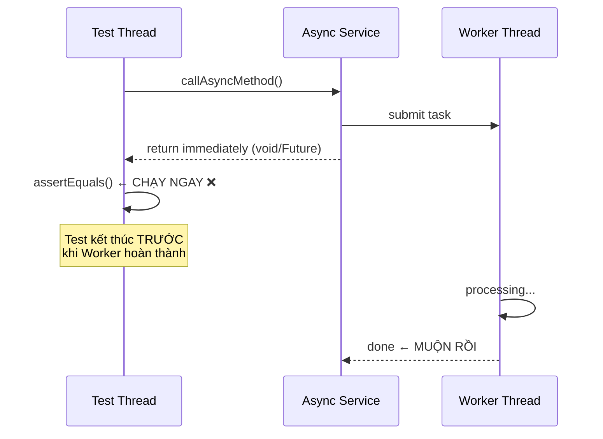

# Làm sao test async code?

## ⚡ Tóm tắt ngắn (30s)
* Async code khó test vì kết quả trả về **trên thread khác** — test method kết thúc trước khi async hoàn thành
* **3 chiến lược chính**: (1) Dùng `CompletableFuture` + `get(timeout)`, (2) Dùng `Awaitility` library để poll kết quả, (3) Override executor thành **synchronous** trong test
* Với Spring `@Async`: có thể dùng `@SpyBean` + `Awaitility` hoặc **disable async** trong test profile
* Luôn test cả **happy path**, **timeout**, và **exception handling** trong async flow

---

## 🔍 Chi tiết bản chất thực chiến

### Tại sao test async code khó?



### Các pattern async trong Java/Spring
1. **`@Async` + void**: fire-and-forget, khó test nhất
2. **`@Async` + `CompletableFuture`**: có thể await kết quả
3. **`CompletableFuture.supplyAsync()`**: Java native async
4. **`@EventListener` / `@TransactionalEventListener`**: async event handling
5. **`@Scheduled`**: periodic task

---

## 💻 Code thực chiến: BAD vs GOOD

### ❌ BAD: Test async mà không chờ kết quả

```java
@SpringBootTest
class NotificationServiceTest {

    @Autowired
    private NotificationService notificationService;
    @Autowired
    private NotificationRepository notificationRepository;

    @Test
    void sendNotification_shouldSaveToDatabase() {
        notificationService.sendAsync("user@test.com", "Hello"); // @Async method

        // ❌ RACE CONDITION: async chưa chạy xong, count = 0
        assertEquals(1, notificationRepository.count()); // FLAKY TEST!
    }

    @Test
    void sendNotification_withSleep() {
        notificationService.sendAsync("user@test.com", "Hello");

        Thread.sleep(3000); // ❌ Brittle: quá ngắn thì flaky, quá dài thì chậm
        assertEquals(1, notificationRepository.count());
    }
}
```

---

### ✅ GOOD: 3 chiến lược test async đúng cách

```java
// ========================================================
// Chiến lược 1: CompletableFuture + get(timeout)
// ========================================================
@Service
public class PriceService {

    @Async
    public CompletableFuture<BigDecimal> calculatePriceAsync(String productId) {
        BigDecimal price = complexCalculation(productId);
        return CompletableFuture.completedFuture(price);
    }
}

@SpringBootTest
class PriceServiceTest {

    @Autowired
    private PriceService priceService;

    @Test
    void calculatePrice_shouldReturnCorrectPrice() throws Exception {
        CompletableFuture<BigDecimal> future = priceService.calculatePriceAsync("PROD-1");

        // ✅ Block test thread, chờ tối đa 5 giây
        BigDecimal result = future.get(5, TimeUnit.SECONDS);

        assertEquals(new BigDecimal("99.99"), result);
    }

    @Test
    void calculatePrice_shouldTimeout_whenServiceSlow() {
        CompletableFuture<BigDecimal> future = priceService.calculatePriceAsync("SLOW-PROD");

        // ✅ Test timeout behavior
        assertThrows(TimeoutException.class, () ->
            future.get(100, TimeUnit.MILLISECONDS)
        );
    }
}

// ========================================================
// Chiến lược 2: Awaitility — polling-based (KHUYÊN DÙNG)
// ========================================================
@SpringBootTest
class NotificationServiceAwaitilityTest {

    @Autowired
    private NotificationService notificationService;
    @Autowired
    private NotificationRepository notificationRepository;

    @Test
    void sendNotification_shouldEventuallyPersist() {
        notificationService.sendAsync("user@test.com", "Hello");

        // ✅ Awaitility: poll mỗi 100ms, tối đa 5 giây
        await()
            .atMost(5, TimeUnit.SECONDS)
            .pollInterval(100, TimeUnit.MILLISECONDS)
            .untilAsserted(() -> {
                assertEquals(1, notificationRepository.count());
                Notification saved = notificationRepository.findAll().get(0);
                assertEquals("user@test.com", saved.getRecipient());
                assertEquals("SENT", saved.getStatus());
            });
    }

    @Test
    void sendNotification_shouldHandleFailure() {
        notificationService.sendAsync("invalid-email", "Hello");

        // ✅ Verify trạng thái FAILED sau khi async xử lý
        await()
            .atMost(5, TimeUnit.SECONDS)
            .untilAsserted(() -> {
                Notification saved = notificationRepository.findAll().get(0);
                assertEquals("FAILED", saved.getStatus());
            });
    }
}

// ========================================================
// Chiến lược 3: Override Executor thành Synchronous
// ========================================================
@TestConfiguration
public class SyncAsyncConfig {

    // ✅ Replace async executor bằng synchronous trong test
    @Bean
    @Primary
    public Executor taskExecutor() {
        return new SyncTaskExecutor(); // Chạy trên cùng thread — deterministic!
    }
}

@SpringBootTest
@Import(SyncAsyncConfig.class) // ✅ Override async thành sync
class NotificationServiceSyncTest {

    @Autowired
    private NotificationService notificationService;
    @Autowired
    private NotificationRepository notificationRepository;

    @Test
    void sendNotification_synchronous_easyToTest() {
        notificationService.sendAsync("user@test.com", "Hello");

        // ✅ Không cần chờ — method chạy synchronous trên cùng thread
        assertEquals(1, notificationRepository.count());
    }
}
```

### ✅ Unit Test async với CompletableFuture chain

```java
@ExtendWith(MockitoExtension.class)
class OrderProcessorTest {

    @Mock private InventoryService inventoryService;
    @Mock private PaymentService paymentService;
    @InjectMocks private OrderProcessor orderProcessor;

    @Test
    void processOrder_shouldChainAsyncCalls() throws Exception {
        // Arrange: mock async dependencies
        when(inventoryService.checkStockAsync("PROD-1"))
            .thenReturn(CompletableFuture.completedFuture(true));
        when(paymentService.chargeAsync(any()))
            .thenReturn(CompletableFuture.completedFuture("TXN-123"));

        // Act
        CompletableFuture<OrderResult> future = orderProcessor.processAsync("PROD-1", 1);

        // Assert
        OrderResult result = future.get(1, TimeUnit.SECONDS);
        assertEquals("TXN-123", result.getTransactionId());
        assertEquals(OrderStatus.COMPLETED, result.getStatus());
    }

    @Test
    void processOrder_shouldHandleAsyncException() {
        when(inventoryService.checkStockAsync("PROD-1"))
            .thenReturn(CompletableFuture.failedFuture(
                new OutOfStockException("PROD-1")));

        CompletableFuture<OrderResult> future = orderProcessor.processAsync("PROD-1", 1);

        // ✅ Verify exception propagation trong async chain
        ExecutionException ex = assertThrows(ExecutionException.class,
            () -> future.get(1, TimeUnit.SECONDS));
        assertInstanceOf(OutOfStockException.class, ex.getCause());
    }
}
```

---

## 📊 Bảng so sánh chiến lược test Async

| Tiêu chí | CompletableFuture.get() | Awaitility | SyncTaskExecutor |
| :--- | :--- | :--- | :--- |
| Áp dụng cho | Method trả `Future` | Fire-and-forget `@Async` | Mọi `@Async` method |
| Deterministic | ✅ Có | ⚠️ Polling-based | ✅ Hoàn toàn |
| Test concurrency bug | ✅ Có | ✅ Có | ❌ Không (chạy single-thread) |
| Test timeout | ✅ Dễ dàng | ✅ Dễ dàng | ❌ Không áp dụng |
| Độ phức tạp setup | Thấp | Thấp (thêm dependency) | Trung bình (cần TestConfig) |
| Khi nào dùng | Có `Future` return type | Side-effect based (DB, event) | Muốn test nhanh, đơn giản |

---

## ⚠️ Common Gotchas & Questions follow-up

### 1. @Async không hoạt động trong cùng class (self-invocation)
* **Problem**: Gọi `@Async` method từ method khác trong cùng bean → chạy synchronous
* **Consequence**: Test pass nhưng production code không thực sự async
* **Solution**: Tách async method ra bean riêng, hoặc inject self qua `ObjectProvider`

### 2. Flaky test do timing issue
* **Problem**: `Thread.sleep()` quá ngắn → test fail intermittently
* **Consequence**: CI/CD pipeline unstable, mất niềm tin vào test suite
* **Solution**: Luôn dùng **Awaitility** với `atMost()` + `pollInterval()`, không bao giờ dùng `Thread.sleep()`

### 3. Exception bị nuốt trong async
* **Problem**: `@Async void` method throw exception → không ai handle → log rồi mất
* **Consequence**: Silent failure trong production, data inconsistency
* **Solution**: Implement `AsyncUncaughtExceptionHandler`, hoặc dùng `CompletableFuture` return type

### 4. Transaction context bị mất trong async thread
* **Problem**: `@Async` method chạy trên thread mới → không share `TransactionContext` với caller
* **Consequence**: `@Transactional` trên async method tạo transaction riêng, lazy-load fail
* **Solution**: Đảm bảo async method có `@Transactional` riêng, truyền data (không entity) qua async boundary

### 5. SecurityContext không propagate
* **Problem**: `SecurityContextHolder` dùng `ThreadLocal` → async thread không có authentication info
* **Consequence**: `@PreAuthorize` fail, audit log thiếu user info
* **Solution**: Cấu hình `SecurityContextHolder.setStrategyName(MODE_INHERITABLETHREADLOCAL)` hoặc dùng `DelegatingSecurityContextExecutor`
