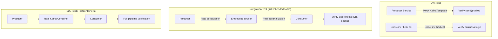

# Làm sao test Kafka consumer/producer?

## ⚡ Tóm tắt ngắn (30s)
* **3 tầng test**: Unit test (mock KafkaTemplate), Integration test (Embedded Kafka / `@EmbeddedKafka`), E2E test (Testcontainers Kafka)
* Spring Kafka cung cấp **`@EmbeddedKafka`** — chạy Kafka broker in-memory, không cần Docker, rất nhanh
* Dùng **`ConsumerRecord` assertion** để verify message format, headers, key, partition
* Quan trọng: test cả **error handling** (deserialization error, retry, DLT - Dead Letter Topic)
* Production tip: luôn test **idempotency** — consumer nhận cùng message 2 lần phải cho kết quả giống nhau

---

## 🔍 Chi tiết bản chất thực chiến

### Kiến trúc test Kafka



### Điều gì cần test?
1. **Producer**: message gửi đúng topic, key, headers, serialization format
2. **Consumer**: deserialize đúng, business logic xử lý đúng, acknowledgment
3. **Error handling**: retry policy, Dead Letter Topic routing
4. **Serialization**: Avro/JSON schema compatibility
5. **Ordering**: messages cùng key → cùng partition → đúng thứ tự

---

## 💻 Code thực chiến: BAD vs GOOD

### ❌ BAD: Test producer bằng cách verify send() mà không test serialization

```java
@ExtendWith(MockitoExtension.class)
class OrderEventProducerTest {

    @Mock
    private KafkaTemplate<String, OrderEvent> kafkaTemplate;
    @InjectMocks
    private OrderEventProducer producer;

    @Test
    void shouldSendOrderEvent() {
        OrderEvent event = new OrderEvent("ORD-1", "CREATED");

        producer.publish(event);

        // ❌ Chỉ verify method được gọi — không test serialization thực tế
        // ❌ Không verify headers, partition key, timestamp
        // ❌ Nếu OrderEvent không serializable → test vẫn pass nhưng production FAIL
        verify(kafkaTemplate).send("order-events", event);
    }
}
```

---

### ✅ GOOD: Test đầy đủ với @EmbeddedKafka

```java
// ========================================================
// Producer Service
// ========================================================
@Service
@RequiredArgsConstructor
public class OrderEventProducer {

    private final KafkaTemplate<String, OrderEvent> kafkaTemplate;

    public CompletableFuture<SendResult<String, OrderEvent>> publish(OrderEvent event) {
        return kafkaTemplate.send(
            MessageBuilder.withPayload(event)
                .setHeader(KafkaHeaders.TOPIC, "order-events")
                .setHeader(KafkaHeaders.KEY, event.getOrderId())
                .setHeader("event-type", event.getType())
                .build()
        );
    }
}

// ========================================================
// Consumer Listener
// ========================================================
@Service
@RequiredArgsConstructor
@Slf4j
public class OrderEventConsumer {

    private final OrderRepository orderRepository;

    @KafkaListener(topics = "order-events", groupId = "order-processor")
    public void consume(
            @Payload OrderEvent event,
            @Header(KafkaHeaders.RECEIVED_KEY) String key,
            @Header("event-type") String eventType,
            Acknowledgment ack) {
        
        log.info("Received order event: {} type: {}", key, eventType);
        orderRepository.save(Order.from(event));
        ack.acknowledge(); // manual commit
    }
}

// ========================================================
// Integration Test — Full round-trip
// ========================================================
@SpringBootTest
@EmbeddedKafka(
    partitions = 3,
    topics = {"order-events", "order-events-dlq"},
    brokerProperties = {
        "listeners=PLAINTEXT://localhost:9092",
        "log.dir=target/embedded-kafka"
    }
)
@TestPropertySource(properties = {
    "spring.kafka.bootstrap-servers=${spring.embedded.kafka.brokers}",
    "spring.kafka.consumer.auto-offset-reset=earliest",
    "spring.kafka.consumer.enable-auto-commit=false"
})
class OrderEventIntegrationTest {

    @Autowired
    private OrderEventProducer producer;
    @Autowired
    private OrderRepository orderRepository;
    @Autowired
    private EmbeddedKafkaBroker embeddedKafka;

    @AfterEach
    void cleanup() {
        orderRepository.deleteAll();
    }

    // ✅ Test 1: Full round-trip — produce → consume → persist
    @Test
    void shouldProduceAndConsumeOrderEvent() {
        OrderEvent event = new OrderEvent("ORD-123", "CREATED", 
            BigDecimal.valueOf(299.99), Instant.now());

        // Produce
        producer.publish(event);

        // Verify consumer xử lý thành công
        await()
            .atMost(10, TimeUnit.SECONDS)
            .pollInterval(500, TimeUnit.MILLISECONDS)
            .untilAsserted(() -> {
                Optional<Order> order = orderRepository.findByOrderId("ORD-123");
                assertTrue(order.isPresent());
                assertEquals("CREATED", order.get().getStatus());
                assertEquals(BigDecimal.valueOf(299.99), order.get().getAmount());
            });
    }

    // ✅ Test 2: Verify message key → đúng partition (ordering)
    @Test
    void shouldRouteToSamePartition_forSameKey() throws Exception {
        SendResult<String, OrderEvent> result1 = producer.publish(
            new OrderEvent("ORD-1", "CREATED")).get(5, TimeUnit.SECONDS);
        SendResult<String, OrderEvent> result2 = producer.publish(
            new OrderEvent("ORD-1", "PAID")).get(5, TimeUnit.SECONDS);

        // Cùng key → cùng partition → đảm bảo ordering
        assertEquals(result1.getRecordMetadata().partition(),
                     result2.getRecordMetadata().partition());
    }

    // ✅ Test 3: Verify serialization/deserialization
    @Test
    void shouldSerializeAndDeserializeCorrectly() throws Exception {
        // Dùng ConsumerFactory để tạo test consumer
        Map<String, Object> props = KafkaTestUtils.consumerProps(
            "test-group", "true", embeddedKafka);
        props.put(ConsumerConfig.VALUE_DESERIALIZER_CLASS_CONFIG, 
            JsonDeserializer.class);
        props.put(JsonDeserializer.TRUSTED_PACKAGES, "*");

        ConsumerFactory<String, OrderEvent> cf = new DefaultKafkaConsumerFactory<>(props);
        Consumer<String, OrderEvent> testConsumer = cf.createConsumer();
        embeddedKafka.consumeFromAnEmbeddedTopic(testConsumer, "order-events");

        // Produce
        OrderEvent original = new OrderEvent("ORD-456", "SHIPPED");
        producer.publish(original);

        // Consume và verify
        ConsumerRecords<String, OrderEvent> records = 
            KafkaTestUtils.getRecords(testConsumer, Duration.ofSeconds(10));

        assertFalse(records.isEmpty());
        ConsumerRecord<String, OrderEvent> record = records.iterator().next();
        assertEquals("ORD-456", record.key());
        assertEquals("SHIPPED", record.value().getType());
        assertEquals("SHIPPED", 
            new String(record.headers().lastHeader("event-type").value()));

        testConsumer.close();
    }
}

// ========================================================
// Unit Test — Consumer logic isolation
// ========================================================
@ExtendWith(MockitoExtension.class)
class OrderEventConsumerUnitTest {

    @Mock private OrderRepository orderRepository;
    @Mock private Acknowledgment acknowledgment;
    @InjectMocks private OrderEventConsumer consumer;

    @Test
    void consume_shouldSaveOrderAndAcknowledge() {
        OrderEvent event = new OrderEvent("ORD-1", "CREATED");

        // ✅ Test consumer logic trực tiếp — không cần Kafka
        consumer.consume(event, "ORD-1", "CREATED", acknowledgment);

        verify(orderRepository).save(argThat(order -> 
            order.getOrderId().equals("ORD-1") && 
            order.getStatus().equals("CREATED")
        ));
        verify(acknowledgment).acknowledge();
    }

    @Test
    void consume_shouldNotAcknowledge_whenProcessingFails() {
        when(orderRepository.save(any())).thenThrow(new DataAccessException("DB down") {});
        OrderEvent event = new OrderEvent("ORD-1", "CREATED");

        assertThrows(DataAccessException.class, () ->
            consumer.consume(event, "ORD-1", "CREATED", acknowledgment));

        verify(acknowledgment, never()).acknowledge();
    }
}
```

---

## 📊 Bảng so sánh chiến lược test Kafka

| Tiêu chí | Unit Test (Mock) | @EmbeddedKafka | Testcontainers Kafka |
| :--- | :--- | :--- | :--- |
| Tốc độ | ⚡ ~ms | 🔶 ~3-5s startup | 🐢 ~10-15s startup |
| Serialization test | ❌ Không | ✅ Có | ✅ Có |
| Partition logic | ❌ Không | ✅ Có | ✅ Có |
| Consumer group rebalance | ❌ Không | ⚠️ Hạn chế | ✅ Có |
| Kafka version matching | N/A | ⚠️ Embedded version | ✅ Chọn đúng version |
| CI/CD friendly | ✅ | ✅ | ⚠️ Cần Docker |
| Phù hợp cho | Business logic | Integration test | E2E / Pre-production |

---

## ⚠️ Common Gotchas & Questions follow-up

### 1. Consumer test flaky do timing
* **Problem**: Consumer chưa subscribe xong khi producer gửi message → miss message
* **Consequence**: Test intermittently fails
* **Solution**: Dùng `ContainerTestUtils.waitForAssignment()` hoặc `Awaitility` để đợi consumer ready

### 2. Deserialization error không được test
* **Problem**: Producer gửi format khác consumer expect → `SerializationException` → message bị drop
* **Consequence**: Data loss không ai biết
* **Solution**: Cấu hình `ErrorHandlingDeserializer` + test với malformed message → verify DLT routing

### 3. Idempotency không được test
* **Problem**: Consumer nhận duplicate message (at-least-once) → insert duplicate data
* **Consequence**: Data inconsistency trong production
* **Solution**: Test gửi cùng message 2 lần → verify chỉ có 1 record trong DB

### 4. Offset commit strategy
* **Problem**: Auto-commit vs manual commit behavior khác nhau khi exception xảy ra
* **Consequence**: Message loss (auto-commit) hoặc reprocessing (manual commit)
* **Solution**: Test manual ack: verify `ack.acknowledge()` chỉ gọi sau khi process thành công

### 5. Topic configuration trong test vs production
* **Problem**: Test dùng 1 partition, production dùng 12 → ordering behavior khác
* **Consequence**: Bug ordering chỉ xuất hiện ở production
* **Solution**: `@EmbeddedKafka(partitions = 3)` để test multi-partition behavior
