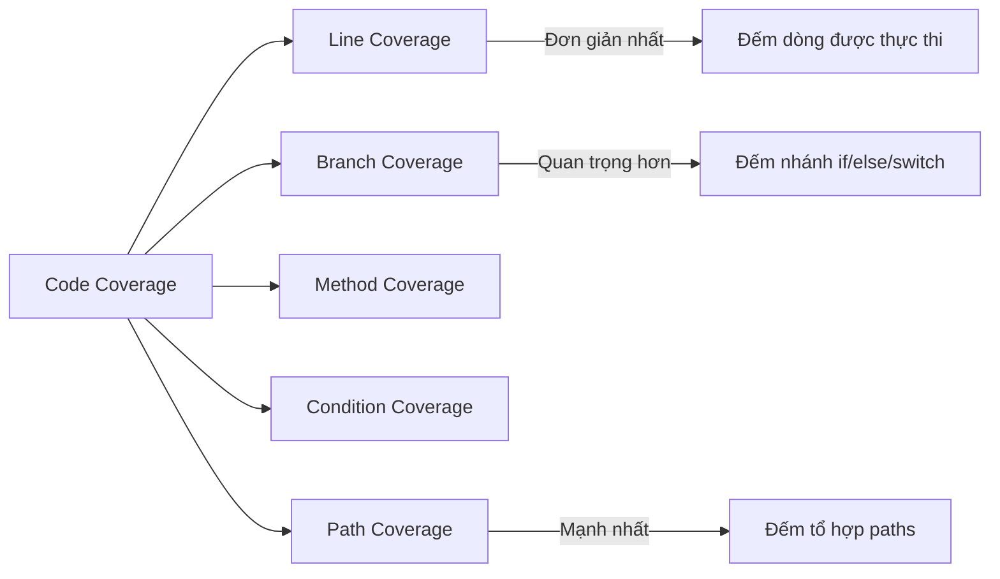

# Code coverage có phản ánh chất lượng test không?

## ⚡ Tóm tắt ngắn (30s)
* **Không hoàn toàn** — code coverage là **necessary but not sufficient** condition. Coverage cao chỉ nói rằng code được **chạy qua**, không nói rằng code được **kiểm tra đúng**
* Có thể đạt **100% coverage mà 0 assertion** — test chạy qua mọi dòng nhưng không verify gì cả
* Coverage hữu ích để tìm **dead zone** — code CHƯA BAO GIỜ được test. Nhưng không nên dùng làm KPI chất lượng duy nhất
* **Mutation testing** (PIT) mới thực sự đo chất lượng assertion — nó thay đổi code rồi xem test có phát hiện không
* Quy tắc thực chiến: **80% line coverage** là mức đủ tốt, tập trung coverage vào **business-critical paths**

---

## 🔍 Chi tiết bản chất thực chiến

### Các loại coverage metrics



### Tại sao coverage cao ≠ quality cao?

**Coverage chỉ đo**: "Dòng code này có được **chạy qua** trong test không?"
**Coverage KHÔNG đo**: "Test có **verify đúng behavior** không?"

Đây là sự khác biệt cốt lõi mà nhiều team không nhận ra. Một test suite có thể execute 100% code mà không assert bất kỳ điều gì meaningful.

---

## 💻 Code thực chiến: BAD vs GOOD

### ❌ BAD: 100% coverage nhưng test vô nghĩa

```java
// Service code
@Service
public class PricingService {

    public BigDecimal calculateDiscount(Order order) {
        if (order.getTotalAmount().compareTo(BigDecimal.valueOf(1000)) > 0) {
            return order.getTotalAmount().multiply(BigDecimal.valueOf(0.10)); // 10%
        } else if (order.isVipCustomer()) {
            return order.getTotalAmount().multiply(BigDecimal.valueOf(0.05)); // 5%
        }
        return BigDecimal.ZERO;
    }

    public BigDecimal calculateFinalPrice(Order order) {
        BigDecimal discount = calculateDiscount(order);
        BigDecimal shipping = calculateShipping(order);
        return order.getTotalAmount().subtract(discount).add(shipping);
    }
}

// ❌ Test đạt 100% LINE coverage nhưng VÔ GIÁ TRỊ
class PricingServiceBadTest {

    private PricingService service = new PricingService();

    @Test
    void testCalculateDiscount_highAmount() {
        Order order = new Order(BigDecimal.valueOf(2000), false);
        service.calculateDiscount(order); // ❌ Không assert gì!
        // Line coverage: ✅ dòng if và return đều được chạy
    }

    @Test
    void testCalculateDiscount_vip() {
        Order order = new Order(BigDecimal.valueOf(500), true);
        service.calculateDiscount(order); // ❌ Không assert gì!
    }

    @Test
    void testCalculateDiscount_noDiscount() {
        Order order = new Order(BigDecimal.valueOf(100), false);
        service.calculateDiscount(order); // ❌ Không assert gì!
    }

    @Test
    void testFinalPrice() {
        Order order = new Order(BigDecimal.valueOf(2000), false);
        service.calculateFinalPrice(order); // ❌ Không assert gì!
        // 100% line coverage, 100% branch coverage, 0% value verification
    }
}
```

---

### ✅ GOOD: Coverage có ý nghĩa với assertion chất lượng

```java
class PricingServiceGoodTest {

    private PricingService service = new PricingService();

    // ✅ Test behavior, verify expected output
    @Test
    void calculateDiscount_orderOver1000_shouldApply10Percent() {
        Order order = new Order(BigDecimal.valueOf(2000), false);
        
        BigDecimal discount = service.calculateDiscount(order);
        
        assertEquals(BigDecimal.valueOf(200.0), discount,
            "Orders over 1000 should get 10% discount");
    }

    @Test
    void calculateDiscount_vipUnder1000_shouldApply5Percent() {
        Order order = new Order(BigDecimal.valueOf(500), true);
        
        BigDecimal discount = service.calculateDiscount(order);
        
        assertEquals(BigDecimal.valueOf(25.0), discount,
            "VIP orders under 1000 should get 5% discount");
    }

    @Test
    void calculateDiscount_regularUnder1000_shouldReturnZero() {
        Order order = new Order(BigDecimal.valueOf(100), false);
        
        BigDecimal discount = service.calculateDiscount(order);
        
        assertEquals(BigDecimal.ZERO, discount,
            "Regular orders under 1000 should get no discount");
    }

    // ✅ Edge case — boundary value testing
    @Test
    void calculateDiscount_exactlyAt1000_shouldNotApplyHighDiscount() {
        Order order = new Order(BigDecimal.valueOf(1000), false);
        
        BigDecimal discount = service.calculateDiscount(order);
        
        assertEquals(BigDecimal.ZERO, discount,
            "Exactly 1000 should NOT trigger > 1000 discount");
    }

    // ✅ Test tổ hợp — verify final calculation logic
    @ParameterizedTest
    @CsvSource({
        "2000, false, 1810.00",  // 2000 - 200 (10%) + 10 shipping
        "500,  true,  485.00",   // 500 - 25 (5%) + 10 shipping  
        "100,  false, 110.00"    // 100 - 0 + 10 shipping
    })
    void calculateFinalPrice_shouldComputeCorrectly(
            BigDecimal amount, boolean vip, BigDecimal expected) {
        Order order = new Order(amount, vip);
        
        BigDecimal finalPrice = service.calculateFinalPrice(order);
        
        assertEquals(expected, finalPrice);
    }
}
```

### ✅ Cấu hình JaCoCo coverage trong project

```xml
<!-- pom.xml — JaCoCo plugin configuration -->
<plugin>
    <groupId>org.jacoco</groupId>
    <artifactId>jacoco-maven-plugin</artifactId>
    <version>0.8.12</version>
    <executions>
        <execution>
            <goals><goal>prepare-agent</goal></goals>
        </execution>
        <execution>
            <id>report</id>
            <phase>verify</phase>
            <goals><goal>report</goal></goals>
        </execution>
        <execution>
            <id>check</id>
            <phase>verify</phase>
            <goals><goal>check</goal></goals>
            <configuration>
                <rules>
                    <rule>
                        <element>BUNDLE</element>
                        <limits>
                            <!-- ✅ Line coverage tối thiểu 80% -->
                            <limit>
                                <counter>LINE</counter>
                                <value>COVEREDRATIO</value>
                                <minimum>0.80</minimum>
                            </limit>
                            <!-- ✅ Branch coverage tối thiểu 70% -->
                            <limit>
                                <counter>BRANCH</counter>
                                <value>COVEREDRATIO</value>
                                <minimum>0.70</minimum>
                            </limit>
                        </limits>
                    </rule>
                </rules>
                <!-- ✅ Exclude generated code, DTOs, configs -->
                <excludes>
                    <exclude>**/config/**</exclude>
                    <exclude>**/dto/**</exclude>
                    <exclude>**/*Application.*</exclude>
                </excludes>
            </configuration>
        </execution>
    </executions>
</plugin>
```

---

## 📊 Bảng so sánh Coverage Metrics

| Metric | Đo gì | Điểm mạnh | Điểm yếu |
| :--- | :--- | :--- | :--- |
| Line Coverage | % dòng code được execute | Dễ hiểu, dễ đo | Không phân biệt logic phức tạp |
| Branch Coverage | % nhánh if/else được cover | Phát hiện missing edge case | Không đo combination of conditions |
| Condition Coverage | % sub-condition trong compound `if` | Chi tiết hơn branch | Phức tạp, khó đạt 100% |
| Path Coverage | % tổ hợp execution paths | Toàn diện nhất | Exponential paths, không thực tế |
| Mutation Coverage | % mutant bị test phát hiện | **Đo chất lượng assertion thực sự** | Chậm (chạy test nhiều lần) |

---

## ⚠️ Common Gotchas & Questions follow-up

### 1. Coverage target quá cao gây phản tác dụng
* **Problem**: Ép team đạt 95%+ coverage → viết test vô nghĩa chỉ để tăng số
* **Consequence**: Test suite chậm, brittle, maintenance cost cao, false sense of security
* **Solution**: Target 80% line + 70% branch cho business logic, exclude generated code/DTOs

### 2. Coverage chỉ đo code được chạy, không đo code ĐÚNG RA PHẢI CÓ
* **Problem**: Missing feature/requirement → không có code → không giảm coverage
* **Consequence**: 100% coverage nhưng thiếu validation, security check, error handling
* **Solution**: Combine coverage với **requirement-based testing** và **mutation testing**

### 3. Getter/Setter/DTO kéo coverage xuống
* **Problem**: Lombok-generated hoặc boilerplate code chiếm phần lớn uncovered lines
* **Consequence**: Coverage number thấp giả tạo, team frustrated
* **Solution**: Exclude via JaCoCo config: `<exclude>**/dto/**</exclude>`, `@Generated` annotation

### 4. Integration test tăng coverage nhưng chậm
* **Problem**: 1 integration test cover 200 lines nhưng chạy 5 giây
* **Consequence**: CI/CD chậm dần, developer skip test
* **Solution**: Phân tách: unit test cho coverage, integration test cho correctness. Chạy integration test riêng pipeline

### 5. Khi nào coverage thực sự hữu ích?
* **Hữu ích nhất**: Phát hiện **dead zone** — code chưa bao giờ được test
* **Hữu ích**: Trend tracking — coverage giảm theo thời gian = tech debt tăng
* **Ít hữu ích**: So sánh giữa các team/project — context khác nhau hoàn toàn
