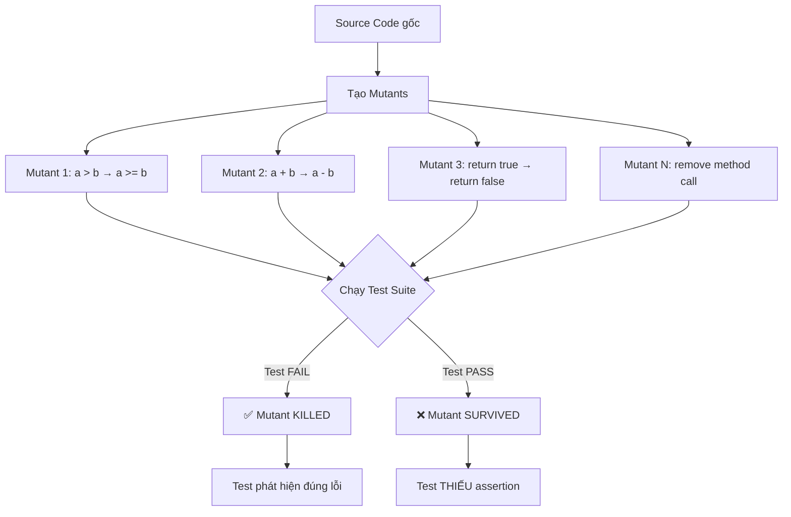

# Mutation testing là gì?

## ⚡ Tóm tắt ngắn (30s)
* Mutation testing **thay đổi (mutate) source code** rồi chạy test suite — nếu test vẫn PASS → test yếu, **mutant survived**
* Ví dụ: đổi `>` thành `>=`, đổi `return a + b` thành `return a - b` → test phải FAIL mới tốt
* **Mutation score = killed mutants / total mutants** — đo **chất lượng assertion** thực sự, không chỉ coverage
* Tool phổ biến nhất cho Java: **PIT (PITest)** — tích hợp Maven/Gradle, report HTML chi tiết
* Production tip: chỉ chạy mutation testing trên **business-critical modules**, không toàn bộ codebase (quá chậm)

---

## 🔍 Chi tiết bản chất thực chiến

### Mutation testing hoạt động thế nào?



### Các loại Mutation Operators phổ biến

| Operator | Gốc | Mutated | Ý nghĩa |
| :--- | :--- | :--- | :--- |
| **Conditionals Boundary** | `a > b` | `a >= b` | Test boundary value? |
| **Negate Conditionals** | `a == b` | `a != b` | Test cả true và false path? |
| **Math Mutator** | `a + b` | `a - b` | Test calculation kết quả? |
| **Return Values** | `return true` | `return false` | Test return value? |
| **Void Method Call** | `list.add(x)` | *(removed)* | Test side effect? |
| **Increments** | `i++` | `i--` | Test loop logic? |
| **Null Return** | `return obj` | `return null` | Test null handling? |

---

## 💻 Code thực chiến: BAD vs GOOD

### ❌ BAD: Test đạt 100% coverage nhưng mutation test FAIL

```java
// Service code
public class DiscountCalculator {

    public BigDecimal calculate(BigDecimal amount, CustomerType type) {
        if (amount.compareTo(BigDecimal.valueOf(1000)) > 0) {
            if (type == CustomerType.VIP) {
                return amount.multiply(BigDecimal.valueOf(0.20)); // 20%
            }
            return amount.multiply(BigDecimal.valueOf(0.10)); // 10%
        }
        return BigDecimal.ZERO;
    }
}

// ❌ Test: 100% line coverage, nhưng mutation score thấp
class DiscountCalculatorWeakTest {

    private DiscountCalculator calculator = new DiscountCalculator();

    @Test
    void testHighAmount() {
        BigDecimal result = calculator.calculate(
            BigDecimal.valueOf(2000), CustomerType.REGULAR);
        assertNotNull(result); // ❌ Chỉ check not null — mutation a*0.10 → a*0.20 vẫn pass
    }

    @Test
    void testVip() {
        BigDecimal result = calculator.calculate(
            BigDecimal.valueOf(2000), CustomerType.VIP);
        assertTrue(result.compareTo(BigDecimal.ZERO) > 0); // ❌ Quá loose — bất kỳ số > 0 đều pass
    }

    @Test
    void testLowAmount() {
        BigDecimal result = calculator.calculate(
            BigDecimal.valueOf(500), CustomerType.REGULAR);
        // ❌ Không assert gì
        // Line coverage: 100%, Mutation score: ~30%
    }
}
```

---

### ✅ GOOD: Test kill mọi mutant

```java
class DiscountCalculatorStrongTest {

    private DiscountCalculator calculator = new DiscountCalculator();

    // ✅ Exact value assertion — kill Math Mutator
    @Test
    void calculate_highAmount_regular_shouldReturn10Percent() {
        BigDecimal result = calculator.calculate(
            BigDecimal.valueOf(2000), CustomerType.REGULAR);
        // Kill mutant: 0.10 → 0.20, + → -, * → /
        assertEquals(0, BigDecimal.valueOf(200).compareTo(result));
    }

    // ✅ Kill Conditional Boundary mutant: > → >=
    @Test
    void calculate_exactlyAt1000_shouldReturnZero() {
        BigDecimal result = calculator.calculate(
            BigDecimal.valueOf(1000), CustomerType.REGULAR);
        // Kill mutant: > 1000 → >= 1000
        assertEquals(0, BigDecimal.ZERO.compareTo(result));
    }

    // ✅ Kill: 1001 is boundary
    @Test
    void calculate_justAbove1000_shouldReturnDiscount() {
        BigDecimal result = calculator.calculate(
            BigDecimal.valueOf(1001), CustomerType.REGULAR);
        assertTrue(result.compareTo(BigDecimal.ZERO) > 0,
            "Amount just above 1000 should get discount");
    }

    // ✅ Kill Negate Conditionals: VIP check
    @Test
    void calculate_highAmount_vip_shouldReturn20Percent() {
        BigDecimal result = calculator.calculate(
            BigDecimal.valueOf(2000), CustomerType.VIP);
        assertEquals(0, BigDecimal.valueOf(400).compareTo(result));
    }

    // ✅ Kill Return Value mutant: ZERO → non-zero
    @Test
    void calculate_lowAmount_shouldReturnExactlyZero() {
        BigDecimal result = calculator.calculate(
            BigDecimal.valueOf(500), CustomerType.REGULAR);
        assertEquals(0, BigDecimal.ZERO.compareTo(result));
    }

    // ✅ Verify VIP vs REGULAR different discount
    @Test
    void calculate_sameAmount_vipShouldGetMoreDiscount() {
        BigDecimal vipDiscount = calculator.calculate(
            BigDecimal.valueOf(2000), CustomerType.VIP);
        BigDecimal regularDiscount = calculator.calculate(
            BigDecimal.valueOf(2000), CustomerType.REGULAR);
        
        assertTrue(vipDiscount.compareTo(regularDiscount) > 0,
            "VIP should get higher discount than REGULAR");
    }
}
```

### ✅ Cấu hình PITest trong Maven

```xml
<!-- pom.xml -->
<plugin>
    <groupId>org.pitest</groupId>
    <artifactId>pitest-maven</artifactId>
    <version>1.16.1</version>
    <dependencies>
        <!-- JUnit 5 support -->
        <dependency>
            <groupId>org.pitest</groupId>
            <artifactId>pitest-junit5-plugin</artifactId>
            <version>1.2.1</version>
        </dependency>
    </dependencies>
    <configuration>
        <!-- ✅ Chỉ chạy trên business-critical packages -->
        <targetClasses>
            <param>com.myapp.service.*</param>
            <param>com.myapp.domain.*</param>
        </targetClasses>
        <targetTests>
            <param>com.myapp.service.*Test</param>
            <param>com.myapp.domain.*Test</param>
        </targetTests>
        <!-- ✅ Mutation operators -->
        <mutators>
            <mutator>DEFAULTS</mutator>
            <mutator>NON_VOID_METHOD_CALLS</mutator>
            <mutator>NULL_RETURNS</mutator>
        </mutators>
        <!-- ✅ Mutation score threshold -->
        <mutationThreshold>75</mutationThreshold>
        <!-- ✅ Tối ưu hiệu năng -->
        <threads>4</threads>
        <timeoutConstant>5000</timeoutConstant>
        <excludedClasses>
            <param>*Config</param>
            <param>*DTO</param>
            <param>*Application</param>
        </excludedClasses>
    </configuration>
</plugin>
```

```bash
# Chạy mutation testing
mvn org.pitest:pitest-maven:mutationCoverage

# Report HTML: target/pit-reports/index.html
```

---

## 📊 Bảng so sánh Code Coverage vs Mutation Testing

| Tiêu chí | Code Coverage (JaCoCo) | Mutation Testing (PIT) |
| :--- | :--- | :--- |
| Đo gì | Code được **execute** | Test **phát hiện lỗi** |
| Metric | % lines/branches executed | % mutants killed |
| False positive | Cao — 100% coverage ≠ good test | Thấp — killed mutant = real detection |
| Tốc độ | Nhanh (1 lần chạy test) | Chậm (N lần chạy test × M mutants) |
| Actionable | Tìm code chưa test | Tìm test thiếu assertion |
| Dùng khi | Mọi project, CI/CD gate | Critical modules, periodic review |
| Target | 80% line, 70% branch | 75%+ mutation score |

---

## ⚠️ Common Gotchas & Questions follow-up

### 1. Mutation testing quá chậm cho toàn bộ codebase
* **Problem**: M mutants × N test × T thời gian = hàng giờ cho project lớn
* **Consequence**: Developer không chạy, CI timeout
* **Solution**: Chỉ chạy trên critical packages, dùng **incremental mutation** (PIT chỉ chạy trên code thay đổi), dùng `threads=4`

### 2. Equivalent mutant — mutant không thể kill
* **Problem**: Một số mutation tạo code có behavior giống hệt gốc → test ĐÚNG KHI không fail
* **Ví dụ**: `for(int i=0; i<n; i++)` → `for(int i=0; i!=n; i++)` — giống nhau nếu i luôn tăng
* **Consequence**: Mutation score bị giảm giả tạo
* **Solution**: PIT có heuristics để loại bỏ, chấp nhận mutation score không bao giờ đạt 100%

### 3. Khi nào KHÔNG nên dùng mutation testing?
* Code generate (Lombok, MapStruct) — mutate generated code vô nghĩa
* Controller layer — nên test bằng integration test, không unit test
* Configuration classes — không có business logic
* Prototype/MVP — overhead không đáng

### 4. Mutation testing trong CI/CD pipeline
* **Strategy**: Chạy code coverage trong mọi PR, chạy mutation testing **nightly** hoặc **weekly**
* **Gate**: Mutation score giảm > 5% so với baseline → block merge
* **Tool**: PIT Maven plugin + HTML report, tích hợp SonarQube

### 5. Mối quan hệ giữa coverage và mutation score
* Coverage cao + mutation score thấp = **test yếu** (chạy qua nhưng không verify)
* Coverage thấp + mutation score cao = **test ít nhưng chất lượng** (impossible trên practice)
* **Mục tiêu**: Coverage ≥ 80% VÀ mutation score ≥ 75% trên business logic
