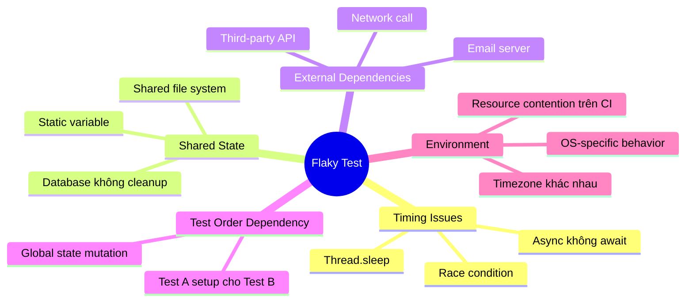

# Flaky test là gì? Cách xử lý.

## ⚡ Tóm tắt ngắn (30s)
* **Flaky test** là test case **khi thì pass, khi thì fail** trên cùng một codebase — không có sự thay đổi nào về code
* Nguyên nhân phổ biến: **race condition, test order dependency, shared mutable state, time-dependent logic, external service dependency**
* Flaky test nguy hiểm vì gây **mất niềm tin** vào test suite → team bắt đầu ignore test failures → quality xuống dốc
* Cách xử lý: **isolate test, mock external dependencies, tránh shared state, dùng deterministic time**, và **quarantine flaky tests** ra khỏi CI pipeline chính

---

## 🔍 Chi tiết bản chất thực chiến

### Tại sao Flaky Test nguy hiểm hơn bạn nghĩ?

Flaky test tạo ra **"broken window effect"** trong engineering culture. Khi team thấy test fail mà không phải do code lỗi, họ dần **bỏ qua test failure**. Kết quả là khi có **real bug**, nó bị ẩn giữa hàng loạt flaky failures.

Google từng công bố: **~16% test failures** tại Google là do flaky tests. Họ đã xây cả hệ thống riêng để detect và quarantine flaky tests.

### Các nguyên nhân phổ biến



### Chiến lược xử lý Flaky Test

1. **Detect**: Chạy test nhiều lần (rerun), track pass/fail ratio
2. **Quarantine**: Tách flaky test ra riêng, không block CI pipeline
3. **Fix root cause**: Analyze và fix từng test
4. **Prevent**: Code review checklist, best practices

---

## 💻 Code thực chiến: BAD vs GOOD

### ❌ BAD: Test phụ thuộc vào timing và shared state

```java
// BAD: Flaky vì race condition + shared state
public class OrderServiceTest {

    // Static shared state → các test ảnh hưởng lẫn nhau
    private static List<Order> orderDatabase = new ArrayList<>();

    @Test
    void testCreateOrder() {
        OrderService service = new OrderService(orderDatabase);
        service.createOrder(new Order("item-1", 100));

        // Flaky: nếu test khác chạy trước, list không rỗng
        assertEquals(1, orderDatabase.size());
    }

    @Test
    void testAsyncNotification() {
        OrderService service = new OrderService(orderDatabase);
        service.createOrderAsync(new Order("item-2", 200));

        // BAD: Thread.sleep → flaky trên CI chậm
        Thread.sleep(500);

        assertTrue(service.isNotificationSent());
    }

    @Test
    void testOrderTimestamp() {
        Order order = new Order("item-3", 300);

        // BAD: Phụ thuộc vào thời gian thực tế
        assertEquals(LocalDate.now(), order.getCreatedDate());
    }
}
```

---

### ✅ GOOD: Test deterministic, isolated, không flaky

```java
public class OrderServiceTest {

    // Mỗi test có state riêng
    private List<Order> orderDatabase;
    private OrderService service;
    private Clock fixedClock;

    @BeforeEach
    void setUp() {
        orderDatabase = new ArrayList<>();  // Fresh state mỗi test
        fixedClock = Clock.fixed(
            Instant.parse("2025-01-15T10:00:00Z"), ZoneId.of("UTC")
        );
        service = new OrderService(orderDatabase, fixedClock);
    }

    @AfterEach
    void tearDown() {
        orderDatabase.clear();  // Cleanup rõ ràng
    }

    @Test
    void shouldAddOrderToDatabase_whenCreateOrder() {
        service.createOrder(new Order("item-1", 100));

        // Deterministic: state isolated per test
        assertThat(orderDatabase).hasSize(1);
        assertThat(orderDatabase.get(0).getItemName()).isEqualTo("item-1");
    }

    @Test
    void shouldSendNotification_whenAsyncOrderCompletes() {
        // GOOD: Dùng Awaitility thay vì Thread.sleep
        service.createOrderAsync(new Order("item-2", 200));

        await().atMost(Duration.ofSeconds(5))
               .pollInterval(Duration.ofMillis(100))
               .untilAsserted(() ->
                   assertTrue(service.isNotificationSent())
               );
    }

    @Test
    void shouldSetCreatedDate_toCurrentDate() {
        Order order = new Order("item-3", 300, fixedClock);

        // GOOD: Deterministic time → never flaky
        assertThat(order.getCreatedDate())
            .isEqualTo(LocalDate.of(2025, 1, 15));
    }
}
```

---

## 📊 Bảng so sánh nguyên nhân và cách xử lý

| Nguyên nhân | Triệu chứng | Cách xử lý |
| :--- | :--- | :--- |
| **Thread.sleep()** | Fail trên CI chậm, pass local | Dùng `Awaitility` hoặc `CountDownLatch` |
| **Shared mutable state** | Fail khi chạy full suite, pass khi chạy riêng | `@BeforeEach` reset state, tránh `static` |
| **Test order dependency** | Fail khi shuffle order | Mỗi test tự setup, dùng `@TestMethodOrder` cẩn thận |
| **Real HTTP calls** | Fail khi network chậm/down | Mock với `WireMock`, `MockWebServer` |
| **Time-dependent logic** | Fail vào nửa đêm hoặc timezone khác | Inject `Clock`, dùng fixed time |
| **Random data** | Fail ngẫu nhiên, khó reproduce | Seed random hoặc dùng fixed test data |
| **File system** | Fail do permission, path separator | Dùng `@TempDir`, abstract file operations |

---

## ⚠️ Common Gotchas & Questions follow-up

### 1. Retry flaky test có phải giải pháp không?
* **Không phải giải pháp gốc** — retry chỉ là **bandage**, mask underlying problem
* Dùng retry tạm thời trong CI để **unblock pipeline** trong khi fix root cause
* Plugin `maven-surefire` hỗ trợ `rerunFailingTestsCount` nhưng **đừng lạm dụng**

### 2. Làm sao detect flaky test trong CI/CD?
* Track **test result history** — test nào flip giữa pass/fail là flaky candidate
* Dùng tool như **Gradle Test Retry plugin**, **Flaky Test Handler** trong Jenkins
* Tạo **flaky test dashboard** để monitor tỷ lệ flaky theo thời gian

### 3. Quarantine strategy hoạt động thế nào?
* Tag flaky test với `@Tag("flaky")` hoặc move vào package riêng
* CI chính **exclude** flaky tests → không block deployment
* Chạy flaky tests trong **separate pipeline** → team fix dần
* Đặt **SLA**: flaky test phải fix trong 1 sprint hoặc bị xóa

### 4. Flaky test trong Integration Test xử lý thế nào?
* Dùng **Testcontainers** thay vì shared database → mỗi test có DB riêng
* **WireMock** cho external API dependencies
* `@DirtiesContext` khi Spring context bị pollute (nhưng tốn performance)
* Prefer **transactional rollback** thay vì manual cleanup

### 5. Khi nào nên xóa flaky test thay vì fix?
* Khi **cost to fix > value của test** — test cover case rất edge, không critical
* Khi test **bị outdated**, business logic đã thay đổi
* Nguyên tắc: **no test tốt hơn flaky test** — flaky test gây hại nhiều hơn lợi
