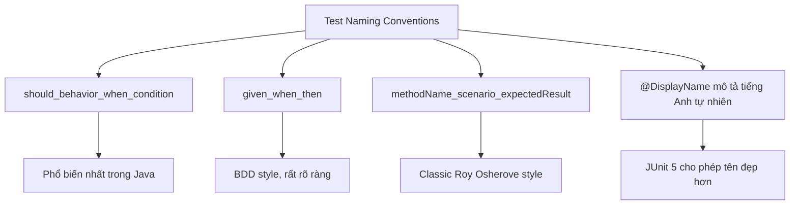

# Test naming convention nên như thế nào?

## ⚡ Tóm tắt ngắn (30s)
* Test name phải **đọc như một specification** — ai đọc cũng hiểu test kiểm tra behavior gì mà không cần đọc code
* Convention phổ biến nhất: **`should_[expectedBehavior]_when_[condition]`** hoặc **`given_when_then`**
* Tránh đặt tên kiểu `test1`, `testMethod`, `testCreateUser` — **quá mơ hồ**, không nói lên được behavior
* Test name tốt giúp **debug nhanh hơn** — khi test fail, bạn biết ngay feature gì hỏng chỉ từ tên test
* Consistency trong team quan trọng hơn convention cụ thể — chọn 1 convention và **enforce qua code review**

---

## 🔍 Chi tiết bản chất thực chiến

### Tại sao Test Name quan trọng?

Test không chỉ để verify code đúng — test còn là **living documentation**. Khi bạn chạy test suite và thấy:

```
✅ shouldReturnEmptyList_whenNoProductsExist
❌ shouldThrowException_whenPriceIsNegative
✅ shouldApplyDiscount_whenCustomerIsVIP
```

Bạn hiểu ngay **business behavior** mà không cần đọc code. Test name chính là **spec of your system**.

### Các convention phổ biến



### Nguyên tắc vàng khi đặt tên test

1. **Describe behavior, not implementation** — test name nên nói "what", không phải "how"
2. **Include the condition/scenario** — khi nào behavior này xảy ra
3. **Include expected outcome** — kết quả mong đợi là gì
4. **Avoid technical jargon** — business stakeholder cũng nên đọc hiểu được
5. **Be specific** — "shouldWork" không phải test name

---

## 💻 Code thực chiến: BAD vs GOOD

### ❌ BAD: Test name vô nghĩa, không truyền tải behavior

```java
class UserServiceTest {

    // BAD: Tên quá generic, không biết test case gì
    @Test
    void test1() {
        UserService service = new UserService(mockRepo);
        User user = service.findById(1L);
        assertNotNull(user);
    }

    // BAD: Chỉ nói method name, không nói scenario
    @Test
    void testRegister() {
        UserService service = new UserService(mockRepo);
        service.register(new UserDto("john", "john@email.com"));
        verify(mockRepo).save(any(User.class));
    }

    // BAD: Quá dài, chứa implementation detail
    @Test
    void testThatRegisterMethodCallsRepositorySaveMethodAndSendsEmail() {
        // ...
    }

    // BAD: Dùng "happy path" / "sad path" — mơ hồ
    @Test
    void testRegisterHappyPath() {
        // ...
    }

    // BAD: Boolean style — không biết expect true hay false
    @Test
    void testIsActive() {
        // ...
    }
}
```

---

### ✅ GOOD: Test name là living documentation

```java
class UserServiceTest {

    // ========== Convention 1: should_when ==========

    @Test
    void shouldReturnUser_whenValidIdProvided() {
        when(mockRepo.findById(1L)).thenReturn(Optional.of(existingUser));

        User result = userService.findById(1L);

        assertThat(result).isEqualTo(existingUser);
    }

    @Test
    void shouldThrowNotFoundException_whenUserIdDoesNotExist() {
        when(mockRepo.findById(999L)).thenReturn(Optional.empty());

        assertThatThrownBy(() -> userService.findById(999L))
            .isInstanceOf(UserNotFoundException.class)
            .hasMessageContaining("999");
    }

    // ========== Convention 2: given_when_then ==========

    @Test
    void givenDuplicateEmail_whenRegister_thenThrowConflictException() {
        when(mockRepo.existsByEmail("john@email.com")).thenReturn(true);

        assertThatThrownBy(() ->
            userService.register(new UserDto("john", "john@email.com"))
        ).isInstanceOf(EmailAlreadyExistsException.class);
    }

    // ========== Convention 3: @DisplayName (JUnit 5) ==========

    @Test
    @DisplayName("Inactive user should not be able to login")
    void inactiveUserCannotLogin() {
        User inactiveUser = User.builder()
            .email("john@email.com")
            .active(false)
            .build();
        when(mockRepo.findByEmail("john@email.com"))
            .thenReturn(Optional.of(inactiveUser));

        assertThatThrownBy(() ->
            userService.login("john@email.com", "password")
        ).isInstanceOf(AccountDeactivatedException.class);
    }

    // ========== Convention 4: Nested class cho grouping ==========

    @Nested
    @DisplayName("Register User")
    class RegisterUser {

        @Test
        @DisplayName("should create user with encoded password")
        void shouldCreateUserWithEncodedPassword() {
            UserDto dto = new UserDto("john", "john@email.com", "raw123");

            userService.register(dto);

            verify(passwordEncoder).encode("raw123");
            verify(mockRepo).save(argThat(user ->
                !user.getPassword().equals("raw123")
            ));
        }

        @Test
        @DisplayName("should send welcome email after registration")
        void shouldSendWelcomeEmailAfterRegistration() {
            userService.register(validUserDto);

            verify(emailService).sendWelcomeEmail("john@email.com");
        }
    }
}
```

---

## 📊 Bảng so sánh các Convention

| Convention | Ví dụ | Ưu điểm | Nhược điểm |
| :--- | :--- | :--- | :--- |
| **should_when** | `shouldReturn404_whenNotFound` | Rõ ràng, phổ biến nhất | Tên có thể dài |
| **given_when_then** | `givenInvalidId_whenFind_thenThrow` | BDD style, structured | 3 phần → tên rất dài |
| **methodName_scenario_result** | `findById_invalidId_throwsException` | Gắn với method rõ ràng | Coupling với implementation |
| **@DisplayName** | `"Inactive user cannot login"` | Tự nhiên như tiếng Anh | Tên method vẫn cần hợp lý |
| **@Nested + @DisplayName** | Class: `RegisterUser` → Method: `shouldSendEmail` | Hierarchy rõ, test report đẹp | Boilerplate nhiều hơn |

---

## ⚠️ Common Gotchas & Questions follow-up

### 1. Nên dùng underscore hay camelCase?
* **Test method**: underscore (`should_return_user`) cho readability — đây là convention riêng cho test, khác production code
* **Nhiều team dùng camelCase** (`shouldReturnUser`) để consistent với Java convention
* Quan trọng nhất: **team consistency** — chọn 1 style và stick with it

### 2. Test name dài quá thì sao?
* Nếu tên test quá dài → test có thể đang **test quá nhiều thứ** → tách thành nhiều test
* Dùng **@Nested class** để group related tests → tên method ngắn hơn vì context đã có ở class name
* `@DisplayName` cho phép tên hiển thị khác tên method

### 3. Nên include tên method being tested không?
* **Không nên couple quá chặt** với method name — khi refactor rename method, phải rename tất cả test
* Focus vào **behavior** thay vì method: `shouldRejectNegativePrice` tốt hơn `createProduct_negativePrice`
* Exception: unit test cho utility/helper method → OK để include method name

### 4. Parameterized test đặt tên thế nào?
```java
@ParameterizedTest(name = "Email ''{0}'' should be invalid")
@ValueSource(strings = {"", "not-email", "@no-local", "no-domain@"})
void shouldRejectInvalidEmail(String invalidEmail) {
    assertThatThrownBy(() -> userService.register(
        new UserDto("john", invalidEmail)
    )).isInstanceOf(InvalidEmailException.class);
}
// Output: Email '' should be invalid
//         Email 'not-email' should be invalid
//         Email '@no-local' should be invalid
```

### 5. Team không follow convention thì sao?
* Thêm **naming convention vào code review checklist**
* Dùng **ArchUnit** để enforce naming pattern programmatically:
```java
@ArchTest
static final ArchRule test_methods_should_follow_naming =
    methods().that().areAnnotatedWith(Test.class)
        .should().haveNameMatching("should.*_when.*")
        .because("Test names must follow should_when convention");
```
* Tạo **live template** trong IDE để generate test method scaffold
