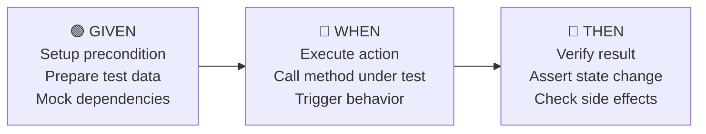
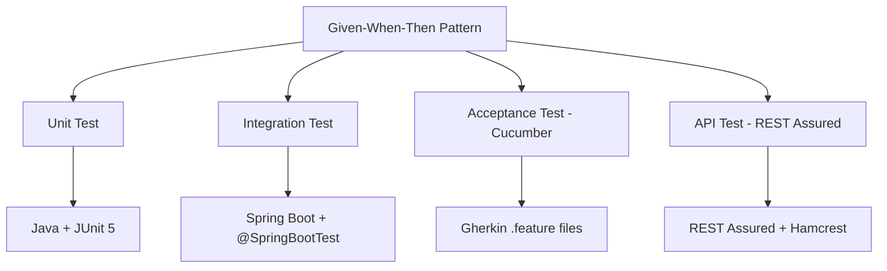

# Given-When-Then là gì?

## ⚡ Tóm tắt ngắn (30s)
* **Given-When-Then** là pattern cấu trúc test theo 3 phần: **precondition → action → assertion**
* Bắt nguồn từ **BDD (Behavior-Driven Development)** — viết test như specification mà business đọc được
* **Given**: setup trạng thái ban đầu — **When**: thực hiện action cần test — **Then**: verify kết quả mong đợi
* Tương đương với **Arrange-Act-Assert (AAA)** trong TDD, nhưng Given-When-Then **hướng business** hơn
* Áp dụng ở mọi level: unit test, integration test, acceptance test, và cả khi viết **Cucumber/Gherkin** specs

---

## 🔍 Chi tiết bản chất thực chiến

### Bản chất của Given-When-Then



| Phase | Mục đích | Câu hỏi trả lời |
| :--- | :--- | :--- |
| **Given** | Setup context, preconditions | "Hệ thống đang ở trạng thái nào?" |
| **When** | Trigger the behavior | "User/system thực hiện action gì?" |
| **Then** | Verify the outcome | "Kết quả mong đợi là gì?" |

### Given-When-Then vs Arrange-Act-Assert

Về bản chất hai pattern **tương đương** nhau, chỉ khác về **mindset**:

- **AAA** (Arrange-Act-Assert): xuất phát từ **developer perspective** — focus vào code structure
- **GWT** (Given-When-Then): xuất phát từ **business perspective** — focus vào behavior specification

Trong thực tế, senior engineer dùng **GWT mindset** để design test, nhưng code structure vẫn giống AAA.

### Ứng dụng ở nhiều levels



---

## 💻 Code thực chiến: BAD vs GOOD

### ❌ BAD: Test không có cấu trúc rõ ràng

```java
class PaymentServiceTest {

    // BAD: Mọi thứ trộn lẫn, không biết đâu là setup, action, assertion
    @Test
    void testPayment() {
        PaymentService service = new PaymentService(mockGateway, mockRepo);
        Customer customer = new Customer("john", "VIP");
        when(mockRepo.findById(1L)).thenReturn(Optional.of(customer));
        when(mockGateway.charge(any())).thenReturn(PaymentResult.SUCCESS);
        PaymentRequest request = new PaymentRequest(1L, BigDecimal.valueOf(500));
        PaymentResponse response = service.processPayment(request);
        assertNotNull(response);
        assertEquals("SUCCESS", response.getStatus());
        assertEquals(BigDecimal.valueOf(450), response.getChargedAmount());
        verify(mockGateway).charge(any());
        verify(mockRepo).findById(1L);
        // Khó đọc: 12 dòng liên tục, không biết đâu là gì
    }

    // BAD: Test name + body không thể hiện behavior
    @Test
    void testPaymentFail() {
        PaymentService service = new PaymentService(mockGateway, mockRepo);
        when(mockRepo.findById(1L)).thenReturn(Optional.empty());
        assertThrows(Exception.class, () ->
            service.processPayment(new PaymentRequest(1L, BigDecimal.TEN))
        );
    }
}
```

---

### ✅ GOOD: Given-When-Then structure rõ ràng

```java
class PaymentServiceTest {

    private PaymentService paymentService;
    @Mock private PaymentGateway mockGateway;
    @Mock private CustomerRepository mockRepo;

    @BeforeEach
    void setUp() {
        paymentService = new PaymentService(mockGateway, mockRepo);
    }

    @Test
    @DisplayName("VIP customer should receive 10% discount on payment")
    void shouldApplyVipDiscount_whenCustomerIsVIP() {
        // GIVEN: VIP customer exists with active account
        Customer vipCustomer = Customer.builder()
            .id(1L)
            .name("John")
            .tier(CustomerTier.VIP)
            .build();
        when(mockRepo.findById(1L)).thenReturn(Optional.of(vipCustomer));
        when(mockGateway.charge(any())).thenReturn(PaymentResult.SUCCESS);

        PaymentRequest request = new PaymentRequest(1L, BigDecimal.valueOf(500));

        // WHEN: Process payment for VIP customer
        PaymentResponse response = paymentService.processPayment(request);

        // THEN: Amount charged should be 450 (10% discount)
        assertThat(response.getStatus()).isEqualTo("SUCCESS");
        assertThat(response.getChargedAmount())
            .isEqualByComparingTo(BigDecimal.valueOf(450));
        assertThat(response.getDiscountApplied())
            .isEqualByComparingTo(BigDecimal.valueOf(50));

        verify(mockGateway).charge(argThat(charge ->
            charge.getAmount().compareTo(BigDecimal.valueOf(450)) == 0
        ));
    }

    @Test
    @DisplayName("Should reject payment when customer not found")
    void shouldThrowException_whenCustomerNotFound() {
        // GIVEN: No customer with ID 999 exists
        when(mockRepo.findById(999L)).thenReturn(Optional.empty());

        // WHEN & THEN: Payment should be rejected
        assertThatThrownBy(() ->
            paymentService.processPayment(
                new PaymentRequest(999L, BigDecimal.TEN)
            )
        )
        .isInstanceOf(CustomerNotFoundException.class)
        .hasMessage("Customer with id 999 not found");

        // THEN: Gateway should never be called
        verifyNoInteractions(mockGateway);
    }
}
```

### ✅ GOOD: Cucumber/Gherkin — Given-When-Then cho Acceptance Test

```gherkin
# payment.feature
Feature: Payment Processing

  Scenario: VIP customer receives discount
    Given a VIP customer "John" with an active account
    And the payment gateway is available
    When John makes a payment of $500
    Then the charged amount should be $450
    And a 10% discount should be applied

  Scenario: Reject payment for unknown customer
    Given no customer with ID 999 exists
    When a payment of $10 is requested for customer 999
    Then the system should return a "CUSTOMER_NOT_FOUND" error
    And no charge should be made to the payment gateway
```

```java
// PaymentStepDefinitions.java — Cucumber Step Definitions
public class PaymentStepDefinitions {

    private PaymentService paymentService;
    private PaymentResponse response;
    private Exception caughtException;

    @Given("a VIP customer {string} with an active account")
    public void givenVipCustomer(String name) {
        Customer customer = Customer.builder()
            .name(name).tier(CustomerTier.VIP).build();
        when(mockRepo.findById(anyLong()))
            .thenReturn(Optional.of(customer));
    }

    @When("John makes a payment of ${int}")
    public void whenMakePayment(int amount) {
        response = paymentService.processPayment(
            new PaymentRequest(1L, BigDecimal.valueOf(amount))
        );
    }

    @Then("the charged amount should be ${int}")
    public void thenChargedAmount(int expected) {
        assertThat(response.getChargedAmount())
            .isEqualByComparingTo(BigDecimal.valueOf(expected));
    }
}
```

---

## 📊 Bảng so sánh Given-When-Then vs Arrange-Act-Assert

| Tiêu chí | Given-When-Then (GWT) | Arrange-Act-Assert (AAA) |
| :--- | :--- | :--- |
| **Nguồn gốc** | BDD (Dan North, 2006) | TDD community |
| **Mindset** | Business behavior | Technical verification |
| **Đọc được bởi** | Dev, QA, BA, Product Owner | Chủ yếu Developer |
| **Tooling** | Cucumber, SpecFlow, JBehave | JUnit, TestNG, Mockito |
| **Khi nào dùng** | Acceptance test, feature spec | Unit test, integration test |
| **Comment style** | `// Given`, `// When`, `// Then` | `// Arrange`, `// Act`, `// Assert` |
| **Mapping** | Given ≈ Arrange, When ≈ Act, Then ≈ Assert | Tương đương |

---

## ⚠️ Common Gotchas & Questions follow-up

### 1. When section nên có bao nhiêu action?
* **Chỉ 1 action** — nếu có nhiều action, tách thành nhiều test
* Multiple actions trong When → bạn đang test **scenario**, không phải **unit behavior**
* Exception: integration/E2E test có thể có workflow với nhiều steps

### 2. Given section quá dài thì sao?
* Extract vào **helper methods**: `givenVipCustomerExists()`, `givenGatewayIsAvailable()`
* Dùng **Test Fixtures** hoặc **Builder pattern** cho complex object setup
* Dùng **@BeforeEach** cho common setup across tests trong cùng class

### 3. Khi nào Given và When gộp lại?
* Khi test **constructor** hoặc **factory method** — action chính là creation
* Khi test **validation** — Given là input data, When+Then là assert throws
* Pattern: `assertThatThrownBy(() -> new Order(-1))` — When và Then gộp tự nhiên

### 4. And / But trong Gherkin hoạt động thế nào?
* **And**: thêm điều kiện cùng phase — `Given A and B` = 2 preconditions
* **But**: negative condition — `Then X but not Y`
* Trong Java test, And/But đơn giản là **thêm dòng code** trong cùng section

### 5. BDD có bắt buộc dùng Cucumber không?
* **Không** — BDD là **mindset**, không phải tool
* Bạn hoàn toàn có thể viết BDD-style test thuần JUnit với comment `// Given, When, Then`
* Cucumber chỉ cần khi muốn **non-technical stakeholder** đọc và validate test specs
* **Overhead của Cucumber** khá cao → chỉ dùng cho critical business flows
