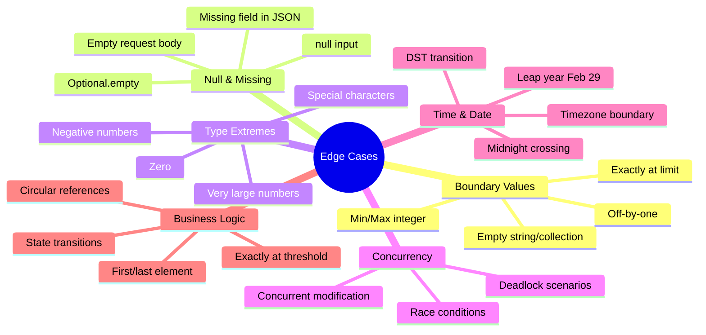

# Làm sao test edge cases tốt?

## ⚡ Tóm tắt ngắn (30s)
* **Edge case** là input/condition nằm ở **ranh giới** (boundary) hoặc **ngoại lệ** mà logic thường bỏ sót
* Kỹ thuật chính: **Boundary Value Analysis**, **Equivalence Partitioning**, **Decision Table**, và **Error Guessing**
* Các edge case kinh điển: `null`, empty, `0`, `Integer.MAX_VALUE`, concurrent access, unicode, timezone midnight
* Mindset quan trọng: **"Nếu mình là hacker, mình sẽ truyền gì vào để phá?"** — adversarial thinking
* Senior engineer **thiết kế edge case test trước khi code** (TDD) → code tự nhiên handle edge case tốt hơn

---

## 🔍 Chi tiết bản chất thực chiến

### Phân loại Edge Cases



### Framework tư duy: ZOMBIE

**ZOMBIE** là acronym giúp nhớ các loại edge case cần test:

| Letter | Meaning | Ví dụ |
| :--- | :--- | :--- |
| **Z** | Zero | `amount = 0`, empty list, blank string |
| **O** | One | Chỉ 1 element, first item, single character |
| **M** | Many | Nhiều elements, large collection, pagination |
| **B** | Boundary | `MAX_VALUE`, `MIN_VALUE`, exactly at limit |
| **I** | Interface | null input, wrong type, API contract violation |
| **E** | Exception | Network timeout, DB down, disk full |

### Kỹ thuật Boundary Value Analysis

Nếu valid range là `1-100`, test tại **6 điểm**:

```
Invalid: 0 | Valid: 1 ... 50 ... 100 | Invalid: 101
          ↑          ↑          ↑           ↑
       boundary   boundary   middle    boundary
```

---

## 💻 Code thực chiến: BAD vs GOOD

### ❌ BAD: Chỉ test happy path, bỏ qua edge cases

```java
class PriceCalculatorTest {

    @Test
    void testCalculateDiscount() {
        PriceCalculator calculator = new PriceCalculator();

        // Chỉ test 1 case "bình thường"
        BigDecimal result = calculator.calculateDiscount(
            BigDecimal.valueOf(100), 10
        );

        assertEquals(BigDecimal.valueOf(90), result);
        // DONE? Không! Còn hàng chục edge cases chưa test
    }

    @Test
    void testBulkOrder() {
        // Chỉ test 3 items — bỏ qua empty, 1 item, max items
        List<OrderItem> items = List.of(
            new OrderItem("A", 2),
            new OrderItem("B", 3),
            new OrderItem("C", 1)
        );
        BigDecimal total = calculator.calculateBulkTotal(items);
        assertTrue(total.compareTo(BigDecimal.ZERO) > 0);
    }
}
```

---

### ✅ GOOD: Cover edge cases có hệ thống

```java
class PriceCalculatorTest {

    private PriceCalculator calculator;

    @BeforeEach
    void setUp() {
        calculator = new PriceCalculator();
    }

    // ========== ZERO ==========

    @Test
    void shouldReturnZero_whenPriceIsZero() {
        BigDecimal result = calculator.calculateDiscount(
            BigDecimal.ZERO, 10
        );
        assertThat(result).isEqualByComparingTo(BigDecimal.ZERO);
    }

    @Test
    void shouldReturnOriginalPrice_whenDiscountIsZero() {
        BigDecimal result = calculator.calculateDiscount(
            BigDecimal.valueOf(100), 0
        );
        assertThat(result).isEqualByComparingTo(BigDecimal.valueOf(100));
    }

    // ========== BOUNDARY ==========

    @ParameterizedTest(name = "Discount {0}% on $100 = ${1}")
    @CsvSource({
        "0,   100.00",   // Minimum discount
        "1,    99.00",   // Just above minimum
        "50,   50.00",   // Middle
        "99,    1.00",   // Just below maximum
        "100,   0.00"    // Maximum discount (free)
    })
    void shouldCalculateCorrectly_atBoundaryDiscounts(
            int discountPercent, String expectedPrice) {
        BigDecimal result = calculator.calculateDiscount(
            BigDecimal.valueOf(100), discountPercent
        );
        assertThat(result)
            .isEqualByComparingTo(new BigDecimal(expectedPrice));
    }

    // ========== INVALID INPUT ==========

    @ParameterizedTest(name = "Should reject discount: {0}%")
    @ValueSource(ints = {-1, -100, 101, 200, Integer.MAX_VALUE})
    void shouldThrowException_whenDiscountOutOfRange(int invalidDiscount) {
        assertThatThrownBy(() ->
            calculator.calculateDiscount(
                BigDecimal.valueOf(100), invalidDiscount
            )
        ).isInstanceOf(IllegalArgumentException.class)
         .hasMessageContaining("Discount must be between 0 and 100");
    }

    @Test
    void shouldThrowException_whenPriceIsNull() {
        assertThatThrownBy(() ->
            calculator.calculateDiscount(null, 10)
        ).isInstanceOf(NullPointerException.class);
    }

    @Test
    void shouldThrowException_whenPriceIsNegative() {
        assertThatThrownBy(() ->
            calculator.calculateDiscount(BigDecimal.valueOf(-50), 10)
        ).isInstanceOf(IllegalArgumentException.class);
    }

    // ========== PRECISION & ROUNDING ==========

    @Test
    void shouldHandleRoundingCorrectly_whenResultIsRepeatingDecimal() {
        // 100 / 3 = 33.333... → cần rounding strategy
        BigDecimal result = calculator.calculateDiscount(
            BigDecimal.valueOf(100), 33  // 33% of 100 = 33.00
        );
        assertThat(result.scale()).isLessThanOrEqualTo(2);
    }

    @Test
    void shouldHandleVeryLargeAmount() {
        BigDecimal largeAmount = new BigDecimal("999999999999.99");
        BigDecimal result = calculator.calculateDiscount(largeAmount, 50);

        assertThat(result)
            .isEqualByComparingTo(new BigDecimal("499999999999.995"));
    }

    // ========== COLLECTION EDGE CASES ==========

    @Test
    void shouldReturnZero_whenBulkOrderHasNoItems() {
        BigDecimal total = calculator.calculateBulkTotal(List.of());
        assertThat(total).isEqualByComparingTo(BigDecimal.ZERO);
    }

    @Test
    void shouldThrowException_whenBulkOrderIsNull() {
        assertThatThrownBy(() -> calculator.calculateBulkTotal(null))
            .isInstanceOf(NullPointerException.class);
    }

    @Test
    void shouldCalculateCorrectly_whenBulkOrderHasSingleItem() {
        List<OrderItem> items = List.of(new OrderItem("A", 1, 99.99));
        BigDecimal total = calculator.calculateBulkTotal(items);
        assertThat(total).isEqualByComparingTo(BigDecimal.valueOf(99.99));
    }
}
```

---

## 📊 Checklist Edge Cases theo Data Type

| Data Type | Edge Cases cần test |
| :--- | :--- |
| **String** | `null`, `""`, `" "` (whitespace), very long (10K chars), unicode `"日本語"`, SQL injection `"'; DROP TABLE"`, XSS `"<script>"` |
| **Number** | `0`, `-1`, `MAX_VALUE`, `MIN_VALUE`, `NaN`, `Infinity`, precision loss |
| **Collection** | `null`, empty `[]`, single element, duplicate elements, very large, concurrent modification |
| **Date/Time** | `null`, midnight `00:00`, leap year `Feb 29`, DST transition, year 2000/2038, future dates |
| **Boolean** | `null` (Boolean wrapper), `true`, `false`, string `"true"/"false"` conversion |
| **Enum** | `null`, every enum value, unknown/new enum value (forward compatibility) |
| **File/Path** | Not exists, empty file, very large file, permission denied, special chars in name, symlink |

---

## ⚠️ Common Gotchas & Questions follow-up

### 1. Test edge case nhiều quá thì coverage có thừa không?
* **Boundary tests có ROI cao nhất** — bugs thường xuất hiện ở ranh giới
* Dùng **Equivalence Partitioning**: chỉ cần 1 test per partition, nhiều test per boundary
* Ví dụ: age valid `0-150` → test `{-1, 0, 1}` và `{149, 150, 151}`, không cần test `{2, 3, 4, ..., 148}`

### 2. Làm sao biết đã cover đủ edge cases?
* Dùng **mutation testing** (PIT) — tạo mutant code xem test có catch không
* **Code review** với focus vào edge cases — pair review checklist
* **Property-based testing** với `jqwik` — generate random edge cases tự động:
```java
@Property
void absoluteValueShouldAlwaysBeNonNegative(
        @ForAll @IntRange(min = Integer.MIN_VALUE) int value) {
    assertThat(Math.abs(value)).isGreaterThanOrEqualTo(0);
    // Fails! Math.abs(Integer.MIN_VALUE) = Integer.MIN_VALUE (negative!)
}
```

### 3. Edge case test nên ở đâu — unit test hay integration test?
* **Input validation edge cases** → unit test (nhanh, isolated)
* **Database edge cases** (null column, constraint violation) → integration test
* **API edge cases** (malformed JSON, missing headers) → controller test / API test
* **Concurrency edge cases** → stress test hoặc dùng `@RepeatedTest(100)`

### 4. Làm sao test concurrent edge cases?
* Dùng `ExecutorService` + `CountDownLatch` để simulate concurrent access
* **Không dùng `Thread.sleep`** — flaky (xem thêm câu hỏi Flaky Test)
* Tools: JCStress cho low-level concurrency testing

### 5. Property-based testing vs example-based testing?
* **Example-based**: bạn chọn cụ thể input → dễ hiểu, dễ debug
* **Property-based**: framework tự generate hàng nghìn input → phát hiện edge case bạn không nghĩ tới
* **Kết hợp cả hai**: example-based cho critical business cases, property-based cho mathematical/invariant properties
