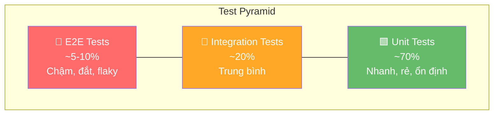

# Test pyramid là gì?

## ⚡ Tóm tắt ngắn (30s)
* Test Pyramid (Mike Cohn, 2009) mô tả **tỉ lệ phân bổ test** lý tưởng: nhiều unit test ở đáy, ít E2E test ở đỉnh
* Nguyên tắc cốt lõi: **càng lên cao → chạy càng chậm, càng flaky, càng đắt maintain** → nên viết ít hơn
* Đáy rộng (70% unit) → giữa (20% integration) → đỉnh nhọn (10% E2E)
* Anti-pattern phổ biến: **Ice Cream Cone** (quá nhiều E2E/manual test, quá ít unit test) — rất phổ biến ở các team chưa mature
* Trong thực tế microservice, nhiều team áp dụng biến thể **Testing Honeycomb** (Spotify) — ưu tiên integration test hơn unit test

---

## 🔍 Chi tiết bản chất thực chiến

### Hình dạng Test Pyramid



### Tại sao hình kim tự tháp?

Mỗi tầng test có **trade-off** khác nhau:

| | Speed | Cost | Confidence | Stability |
|---|---|---|---|---|
| **Unit** | ⚡ ms | 💲 | Thấp (từng viên gạch) | ✅ Rất ổn |
| **Integration** | 🕐 giây | 💲💲 | Trung bình | ⚠️ Khá ổn |
| **E2E** | 🐌 phút | 💲💲💲 | Cao (cả hệ thống) | ❌ Hay flaky |

→ Viết **nhiều test rẻ**, **ít test đắt** = tối ưu ROI

### Các biến thể trong thực tế

**1. Testing Trophy (Kent C. Dodds — Frontend)**
- Ưu tiên integration test ở giữa, unit test ít hơn
- Phù hợp khi unit quá granular và không mang nhiều giá trị

**2. Testing Honeycomb (Spotify — Microservices)**
- Ưu tiên integration/component test vì microservice có ít logic nhưng nhiều I/O
- Unit test ít đi vì business logic thường đơn giản (thin service)

**3. Testing Diamond (thực tế nhiều team)**
- Integration test nhiều nhất, unit và E2E ít hơn
- Phổ biến khi hệ thống CRUD-heavy

---

## 💻 Code thực chiến: Áp dụng Test Pyramid trong Spring Boot

### ❌ BAD: Ice Cream Cone — quá nhiều E2E, thiếu unit test

```java
// BAD: Team chỉ viết E2E test cho mọi thứ
// Kết quả: CI chạy 45 phút, flaky 30%, dev sợ chạy test
@SpringBootTest(webEnvironment = RANDOM_PORT)
class EverythingE2ETest {

    @Autowired TestRestTemplate restTemplate;

    @Test
    void testCalculateDiscount() {
        // Cần boot TOÀN BỘ app + DB chỉ để test phép tính đơn giản
        var response = restTemplate.postForEntity("/api/orders",
            new CreateOrderRequest("SKU-1", 100.0, 10), OrderResponse.class);
        assertEquals(90.0, response.getBody().getFinalAmount());
    }

    @Test
    void testValidateEmail() {
        // Boot Spring context để test regex validation? Quá lãng phí!
        var response = restTemplate.postForEntity("/api/users",
            new CreateUserRequest("invalid-email"), UserResponse.class);
        assertEquals(400, response.getStatusCode().value());
    }
}
```

---

### ✅ GOOD: Pyramid đúng chuẩn — phân tầng rõ ràng

```java
// ========= TẦNG 1: UNIT TEST (70%) — Nhanh, nhiều, focus logic =========
class PricingServiceTest { // Không cần Spring!
    private final PricingService pricing = new PricingService();

    @ParameterizedTest
    @CsvSource({"100, 10, 90", "200, 25, 150", "50, 0, 50"})
    void shouldCalculateDiscountCorrectly(double price, int pct, double expected) {
        assertEquals(expected, pricing.applyDiscount(price, pct), 0.01);
    }

    @Test
    void shouldRejectDiscountAbove50Percent() {
        assertThrows(BusinessException.class,
            () -> pricing.applyDiscount(100, 60));
    }
}

class EmailValidatorTest {
    @ParameterizedTest
    @ValueSource(strings = {"invalid", "no@", "@missing.com", ""})
    void shouldRejectInvalidEmails(String email) {
        assertFalse(EmailValidator.isValid(email));
    }
}

// ========= TẦNG 2: INTEGRATION TEST (20%) — Test boundaries =========
@DataJpaTest
@Testcontainers
class OrderRepositoryTest {
    @Container
    static PostgreSQLContainer<?> pg = new PostgreSQLContainer<>("postgres:15");

    @Autowired OrderRepository repo;

    @Test
    void shouldFindOrdersByStatusWithPagination() {
        repo.saveAll(List.of(
            new Order("ORD-1", CREATED), new Order("ORD-2", CREATED),
            new Order("ORD-3", PAID)
        ));

        Page<Order> result = repo.findByStatus(CREATED, PageRequest.of(0, 10));
        assertThat(result.getContent()).hasSize(2);
    }
}

@WebMvcTest(OrderController.class) // Chỉ load web layer
class OrderControllerTest {
    @Autowired MockMvc mockMvc;
    @MockBean OrderService orderService; // mock service layer

    @Test
    void shouldReturn400ForInvalidRequest() throws Exception {
        mockMvc.perform(post("/api/orders")
                .contentType(APPLICATION_JSON)
                .content("{\"quantity\": -1}"))
            .andExpect(status().isBadRequest())
            .andExpect(jsonPath("$.errors[0]").value("quantity must be positive"));
    }
}

// ========= TẦNG 3: E2E/COMPONENT TEST (10%) — Critical paths only =========
@SpringBootTest(webEnvironment = RANDOM_PORT)
@Testcontainers
class OrderFlowComponentTest {
    @Container static PostgreSQLContainer<?> pg = new PostgreSQLContainer<>("postgres:15");
    @Autowired TestRestTemplate rest;

    @Test
    void shouldCompleteHappyPathOrderCreation() {
        // Chỉ test CRITICAL business flow
        var response = rest.postForEntity("/api/orders",
            new CreateOrderRequest("SKU-1", 2, 100.0), OrderResponse.class);

        assertThat(response.getStatusCode()).isEqualTo(HttpStatus.CREATED);

        // Verify side effects
        var order = rest.getForObject("/api/orders/{id}",
            OrderResponse.class, response.getBody().getId());
        assertThat(order.getStatus()).isEqualTo("CREATED");
    }
}
```

---

## 📊 Bảng so sánh Pyramid vs Anti-patterns

| Tiêu chí | ✅ Test Pyramid | ❌ Ice Cream Cone | ⬡ Testing Honeycomb |
| :--- | :--- | :--- | :--- |
| **Unit test** | 70% (nhiều nhất) | 10% (ít nhất) | 20% |
| **Integration test** | 20% | 20% | 60% (nhiều nhất) |
| **E2E test** | 10% | 40% | 10% |
| **Manual test** | Gần 0% | 30% | 10% |
| **CI time** | 5-10 phút | 30-60 phút | 10-20 phút |
| **Flakiness** | Thấp | Rất cao | Trung bình |
| **Phù hợp với** | Monolith, logic phức tạp | ❌ Không nên | Microservice, CRUD-heavy |
| **Maintenance cost** | Thấp | Rất cao | Trung bình |

---

## ⚠️ Common Gotchas & Questions follow-up

### 1. "Có phải lúc nào cũng 70-20-10 không?"
* **Không!** Tỉ lệ phụ thuộc vào **bản chất hệ thống**
* Business logic phức tạp (finance, insurance) → nhiều unit test hơn
* CRUD microservice → integration test quan trọng hơn unit test
* Điều quan trọng: **hình dạng kim tự tháp** (đáy rộng hơn đỉnh), không phải con số cụ thể

### 2. "Test Pyramid có áp dụng cho microservice không?"
* Spotify đã đề xuất **Testing Honeycomb** vì microservice thường:
  - Logic đơn giản → unit test ít giá trị
  - Nhiều I/O boundary (DB, API, MQ) → integration test quan trọng hơn
* Nhưng nếu microservice có **domain logic phức tạp** → vẫn cần nhiều unit test

### 3. "Làm sao biết test suite đang bị Ice Cream Cone?"
* Dấu hiệu: CI pipeline chạy > 20 phút, test flaky > 5%, dev ngại chạy test
* Đo: tỉ lệ `@SpringBootTest` vs plain JUnit test
* Fix: refactor từ trên xuống — biến E2E thành component test, component thành integration, integration thành unit

### 4. "Code coverage có liên quan không?"
* Coverage là **metric bổ trợ**, không phải mục tiêu
* 80% coverage bằng unit test > 80% coverage bằng E2E test (nhanh hơn, ổn định hơn)
* Focus vào **mutation testing** (PIT) để đo chất lượng test thực sự
