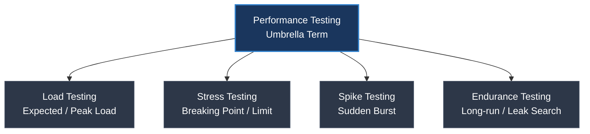

# Performance Testing và Load Testing khác nhau thế nào?

## ⚡ Tóm tắt ngắn (30s)
* **Performance Testing** là thuật ngữ **bao trùm** (umbrella term) chỉ tất cả các phương pháp kiểm thử nhằm đánh giá tốc độ, độ ổn định, khả năng mở rộng và hiệu quả sử dụng tài nguyên (CPU, RAM, Network) của một hệ thống dưới các điều kiện tải khác nhau.
* **Load Testing** là một **tập con** của Performance Testing, tập trung đánh giá hành vi của hệ thống dưới **mức tải dự kiến trong thực tế** (expected load / peak load) xem có đáp ứng được cam kết SLA (Service Level Agreement) hay không.
* Ngoài Load Testing, Performance Testing còn bao gồm các dạng kiểm thử đặc thù khác như **Stress Testing** (vượt ngưỡng chịu tải), **Spike Testing** (tải tăng đột ngột), và **Endurance Testing** (tải duy trì trong thời gian dài).

---

## 🔍 Chi tiết bản chất thực chiến



### 1. Phân biệt các loại hình kiểm thử hiệu năng chính

#### A. Load Testing (Kiểm thử mức tải thông thường & đỉnh)
* **Mục tiêu**: Đảm bảo hệ thống vận hành trơn tru khi có lượng người dùng hoạt động đồng thời đúng như kỳ vọng thiết kế.
* **Kịch bản**: Tăng dần số lượng Virtual Users (VUs) lên mức kỳ vọng (ví dụ: 1000 users), giữ nguyên trong 30-60 phút để đo lường Response Time (p95, p99), Throughput (RPS), và tỉ lệ lỗi (Error Rate).

#### B. Stress Testing (Kiểm thử giới hạn chịu tải)
* **Mục tiêu**: Tìm ra **điểm gãy (breaking point)** của hệ thống. Hệ thống chịu được tối đa bao nhiêu RPS trước khi crash? Khi crash, hệ thống có phục hồi tự động được không (Graceful recovery)?
* **Kịch bản**: Tiếp tục tăng tải liên tục vượt xa mức thiết kế cho đến khi tỉ lệ lỗi tăng vọt hoặc hệ thống phản hồi cực chậm.

#### C. Spike Testing (Kiểm thử tải đột biến)
* **Mục tiêu**: Đánh giá khả năng tự động co giãn (Auto-scaling) và cơ chế chống nghẽn (Rate limiting, Circuit breaker) khi có lượng traffic khổng lồ ập vào đột ngột.
* **Kịch bản**: Tải tăng vọt từ 0 lên cực đại trong vài giây (ví dụ: sự kiện Flash Sale, mở bán vé ca nhạc), duy trì trong thời gian rất ngắn rồi giảm nhanh.

#### D. Endurance/Soak Testing (Kiểm thử độ bền bỉ)
* **Mục tiêu**: Phát hiện các lỗi rò rỉ tài nguyên (**Memory Leak**, Connection Leak, Thread Leak) phát sinh chậm mà các bài test ngắn không thể tìm ra.
* **Kịch bản**: Duy trì mức tải trung bình (ví dụ: 70% expected load) liên tục trong 12 - 72 giờ.

---

## 🎨 Sơ đồ dạng biểu đồ tải (Load Profile) trực quan

```mermaid
gantt
    title So sánh Load Profiles (Trục đứng: Tải - Trục ngang: Thời gian)
    dateFormat  X
    axisFormat %s
    
    section Load Test
    Tăng tải ổn định         :active, 0, 10
    Duy trì tải kỳ vọng     : 10, 30
    Giảm tải dần            : 30, 40
    
    section Stress Test
    Tăng tải liên tục vượt giới hạn :crit, 45, 85
    
    section Spike Test
    Tải đột biến tức thời    :crit, active, 90, 93
    Duy trì cực ngắn         : 93, 95
    Giảm đột ngột            : 95, 98
```



---

## 💻 Kịch bản thực chiến: Viết test script bằng công cụ k6 (Modern Alternative to JMeter)

Sử dụng **k6** (công cụ viết test bằng JavaScript, hiệu năng cực cao, thân thiện với CI/CD) để giả lập kịch bản Load Test và Stress Test.

### ✅ Kịch bản 1: Load Testing (Tăng tải ổn định và duy trì)
```javascript
import http from 'k6/http';
import { sleep, check } from 'k6';

export const options = {
  stages: [
    { duration: '5m', target: 100 },  // Ramp-up: Tăng tải từ 0 lên 100 Virtual Users trong 5 phút
    { duration: '20m', target: 100 }, // Steady state: Duy trì 100 VUs hoạt động liên tục trong 20 phút
    { duration: '5m', target: 0 },    // Ramp-down: Giảm dần tải về 0 trong 5 phút
  ],
  thresholds: {
    http_req_failed: ['rate<0.01'],   // Ngưỡng: Tỉ lệ lỗi phải nhỏ hơn 1%
    http_req_duration: ['p95<500'],   // Ngưỡng: 95% số request phải phản hồi dưới 500ms
  },
};

export default function () {
  const res = http.get('https://api.my-service.com/api/v1/products');
  check(res, {
    'status is 200': (r) => r.status === 200,
  });
  sleep(1); // Giả lập "think time" của người dùng thật
}
```

### ❌ Kịch bản 2: Stress Testing (Tấn công dồn dập tìm điểm gãy)
```javascript
import http from 'k6/http';
import { sleep } from 'k6';

export const options = {
  stages: [
    { duration: '2m', target: 100 },  // Tải bình thường
    { duration: '5m', target: 500 },  // Tăng vọt lên 500 VUs
    { duration: '5m', target: 1000 }, // Tăng cực hạn lên 1000 VUs (Vượt ngưỡng chịu đựng của hệ thống thông thường)
    { duration: '2m', target: 0 },    // Hạ tải để kiểm tra khả năng hồi phục
  ],
};

export default function () {
  http.get('https://api.my-service.com/api/v1/products');
  sleep(0.5); // Ép hệ thống phản hồi liên tục với think time rất ngắn
}
```

---

## 📊 So sánh chi tiết các loại hình Performance Testing

| Tiêu chí | Load Testing | Stress Testing | Spike Testing | Endurance Testing |
| :--- | :--- | :--- | :--- | :--- |
| **Mục đích chính** | Xác thực SLA, Response Time | Tìm điểm gãy (Limit), cách crash | Kiểm tra Auto-scaling, Throttling | Tìm rò rỉ bộ nhớ (Memory leak) |
| **Mức tải áp dụng** | 100% Expected Peak Load | 150% - 300%+ Limit Load | 200%+ Đột ngột tức thì | 70% - 80% Normal Load |
| **Thời gian chạy** | Ngắn (30 phút - 1 tiếng) | Ngắn (15 - 30 phút) | Rất ngắn (vài phút) | Dài (12 - 72 tiếng) |
| **Thông tin thu được** | Hệ thống chạy đạt chuẩn không? | Điểm nghẽn ở đâu khi quá tải? | Hệ thống có bị sập nguồn tức thì? | Tài nguyên hao mòn theo thời gian? |

---

## ⚠️ Common Gotchas & Questions follow-up

### 1. "Think Time và Pacing là gì? Tại sao thiếu chúng lại phá hỏng bài test?"
* **Think Time**: Thời gian người dùng "nghĩ" trước khi thực hiện hành động tiếp theo (ví dụ: xem trang sản phẩm 3 giây rồi mới bấm nút Add to Cart).
* **Pacing**: Khoảng thời gian giãn cách giữa các lần lặp lại kịch bản (Iterative loops) của một Virtual User.
* **Tai hại**: Nếu không set Think Time và Pacing, Virtual User sẽ gọi API liên tục không ngừng nghỉ ngay khi nhận được response. Điều này biến bài test thành một vụ tấn công từ chối dịch vụ (DDoS) phi thực tế, khiến kết quả kiểm thử không phản ánh đúng hành vi người dùng thật.

### 2. "Tại sao không được phép chạy Performance Test trên môi trường DEV / STAGING cấu hình thấp?"
* Môi trường DEV/STAGING thường không có cùng cấu hình phần cứng, không có cluster, không có Auto-scaling giống Production.
* **Hậu quả**: Chạy test sẽ bị nghẽn (bottleneck) ở các lớp phần cứng ảo hóa thấp, hoặc các cấu hình mặc định chưa được tối ưu, dẫn đến việc đưa ra kết luận sai lệch về hiệu năng của code ứng dụng.
* **Giải pháp**: 
  * Cách tốt nhất: Chạy trên môi trường **Staging có cấu hình 1-1 với Production** vào khung giờ thấp điểm.
  * Cách thay thế: Dùng môi trường cấu hình thấp hơn nhưng áp dụng phương pháp **Extrapolation (Ngoại suy)** toán học để ước lượng, dù độ chính xác chỉ ở mức tương đối.

### 3. "Hiện tượng 'JVM Warm-up' ảnh hưởng như thế nào đến Performance Testing?"
* Khi ứng dụng Java mới khởi động, JIT (Just-In-Time) compiler của JVM chưa biên dịch code thành mã máy tối ưu, các class chưa được load hết vào bộ nhớ, Cache chưa được nạp (Cold Cache).
* **Ảnh hưởng**: Nếu đo lường hiệu năng ngay lập tức khi ứng dụng vừa boot, thời gian phản hồi (Response Time) sẽ cực kỳ cao và không chính xác.
* **Best Practice**: Luôn thiết lập giai đoạn **Warm-up** (chạy tải nhẹ trong 3 - 5 phút đầu tiên) trước khi chính thức ghi nhận và đo lường các chỉ số hiệu năng của hệ thống.
