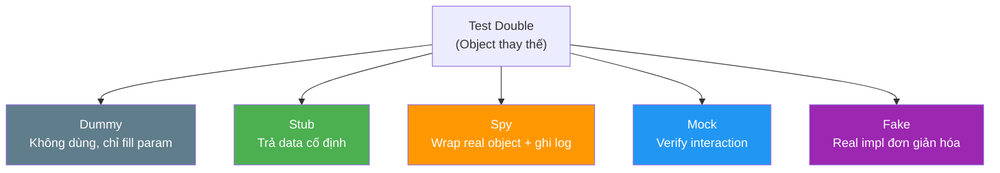

# Mock, stub, spy, fake khác nhau thế nào?

## ⚡ Tóm tắt ngắn (30s)
* Tất cả đều là **Test Double** (thuật ngữ từ Gerard Meszaros) — object thay thế dependency thật trong test
* **Stub**: trả về **dữ liệu cố định**, không verify behavior — dùng khi cần "giả lập đầu vào"
* **Mock**: **verify interaction** — kiểm tra xem method có được gọi đúng số lần, đúng tham số không
* **Spy**: wrap object thật, cho phép **theo dõi và override** một số method — partial mock
* **Fake**: implementation thật nhưng **đơn giản hóa** (ví dụ: in-memory DB thay vì PostgreSQL)
* Trong Mockito, ranh giới mock/stub bị blur vì `mock()` có thể vừa stub vừa verify

---

## 🔍 Chi tiết bản chất thực chiến

### Phân loại Test Double (Martin Fowler / Meszaros)



### Stub — "Cho tôi data giả"
Stub **cung cấp dữ liệu cố định** để test có thể chạy. Không quan tâm method được gọi bao nhiêu lần, chỉ cần trả đúng kết quả. Dùng khi test **state-based** (kiểm tra output).

### Mock — "Method này phải được gọi!"
Mock **verify behavior** — kiểm tra interaction giữa SUT (System Under Test) và dependency. Dùng khi test **interaction-based** (kiểm tra side-effect như gửi email, publish event).

### Spy — "Dùng real object, nhưng tôi muốn override một chỗ"
Spy wrap real object, gọi method thật mặc định, nhưng cho phép **override từng method cụ thể**. Hữu ích khi class có 10 method, bạn chỉ muốn stub 1 method.

### Fake — "Implementation thật nhưng lightweight"
Fake là **implementation thật** nhưng không phù hợp production (thiếu persistence, thiếu scale). Ví dụ: `HashMap` thay cho Redis, H2 thay cho PostgreSQL, `FakeEmailSender` lưu email vào list thay vì gửi thật.

---

## 💻 Code thực chiến: BAD vs GOOD

### ❌ BAD: Lẫn lộn mock/stub, over-verify

```java
// BAD: Dùng mock nhưng verify quá nhiều implementation detail
@Test
void shouldProcessOrder() {
    OrderRepository repo = mock(OrderRepository.class);
    PaymentGateway payment = mock(PaymentGateway.class);
    OrderService service = new OrderService(repo, payment);

    when(repo.findById(1L)).thenReturn(Optional.of(new Order(1L, 100.0)));
    when(payment.charge(any())).thenReturn(PaymentResult.SUCCESS);

    service.processOrder(1L);

    // BAD: Verify QUÁ CHI TIẾT → test dễ vỡ khi refactor
    verify(repo).findById(1L);                    // verify stub? Thừa!
    verify(repo).save(any());                     // OK
    verify(payment).charge(any());                // OK
    verify(payment, never()).refund(any());        // Quá chi tiết
    verifyNoMoreInteractions(repo, payment);       // Brittle!
}
```

---

### ✅ GOOD: Stub cho input, Mock cho side-effect, Fake cho infra

```java
// ========= STUB — Chỉ cung cấp data, không verify =========
@Test
void shouldCalculateTotalWithTax() {
    // Stub: chỉ cần trả data cố định
    TaxService taxService = mock(TaxService.class);
    when(taxService.getTaxRate("VN")).thenReturn(0.10); // stub behavior

    PricingService pricing = new PricingService(taxService);
    double total = pricing.calculateTotal(100.0, "VN");

    // Verify STATE (output), không verify interaction
    assertEquals(110.0, total, 0.01);
    // KHÔNG verify(taxService).getTaxRate("VN") — thừa!
}

// ========= MOCK — Verify side-effect quan trọng =========
@Test
void shouldSendNotificationWhenOrderCompleted() {
    NotificationService notifier = mock(NotificationService.class);
    OrderRepository repo = mock(OrderRepository.class);
    when(repo.findById(1L)).thenReturn(
        Optional.of(new Order(1L, "PAID")));

    OrderService service = new OrderService(repo, notifier);
    service.completeOrder(1L);

    // MOCK: verify side-effect có xảy ra (gửi notification)
    verify(notifier).sendOrderCompletedEmail(argThat(order ->
        order.getId() == 1L && order.getStatus().equals("COMPLETED")
    ));
}

// ========= SPY — Partial mock, dùng real logic + override 1 method =========
@Test
void shouldUseRealLogicButOverrideCacheCheck() {
    ProductService realService = new ProductService(productRepo);
    ProductService spied = spy(realService);

    // Override chỉ 1 method, các method khác vẫn chạy thật
    doReturn(true).when(spied).isCacheValid("SKU-001");

    Product result = spied.getProduct("SKU-001");
    assertNotNull(result);
    // Real logic của getProduct() vẫn chạy, chỉ isCacheValid() bị override
}

// ========= FAKE — Implementation thật nhưng đơn giản =========
class FakeEmailSender implements EmailSender {
    private final List<Email> sentEmails = new ArrayList<>();

    @Override
    public void send(Email email) {
        sentEmails.add(email); // Lưu vào list thay vì gửi thật
    }

    // Helper methods cho test
    public List<Email> getSentEmails() { return sentEmails; }
    public boolean wasSentTo(String address) {
        return sentEmails.stream()
            .anyMatch(e -> e.getTo().equals(address));
    }
}

@Test
void shouldSendWelcomeEmailOnRegistration() {
    FakeEmailSender emailSender = new FakeEmailSender();
    UserService userService = new UserService(userRepo, emailSender);

    userService.register(new User("john@example.com", "John"));

    // Verify bằng Fake — đọc dễ, không cần verify()
    assertTrue(emailSender.wasSentTo("john@example.com"));
    assertEquals("Welcome John!", emailSender.getSentEmails().get(0).getSubject());
}
```

---

## 📊 Bảng so sánh Mock, Stub, Spy, Fake

| Tiêu chí | Stub | Mock | Spy | Fake |
| :--- | :--- | :--- | :--- | :--- |
| **Mục đích** | Cung cấp data cố định | Verify interaction | Partial override | Lightweight implementation |
| **Verify?** | ❌ Không | ✅ Có (`verify()`) | ✅ Có thể | ❌ Thường không |
| **Real logic?** | ❌ Không | ❌ Không | ✅ Có (mặc định) | ✅ Có (đơn giản) |
| **Mockito API** | `when().thenReturn()` | `verify()` | `spy()` + `doReturn()` | Tự viết class |
| **Khi nào dùng** | Cần input data | Verify side-effect | Override 1 method | Replace infra nặng |
| **Ví dụ** | `taxService.getRate()` | `emailService.send()` | `spy(realService)` | `FakeRedisCache` |
| **Coupling** | Thấp | Cao (tie to impl) | Trung bình | Thấp |
| **Maintenance** | Thấp | Cao | Trung bình | Trung bình |

---

## ⚠️ Common Gotchas & Questions follow-up

### 1. "Trong Mockito, mock() vừa là stub vừa là mock?"
* Đúng! `mock()` tạo object có thể vừa `when().thenReturn()` (stub) vừa `verify()` (mock)
* Thuật ngữ Mockito khác với thuật ngữ lý thuyết — cần phân biệt khi trả lời phỏng vấn
* Best practice: dùng `when()` cho input, `verify()` **chỉ cho side-effect quan trọng**

### 2. "Khi nào dùng Spy thay vì Mock?"
* Khi class có nhiều method phức tạp, chỉ muốn override 1-2 method
* **Cảnh báo**: nếu cần spy, thường là dấu hiệu class **violate SRP** — nên refactor
* Spy dễ gây confusion vì mix real và fake behavior — dùng cẩn thận

### 3. "Fake có đáng viết không? Tốn effort mà?"
* Fake **rất đáng** cho dependency dùng ở nhiều test (EmailSender, CacheService, MessageQueue)
* Viết 1 lần, dùng mãi mãi — test đọc dễ hơn, không cần verify chain dài
* Google nội bộ dùng Fake rất nhiều — mỗi service cung cấp Fake cho consumer

### 4. "Dummy khác Stub chỗ nào?"
* **Dummy**: chỉ fill parameter, **không bao giờ được gọi** — ví dụ: `new Object()` cho param bắt buộc
* **Stub**: thực sự **trả về data** khi được gọi
* Trong Mockito, `mock()` với zero stubbing = dummy (trả null/0/false mặc định)
