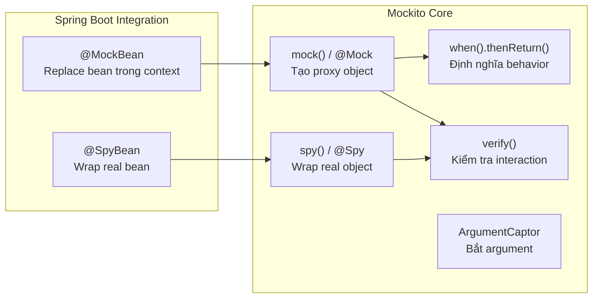

# Mockito dùng thế nào?

## ⚡ Tóm tắt ngắn (30s)
* Mockito là **mocking framework phổ biến nhất** trong Java ecosystem — hỗ trợ tạo mock, stub, spy, verify
* Core API: `mock()`, `when().thenReturn()`, `verify()`, `spy()`, `@Mock`, `@InjectMocks`
* Với Spring Boot: dùng `@MockBean` / `@SpyBean` để inject mock vào Spring context
* Mockito 5+ mặc định dùng **inline mock maker** — mock được cả final class, static method
* Nguyên tắc vàng: **stub input, verify side-effect, đừng verify stub**

---

## 🔍 Chi tiết bản chất thực chiến

### Kiến trúc Mockito



### Lifecycle của Mockito trong JUnit 5

1. `@ExtendWith(MockitoExtension.class)` — khởi tạo Mockito
2. `@Mock` field → Mockito tạo proxy object
3. `@InjectMocks` → Mockito inject mock vào constructor/setter
4. `when().thenReturn()` → setup stub trong `@BeforeEach` hoặc test method
5. Gọi SUT method → Mockito intercept call tới mock
6. `verify()` → kiểm tra interaction sau khi test chạy

---

## 💻 Code thực chiến: BAD vs GOOD

### ❌ BAD: Sai cách dùng Mockito

```java
@ExtendWith(MockitoExtension.class)
class OrderServiceBadTest {

    @Mock OrderRepository orderRepo;
    @Mock PaymentGateway paymentGateway;
    @InjectMocks OrderService orderService;

    // BAD 1: Stub mà không dùng → lenient warning hoặc lỗi strict mode
    @Test
    void badUnusedStub() {
        when(orderRepo.findById(1L)).thenReturn(Optional.of(new Order()));
        when(orderRepo.findAll()).thenReturn(List.of()); // UNUSED! Strict mode sẽ fail
        orderService.getOrder(1L);
    }

    // BAD 2: Verify stub — thừa và brittle
    @Test
    void badVerifyStub() {
        when(orderRepo.findById(1L)).thenReturn(Optional.of(new Order(100.0)));
        Order result = orderService.getOrder(1L);
        verify(orderRepo).findById(1L); // THỪA! Nếu không gọi thì thenReturn đã fail
        assertEquals(100.0, result.getAmount());
    }

    // BAD 3: Mock quá sâu → coupling chặt với implementation
    @Test
    void badDeepMocking() {
        Order mockOrder = mock(Order.class);
        OrderItem mockItem = mock(OrderItem.class);
        when(orderRepo.findById(1L)).thenReturn(Optional.of(mockOrder));
        when(mockOrder.getItems()).thenReturn(List.of(mockItem));
        when(mockItem.getPrice()).thenReturn(50.0);
        when(mockItem.getQuantity()).thenReturn(2);
        // Quá nhiều mock → test vỡ khi refactor Order
    }

    // BAD 4: Dùng any() khi có thể specific
    @Test
    void badUseAnyEverywhere() {
        when(paymentGateway.charge(any(), any(), any())).thenReturn(SUCCESS);
        // Không biết test đang test gì — any() che giấu bug
    }
}
```

---

### ✅ GOOD: Mockito best practices

```java
@ExtendWith(MockitoExtension.class)
class OrderServiceTest {

    @Mock OrderRepository orderRepo;
    @Mock PaymentGateway paymentGateway;
    @Mock EventPublisher eventPublisher;
    @InjectMocks OrderService orderService;

    // ========= GOOD 1: Stub cho input, assert output =========
    @Test
    void shouldReturnOrderWhenFound() {
        Order expected = new Order(1L, 100.0, OrderStatus.CREATED);
        when(orderRepo.findById(1L)).thenReturn(Optional.of(expected));

        Order result = orderService.getOrder(1L);

        assertThat(result.getAmount()).isEqualTo(100.0);
        assertThat(result.getStatus()).isEqualTo(OrderStatus.CREATED);
        // Không verify stub — chỉ check output!
    }

    // ========= GOOD 2: Verify CHỈ side-effect quan trọng =========
    @Test
    void shouldPublishEventWhenOrderCompleted() {
        Order order = new Order(1L, 100.0, OrderStatus.PAID);
        when(orderRepo.findById(1L)).thenReturn(Optional.of(order));

        orderService.completeOrder(1L);

        // Verify side-effect: event phải được publish
        verify(eventPublisher).publish(argThat(event ->
            event instanceof OrderCompletedEvent &&
            ((OrderCompletedEvent) event).getOrderId() == 1L
        ));
    }

    // ========= GOOD 3: ArgumentCaptor cho complex assertion =========
    @Test
    void shouldChargeCorrectAmount() {
        when(orderRepo.findById(1L)).thenReturn(
            Optional.of(new Order(1L, 250.0, OrderStatus.CREATED)));
        when(paymentGateway.charge(any())).thenReturn(PaymentResult.SUCCESS);

        orderService.processPayment(1L);

        ArgumentCaptor<ChargeRequest> captor =
            ArgumentCaptor.forClass(ChargeRequest.class);
        verify(paymentGateway).charge(captor.capture());

        ChargeRequest captured = captor.getValue();
        assertThat(captured.getAmount()).isEqualTo(250.0);
        assertThat(captured.getCurrency()).isEqualTo("VND");
    }

    // ========= GOOD 4: Test exception path =========
    @Test
    void shouldThrowWhenOrderNotFound() {
        when(orderRepo.findById(999L)).thenReturn(Optional.empty());

        assertThrows(OrderNotFoundException.class,
            () -> orderService.getOrder(999L));
    }

    // ========= GOOD 5: BDDMockito cho readable test =========
    @Test
    void shouldApplyDiscountForVipCustomer() {
        // Given
        given(orderRepo.findById(1L)).willReturn(
            Optional.of(new Order(1L, 200.0)));

        // When
        OrderResponse response = orderService.applyVipDiscount(1L);

        // Then
        assertThat(response.getFinalAmount()).isEqualTo(160.0); // 20% off
        then(orderRepo).should().save(argThat(o -> o.getAmount() == 160.0));
    }
}

// ========= GOOD 6: @MockBean trong Spring Boot slice test =========
@WebMvcTest(OrderController.class)
class OrderControllerTest {
    @Autowired MockMvc mockMvc;
    @MockBean OrderService orderService; // replace real bean

    @Test
    void shouldReturnOrder() throws Exception {
        given(orderService.getOrder(1L))
            .willReturn(new OrderResponse(1L, 100.0, "CREATED"));

        mockMvc.perform(get("/api/orders/1"))
            .andExpect(status().isOk())
            .andExpect(jsonPath("$.amount").value(100.0))
            .andExpect(jsonPath("$.status").value("CREATED"));
    }
}
```

---

## 📊 Bảng so sánh Mockito API

| API | Mục đích | Khi nào dùng | Ví dụ |
| :--- | :--- | :--- | :--- |
| `mock()` / `@Mock` | Tạo mock object | Luôn luôn — dependency cần isolate | `mock(OrderRepo.class)` |
| `when().thenReturn()` | Stub return value | Cần giả lập input/data | `when(repo.findById(1L)).thenReturn(...)` |
| `when().thenThrow()` | Stub exception | Test error handling | `when(repo.save(any())).thenThrow(...)` |
| `verify()` | Check method được gọi | Verify side-effect (email, event) | `verify(notifier).send(any())` |
| `verify(times(n))` | Check số lần gọi | Verify exactly N lần | `verify(repo, times(1)).save(any())` |
| `spy()` / `@Spy` | Partial mock | Override 1-2 method của real object | `spy(realService)` |
| `@InjectMocks` | Auto-inject mocks | SUT có constructor injection | `@InjectMocks OrderService service` |
| `ArgumentCaptor` | Capture argument | Assert complex argument | `captor.capture()` → `captor.getValue()` |
| `@MockBean` | Mock trong Spring | Slice test (`@WebMvcTest`) | `@MockBean OrderService service` |
| `doReturn().when()` | Stub spy method | Tránh real method execution | `doReturn(x).when(spied).method()` |

---

## ⚠️ Common Gotchas & Questions follow-up

### 1. "when().thenReturn() vs doReturn().when() khác gì?"
* `when(mock.method()).thenReturn(x)` — gọi method thật trước (OK với mock, **nguy hiểm với spy**)
* `doReturn(x).when(spy).method()` — không gọi method thật → **an toàn với spy**
* Rule: dùng `doReturn` cho spy, `when` cho mock

### 2. "@Mock vs @MockBean?"
* `@Mock` — Mockito thuần, **không cần Spring context** → nhanh
* `@MockBean` — Spring Boot, **replace bean trong ApplicationContext** → chậm hơn
* Best practice: ưu tiên `@Mock` + `@InjectMocks`, chỉ dùng `@MockBean` trong slice test

### 3. "Mockito mock được final class/static method không?"
* Mockito 5+ (inline mock maker): **mock được final class** mặc định
* Static method: dùng `mockStatic()` — nhưng cần wrap trong try-with-resources
* `try (var mocked = mockStatic(UUID.class)) { mocked.when(UUID::randomUUID).thenReturn(...); }`

### 4. "Strict stubbing là gì?"
* Mockito 3+ mặc định **strict stubbing** — stub mà không dùng sẽ báo `UnnecessaryStubbingException`
* Giúp phát hiện test thừa/sai logic
* Override bằng `@MockitoSettings(strictness = Strictness.LENIENT)` nếu cần — nhưng nên tránh

### 5. "Answer vs thenReturn?"
* `thenReturn` — trả giá trị cố định
* `thenAnswer` — dynamic response dựa trên input: `when(repo.save(any())).thenAnswer(inv -> inv.getArgument(0))`
* Dùng `thenAnswer` khi cần return chính argument (ví dụ: `save()` trả lại entity)
