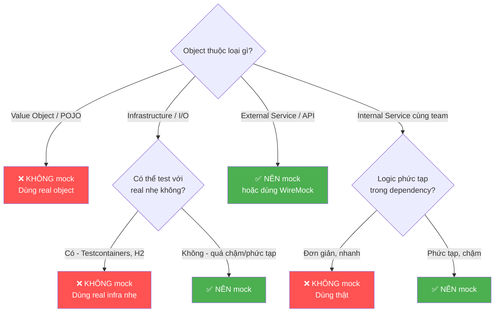

# Khi nào không nên mock?

## ⚡ Tóm tắt ngắn (30s)
* **Không mock value object / domain model** — chúng là thứ bạn đang test, mock đi thì test vô nghĩa
* **Không mock thứ bạn sở hữu mà rẻ tiền để dùng thật** — `List`, `Map`, `String`, simple POJO
* **Không mock database khi test query logic** — dùng Testcontainers hoặc H2 để test query/SQL thật
* **Không mock 3rd-party library quá sâu** — tạo adapter/wrapper rồi mock wrapper
* **Nguyên tắc**: mock ở **boundary** (ranh giới hệ thống), không mock ở **core domain**
* Over-mocking = test chỉ verify **bạn gọi đúng method**, không verify **logic đúng**

---

## 🔍 Chi tiết bản chất thực chiến

### Mental model: Khi nào mock, khi nào không?



### 6 trường hợp KHÔNG nên mock

**1. Value Object / Domain Entity**
Entity và VO chứa **logic cốt lõi** — mock chúng = bỏ qua phần quan trọng nhất.

**2. Data structure đơn giản**
`List`, `Map`, `Optional`, DTO — tạo real instance nhanh hơn setup mock.

**3. Database query khi test repository layer**
Mock `JdbcTemplate.query()` không chứng minh SQL đúng — chỉ Testcontainers/H2 mới test được query thật.

**4. 3rd-party library trực tiếp**
Mock `HttpClient`, `ObjectMapper`, `RestTemplate` trực tiếp → coupling chặt với implementation. Nên wrap bằng adapter.

**5. Logic thuần túy không có side-effect**
Pure function (tính toán, validation, transformation) — chạy thật nhanh hơn setup mock.

**6. Khi mock che giấu design problem**
Nếu cần mock 5+ dependency → class violate SRP → nên refactor, không nên thêm mock.

---

## 💻 Code thực chiến: BAD vs GOOD

### ❌ BAD: Over-mocking mọi thứ

```java
// BAD 1: Mock value object
@Test
void badMockValueObject() {
    Money mockMoney = mock(Money.class);
    when(mockMoney.getAmount()).thenReturn(BigDecimal.valueOf(100));
    when(mockMoney.getCurrency()).thenReturn("VND");
    // Mock Money rồi test cái gì? Chỉ test Mockito hoạt động đúng!

    Order order = new Order(mockMoney);
    assertEquals(BigDecimal.valueOf(100), order.getTotal().getAmount());
    // Test này pass nhưng KHÔNG chứng minh Money.add(), Money.multiply() đúng
}

// BAD 2: Mock List
@Test
void badMockList() {
    List<Order> mockList = mock(List.class);
    when(mockList.size()).thenReturn(3);
    when(mockList.get(0)).thenReturn(new Order(100.0));
    // Tạo real List nhanh hơn 10x!
}

// BAD 3: Mock repository khi test query logic
@Test
void badMockRepositoryForQueryTest() {
    OrderRepository repo = mock(OrderRepository.class);
    when(repo.findByStatusAndDateBetween(any(), any(), any()))
        .thenReturn(List.of(new Order(100.0)));
    // Stub trả ra kết quả mong muốn → test LUÔN LUÔN pass
    // Nhưng SQL query có thể SAI hoàn toàn!
}

// BAD 4: Mock ObjectMapper trực tiếp
@Test
void badMockObjectMapper() {
    ObjectMapper mapper = mock(ObjectMapper.class);
    when(mapper.writeValueAsString(any())).thenReturn("{\"id\":1}");
    // ObjectMapper rất nhanh, mock nó chỉ tạo coupling vô ích
}

// BAD 5: Quá nhiều mock = design smell
@Test
void badTooManyMocks() {
    // 7 mocks = class có quá nhiều responsibility!
    OrderRepository repo = mock(OrderRepository.class);
    PaymentGateway payment = mock(PaymentGateway.class);
    InventoryService inventory = mock(InventoryService.class);
    NotificationService notifier = mock(NotificationService.class);
    AuditLogger audit = mock(AuditLogger.class);
    MetricsCollector metrics = mock(MetricsCollector.class);
    CacheService cache = mock(CacheService.class);
    // → Signal: OrderService cần được tách nhỏ!
}
```

---

### ✅ GOOD: Mock đúng chỗ, dùng thật khi có thể

```java
// GOOD 1: Dùng real value object
@Test
void shouldCalculateOrderTotal() {
    Money price = Money.of(100, "VND");        // Real object!
    Money tax = Money.of(10, "VND");           // Real object!
    OrderItem item = new OrderItem("SKU-1", price, 2); // Real!

    Order order = new Order(List.of(item), tax);

    assertThat(order.getTotal()).isEqualTo(Money.of(210, "VND"));
    // Test thật sự chứng minh logic tính toán đúng
}

// GOOD 2: Dùng real List
@Test
void shouldFilterActiveOrders() {
    List<Order> orders = List.of(         // Real list!
        new Order(1L, OrderStatus.ACTIVE),
        new Order(2L, OrderStatus.CANCELLED),
        new Order(3L, OrderStatus.ACTIVE)
    );
    OrderRepository repo = mock(OrderRepository.class);
    when(repo.findAll()).thenReturn(orders);

    OrderService service = new OrderService(repo);
    List<Order> active = service.getActiveOrders();

    assertThat(active).hasSize(2);
}

// GOOD 3: Testcontainers cho DB query test
@DataJpaTest
@Testcontainers
class OrderRepositoryTest {
    @Container
    static PostgreSQLContainer<?> pg = new PostgreSQLContainer<>("postgres:15");

    @Autowired OrderRepository repo;

    @Test
    void shouldFindOrdersByStatusAndDateRange() {
        // Insert real data
        repo.save(new Order("ORD-1", OrderStatus.PAID, LocalDate.of(2024, 1, 15)));
        repo.save(new Order("ORD-2", OrderStatus.PAID, LocalDate.of(2024, 2, 15)));
        repo.save(new Order("ORD-3", OrderStatus.CREATED, LocalDate.of(2024, 1, 20)));

        // Test REAL SQL query
        List<Order> result = repo.findByStatusAndDateBetween(
            OrderStatus.PAID,
            LocalDate.of(2024, 1, 1),
            LocalDate.of(2024, 1, 31)
        );

        assertThat(result).hasSize(1)
            .extracting(Order::getOrderCode)
            .containsExactly("ORD-1");
    }
}

// GOOD 4: Wrap 3rd-party, mock wrapper
// Adapter pattern — tách biệt 3rd-party dependency
interface PaymentProcessor {
    PaymentResult charge(String customerId, Money amount);
}

class StripePaymentProcessor implements PaymentProcessor {
    private final Stripe stripeClient; // 3rd-party

    @Override
    public PaymentResult charge(String customerId, Money amount) {
        // Gọi Stripe API thật
        return stripeClient.charges().create(customerId, amount.toBigDecimal());
    }
}

@Test
void shouldHandlePaymentFailure() {
    // Mock WRAPPER, không mock Stripe trực tiếp
    PaymentProcessor processor = mock(PaymentProcessor.class);
    when(processor.charge(eq("CUST-1"), any()))
        .thenReturn(PaymentResult.DECLINED);

    OrderService service = new OrderService(orderRepo, processor);

    assertThrows(PaymentDeclinedException.class,
        () -> service.processPayment(1L));
}

// GOOD 5: Refactor thay vì thêm mock
// TRƯỚC: 1 class, 7 dependencies
// SAU: tách thành các class nhỏ hơn
class OrderPaymentService {
    private final OrderRepository orderRepo;       // 1 mock
    private final PaymentProcessor paymentProcessor; // 1 mock
    // Chỉ 2 dependency → test đơn giản, dễ maintain
}

class OrderNotificationService {
    private final OrderRepository orderRepo;
    private final NotificationService notifier;
    // 2 dependency
}
```

---

## 📊 Bảng so sánh: Mock vs Real

| Loại dependency | Mock? | Lý do | Thay thế |
| :--- | :--- | :--- | :--- |
| **Value Object / Entity** | ❌ | Chứa core logic, nhanh tạo | Real object |
| **List, Map, String** | ❌ | Tạo real nhanh hơn mock | `List.of(...)` |
| **Pure function / Util** | ❌ | Không side-effect, chạy nhanh | Gọi thật |
| **Repository (query test)** | ❌ | Mock không test SQL | Testcontainers / H2 |
| **ObjectMapper, Validator** | ❌ | Nhanh, deterministic | Real instance |
| **External HTTP API** | ✅ | Chậm, unreliable, cost | WireMock, mock |
| **Email / SMS service** | ✅ | Side-effect thật | Mock hoặc Fake |
| **Message Queue producer** | ✅ | Cần infra | Mock hoặc embedded |
| **Time / Clock** | ✅ | Non-deterministic | `Clock.fixed()` |
| **Random** | ✅ | Non-deterministic | Seeded Random hoặc mock |

---

## ⚠️ Common Gotchas & Questions follow-up

### 1. "Mock nhiều quá có hại gì?"
* Test **chỉ verify wiring**, không verify **business logic**
* Refactor implementation → test vỡ dù behavior đúng = **brittle test**
* Maintenance cost tăng: thay đổi 1 method signature → sửa 50 test
* **Rule of thumb**: nếu > 3 mock trong 1 test → xem lại design

### 2. "H2 hay Testcontainers cho integration test?"
* **H2**: nhanh hơn, nhưng SQL dialect khác PostgreSQL → có thể miss bug
* **Testcontainers**: chậm hơn nhưng **same engine** → confidence cao hơn
* Best practice: dùng Testcontainers cho CI, H2 cho local dev nếu cần speed
* Cảnh báo: H2 không hỗ trợ `JSONB`, `LATERAL JOIN`, window function giống PG

### 3. "Khi nào dùng WireMock thay vì mock?"
* **Mock**: unit test, isolate 1 class, không cần HTTP
* **WireMock**: component/integration test, cần test **HTTP contract** (status code, headers, timeout)
* WireMock giúp test **error scenario** thực tế: timeout, 500, connection refused

### 4. "Làm sao nhận biết test đang over-mock?"
* Test pass nhưng production vẫn lỗi → mock che giấu bug
* Refactor code → nhiều test vỡ dù behavior không đổi
* Đọc test không hiểu nó đang test business gì → quá nhiều `when/verify`
* **Metric**: tỉ lệ `verify()` / `assert` > 1 → likely over-mocking
