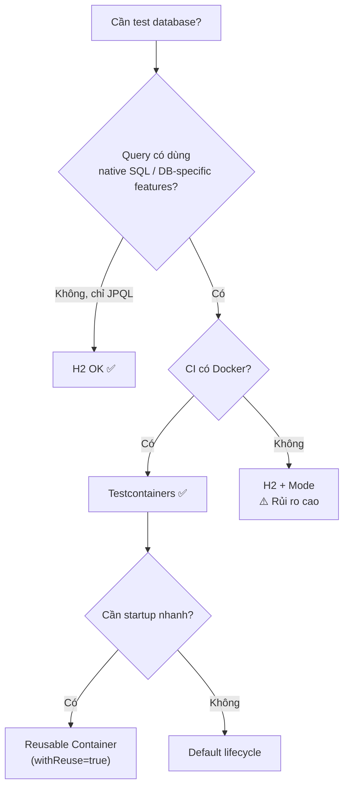

# Test database nên dùng H2 hay Testcontainers?

## ⚡ Tóm tắt ngắn (30s)
* **H2** nhanh, nhẹ, zero-config nhưng **không đảm bảo tương thích SQL dialect** với production DB (PostgreSQL, MySQL) — dễ gây false positive
* **Testcontainers** spin up container Docker chạy **đúng DB engine production**, đảm bảo query/stored procedure chạy đúng behavior — nhưng **chậm hơn** và cần Docker daemon
* **Nguyên tắc senior**: dùng H2 cho unit test đơn giản (repository CRUD), dùng Testcontainers cho **integration test và CI pipeline** nơi cần production-parity
* Từ Spring Boot 3.1+, **`@ServiceConnection`** giúp Testcontainers tích hợp gần như zero-config

---

## 🔍 Chi tiết bản chất thực chiến

### Vấn đề cốt lõi: SQL Dialect Mismatch

H2 là in-memory DB viết bằng Java, dù hỗ trợ compatibility mode (`MODE=PostgreSQL`), nhưng **không cover hết** các tính năng:

- **JSON/JSONB queries** trong PostgreSQL không hoạt động đúng trên H2
- **Window functions** phức tạp có thể cho kết quả khác
- **Native queries** với database-specific syntax sẽ fail
- **Generated columns, materialized views, partial indexes** không tồn tại trong H2
- **Transaction isolation behavior** khác biệt tinh vi → bug chỉ xảy ra trên production

### Khi nào H2 vẫn hợp lý?

- **Prototype / POC** nhanh, chưa cần Docker
- **Unit test đơn giản** chỉ test JPQL/HQL queries (không native SQL)
- **CI environment** không có Docker (rare nhưng tồn tại)
- **Developer onboarding** — chạy test ngay mà không cần setup

### Khi nào bắt buộc Testcontainers?

- **Native SQL queries** sử dụng DB-specific syntax
- **Flyway/Liquibase migrations** cần validate trên đúng DB engine
- **Stored procedures, triggers, custom types** (JSONB, array, enum)
- **Performance-sensitive queries** cần verify execution plan
- **Multi-DB support** — test trên cả PostgreSQL và MySQL



---

## 💻 Code thực chiến: BAD vs GOOD

### ❌ BAD: Dùng H2 cho native PostgreSQL queries

```java
// application-test.properties
// spring.datasource.url=jdbc:h2:mem:testdb;MODE=PostgreSQL
// spring.datasource.driver-class-name=org.h2.Driver

@DataJpaTest
@ActiveProfiles("test")
class OrderRepositoryTest {

    @Autowired
    private OrderRepository orderRepository;

    @Test
    void shouldFindOrdersByJsonField() {
        // ❌ Native PostgreSQL JSONB query → H2 sẽ FAIL hoặc cho kết quả SAI
        List<Order> orders = orderRepository.findByMetadata("status", "shipped");
        // Query bên dưới: SELECT * FROM orders WHERE metadata->>'status' = ?
        // H2 KHÔNG hỗ trợ ->> operator dù ở MODE=PostgreSQL
        assertThat(orders).hasSize(2);
    }

    @Test
    void shouldUseWindowFunction() {
        // ❌ Một số window functions phức tạp cho kết quả khác trên H2
        List<OrderRank> ranked = orderRepository.findOrdersRankedByRevenue();
        assertThat(ranked.get(0).getRank()).isEqualTo(1);
    }
}
```

---

### ✅ GOOD: Testcontainers với Spring Boot 3.1+ @ServiceConnection

```java
// build.gradle
// testImplementation 'org.springframework.boot:spring-boot-testcontainers'
// testImplementation 'org.testcontainers:postgresql'
// testImplementation 'org.testcontainers:junit-jupiter'

@DataJpaTest
@Testcontainers
@AutoConfigureTestDatabase(replace = AutoConfigureTestDatabase.Replace.NONE)
class OrderRepositoryTest {

    @Container
    @ServiceConnection // ✅ Spring Boot 3.1+ auto-config datasource từ container
    static PostgreSQLContainer<?> postgres = new PostgreSQLContainer<>("postgres:16-alpine")
            .withDatabaseName("testdb")
            .withUsername("test")
            .withPassword("test");

    @Autowired
    private OrderRepository orderRepository;

    @Test
    void shouldFindOrdersByJsonField() {
        // ✅ Chạy trên PostgreSQL thật → JSONB query hoạt động chính xác
        Order order = new Order();
        order.setMetadata(Map.of("status", "shipped", "priority", "high"));
        orderRepository.save(order);

        List<Order> orders = orderRepository.findByMetadata("status", "shipped");
        assertThat(orders).hasSize(1);
        assertThat(orders.get(0).getMetadata().get("status")).isEqualTo("shipped");
    }

    @Test
    void shouldValidateFlywayMigrations() {
        // ✅ Flyway migrations chạy trên đúng PostgreSQL engine
        // Nếu migration có syntax lỗi trên Postgres → fail ngay ở test
        assertThat(postgres.isRunning()).isTrue();
    }
}
```

---

### ✅ GOOD: Reusable Container cho tốc độ CI

```java
// src/test/java/com/example/SharedPostgresContainer.java
public class SharedPostgresContainer {

    private static final PostgreSQLContainer<?> POSTGRES;

    static {
        POSTGRES = new PostgreSQLContainer<>("postgres:16-alpine")
                .withDatabaseName("testdb")
                .withReuse(true); // ✅ Container tái sử dụng giữa các test class
        POSTGRES.start();
    }

    // Tự động register datasource properties
    @DynamicPropertySource
    static void configure(DynamicPropertyRegistrar registrar) {
        registrar.add("spring.datasource.url", POSTGRES::getJdbcUrl);
        registrar.add("spring.datasource.username", POSTGRES::getUsername);
        registrar.add("spring.datasource.password", POSTGRES::getPassword);
    }

    public static PostgreSQLContainer<?> getInstance() {
        return POSTGRES;
    }
}

// File ~/.testcontainers.properties (bật reuse globally)
// testcontainers.reuse.enable=true
```

---

## 📊 Bảng so sánh H2 vs Testcontainers

| Tiêu chí | H2 In-Memory | Testcontainers |
| :--- | :--- | :--- |
| **Startup time** | ~100ms ⚡ | ~3-8s (first), ~1s (reuse) |
| **SQL Compatibility** | Partial (mode) | 100% production-parity ✅ |
| **Native Queries** | ❌ Thường fail | ✅ Chạy chính xác |
| **Flyway/Liquibase** | ⚠️ Dialect issues | ✅ Validate đúng engine |
| **Docker required** | ❌ Không | ✅ Bắt buộc |
| **CI complexity** | Thấp | Trung bình (cần DinD/socket) |
| **JSONB/Array/Enum** | ❌ Không hỗ trợ | ✅ Full support |
| **Memory footprint** | Nhỏ (~50MB) | Lớn hơn (~200-500MB) |
| **Transaction behavior** | Khác biệt tinh vi | Giống production |
| **Parallel test support** | Dễ (mỗi test 1 schema) | Cần config (fixed port) |

---

## ⚠️ Common Gotchas & Questions follow-up

### 1. "H2 MODE=PostgreSQL có đủ không?"
* **Problem**: H2 compatibility mode chỉ cover **basic syntax** (LIMIT, OFFSET, boolean type). Không hỗ trợ `jsonb`, `@>` operator, `GENERATED ALWAYS AS`, lateral join, CTEs phức tạp
* **Consequence**: Test pass trên H2 nhưng **query fail trên production** → false confidence
* **Solution**: Nếu dùng bất kỳ PostgreSQL-specific feature nào → dùng Testcontainers

### 2. "Testcontainers chậm quá, CI mất 10 phút"
* **Problem**: Mỗi test class start/stop container mới
* **Solution**: Dùng **Singleton Pattern** hoặc `withReuse(true)`. Spring Boot 3.1+ hỗ trợ `@ServiceConnection` + shared container. CI có thể dùng **testcontainers cloud** để offload container management

### 3. "Testcontainers trong CI/CD (GitHub Actions, GitLab CI)?"
* **GitHub Actions**: Docker đã có sẵn → chạy thẳng
* **GitLab CI**: Cần `docker:dind` service hoặc bind Docker socket
* **Jenkins**: Cần Docker plugin hoặc chạy agent có Docker

### 4. "Có thể mix cả hai không?"
* **Có**: Dùng Spring profiles — `@ActiveProfiles("h2")` cho unit test nhanh, `@ActiveProfiles("tc")` cho integration test
* **Nhưng**: Maintain 2 bộ config phức tạp → team lớn nên **chuẩn hóa 1 approach**

### 5. "Data seeding strategy với Testcontainers?"
* Dùng **`@Sql`** annotation để load test data trước mỗi test
* Hoặc **Flyway migration** + `@Transactional` test (auto-rollback)
* Tránh dùng `data.sql` global — khó maintain khi test suite lớn
