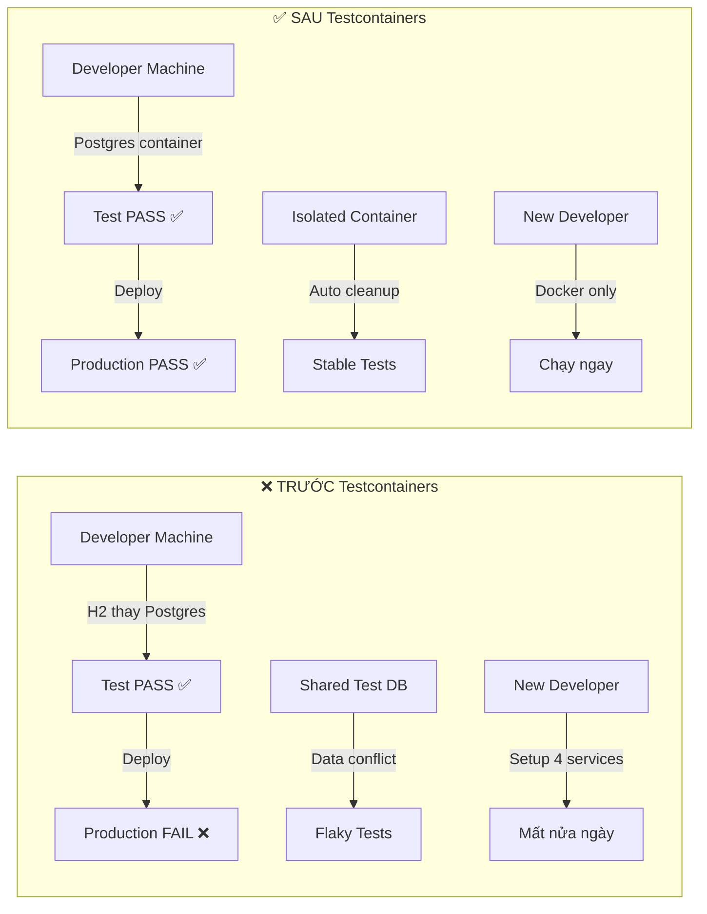
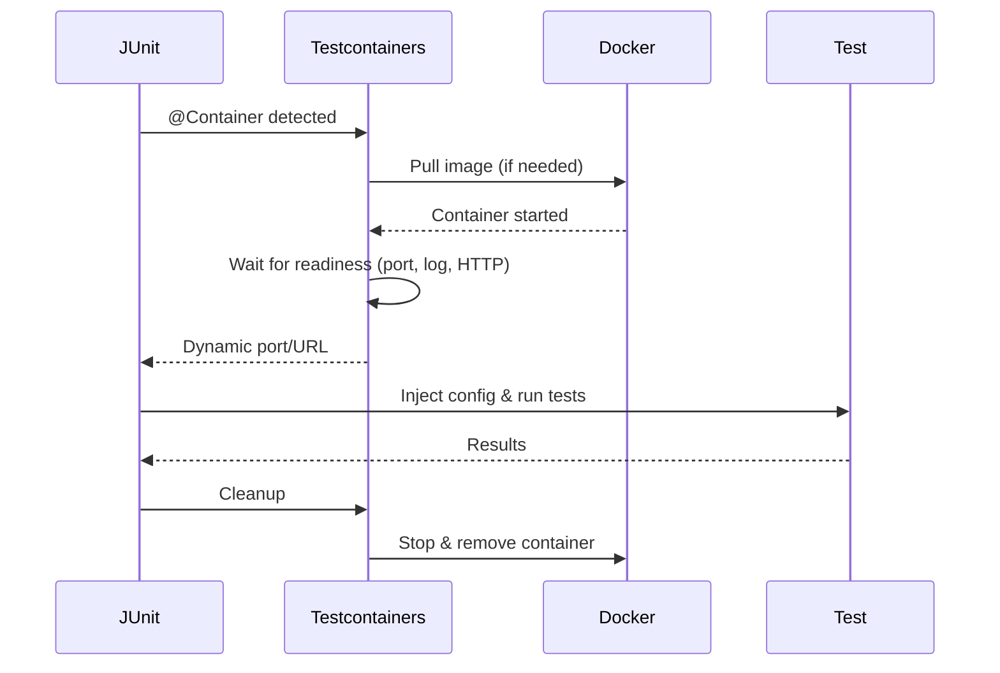

# Testcontainers giải quyết vấn đề gì?

## ⚡ Tóm tắt ngắn (30s)
* Testcontainers giải quyết bài toán **"works on my machine"** — đảm bảo integration test chạy trên **đúng infrastructure giống production** (PostgreSQL, Redis, Kafka, Elasticsearch...)
* Trước Testcontainers: dùng H2 (SQL mismatch), shared test DB (data conflict), mock (không test thật) → **false confidence**
* Testcontainers spin up **Docker container programmatically** trong JUnit lifecycle, auto-cleanup sau test → **deterministic, isolated, reproducible**
* Từ Spring Boot 3.1+: tích hợp native với `@ServiceConnection`, gần như zero-config

---

## 🔍 Chi tiết bản chất thực chiến

### 3 vấn đề lớn Testcontainers giải quyết

#### 1. Environment Parity (Môi trường test ≠ Production)

Trước Testcontainers, team thường dùng:
- **H2 in-memory** thay PostgreSQL → SQL dialect khác, JSONB không hoạt động
- **SQLite** thay MySQL → missing features (stored procedures, triggers)
- **Embedded Redis** (bản Java) → behavior khác Redis thật (clustering, Lua scripts)

**Hậu quả**: Test pass nhưng production fail → mất trust vào test suite.

#### 2. Test Isolation (Shared Test Database)

Nhiều team dùng **1 shared test database** cho cả team:
- Developer A insert data → Developer B test fail vì data unexpected
- CI job chạy parallel → **race condition** trên cùng 1 DB
- Không ai dám clean data vì sợ ảnh hưởng người khác

#### 3. Infrastructure Setup Complexity

- "Anh ơi, em cài PostgreSQL 16 + Redis 7 + Kafka 3.6 thế nào?"
- Mỗi developer setup khác nhau, version khác nhau
- Onboarding mất **nửa ngày** chỉ để chạy được test



### Testcontainers Lifecycle



### Các loại service Testcontainers hỗ trợ

| Category | Services |
| :--- | :--- |
| **Database** | PostgreSQL, MySQL, MongoDB, Oracle, SQL Server, Cassandra |
| **Message Broker** | Kafka, RabbitMQ, Pulsar, ActiveMQ |
| **Cache** | Redis, Memcached |
| **Search** | Elasticsearch, OpenSearch, Solr |
| **Cloud** | LocalStack (AWS), Azurite (Azure), MinIO (S3) |
| **Other** | Nginx, Vault, Keycloak, WireMock |

---

## 💻 Code thực chiến: BAD vs GOOD

### ❌ BAD: Mock repository — không test được query logic

```java
@ExtendWith(MockitoExtension.class)
class OrderServiceTest {

    @Mock
    private OrderRepository orderRepository;

    @InjectMocks
    private OrderService orderService;

    @Test
    void shouldFindPendingOrders() {
        // ❌ Mock trả về data cứng → không test được SQL query thật
        // Nếu query có bug (sai JOIN, thiếu WHERE) → test vẫn PASS
        when(orderRepository.findPendingOrdersOlderThan(any()))
                .thenReturn(List.of(new Order("ORD-001", OrderStatus.PENDING)));

        List<Order> result = orderService.getPendingOrders();

        assertThat(result).hasSize(1);
        // ✅ Test pass, nhưng query thật có thể trả về SAI data
    }
}
```

---

### ✅ GOOD: Testcontainers — test query trên database thật

```java
@DataJpaTest
@Testcontainers
@AutoConfigureTestDatabase(replace = AutoConfigureTestDatabase.Replace.NONE)
class OrderRepositoryTest {

    @Container
    @ServiceConnection
    static PostgreSQLContainer<?> postgres =
            new PostgreSQLContainer<>("postgres:16-alpine");

    @Autowired
    private OrderRepository orderRepository;

    @Autowired
    private TestEntityManager entityManager;

    @Test
    void shouldFindPendingOrdersOlderThan7Days() {
        // ✅ Insert data thật vào PostgreSQL container
        Order oldPending = Order.builder()
                .orderNumber("ORD-001")
                .status(OrderStatus.PENDING)
                .createdAt(LocalDateTime.now().minusDays(10))
                .build();
        Order recentPending = Order.builder()
                .orderNumber("ORD-002")
                .status(OrderStatus.PENDING)
                .createdAt(LocalDateTime.now().minusDays(2))
                .build();

        entityManager.persist(oldPending);
        entityManager.persist(recentPending);
        entityManager.flush();

        // ✅ Query chạy trên PostgreSQL thật — test đúng SQL logic
        List<Order> result = orderRepository
                .findPendingOrdersOlderThan(LocalDateTime.now().minusDays(7));

        assertThat(result).hasSize(1);
        assertThat(result.get(0).getOrderNumber()).isEqualTo("ORD-001");
    }
}
```

---

### ✅ GOOD: Multi-container test (DB + Redis + Kafka)

```java
@SpringBootTest
@Testcontainers
class OrderIntegrationTest {

    @Container
    @ServiceConnection
    static PostgreSQLContainer<?> postgres =
            new PostgreSQLContainer<>("postgres:16-alpine");

    @Container
    @ServiceConnection
    static GenericContainer<?> redis =
            new GenericContainer<>("redis:7-alpine")
                    .withExposedPorts(6379);

    @Container
    @ServiceConnection
    static KafkaContainer kafka =
            new KafkaContainer(DockerImageName.parse("confluentinc/cp-kafka:7.6.0"));

    @Autowired
    private OrderService orderService;

    @Autowired
    private StringRedisTemplate redisTemplate;

    @Test
    void shouldCreateOrderAndPublishEvent() {
        // ✅ Full integration: DB lưu order, cache Redis, publish Kafka event
        CreateOrderRequest request = new CreateOrderRequest("ITEM-001", 3);
        Order order = orderService.createOrder(request);

        // Verify DB
        assertThat(order.getId()).isNotNull();

        // Verify Redis cache
        String cached = redisTemplate.opsForValue()
                .get("order:" + order.getId());
        assertThat(cached).isNotNull();
    }
}
```

---

## 📊 Bảng so sánh các approach test database

| Tiêu chí | Mock Repository | H2 In-Memory | Shared Test DB | Testcontainers |
| :--- | :--- | :--- | :--- | :--- |
| **Test query logic** | ❌ | ⚠️ Partial | ✅ | ✅ |
| **SQL dialect parity** | N/A | ❌ | ✅ | ✅ |
| **Test isolation** | ✅ | ✅ | ❌ | ✅ |
| **Speed** | ⚡ Instant | ⚡ Fast | 🔶 Medium | 🔶 Medium |
| **Setup complexity** | Không | Không | Cao | Docker only |
| **CI reproducibility** | ✅ | ✅ | ❌ | ✅ |
| **Migration validation** | ❌ | ⚠️ | ✅ | ✅ |
| **Multi-service test** | ❌ | ❌ | Phức tạp | ✅ Dễ dàng |

---

## ⚠️ Common Gotchas & Questions follow-up

### 1. "Testcontainers có chạy trên CI/CD được không?"
* **GitHub Actions**: Docker pre-installed → chạy trực tiếp, không cần config
* **GitLab CI**: Thêm `docker:dind` service, set `DOCKER_HOST`
* **Jenkins**: Agent cần Docker installed, hoặc dùng Docker Pipeline plugin
* **Testcontainers Cloud**: Offload container execution lên cloud → CI không cần Docker

### 2. "Container start chậm, test suite mất 10 phút"
* **Singleton pattern**: Share 1 container cho nhiều test class (static field + `@DynamicPropertySource`)
* **`withReuse(true)`**: Container sống sót giữa các test run → chỉ start 1 lần
* **Parallel test**: Mỗi thread dùng riêng container hoặc dùng schema isolation
* **Từ Spring Boot 3.1+**: `@ServiceConnection` tự quản lý lifecycle tối ưu

### 3. "Nếu test cần initial data (seed data) thì sao?"
* Dùng `@Sql("/test-data.sql")` trên mỗi test method
* Hoặc Flyway migration cho schema + `@BeforeEach` cho test data
* `@Transactional` test tự rollback → mỗi test bắt đầu clean state

### 4. "GenericContainer vs Module-specific container?"
* **Module-specific** (PostgreSQLContainer, KafkaContainer): có sẵn helper methods (`getJdbcUrl()`, `getBootstrapServers()`)
* **GenericContainer**: dùng cho service chưa có module (custom image, internal service)
* **Luôn ưu tiên module-specific** khi có sẵn

### 5. "Testcontainers có thay thế được staging environment?"
* **Không hoàn toàn** — Testcontainers test ở mức **component/integration**, không test được networking, load balancing, DNS
* Testcontainers bổ sung cho staging, **không thay thế** end-to-end test trên staging
