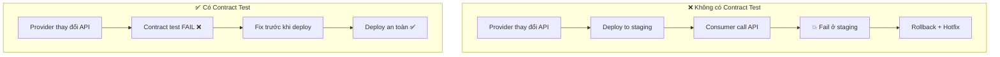
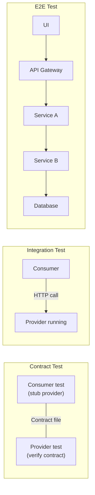

# Contract testing là gì?

## ⚡ Tóm tắt ngắn (30s)
* Contract testing là phương pháp **verify giao tiếp giữa 2 service** bằng cách định nghĩa một "contract" (hợp đồng) mô tả request/response format mà cả 2 bên đồng ý tuân theo
* Khác với integration test (cần cả 2 service chạy cùng lúc), contract test **chạy độc lập** ở mỗi service → nhanh hơn, ít flaky
* Giải quyết bài toán: **"Service A deploy version mới, liệu có break Service B không?"** mà không cần end-to-end test
* Tool phổ biến: **Pact** (consumer-driven), **Spring Cloud Contract** (provider-driven)

---

## 🔍 Chi tiết bản chất thực chiến

### Vấn đề contract testing giải quyết

Trong microservices, mỗi service giao tiếp qua API (REST, gRPC, message queue). Khi service provider thay đổi API:

- **Rename field**: `userName` → `username` → consumer parse sai
- **Remove field**: bỏ `email` khỏi response → consumer NPE
- **Change type**: `price: "100"` → `price: 100` → consumer deserialize fail
- **Change status code**: 200 → 201 → consumer không handle

**Không có contract test**: Bug phát hiện ở **staging/production** → rollback, hotfix, downtime.

**Có contract test**: Bug phát hiện ở **build time** → fail ngay trong CI → không deploy được.



### Contract Test vs Integration Test vs E2E Test



### Hai trường phái Contract Testing

#### 1. Consumer-Driven Contract (CDC) — Pact

- **Consumer** định nghĩa contract: "Tôi expect API trả về field X, Y, Z"
- **Provider** verify: "OK, tôi có trả về đúng X, Y, Z không?"
- **Ưu điểm**: Consumer chủ động, provider chỉ cần đáp ứng những gì consumer thực sự dùng
- **Tool**: Pact

#### 2. Provider-Driven Contract — Spring Cloud Contract

- **Provider** định nghĩa contract: "API của tôi trả về format này"
- **Consumer** nhận stub/WireMock tự động generate từ contract
- **Ưu điểm**: Provider kiểm soát API design, dễ quản lý khi nhiều consumer
- **Tool**: Spring Cloud Contract

---

## 💻 Code thực chiến: BAD vs GOOD

### ❌ BAD: Test integration bằng cách gọi service thật

```java
@SpringBootTest(webEnvironment = SpringBootTest.WebEnvironment.RANDOM_PORT)
class OrderServiceIntegrationTest {

    @Autowired
    private TestRestTemplate restTemplate;

    @Test
    void shouldGetUserFromUserService() {
        // ❌ Cần UserService phải đang chạy → flaky, slow
        // ❌ UserService thay đổi response → test này fail nhưng KHÔNG AI BIẾT
        // ❌ Network issue → false failure
        ResponseEntity<UserDto> response = restTemplate
                .getForEntity("http://user-service:8081/api/users/1", UserDto.class);

        assertThat(response.getStatusCode()).isEqualTo(HttpStatus.OK);
        assertThat(response.getBody().getName()).isNotNull();
    }
}
```

---

### ✅ GOOD: Consumer-side contract test với Pact

```java
// ORDER-SERVICE (Consumer) — Định nghĩa contract
@ExtendWith(PactConsumerTestExt.class)
@PactTestFor(providerName = "user-service", port = "8081")
class UserClientContractTest {

    @Pact(consumer = "order-service", provider = "user-service")
    public V4Pact getUserPact(PactDslWithProvider builder) {
        // ✅ Consumer định nghĩa: "Tôi cần API trả về đúng format này"
        return builder
                .given("user with ID 1 exists")
                .uponReceiving("a request for user 1")
                    .path("/api/users/1")
                    .method("GET")
                .willRespondWith()
                    .status(200)
                    .headers(Map.of("Content-Type", "application/json"))
                    .body(new PactDslJsonBody()
                            .integerType("id", 1)
                            .stringType("name", "John Doe")
                            .stringType("email", "john@example.com")
                    )
                .toPact(V4Pact.class);
    }

    @Autowired
    private UserClient userClient; // Feign or RestTemplate client

    @Test
    @PactTestFor(pactMethod = "getUserPact")
    void shouldGetUserById(MockServer mockServer) {
        // ✅ Test chạy against Pact mock server — không cần UserService thật
        UserDto user = userClient.getUserById(1L);

        assertThat(user.getName()).isEqualTo("John Doe");
        assertThat(user.getEmail()).isEqualTo("john@example.com");
        // Pact file được generate → publish lên Pact Broker
    }
}
```

---

### ✅ GOOD: Provider-side verification

```java
// USER-SERVICE (Provider) — Verify contract từ consumer
@Provider("user-service")
@PactBroker(url = "http://pact-broker.company.com")
@SpringBootTest(webEnvironment = SpringBootTest.WebEnvironment.RANDOM_PORT)
class UserProviderContractTest {

    @Autowired
    private UserRepository userRepository;

    @TestTemplate
    @ExtendWith(PactVerificationInvocationContextProvider.class)
    void verifyPact(PactVerificationContext context) {
        // ✅ Pact tự động verify tất cả contract từ consumers
        context.verifyInteraction();
    }

    @BeforeEach
    void setUp(PactVerificationContext context) {
        context.setTarget(new HttpTestTarget("localhost",
                Integer.parseInt(serverPort)));
    }

    @State("user with ID 1 exists")
    void setupUser() {
        // ✅ Setup test data tương ứng với "given" state trong contract
        userRepository.save(new User(1L, "John Doe", "john@example.com"));
    }
}
```

---

## 📊 Bảng so sánh các loại testing trong microservices

| Tiêu chí | Unit Test | Contract Test | Integration Test | E2E Test |
| :--- | :--- | :--- | :--- | :--- |
| **Scope** | 1 class/method | 2 services interface | Nhiều components | Toàn hệ thống |
| **Speed** | ms | seconds | seconds-minutes | minutes |
| **Cần service khác?** | ❌ | ❌ (stub) | ✅ | ✅ Tất cả |
| **Flaky risk** | Thấp | Thấp | Trung bình | Cao |
| **Phát hiện API break** | ❌ | ✅ | ✅ | ✅ |
| **Maintain cost** | Thấp | Trung bình | Cao | Rất cao |
| **Test pyramid position** | Base | Middle | Middle | Top |
| **CI feedback time** | Seconds | Seconds | Minutes | 10-30min |

---

## ⚠️ Common Gotchas & Questions follow-up

### 1. "Contract test có thay thế integration test không?"
* **Không** — Contract test chỉ verify **format** (field name, type, status code), không verify **business logic**
* Ví dụ: Contract test verify response có field `totalPrice`, nhưng không verify `totalPrice = quantity * unitPrice`
* Integration test vẫn cần để test **end-to-end flow** xuyên suốt nhiều services

### 2. "Pact Broker là gì? Bắt buộc không?"
* **Pact Broker** là central server lưu trữ contract files, cho phép provider download và verify
* Không bắt buộc (có thể share file), nhưng **strongly recommended** cho team lớn
* Pactflow (SaaS version) có thêm tính năng: **can-i-deploy** check trước khi deploy

### 3. "Contract test cho message queue (Kafka, RabbitMQ)?"
* Pact hỗ trợ **message pact** — verify format của Kafka message/event
* Consumer định nghĩa: "Tôi expect event OrderCreated có field orderId, amount"
* Producer verify: "Serialized message có đúng format không?"

### 4. "Khi nào KHÔNG cần contract test?"
* **Monolith** — không có inter-service communication
* **Team nhỏ** (2-3 người) — nói chuyện trực tiếp nhanh hơn
* **3rd-party API** — bạn không kiểm soát provider → dùng integration test
* **Rapidly changing prototype** — overhead maintain contract cao

### 5. "Spring Cloud Contract vs Pact — chọn cái nào?"
* **Pact**: Cross-language (Java, JS, Python, Go), consumer-driven, Pact Broker ecosystem
* **Spring Cloud Contract**: Chỉ Java/Spring, provider-driven, tích hợp sâu Spring ecosystem
* **Rule of thumb**: Polyglot microservices → Pact. All-Spring ecosystem → Spring Cloud Contract
