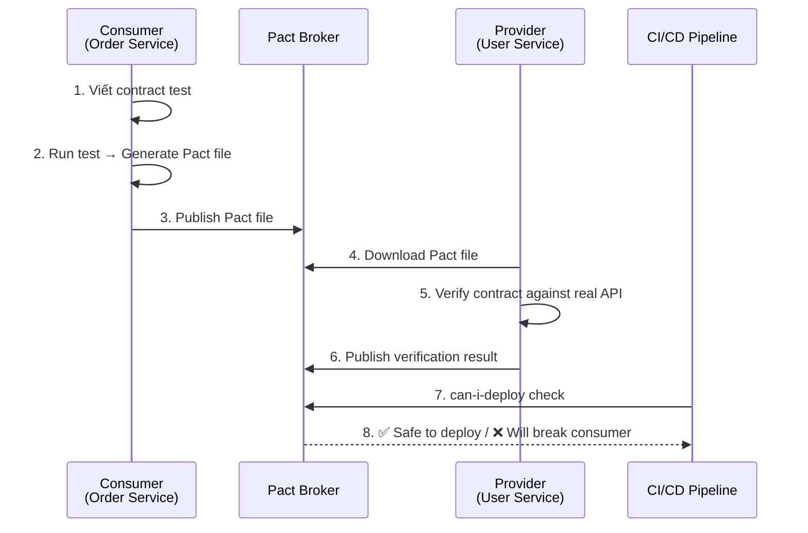
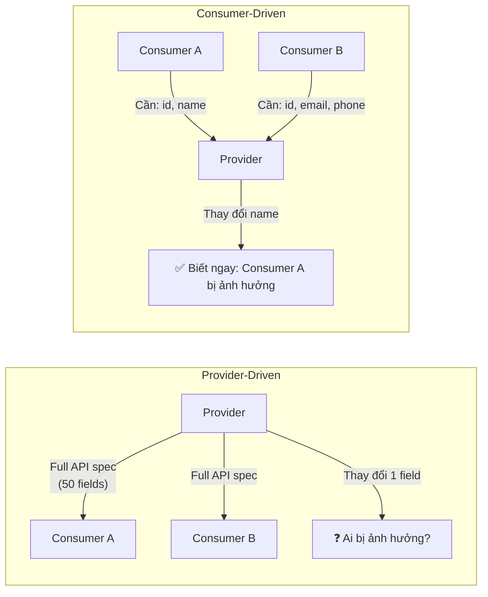

# Consumer-driven contract test là gì?

## ⚡ Tóm tắt ngắn (30s)
* Consumer-driven contract (CDC) test là phương pháp contract testing mà **consumer (bên gọi API) chủ động định nghĩa** expectations về API response
* Consumer viết test mô tả: "Tôi gọi `GET /users/1` và expect response có field `id`, `name`, `email`" → sinh ra **contract file (Pact file)**
* Provider (bên cung cấp API) **tải contract file về và verify** rằng API thật sự trả về đúng format
* **Lợi ích then chốt**: Provider chỉ cần maintain những field **consumer thực sự dùng**, không phải giữ nguyên toàn bộ response → an toàn hơn khi refactor

---

## 🔍 Chi tiết bản chất thực chiến

### Workflow của CDC Test (Pact)



### Tại sao "Consumer-Driven" chứ không phải "Provider-Driven"?

**Provider-driven** (truyền thống):
- Provider công bố OpenAPI/Swagger spec → consumer tuân theo
- Problem: Provider thêm/bớt field → **không biết consumer nào bị ảnh hưởng**
- Provider giữ lại field cũ "cho chắc" → **API phình to**, response bloated

**Consumer-driven** (Pact):
- Consumer nói: "Tôi chỉ dùng field `id`, `name`, `email`" → chỉ verify 3 field này
- Provider rename field `phone` → **không ảnh hưởng** consumer (vì consumer không dùng)
- Provider rename field `name` → `fullName` → **contract test FAIL** → phát hiện ngay



### Pact Specification — Anatomy của Contract File

```json
{
  "consumer": { "name": "order-service" },
  "provider": { "name": "user-service" },
  "interactions": [
    {
      "description": "a request for user 1",
      "providerState": "user with ID 1 exists",
      "request": {
        "method": "GET",
        "path": "/api/users/1"
      },
      "response": {
        "status": 200,
        "headers": { "Content-Type": "application/json" },
        "body": {
          "id": 1,
          "name": "John Doe",
          "email": "john@example.com"
        },
        "matchingRules": {
          "body": {
            "$.id": { "matchers": [{ "match": "integer" }] },
            "$.name": { "matchers": [{ "match": "type" }] },
            "$.email": { "matchers": [{ "match": "type" }] }
          }
        }
      }
    }
  ]
}
```

Chú ý: **matchingRules** dùng `type` matching — không so sánh exact value, chỉ verify **data type** → linh hoạt hơn.

---

## 💻 Code thực chiến: BAD vs GOOD

### ❌ BAD: Consumer test hardcode response — dễ vỡ, không đồng bộ

```java
@ExtendWith(MockitoExtension.class)
class OrderServiceTest {

    @Mock
    private UserClient userClient;

    @InjectMocks
    private OrderService orderService;

    @Test
    void shouldCreateOrderWithUserInfo() {
        // ❌ Mock trả về data cứng → không có contract với provider
        // ❌ Provider thay đổi response format → mock vẫn pass → production fail
        UserDto mockUser = new UserDto(1L, "John", "john@example.com", "0901234567");
        when(userClient.getUserById(1L)).thenReturn(mockUser);

        Order order = orderService.createOrder(1L, "ITEM-001");

        assertThat(order.getUserName()).isEqualTo("John");
        // Test pass nhưng nếu provider rename "name" → "fullName",
        // mock KHÔNG phát hiện → bug lọt vào production
    }
}
```

---

### ✅ GOOD: Consumer-side Pact test — tạo contract tự động

```java
@ExtendWith(PactConsumerTestExt.class)
@PactTestFor(providerName = "user-service")
class UserClientPactTest {

    // ✅ Định nghĩa contract: consumer expect gì từ provider
    @Pact(consumer = "order-service", provider = "user-service")
    public V4Pact getUserByIdPact(PactDslWithProvider builder) {
        return builder
                .given("user with ID 1 exists")  // Provider state
                .uponReceiving("get user by id")
                    .path("/api/users/1")
                    .method("GET")
                    .headers("Accept", "application/json")
                .willRespondWith()
                    .status(200)
                    .headers(Map.of("Content-Type", "application/json"))
                    .body(new PactDslJsonBody()
                            .integerType("id", 1)           // Type matching, not exact value
                            .stringType("name", "John Doe")  // Chỉ verify là String
                            .stringType("email", "john@example.com")
                            .stringMatcher("email", ".*@.*", "john@example.com") // Regex matching
                    )
                .toPact(V4Pact.class);
    }

    @Pact(consumer = "order-service", provider = "user-service")
    public V4Pact getUserNotFoundPact(PactDslWithProvider builder) {
        return builder
                .given("user with ID 999 does not exist")
                .uponReceiving("get non-existing user")
                    .path("/api/users/999")
                    .method("GET")
                .willRespondWith()
                    .status(404)
                    .body(new PactDslJsonBody()
                            .stringType("error", "User not found")
                    )
                .toPact(V4Pact.class);
    }

    @Test
    @PactTestFor(pactMethod = "getUserByIdPact")
    void shouldGetExistingUser(MockServer mockServer) {
        // ✅ Pact mock server tự start → test consumer logic
        UserClient client = new UserClient(mockServer.getUrl());
        UserDto user = client.getUserById(1L);

        assertThat(user.getId()).isNotNull();
        assertThat(user.getName()).isNotBlank();
        assertThat(user.getEmail()).contains("@");
        // → Pact file generated at target/pacts/order-service-user-service.json
    }

    @Test
    @PactTestFor(pactMethod = "getUserNotFoundPact")
    void shouldHandleUserNotFound(MockServer mockServer) {
        UserClient client = new UserClient(mockServer.getUrl());

        assertThatThrownBy(() -> client.getUserById(999L))
                .isInstanceOf(UserNotFoundException.class);
    }
}
```

---

### ✅ GOOD: Provider verification với state management

```java
@Provider("user-service")
@PactBroker(
    url = "${PACT_BROKER_URL}",
    authentication = @PactBrokerAuth(token = "${PACT_BROKER_TOKEN}")
)
@SpringBootTest(webEnvironment = SpringBootTest.WebEnvironment.RANDOM_PORT)
class UserProviderPactVerificationTest {

    @LocalServerPort
    private int port;

    @Autowired
    private UserRepository userRepository;

    @BeforeEach
    void setUp(PactVerificationContext context) {
        context.setTarget(new HttpTestTarget("localhost", port));
    }

    @TestTemplate
    @ExtendWith(PactVerificationInvocationContextProvider.class)
    void verifyPact(PactVerificationContext context) {
        // ✅ Pact tự động replay tất cả interactions từ consumer contracts
        context.verifyInteraction();
    }

    // ✅ State handlers — setup data cho mỗi provider state
    @State("user with ID 1 exists")
    void userExists() {
        userRepository.deleteAll();
        userRepository.save(new User(1L, "John Doe", "john@example.com"));
    }

    @State("user with ID 999 does not exist")
    void userDoesNotExist() {
        userRepository.deleteAll();
        // Không tạo user → API sẽ trả 404
    }
}
```

---

## 📊 Bảng so sánh Consumer-Driven vs Provider-Driven Contract

| Tiêu chí | Consumer-Driven (Pact) | Provider-Driven (Spring Cloud Contract) |
| :--- | :--- | :--- |
| **Ai viết contract?** | Consumer | Provider |
| **Contract format** | Pact JSON | Groovy/YAML DSL |
| **Cross-language** | ✅ (Java, JS, Python, Go, .NET) | ❌ Java/Spring only |
| **Broker/Registry** | Pact Broker (central) | Git repository |
| **Stub generation** | Consumer mock từ Pact file | WireMock stub auto-generated |
| **Best for** | Polyglot microservices | Spring-only ecosystem |
| **Provider freedom** | Cao (chỉ maintain field consumer dùng) | Thấp (phải match full spec) |
| **can-i-deploy** | ✅ Built-in | ❌ Manual check |
| **Learning curve** | Trung bình | Thấp (Spring native) |

---

## ⚠️ Common Gotchas & Questions follow-up

### 1. "Consumer thêm field mới vào contract thì sao?"
* Consumer thêm field `phone` vào expectation → publish contract mới
* Provider verify → **FAIL** nếu API chưa trả `phone`
* Provider cần **thêm field** hoặc **từ chối** (negotiate với consumer team)
* Đây chính là điểm mạnh CDC: **communication trigger** giữa teams

### 2. "Nhiều consumer cùng gọi 1 provider — conflict contract?"
* Mỗi consumer có **contract riêng** — provider verify **tất cả** contracts
* Consumer A cần `id, name`, Consumer B cần `id, email` → Provider phải trả cả `id, name, email`
* Pact Broker hiển thị **dependency matrix** — provider biết tất cả consumers

### 3. "Provider state quá phức tạp — quá nhiều @State methods?"
* Limit provider states → chỉ tạo state cho **happy path** + **main error cases**
* Dùng **state params**: `@State(value = "user exists", params = {"id": "1"})` → tái sử dụng state handler
* Nếu state setup quá complex → xem xét lại API design

### 4. "CDC test có verify request body không?"
* **Có** — consumer có thể define request body matching rules
* Ví dụ: POST `/api/orders` với body `{"userId": 1, "items": [...]}` → provider verify rằng API accept đúng format
* Dùng **provider state** để setup preconditions cho write operations

### 5. "Versioning contract — consumer v1 và v2 cùng tồn tại?"
* Pact Broker hỗ trợ **tags** và **branches** — consumer v1 trên branch `main`, v2 trên branch `feature/new-api`
* **Pending pacts**: Contract mới từ consumer chưa được provider verify → không block deployment
* **WIP pacts**: Work-in-progress contracts → provider aware nhưng fail không block CI
