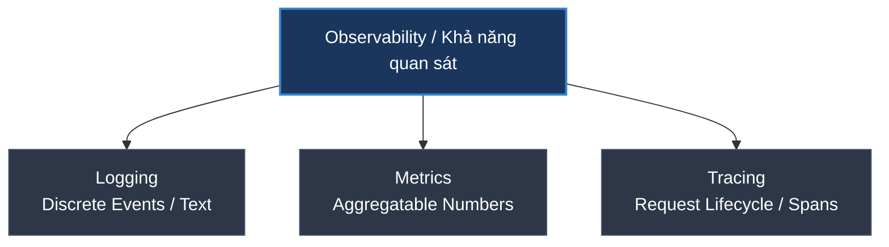
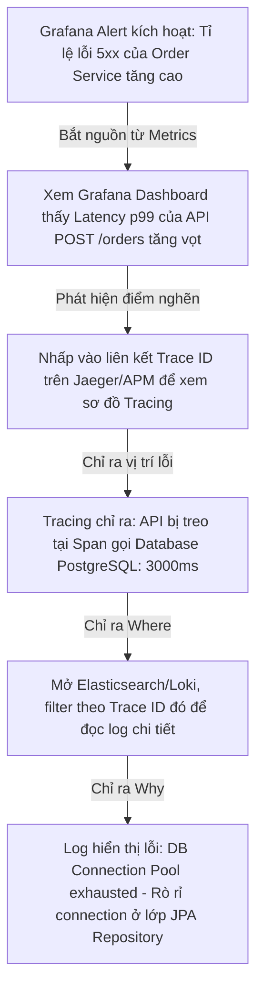

# Logging, Metrics, và Tracing khác nhau thế nào? (Ba trụ cột của Observability)

## ⚡ Tóm tắt ngắn (30s)
* Đây là **Ba trụ cột của Khả năng quan sát (Three Pillars of Observability)** giúp chúng ta vận hành, giám sát và tìm lỗi hệ thống (đặc biệt là Microservices).
* **Logging (Nhật ký sự kiện)**: Ghi lại thông tin chi tiết về các **sự kiện rời rạc** (discrete events) xảy ra trong ứng dụng. Dùng để trả lời câu hỏi: **"Tại sao lỗi xảy ra?" (Why)**.
* **Metrics (Chỉ số đo lường)**: Dữ liệu số học có khả năng tích hợp/gộp (aggregatable numeric data) đo lường trạng thái hệ thống theo thời gian. Dùng để cảnh báo (Alerting) và trả lời câu hỏi: **"Hệ thống có lỗi không? Khi nào?" (Is there a problem? When)**.
* **Tracing (Dấu vết yêu cầu)**: Theo dõi vòng đời của một yêu cầu (request lifecycle) đi xuyên qua các component hoặc dịch vụ phân tán. Dùng để trả lời câu hỏi: **"Lỗi hoặc điểm nghẽn nằm ở đâu?" (Where)**.

---

## 🔍 Chi tiết bản chất thực chiến



### 1. Phân tích chi tiết ba trụ cột

#### A. Logging
* **Bản chất**: Bản ghi ghi lại một hành động tại một thời điểm cụ thể, chứa nhiều ngữ cảnh (Context) như User ID, IP, Error Stack trace.
* **Đặc điểm**: Tốn cực nhiều không gian lưu trữ (Storage). Thường được gom về một trung tâm (như ElasticSearch, Loki) để tìm kiếm và phân tích.
* **Ví dụ**: `2026-05-23 07:39:17.001 ERROR [order-service] 12450 --- [nio-8080-exec-1] c.e.service.OrderService : Failed to create order for user: USR-9988. Database connection timeout.`

#### B. Metrics
* **Bản chất**: Các con số có thể cộng, trừ, tính trung bình, đo lường tần suất hoạt động của tài nguyên hoặc ứng dụng trong một khoảng thời gian.
* **Đặc điểm**: Cực kỳ nhẹ và rẻ về dung lượng lưu trữ. Lưu trong Time-Series Database (như Prometheus, InfluxDB). Thích hợp nhất để làm Dashboard (Grafana) và Trigger cảnh báo.
* **Ví dụ**: `http_requests_total{method="POST", handler="/api/v1/orders", status="500"} 42` (Số lượng request POST lỗi 500 vào API order là 42).

#### C. Tracing
* **Bản chất**: Một chuỗi các đoạn liên kết (**Spans**), mỗi Span biểu diễn một đơn vị công việc (HTTP call, DB query, Queue publish) từ lúc request bắt đầu ở client cho đến khi hoàn tất.
* **Đặc điểm**: Sử dụng **Trace ID** duy nhất để liên kết các Span đi qua nhiều microservices. Rất cần thiết cho kiến trúc phân tán để phát hiện nghẽn cổ chai (Bottleneck) hoặc lỗi liên kết dịch vụ.
* **Ví dụ**: Người dùng click "Mua hàng" -> Gateway (Span 1, 50ms) -> Order Service (Span 2, 200ms) -> Payment Service (Span 3, 150ms).

---

## 🎨 Sơ đồ luồng xử lý lỗi thực tế trong Microservices

Khi hệ thống gặp sự cố, cả 3 trụ cột sẽ phối hợp nhịp nhàng như sau:



---

## 💻 Code thực chiến: Cấu hình 3 trụ cột trong Spring Boot

### ❌ BAD (Cấu hình nghèo nàn, viết log thô, không có metrics & tracing)
```java
@RestController
@RequestMapping("/api/orders")
public class UnobservableOrderController {
    
    // ❌ BAD: Không có tracing ID, log thô dạng text khó phân tích (không có JSON structured)
    private static final Logger log = LoggerFactory.getLogger(UnobservableOrderController.class);

    @PostMapping
    public ResponseEntity<String> createOrder(@RequestBody OrderRequest req) {
        log.info("Creating order for user: " + req.getUserId()); // ❌ Khó grep khi lượng log lớn
        try {
            // Thực hiện nghiệp vụ
            return ResponseEntity.ok("Success");
        } catch (Exception e) {
            log.error("Error creating order: " + e.getMessage()); // ❌ Mất stack trace
            return ResponseEntity.status(500).body("Error");
        }
    }
}
```

---

### ✅ GOOD (Tích hợp Observability hoàn chỉnh với Spring Boot Actuator, Micrometer và Logback)

#### 1. File cấu hình `application.yml` kích hoạt Metrics & Tracing
```yaml
management:
  endpoints:
    web:
      exposure:
        include: "prometheus,health,info" # ✅ Xuất metrics Prometheus cho Agent cào
  metrics:
    tags:
      application: ${spring.application.name} # ✅ Đính kèm tên ứng dụng vào mọi metric
  tracing:
    sampling:
      probability: 1.0 # ✅ Gửi 100% trace lên APM (môi trường dev, prod thường để 0.1 - 10%)
```

#### 2. Viết code nghiệp vụ có sẵn Log Structuring và Tracing tự động
```java
import io.micrometer.observation.annotation.Observed;
import org.slf4j.Logger;
import org.slf4j.LoggerFactory;

@RestController
@RequestMapping("/api/orders")
public class ObservableOrderController {
    
    private static final Logger log = LoggerFactory.getLogger(ObservableOrderController.class);
    private final OrderService orderService;

    public ObservableOrderController(OrderService orderService) {
        this.orderService = orderService;
    }

    @PostMapping
    @Observed(name = "order.creation") // ✅ Tự động tạo Custom Metric & Trace Span cho method này
    public ResponseEntity<OrderResponse> createOrder(@RequestBody OrderRequest req) {
        // ✅ Logback cấu hình xuất JSON sẽ tự động chứa [traceId, spanId] do Micrometer Tracing tiêm vào MDC (Mapped Diagnostic Context)
        log.info("Initiating order creation process for user: {}", req.getUserId()); 
        
        OrderResponse response = orderService.process(req);
        
        log.info("Order created successfully. OrderId: {}", response.getOrderId());
        return ResponseEntity.ok(response);
    }
}
```

---

## 📊 Bảng so sánh 3 trụ cột Observability

| Tiêu chí | Logging (Logs) | Metrics | Tracing (Traces) |
| :--- | :--- | :--- | :--- |
| **Định dạng dữ liệu** | Text không cấu trúc hoặc Structured JSON | Cặp Key-Value định dạng số (Timeseries) | Sơ đồ cây (Graph of Spans) |
| **Mục đích sử dụng** | Debug chi tiết nguyên nhân sự cố | Trigger Alert, Monitor sức khỏe tổng quan | Theo dõi luồng dữ liệu, phát hiện nghẽn |
| **Chi phí lưu trữ** | **Rất cao** (Tỉ lệ thuận lượng request) | **Rất thấp** (Tỉ lệ thuận số lượng metric đặt ra) | **Trung bình - Cao** (Phụ thuộc Sampling rate) |
| **Thời gian lưu trữ** | Thường ngắn (7 - 30 ngày) | Dài (vài tháng đến vài năm) | Thường ngắn (7 - 14 ngày) |
| **Công cụ phổ biến** | ELK Stack, Grafana Loki, Splunk | Prometheus, Datadog, InfluxDB | Jaeger, Zipkin, OpenTelemetry |

---

## ⚠️ Common Gotchas & Questions follow-up

### 1. "High Cardinality trong Metrics là gì? Tại sao không được đưa User ID hay Order ID làm label/tag trong Prometheus?"
* **Cardinality (Bản số)** là số lượng các giá trị duy nhất có thể có của một thuộc tính (tag/label).
* **High Cardinality**: Xảy ra khi ta đưa các thuộc tính có vô số giá trị ngẫu nhiên (như `user_id`, `order_id`, `email`, `timestamp`) làm label cho metrics.
* **Nguy hiểm**: Prometheus thiết kế để lưu giữ các chuỗi thời gian (time-series). Mỗi sự kết hợp độc nhất của các label sẽ tạo ra một time-series mới trong memory của Prometheus. Nếu ta đưa `user_id` (ví dụ có 1 triệu người dùng) vào tag, Prometheus sẽ phải tạo ra 1 triệu time-series khác nhau. Điều này gây ra **Cardinality Explosion**, làm cạn kiệt RAM và sập server Prometheus ngay lập tức!
* **Quy tắc**: Chỉ đưa các thuộc tính có tập giá trị giới hạn (Low Cardinality) như `status_code` (200, 400, 500), `method` (GET, POST), `env` (prod, staging) làm label cho metrics. Dữ liệu High Cardinality hãy lưu ở Logs hoặc Tracing.

### 2. "Sampling trong Tracing là gì? Tại sao ta không trace 100% request trên Production?"
* **Sampling (Lấy mẫu)**: Là việc chỉ ghi nhận và lưu trữ một tỉ lệ phần trăm nhất định các request traces (ví dụ: chỉ lấy 5% tổng số request).
* **Tại sao cần?**
  * **Tiết kiệm tài nguyên**: Ở hệ thống lớn với hàng triệu RPS, việc ghi nhận 100% traces sẽ tạo ra lượng dữ liệu khổng lồ (băng thông mạng tăng vọt, chi phí lưu trữ APM đắt đỏ).
  * **Hiệu năng**: Quá trình tạo và truyền trace context đi qua mạng có thể gây ra một phần nhỏ độ trễ (overhead) cho ứng dụng.
* **Các chiến lược Sampling**:
  * **Head-based Sampling**: Quyết định trace hay không ngay khi request vừa chạm vào Gateway (ví dụ lấy ngẫu nhiên 5% traffic). Rất nhẹ nhưng có nguy cơ bỏ sót các request bị lỗi.
  * **Tail-based Sampling**: Đợi request chạy xong toàn bộ luồng mới quyết định. Nếu request bị lỗi (status 5xx) hoặc chạy quá chậm (>2s) thì **bắt buộc phải lưu lại**, nếu chạy thành công bình thường thì bỏ qua. Cực kỳ tối ưu cho vận hành thực tế.
