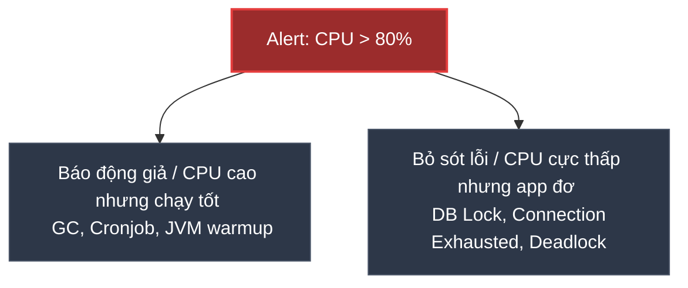

# Vì sao không nên cấu hình Alert dựa trên CPU đơn thuần?

## ⚡ Tóm tắt ngắn (30s)
* Cấu hình cảnh báo dựa trên **mức sử dụng CPU đơn thuần** (ví dụ: `CPU > 80%`) là một lỗi thiết kế giám sát (Anti-pattern) kinh điển dẫn đến hiện tượng **Alert Fatigue** (chai lỳ cảnh báo) cực kỳ nghiêm trọng.
* **Tại sao không nên?**
  1. **CPU cao là bình thường và hữu ích**: CPU vọt lên 90% khi JVM thực hiện khởi động (Warm-up), JIT Compiler biên dịch mã máy, Garbage Collection (GC) dọn dẹp bộ nhớ, chạy Cronjob/Batch Job hoặc nén dữ liệu. Đây là hành vi tự nhiên để hệ thống tận dụng tối đa sức mạnh phần cứng.
  2. **Hệ thống sập nhưng CPU vẫn thấp**: Trong các lỗi nghẽn I/O, khoá cơ sở dữ liệu (**Database Deadlock**), cạn kiệt Connection Pool, hoặc treo luồng (Thread Blocked). Lúc này, ứng dụng bị đơ cứng, người dùng nhận lỗi liên tục nhưng CPU rảnh rỗi cực kỳ (thường `< 10%`).
* **Giải pháp**: Luôn cấu hình Alert dựa trên **Triệu chứng lỗi (Symptom-based)** ảnh hưởng trực tiếp tới khách hàng (API lỗi 5xx, p99 Latency cao). Chỉ sử dụng CPU làm metric chẩn đoán phụ trợ hoặc làm điều kiện kích hoạt **Auto-scaling (HPA)** tự động.

---

## 🔍 Chi tiết bản chất thực chiến



### 1. Kịch bản 1: CPU vọt lên 98% nhưng người dùng vẫn cực kỳ hạnh phúc
* Vào lúc 2 giờ sáng, hệ thống chạy tác vụ Batch Job tổng hợp doanh thu ngày và xuất báo cáo PDF.
* Tác vụ này được tối ưu hóa đa luồng, sử dụng toàn bộ tài nguyên CPU của server để hoàn thành nhanh nhất có thể.
* **Hậu quả**: Nếu cấu hình alert CPU đơn thuần, điện thoại của bạn sẽ hú còi inh ỏi đánh thức bạn dậy. Tuy nhiên, thực tế đây là hành vi hoàn toàn mong muốn, hệ thống thanh toán chính vẫn hoạt động trơn tru.

### 2. Kịch bản 2: CPU 5% nhưng hệ thống sập hoàn toàn
* Ứng dụng Spring Boot của bạn có cấu hình Hikari Connection Pool tối đa 10 kết nối.
* Do một API viết SQL tệ không đóng transaction đúng cách, cả 10 kết nối DB đều bị chiếm dụng và treo vĩnh viễn.
* Bất kỳ request mới nào của người dùng gửi tới đều bị treo ở hàng chờ lấy connection, dẫn tới quá thời gian phản hồi (Gateway Timeout 504).
* **Hậu quả**: Trình duyệt của khách hàng quay đều và báo lỗi. Nhưng vì luồng ứng dụng bị treo block chờ I/O, CPU của server gần như bằng 0% (nhàn rỗi). Alert CPU hoàn toàn im lặng, sếp gọi điện mắng bạn trước khi hệ thống kịp cảnh báo!

---

## 💻 Kịch bản thực chiến: Cấu hình Alert CPU thông minh bằng Prometheus Rules

Nếu vẫn muốn cảnh báo về CPU, hãy kết hợp CPU với chỉ số **Saturation (Load Average)** và **API Latency** để tạo thành bộ cảnh báo thông minh, loại bỏ hoàn toàn báo động giả.

### ❌ BAD (Cấu hình thô sơ gây nhiễu)
```yaml
# Báo động ngay lập tức nếu CPU máy chủ vượt quá 85% trong 1 phút
- alert: HostHighCpu
  expr: node_cpu_seconds_total{mode="idle"} < 15
  for: 1m
  labels:
    severity: critical
```

---

### ✅ GOOD (Cảnh báo thông minh kết hợp CPU cao kèm theo suy giảm hiệu năng API)
Chỉ cảnh báo khi CPU máy chủ vượt quá 90% **ĐỒNG THỜI** độ trễ p95 của API bị tăng vọt (chứng minh CPU cao thực sự đang làm chậm hệ thống của khách hàng):

```yaml
- alert: CpuExhaustionAffectingUserExperience
  expr: |
    (
      # Điều kiện 1: CPU của ứng dụng vượt quá 90% liên tục 5 phút
      (100 - (avg by (instance) (irate(node_cpu_seconds_total{mode="idle"}[5m])) * 100)) > 90
    )
    AND
    (
      # Điều kiện 2: ĐỒNG THỜI độ trễ p95 của API vượt quá 1000ms (1 giây)
      histogram_quantile(0.95, sum(rate(http_server_requests_seconds_bucket[5m])) by (le)) > 1
    )
  for: 5m
  labels:
    severity: page
    team: infra-team
  annotations:
    summary: "CRITICAL: CPU exhaustion is degrading API response time on {{ $labels.instance }}"
    description: "Mức sử dụng CPU vượt quá 90% và đang trực tiếp làm tăng độ trễ p95 của người dùng vượt quá 1 giây."
    runbook_url: "https://wiki.my-company.com/playbooks/infra/cpu-degradation.md"
```

---

## 📊 So sánh triết lý cảnh báo: CPU Metrics vs Symptom Metrics

| Tiêu chí | Cảnh báo theo CPU Utiization | Cảnh báo theo Triệu chứng (Symptom-based) |
| :--- | :--- | :--- |
| **Bản chất đo lường** | Trạng thái linh kiện phần cứng vật lý | Trải nghiệm trực tiếp của người dùng |
| **Độ tin cậy cảnh báo**| Rất thấp (dễ gây báo động giả) | Tuyệt đối chính xác (người dùng bị lỗi là báo) |
| **Bối cảnh sử dụng tốt**| Dùng làm điều kiện Auto-scaling (HPA) | Dùng để Page (đánh thức) kỹ sư trực chiến |
| **Ví dụ hành động** | Tự động nhân đôi số Pod trong Kubernetes | Dev On-call vào điều tra lỗi code, restart app |

---

## ⚠️ Common Gotchas & Questions follow-up

### 1. "CPU Throttling trong Kubernetes là gì? Tại sao nó nguy hiểm hơn CPU Utilization?"
* **Định nghĩa**: CPU Throttling là cơ chế của Kubernetes (sử dụng cgroups CFS quota) để giới hạn tài nguyên CPU của một Container. Khi container tiêu thụ vượt quá mức `limits.cpu` khai báo trong file cấu hình YAML, Kubernetes sẽ **bóp nghẹt (throttle) chu kỳ CPU** của container đó.
* **Đặc điểm thực chiến cực kỳ nguy hiểm**:
  * Khi bị throttle, container chạy chậm đi gấp hàng chục lần. Response time API vọt lên vài giây.
  * Tuy nhiên, khi bạn check metric `container_cpu_usage_seconds_total`, bạn sẽ thấy CPU của pod đó mới chỉ đạt khoảng 60% - 70%, hoàn toàn chưa chạm ngưỡng 100%!
  * Do đó, cảnh báo theo CPU thông thường sẽ hoàn toàn bỏ sót sự cố này.
* **Khắc phục**: 
  * Cần cấu hình monitor chỉ số **`container_cpu_cfs_throttled_seconds_total`** (đo lường thời gian container bị bóp CPU). Nếu chỉ số này lớn hơn 0, có nghĩa là giới hạn CPU limit đang quá thấp, cần tăng `limits.cpu` lên hoặc loại bỏ hoàn toàn limit CPU (chỉ để `requests.cpu`) theo khuyến nghị của nhiều chuyên gia Kubernetes.

### 2. "Vậy khi CPU cao thực sự do lượng traffic tăng vọt, tôi nên xử lý thế nào?"
* Thay vì bắn alert bắt con người vào xử lý thủ công bằng tay (mất 5-10 phút để dev đăng nhập và scale), hãy tự động hóa hoàn toàn bằng **HPA (Horizontal Pod Autoscaler)** trong Kubernetes.
* Cấu hình HPA tự động scale số lượng Pod từ 2 lên 10 khi CPU trung bình vượt quá 75%. Hệ thống sẽ tự động scale-out chỉ trong 30 giây để gánh tải mà không cần đánh thức bất kỳ lập trình viên nào dậy lúc nửa đêm.
