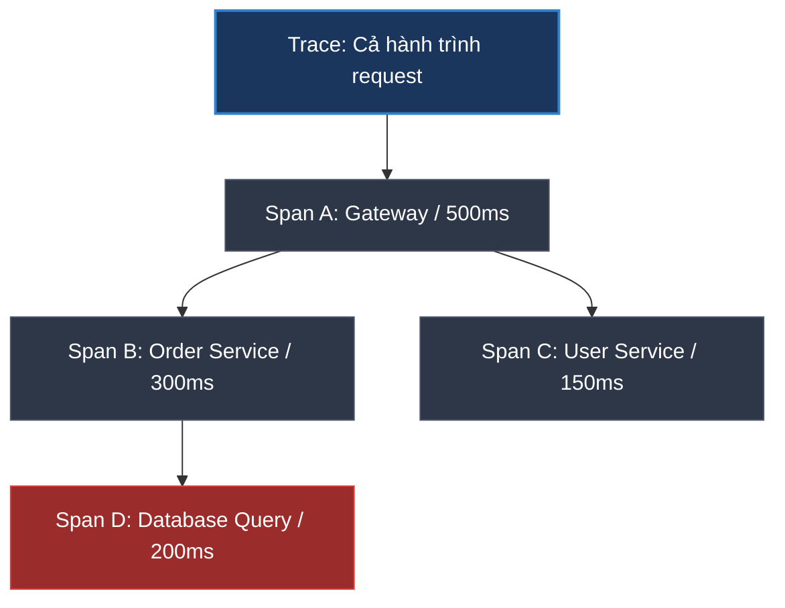

# Distributed Tracing giúp debug gì trong hệ thống Microservices?

## ⚡ Tóm tắt ngắn (30s)
* **Distributed Tracing (Dấu vết yêu cầu phân tán)** là phương pháp theo dõi và lập bản đồ chi tiết toàn bộ hành trình của một yêu cầu (request) đi xuyên qua các dịch vụ (microservices), cơ sở dữ liệu, và hàng đợi tin nhắn trong kiến trúc phân tán.
* **Các ứng dụng debug đột phá trong thực chiến**:
  1. **Định vị chính xác điểm nghẽn (Bottlenecks)**: Chỉ ra cụ thể API chậm là do service nào bị đơ, hoặc câu lệnh SQL nào chạy tốn thời gian nhất dưới dạng sơ đồ thời gian trực quan (Gantt Chart).
  2. **Tìm nguồn gốc lỗi tức thì (Root Cause Analysis)**: Khi request bị lỗi 500 ở API Gateway, tracing sẽ chỉ ra chính xác dòng code bị crash ở microservice sâu nhất nằm trong chuỗi gọi chéo.
  3. **Vẽ sơ đồ liên kết động (Dependency Mapping)**: Tự động vẽ bản đồ tương tác giữa các service trong thời gian thực, phát hiện các cuộc gọi API thừa hoặc vòng lặp gọi chéo nguy hiểm.

---

## 🔍 Chi tiết bản chất thực chiến

### 1. Các khái niệm cốt lõi trong Distributed Tracing



* **Trace (Hành trình)**: Là bức tranh toàn cảnh về vòng đời của một request. Được định danh bằng **Trace ID** duy nhất.
* **Span (Phân đoạn)**: Là một đơn vị công việc riêng lẻ trong hành trình đó (ví dụ: một cuộc gọi HTTP, một câu lệnh SQL, một lần ghi vào Cache). Mỗi Span có **Span ID**, thời gian bắt đầu, thời gian kết thúc, và **Parent ID** để xác định vị trí của nó trong cây phân cấp.
* **Context Propagation (Truyền ngữ cảnh)**: Là cơ chế truyền Trace ID và Span ID qua môi trường mạng (HTTP Headers, Kafka Headers) từ service này sang service khác để giữ chuỗi trace liên tục.

### 2. Case-study thực tế: Debug lỗi API "Thanh toán chậm"
Khách hàng phản ánh tính năng "Thanh toán" thỉnh thoảng mất tới 5 giây mới xong.
* **Không có Tracing**: Dev phải mò mẫm đọc log của `gateway-service`, `order-service`, `payment-service`, `bank-api-client` để so khớp timestamp. Rất khó khăn và mất thời gian.
* **Có Tracing (Jaeger/Zipkin)**: Mở Trace ID của request lỗi lên, bạn sẽ thấy biểu đồ dạng thanh ngang (Gantt Chart):
  * `POST /api/v1/checkout` [Total: 5100ms]
    * ├── `OrderService: createOrder` [200ms]
    * └── `PaymentService: processPayment` [4900ms]  <-- 🛑 Phát hiện chậm ở đây!
      * ├── `Database: updateWalletBalance` [50ms]
      * └── `BankClient: invokeThirdPartyBankAPI` [4850ms] <-- 🛑 Thủ phạm thực sự: API ngân hàng bên thứ ba phản hồi cực kỳ chậm!
* **Kết luận**: Nhờ Tracing, bạn chỉ ra thủ phạm chỉ trong 10 giây mà không cần viết thêm bất kỳ dòng code debug nào.

---

## 💻 Code thực chiến: Sử dụng Micrometer Tracing trong Spring Boot 3

Spring Boot 3 tích hợp sẵn **Micrometer Tracing** (thay thế cho Spring Cloud Sleuth). Nó tự động sinh Trace/Span ID và tiêm (inject) vào log MDC, đồng thời tự động truyền Trace Context qua RestTemplate hoặc WebClient.

### 1. Dependency cần thiết (Maven)
```xml
<dependency>
    <groupId>io.micrometer</groupId>
    <artifactId>micrometer-tracing-bridge-otel</artifactId> <!-- ✅ Cầu nối OpenTelemetry -->
</dependency>
<dependency>
    <groupId>io.opentelemetry</groupId>
    <artifactId>opentelemetry-exporter-otlp</artifactId> <!-- ✅ Bộ xuất dữ liệu sang APM (Jaeger/Zipkin) -->
</dependency>
```

### 2. Viết Code tạo Custom Span để đo lường các nghiệp vụ phức tạp thủ công
Thư viện tự động trace các cuộc gọi HTTP. Nhưng đối với các đoạn code xử lý nặng bên trong service, ta có thể tự tạo custom span để đo đạc chi tiết:

```java
import io.micrometer.observation.Observation;
import io.micrometer.observation.ObservationRegistry;
import org.springframework.stereotype.Service;

@Service
public class InventoryService {

    private final ObservationRegistry observationRegistry;

    public InventoryService(ObservationRegistry observationRegistry) {
        this.observationRegistry = observationRegistry;
    }

    public void checkStockAndReserve(String sku, int quantity) {
        // ✅ Tạo và bắt đầu một Custom Span có tên "reserve_stock_operation"
        Observation.createNotStarted("reserve_stock_operation", observationRegistry)
            .lowCardinalityKeyValue("sku.code", sku) // Đính kèm tag nghiệp vụ để filter sau này
            .observe(() -> {
                // 💻 Logic nghiệp vụ thực tế xử lý nặng cần đo lường độ trễ
                databaseLockAndReserve(sku, quantity);
                callExternalWarehouseSystem(sku);
            });
    }

    private void databaseLockAndReserve(String sku, int quantity) {
        // Giả lập xử lý DB...
    }

    private void callExternalWarehouseSystem(String sku) {
        // Giả lập gọi API bên ngoài...
    }
}
```

---

## 📊 So sánh Logging thông thường vs Distributed Tracing

| Tiêu chí | Logging truyền thống | Distributed Tracing |
| :--- | :--- | :--- |
| **Góc nhìn dữ liệu** | Rời rạc, cục bộ trong từng service | Mạch lạc, xuyên suốt cả hệ thống |
| **Mục đích debug** | Giải thích **Tại sao** dòng code bị lỗi | Giải thích **Lỗi ở đâu** và **Tại sao chậm** |
| **Độ trễ tích lũy** | Rất khó để tính toán giữa các service | Tự động tính toán chi tiết từng mili-giây |
| **Khả năng trực quan hóa**| Kém (chỉ là các dòng text thô) | Cực tốt (biểu đồ dạng Gantt chart, sơ đồ mạng) |
| **Chi phí triển khai** | Rất đơn giản, có sẵn mặc định | Phức tạp hơn, cần cài đặt APM Collector |

---

## ⚠️ Common Gotchas & Questions follow-up

### 1. "W3C Trace Context là gì? Tại sao nó là chuẩn bắt buộc hiện nay?"
* **Vấn đề lịch sử**: Trước đây, mỗi hãng làm APM tự chế ra định dạng HTTP header để truyền Trace ID qua mạng khác nhau (ví dụ: Zipkin dùng header `X-B3-TraceId`, Datadog dùng `x-datadog-trace-id`). Điều này khiến việc tích hợp các service viết bằng các ngôn ngữ và thư viện khác nhau trở thành cơn ác mộng.
* **Giải pháp: W3C Trace Context**: Là tiêu chuẩn quốc tế được W3C ban hành để thống nhất header truyền trace context. Mọi thư viện hiện đại (OpenTelemetry, Micrometer) đều bắt buộc tuân theo chuẩn này:
  * Header **`traceparent`**: Chứa toàn bộ thông tin Trace ID, Span ID, và Trace Flags.
    * *Ví dụ*: `traceparent: 00-4bf92f3577b34da6a3ce929d0e0e4736-00f067aa0ba902b7-01`
  * Header **`tracestate`**: Chứa thông tin tùy biến đặc thù của từng APM tool.

### 2. "Làm sao để truyền Trace Context qua các kiến trúc bất đồng bộ (Message Broker như Kafka, RabbitMQ)?"
* **Thách thức**: Khi gọi API HTTP, ta truyền trace qua HTTP headers. Nhưng khi gọi bất đồng bộ bằng cách đẩy message vào Kafka, message đó không đi qua giao thức HTTP.
* **Giải pháp**:
  * Các message broker hiện đại (Kafka >= 0.11, RabbitMQ) đều hỗ trợ thuộc tính **Record Headers** (dữ liệu metadata đi kèm message body).
  * Các thư viện tracing sẽ tự động can thiệp (intercept) vào Producer để ghi các trường `traceparent` vào Kafka Record Headers trước khi gửi.
  * Phía Consumer nhận message sẽ đọc Kafka Headers này để khôi phục (restore) lại Trace Context và tiếp tục ghi log với Trace ID cũ, đảm bảo chuỗi trace không bị đứt gãy.
