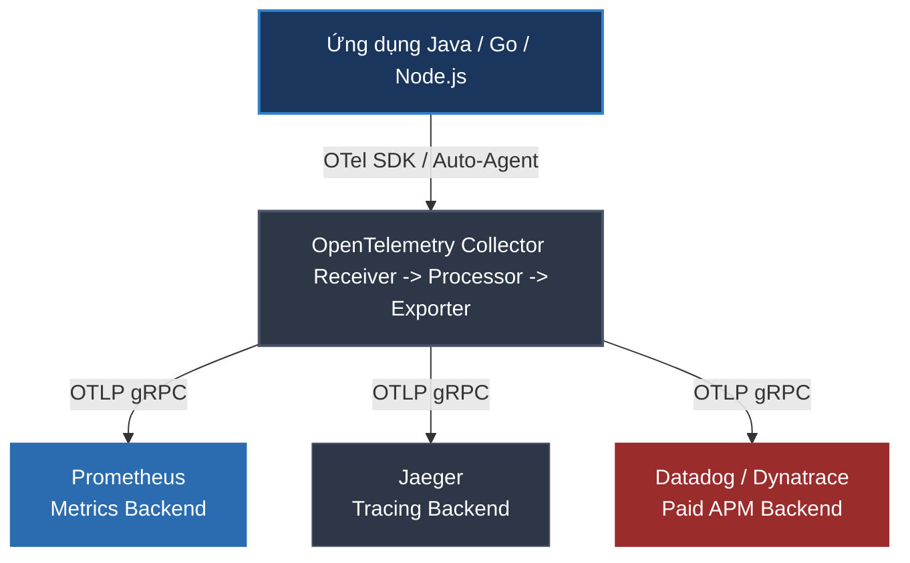

# OpenTelemetry là gì? Chuẩn công nghiệp mới cho Observability

## ⚡ Tóm tắt ngắn (30s)
* **OpenTelemetry (OTel)** là một dự án nguồn mở thuộc quỹ **CNCF** (Cloud Native Computing Foundation), được tạo ra từ sự sáp nhập của hai dự án OpenTracing và OpenCensus. Dự án này hiện là tiêu chuẩn vàng toàn cầu cho việc thu thập dữ liệu khả năng quan sát (**Observability**).
* **Mục tiêu**: Cung cấp một **tiêu chuẩn duy nhất và thống nhất** gồm APIs, SDKs, Agent, và Collector để thu thập 3 loại dữ liệu **Logs, Metrics, và Traces (LMT)** từ bất kỳ ứng dụng nào.
* **Lợi ích tối thượng**: Giải quyết triệt để vấn đề **Vendor Lock-in (Khóa chặt nhà cung cấp)**. Bạn chỉ cần tích hợp code theo chuẩn OpenTelemetry một lần duy nhất, sau đó có thể thoải mái chuyển đổi hệ thống phân tích APM (từ mã nguồn mở Jaeger/Prometheus sang các dịch vụ trả phí như Datadog, Dynatrace, New Relic) chỉ bằng cách đổi cấu hình cấu hình xuất (Exporter) mà không phải sửa đổi bất kỳ dòng code ứng dụng nào.

---

## 🔍 Chi tiết bản chất thực chiến

### 1. Kiến trúc phân tầng của OpenTelemetry



#### A. OpenTelemetry API
Định nghĩa giao diện lập trình, các kiểu dữ liệu và cơ chế Context Propagation. API này hoàn toàn độc lập với mọi thư viện thực thi, đảm bảo code nghiệp vụ của bạn không bị phụ thuộc vào bất kỳ nhà cung cấp APM cụ thể nào.

#### B. OpenTelemetry SDK
Bản cài đặt thực tế của API cho từng ngôn ngữ cụ thể. SDK chịu trách nhiệm quản lý bộ nhớ, xử lý bất đồng bộ, gộp lô (batching) và truyền tải dữ liệu ra ngoài qua các bộ xuất (Exporters).

#### C. OpenTelemetry Collector
Một thành phần trung gian (proxy proxy) chạy độc lập với ứng dụng. Nó có 3 nhiệm vụ:
* **Receivers (Nhận)**: Nhận dữ liệu observability gửi tới dưới nhiều giao thức (OTLP, Zipkin, Jaeger, Prometheus).
* **Processors (Xử lý)**: Lọc dữ liệu nhiễu, gộp lô để tiết kiệm băng thông, đính kèm thông tin hạ tầng (Kubernetes Pod Name, Cloud Region) hoặc ẩn các thông tin nhạy cảm.
* **Exporters (Xuất)**: Đẩy dữ liệu đã xử lý tới một hoặc nhiều backend đích (Jaeger, Prometheus, Datadog...) đồng thời.

---

## 💻 Hướng dẫn triển khai thực chiến: Java Auto-Instrumentation (Zero-Code)

Với Java, OpenTelemetry cung cấp cơ chế **Auto-Instrumentation (Tự động đo đạc)** thông qua Java Agent cực kỳ mạnh mẽ. Bạn hoàn toàn **không cần viết hay sửa một dòng code nào** trong dự án Spring Boot, agent sẽ tự động can thiệp vào JVM byte-code để trace toàn bộ HTTP Requests, JDBC queries, Redis calls, Kafka messages.

### 1. Khởi chạy ứng dụng đính kèm OTel Java Agent
Tải file `opentelemetry-javaagent.jar` từ github của OpenTelemetry, sau đó chạy ứng dụng Spring Boot kèm tham số JVM:

```bash
java -javaagent:path/to/opentelemetry-javaagent.jar \
     -Dotel.service.name=order-service \
     -Dotel.endpoints=http://otel-collector:4317 \
     -Dotel.metrics.exporter=otlp \
     -Dotel.traces.exporter=otlp \
     -jar order-service.jar
```
* `otel.service.name`: Tên định danh của service trên Dashboard.
* `otel.endpoints`: Địa chỉ của OTel Collector trung gian nhận dữ liệu qua cổng gRPC `4317` bằng giao thức hiệu năng cao **OTLP** (OpenTelemetry Protocol).

### 2. Cấu hình file `otel-collector-config.yaml` cho Collector
Cấu hình Collector nhận dữ liệu OTLP từ ứng dụng, sau đó đẩy song song sang Prometheus (Metrics) và Jaeger (Traces):

```yaml
receivers:
  otlp:
    protocols:
      grpc: # ✅ Lắng nghe ứng dụng gửi dữ liệu qua cổng 4317
      http:

processors:
  batch: # ✅ Gộp các lô dữ liệu trước khi gửi đi để tránh nghẽn mạng

exporters:
  prometheus:
    endpoint: "0.0.0.0:8889" # ✅ Prometheus Server sẽ cào metrics từ cổng này
  otlp/jaeger:
    endpoint: "jaeger-server:4317" # ✅ Gửi traces sang Jaeger
    tls:
      insecure: true

service:
  pipelines:
    traces:
      receivers: [otlp]
      processors: [batch]
      exporters: [otlp/jaeger]
    metrics:
      receivers: [otlp]
      processors: [batch]
      exporters: [prometheus]
```

---

## 📊 Bảng so sánh tiến trình lịch sử

| Tiêu chí | OpenTracing | OpenCensus (Google) | OpenTelemetry (CNCF) |
| :--- | :--- | :--- | :--- |
| **Trạng thái** | Đã khai tử (Deprecated) | Đã khai tử (Deprecated) | **Đang hoạt động mạnh mẽ** |
| **Phạm vi thu thập**| Chỉ hỗ trợ Traces | Hỗ trợ Traces & Metrics | **Hỗ trợ đầy đủ: Logs, Metrics, Traces** |
| **Thành phần** | Chỉ định nghĩa API | Có API và bộ SDK thực thi | **API, SDK, Agent, và Collector trung gian** |
| **Độ phổ biến** | Thấp | Trung bình | **Trở thành tiêu chuẩn chung của ngành** |

---

## ⚠️ Common Gotchas & Questions follow-up

### 1. "Sự khác biệt giữa Auto-instrumentation và Manual-instrumentation là gì? Khi nào nên dùng?"
* **Auto-instrumentation (Đo đạc tự động)**:
  * **Cơ chế**: Sử dụng Java Agent can thiệp byte-code lúc khởi chạy (runtime bytecode manipulation).
  * **Ưu điểm**: Triển khai cực nhanh, zero-code, tự động cover toàn bộ các framework phổ biến (Spring Boot, Hibernate, JDBC, HTTP Clients).
  * **Nhược điểm**: Có thể gây ra một chút overhead nhẹ lúc khởi động ứng dụng do phải load Agent. Không hiểu được logic nghiệp vụ sâu sắc của doanh nghiệp.
* **Manual-instrumentation (Đo đạc thủ công)**:
  * **Cơ chế**: Dev trực tiếp gọi thư viện OpenTelemetry API trong code ứng dụng để bắt đầu span, đặt tên, ghi lỗi hoặc add custom tags.
  * **Ưu điểm**: Đo đạc cực kỳ chính xác các logic phức tạp, gắn các tag nghiệp vụ quan trọng (ví dụ: `order.amount`, `customer.tier`).
  * **Nhược điểm**: Làm phình code nghiệp vụ, tốn công sức lập trình.
* **Best Practice**: Kết hợp cả hai. Sử dụng **Auto-instrumentation** để phủ 90% hạ tầng cơ bản (REST API, DB, Queue), sau đó dùng **Manual-instrumentation** để viết code đo đạc 10% các luồng nghiệp vụ cốt lõi của doanh nghiệp.

### 2. "OTLP (OpenTelemetry Protocol) là gì? Tại sao nó tối ưu?"
* **OTLP** là giao thức truyền tải dữ liệu Observability được thiết kế mới hoàn toàn bởi OpenTelemetry.
* **Tối ưu ở điểm nào?**
  * OTLP mặc định truyền dữ liệu qua **gRPC** sử dụng **Protocol Buffers (Protobuf)** để tuần tự hóa dữ liệu dạng nhị phân siêu nén.
  * Tốc độ truyền tải nhanh gấp nhiều lần, dung lượng payload cực kỳ nhẹ so với việc gửi log dạng JSON hoặc HTTP text truyền thống.
  * Hỗ trợ cơ chế nén luồng dữ liệu (stream compression) và tự động phục hồi kết nối cực mạnh, giảm thiểu tối đa tài nguyên mạng của server.
