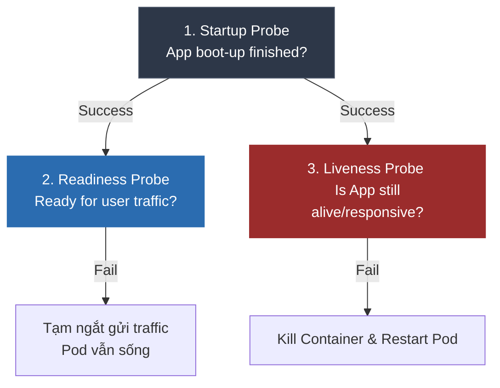

# Health Check, Liveness Probe, và Readiness Probe khác nhau thế nào?

## ⚡ Tóm tắt ngắn (30s)
* Đây là các cơ chế kiểm tra sức khỏe của ứng dụng chạy trong môi trường Container (như **Kubernetes** hoặc Docker Compose) để đưa ra quyết định điều phối tự động:
* **Liveness Probe (Kiểm tra sự sống)**: Xác định xem ứng dụng **còn sống hay đã bị treo cứng vĩnh viễn** (ví dụ: Thread Deadlock, Infinite loop). Nếu thất bại, Kubernetes sẽ **ngay lập tức kill container và tạo mới (restart)** để tự cứu hộ.
* **Readiness Probe (Kiểm tra sự sẵn sàng)**: Xác định xem ứng dụng **đã sẵn sàng để nhận traffic từ người dùng chưa** (ví dụ: đã load xong cache, kết nối DB thành công chưa). Nếu thất bại, Kubernetes sẽ **tạm ngưng hướng traffic (route request) đến Pod đó** nhưng không hề restart container.
* **Startup Probe (Kiểm tra lúc khởi động)**: Chặn Liveness và Readiness không cho chạy cho đến khi ứng dụng hoàn thành quá trình boot ban đầu (dành cho app khởi động siêu chậm, tránh bị restart oan).

---

## 🔍 Chi tiết bản chất thực chiến

### 1. Phân biệt Liveness vs Readiness vs Startup Probe



#### A. Liveness Probe — Tránh treo đơ vĩnh viễn
* **Mục tiêu**: Phát hiện các trạng thái lỗi không thể tự phục hồi nếu không restart ứng dụng (Deadlock).
* **Nguyên lý**: Phải phản hồi nhanh, cực nhẹ. Thường chỉ cần kiểm tra xem Web Server (Tomcat) còn phản hồi mã HTTP 200 hay không.

#### B. Readiness Probe — Tránh lỗi tràn bộ đệm hoặc cold-start
* **Mục tiêu**: Đảm bảo ứng dụng không nhận request khi nó chưa sẵn sàng xử lý (đang load bộ nhớ đệm Cache, đang tạo Connection Pool hoặc Database đang sập).
* **Nguyên lý**: Kiểm tra các phụ thuộc bên ngoài của pod (kết nối Database, Redis, Broker). Nếu lỗi kết nối, tạm ngắt nhận traffic để tránh trả lỗi 500 cho khách hàng.

#### C. Startup Probe — Bảo vệ lúc ứng dụng khởi động chậm
* **Mục tiêu**: JVM Warm-up hoặc các ứng dụng Java Monolith khởi động mất 2 - 3 phút. Nếu không có Startup Probe, Liveness Probe sẽ nhảy vào check ngay từ giây thứ 10, thấy app chưa phản hồi sẽ kill và restart pod. Quá trình này lặp lại vô tận tạo thành vòng lặp crash.

---

## 💻 Code thực chiến: Cấu hình Spring Boot Actuator kết hợp Kubernetes Probes

Spring Boot Actuator từ phiên bản 2.3+ tự động hỗ trợ xuất ra 2 endpoint kiểm tra sức khỏe an toàn cực kỳ tiện lợi:
* Liveness: `/actuator/health/liveness`
* Readiness: `/actuator/health/readiness`

### 1. Kích hoạt Probes trong file `application.yml`
```yaml
management:
  endpoint:
    health:
      probes:
        enabled: true # ✅ Kích hoạt tự động liveness và readiness probes
```

### 2. Cấu hình file YAML triển khai Kubernetes Deployment chuẩn chỉnh

```yaml
apiVersion: apps/v1
kind: Deployment
metadata:
  name: order-service
spec:
  replicas: 3
  template:
    spec:
      containers:
        - name: order-service
          image: order-service:v1.0
          ports:
            - containerPort: 8080
          
          # 1. Startup Probe: Chờ ứng dụng khởi động trong tối đa 120s (12 * 10s)
          startupProbe:
            httpGet:
              path: /actuator/health/liveness
              port: 8080
            failureThreshold: 12
            periodSeconds: 10 # Check mỗi 10 giây
          
          # 2. Liveness Probe: Chỉ bắt đầu chạy sau khi Startup Probe thành công
          livenessProbe:
            httpGet:
              path: /actuator/health/liveness # ✅ Chỉ check liveness siêu nhẹ
              port: 8080
            periodSeconds: 10
            timeoutSeconds: 2 # Timeout phản hồi quá 2 giây coi như fail
            failureThreshold: 3 # Fail 3 lần liên tục sẽ restart Container
          
          # 3. Readiness Probe: Chỉ bắt đầu chạy sau khi Startup Probe thành công
          readinessProbe:
            httpGet:
              path: /actuator/health/readiness # ✅ Check kết nối DB, Redis...
              port: 8080
            periodSeconds: 10
            timeoutSeconds: 3
            failureThreshold: 3
```

---

## 📊 Bảng so sánh 3 loại Probe

| Tiêu chí | Startup Probe | Liveness Probe | Readiness Probe |
| :--- | :--- | :--- | :--- |
| **Hành động khi thất bại** | Restart Container | **Kill & Restart Container** | **Tạm ngắt nhận request (Route)** |
| **Nhiệm vụ chính** | Bảo vệ app khởi động chậm | Khắc phục app bị deadlock/treo | Đảm bảo app sẵn sàng xử lý data |
| **Đối tượng kiểm tra** | Chỉ check xem app đã phản hồi chưa | Check Web Server nội tại còn sống | Check kết nối Database, Cache, MQ |
| **Thời điểm chạy** | Ngay khi container vừa được tạo | Chạy liên tục sau khi Startup đạt | Chạy liên tục sau khi Startup đạt |

---

## ⚠️ Common Gotchas & Questions follow-up

### 1. "Bản tình ca chết chóc (The Death Spiral) là gì khi Liveness Probe check nhầm Database?"
* **Vấn đề cực kỳ tai hại**: Rất nhiều dev lười cấu hình chung cả Liveness và Readiness Probe trỏ vào cùng một URL `/actuator/health` (mặc định kiểm tra kết nối tới cả Database).
* **Kịch bản thảm họa sập hệ thống (Death Spiral)**:
  1. Database PostgreSQL bị quá tải, phản hồi truy vấn siêu chậm (> 10 giây).
  2. Liveness Probe của `order-service-pod-1` gọi vào `/actuator/health`. Actuator check kết nối DB thấy timeout -> Trả về mã lỗi 503.
  3. Kubernetes thấy Liveness thất bại 3 lần liên tục -> **Kill thẳng tay pod-1 và tạo mới pod-1-new**.
  4. Khi pod-1-new khởi động lại, nó bắt đầu chạy logic nạp cache, kết nối lại Database, làm gia tăng lượng truy vấn dồn dập vào Database đang hấp hối.
  5. Hiện tượng này xảy ra đồng loạt với tất cả các pod còn lại trong cluster. Cả hệ thống rơi vào vòng lặp: **Sập DB -> Pod sập Liveness -> Restart Pod -> Gây tải nặng hơn cho DB -> Sập hoàn toàn vĩnh viễn**.
* **Nguyên tắc tối thượng**: **Liveness Probe tuyệt đối không được phép phụ thuộc vào Database hay bên thứ ba**. Liveness chỉ được phép kiểm tra nội tại của Container (Tomcat còn phản hồi). Việc check DB là nhiệm vụ độc lập của Readiness Probe!

### 2. "Làm thế nào để tùy biến Readiness State thủ công trong code Spring Boot?"
Trong thực tế, bạn muốn tạm dừng nhận traffic để thực hiện một tác vụ bảo trì hoặc chuẩn bị shutdown an toàn. Spring Boot cung cấp `ApplicationEventPublisher` để thay đổi trạng thái probe động:

```java
@Autowired
private ApplicationEventPublisher eventPublisher;

public void startMaintenanceTask() {
    // ✅ Chuyển trạng thái Readiness sang OUT_OF_SERVICE. 
    // Kubernetes lập tức ngắt gửi traffic của người dùng tới Pod này!
    AvailabilityChangeEvent.publish(eventPublisher, this, ReadinessState.REFUSING_TRAFFIC);
    
    doHeavyMaintenance();
    
    // Sau khi bảo trì xong, khôi phục lại trạng thái nhận traffic bình thường
    AvailabilityChangeEvent.publish(eventPublisher, this, ReadinessState.ACCEPTING_TRAFFIC);
}
```
* Điều này giúp chúng ta thực hiện bảo trì không downtime (Zero-downtime maintenance) cực kỳ chuyên nghiệp.
