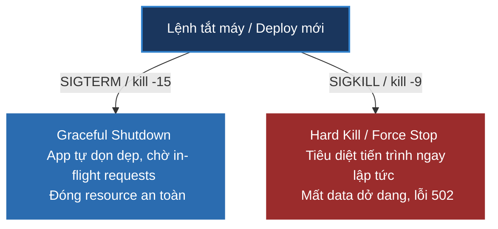

# Graceful Shutdown là gì? Cách cấu hình trong Spring Boot và Kubernetes

## ⚡ Tóm tắt ngắn (30s)
* **Graceful Shutdown (Tắt ứng dụng êm ái)** là quá trình dừng một dịch vụ đang hoạt động một cách có trật tự, đảm bảo **không làm gián đoạn hoặc lỗi** các yêu cầu (requests) của người dùng hiện tại đang xử lý dở dang (in-flight requests).
* **Quy trình chuẩn**:
  1. Nhận tín hiệu tắt máy (**`SIGTERM`**) từ hệ điều hành hoặc Kubernetes.
  2. Từ chối nhận thêm các request mới (ngắt route trên API Gateway / Load Balancer).
  3. Duy trì hoạt động trong một khoảng thời gian chờ (**Grace Period**) để hoàn thành nốt các luồng thanh toán, xử lý file hoặc db query hiện tại.
  4. Đóng các tài nguyên kết nối: DB Connection Pool, Message Consumers (Kafka/RabbitMQ), hủy đăng ký Service Discovery (Consul/Eureka).
  5. Tắt máy hoàn toàn.
* Nếu tắt cứng đột ngột (**Hard Kill / `SIGKILL`** hoặc `kill -9`), người dùng sẽ ngay lập tức nhận lỗi 502 Bad Gateway và dữ liệu giao dịch dở dang có nguy cơ bị mất hoặc sai lệch.

---

## 🔍 Chi tiết bản chất thực chiến

### 1. SIGTERM vs SIGKILL trong Hệ điều hành



* **`SIGTERM` (Signal 15 - Termination)**: Là lời yêu cầu lịch sự gửi tới ứng dụng: *"Tôi chuẩn bị tắt bạn, hãy tự dọn dẹp và đóng các công việc dở dang đi"*. Ứng dụng có thể bắt tín hiệu này để khởi chạy quy trình Graceful Shutdown.
* **`SIGKILL` (Signal 9 - Kill)**: Là lệnh cưỡng chế tiêu diệt tiến trình ngay lập tức từ Kernel của Hệ điều hành. Ứng dụng bị sập nguồn ngay tức thì, không có cơ hội đóng các transaction hay file đang ghi.

---

## 💻 Cấu hình Graceful Shutdown trong Spring Boot & Kubernetes

Kể từ Spring Boot 2.3+, tính năng Graceful Shutdown đã được tích hợp sẵn cho cả Web Server nhúng (Tomcat, Jetty, Netty, Undertow).

### 1. Cấu hình Spring Boot qua file `application.yml`
```yaml
server:
  shutdown: graceful # ✅ Kích hoạt Graceful Shutdown (Mặc định là "immediate" - tắt ngay lập tức)

spring:
  lifecycle:
    timeout-per-shutdown-phase: 30s # ✅ Thời gian chờ tối đa cho các request in-flight hoàn thành nốt. Quá 30s sẽ bị force kill.
```

### 2. Viết Code Java lắng nghe sự kiện đóng ứng dụng để dọn dẹp các Thread chạy nền (Background Tasks)
```java
import org.springframework.context.ApplicationListener;
import org.springframework.context.event.ContextClosedEvent;
import org.springframework.stereotype.Component;

@Component
public class GracefulShutdownListener implements ApplicationListener<ContextClosedEvent> {

    @Override
    public void onApplicationEvent(ContextClosedEvent event) {
        // ✅ Sự kiện kích hoạt khi Spring Context nhận tín hiệu SIGTERM chuẩn bị tắt máy
        System.out.println("SIGTERM received. Starting custom cleanup tasks...");
        
        // Thực hiện đóng các background thread pools, hủy queue listeners thủ công nếu cần
        stopBackgroundProcessingThreads();
        
        System.out.println("Custom cleanup finished. Spring Context can now close.");
    }

    private void stopBackgroundProcessingThreads() {
        // Logic shutdown Executor Service...
    }
}
```

### 3. Cấu hình file YAML Kubernetes Deployment chuẩn thực chiến
Khi deploy bản mới, Kubernetes sẽ gửi tín hiệu `SIGTERM` tới Pod cũ. Mặc định Kubernetes chờ tối đa 30 giây (`terminationGracePeriodSeconds`) trước khi gửi tiếp lệnh cưỡng chế `SIGKILL`.

```yaml
apiVersion: apps/v1
kind: Deployment
metadata:
  name: order-service
spec:
  template:
    spec:
      # ✅ Thời gian chờ của Kubernetes phải lớn hơn hoặc bằng thời gian chờ của Spring Boot
      terminationGracePeriodSeconds: 45 
      
      containers:
        - name: order-service
          image: order-service:v1.0
          
          # ⚠️ TRÁNH LỖI TRỄ ĐỒNG BỘ: Sử dụng preStop hook ngủ 10s trước khi gửi SIGTERM
          lifecycle:
            preStop:
              exec:
                command: ["/bin/sh", "-c", "sleep 10"]
```

---

## 📊 So sánh Graceful Shutdown vs Hard Shutdown

| Tiêu chí | Graceful Shutdown (SIGTERM) | Hard Shutdown (SIGKILL) |
| :--- | :--- | :--- |
| **Tính an toàn dữ liệu**| Tuyệt đối an toàn, các transaction hoàn tất | Rất nguy hiểm, có nguy cơ gây sai lệch DB |
| **Trải nghiệm người dùng**| Zero-downtime, không có request bị lỗi | Người dùng nhận lỗi 502/504 lúc deploy |
| **Mức tiêu thụ thời gian**| Chờ đợi tối đa bằng Grace Period timeout | Tắt máy lập tức tức thời |
| **Độ trễ I/O & Network**| Đóng có trật tự các port và connections | Ngắt kết nối thô bạo đột ngột |

---

## ⚠️ Common Gotchas & Questions follow-up

### 1. "Tại sao dù đã bật Graceful Shutdown trong Spring Boot, người dùng vẫn thỉnh thoảng nhận lỗi 502 Bad Gateway khi deploy bản mới trên Kubernetes?"
* **Vấn đề trễ đồng bộ của Kubernetes Service (Race Condition)**:
  1. Khi bạn bắt đầu deploy bản mới, Kubernetes Control Plane chuyển trạng thái Pod cũ sang `Terminating`.
  2. Đồng thời, nó gửi tín hiệu `SIGTERM` tới Pod cũ. Spring Boot lập tức dừng Web Server Tomcat và ngắt kết nối.
  3. **Tuy nhiên**: Quá trình cập nhật danh sách IP (Endpoint) của Service và đồng bộ bảng định tuyến `iptables/ipvs` trên các node mạng của Kubernetes mất khoảng **1 - 3 giây**.
  4. Trong 3 giây trễ đó, Gateway vẫn tiếp tục gửi các request mới của người dùng tới IP của Pod cũ đã tắt Tomcat. Kết quả: Khách hàng nhận lỗi **502 Bad Gateway**.
* **Giải pháp thực chiến: Sử dụng `preStop` hook**:
  * Cấu hình lệnh `sleep 10` trong `preStop` hook của Kubernetes Deployment (như file YAML mẫu ở trên).
  * Khi bắt đầu tắt, Kubernetes sẽ chạy lệnh `sleep 10` này trước. Pod cũ vẫn mở cổng và xử lý bình thường.
  * Trong 10 giây ngủ đó, Kubernetes có dư dả thời gian để đồng bộ và gỡ bỏ hoàn toàn IP của Pod cũ ra khỏi Load Balancer. Không có request mới nào gửi tới nữa.
  * Hết 10 giây ngủ, Kubernetes mới gửi tín hiệu `SIGTERM` thực tế để Pod cũ tự dọn dẹp các request cũ còn lại và tắt máy an toàn. Đây là bí quyết sống còn để đạt **Zero-Downtime Deployment**!

### 2. "Thời gian chờ Grace Period nên đặt bao nhiêu là hợp lý?"
* **Quy tắc**: Phụ thuộc vào đặc thù nghiệp vụ dài nhất của ứng dụng:
  * Nếu ứng dụng chỉ xử lý các request HTTP ngắn thông thường (< 500ms): Chỉ cần đặt Grace Period **10 - 15 giây** là quá đủ.
  * Nếu ứng dụng có các API đặc thù xử lý nặng như upload file lớn, render PDF, thanh toán qua cổng 3rd party trung gian mất nhiều thời gian: Cần cấu hình Grace Period lớn hơn thời gian chạy lớn nhất của API đó (ví dụ **30 - 60 giây**) để đảm bảo an toàn.
  * Luôn đảm bảo: `terminationGracePeriodSeconds (K8s)` >= `timeout-per-shutdown-phase (Spring Boot) + 10s (preStop sleep)`.
