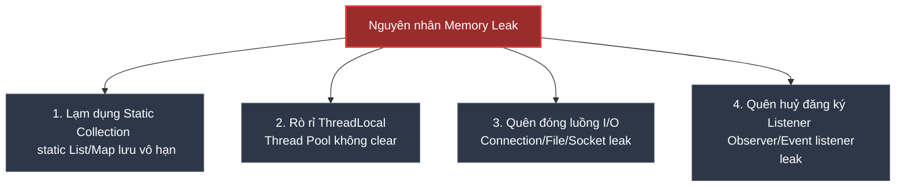

# Làm sao debug Memory Leak trên Production? Quy trình xử lý thực tế

## ⚡ Tóm tắt ngắn (30s)
* **Memory Leak (Rò rỉ bộ nhớ)** trong Java xảy ra khi các đối tượng không còn được ứng dụng sử dụng nữa nhưng **Garbage Collector (GC) không thể giải phóng** chúng do vẫn còn các liên kết tham chiếu mạnh (**Strong References**) trỏ tới từ các GC Roots (như biến static, luồng chạy nền, ThreadLocal).
* **Triệu chứng**: Bộ nhớ Heap tăng dần theo thời gian (biểu đồ răng cưa đi lên), tần suất Full GC tăng vọt, API phản hồi siêu chậm và cuối cùng sập ứng dụng với lỗi **`java.lang.OutOfMemoryError: Java heap space`**.
* **Quy trình xử lý thực chiến 4 bước**:
  1. **Tự động xuất dữ liệu**: Cấu hình JVM flag để tự động xuất **Heap Dump** khi crash (`-XX:+HeapDumpOnOutOfMemoryError`).
  2. **Trích xuất chủ động**: Dùng lệnh `jcmd` hoặc `jmap` để dump bộ nhớ của Pod đang bị rò rỉ trước khi nó sập.
  3. **Phân tích (Analysis)**: Sử dụng **Eclipse Memory Analyzer (MAT)** hoặc **JProfiler** để mở file Heap Dump, phân tích phần "Leak Suspects" để tìm ra class/đối tượng chiếm RAM nhiều nhất và lần vết ngược về GC Roots.
  4. **Sửa lỗi**: Khắc phục code nghiệp vụ (xóa static map vô hạn, giải phóng ThreadLocal, đóng luồng I/O).

---

## 🔍 Chi tiết bản chất thực chiến

### 1. Nguyên nhân gây rò rỉ bộ nhớ phổ biến trong Java



* **Lạm dụng biến `static`**: Vòng đời của biến `static` gắn liền với vòng đời của ClassLoader (tồn tại vĩnh viễn đến khi tắt server). Nếu lưu dữ liệu vào `static List` hoặc `static Map` mà không dọn dẹp hoặc không giới hạn kích thước, GC sẽ không bao giờ được phép thu dọn các object bên trong.
* **Rò rỉ ThreadLocal trong Thread Pool**:
  * Các Web Server nhúng (như Tomcat) tái sử dụng lại các Thread trong Thread Pool.
  * Nếu ta đưa dữ liệu vào `ThreadLocal` nhưng khi kết thúc request **không gọi phương thức `.remove()`**, dữ liệu đó sẽ bị treo cứng ở thread đó vĩnh viễn, chiếm giữ RAM vô ích.
* **Quên đóng tài nguyên (Unclosed resources)**: Quên đóng JDBC Connection, Socket, File InputStream, hoặc Database Cursor.

---

## 💻 Code thực chiến: Minh họa lỗi rò rỉ bộ nhớ và cách khắc phục

### ❌ BAD (Rò rỉ bộ nhớ qua biến static map và quên đóng stream)
```java
@Service
public class BadCacheService {
    // ❌ BAD: Biến static Map lưu trữ thông tin session người dùng vô hạn, không có cơ chế tự xoá (TTL)
    private static final Map<String, UserSession> sessionCache = new HashMap<>();

    public void cacheSession(String userId, UserSession session) {
        sessionCache.put(userId, session); // Trực tiếp đưa vào map -> Rò rỉ RAM!
    }

    public void processFile(String filePath) throws IOException {
        // ❌ BAD: Không đóng InputStream nếu xảy ra exception -> Rò rỉ file descriptor & RAM
        FileInputStream fis = new FileInputStream(filePath);
        int data = fis.read();
        while(data != -1) {
            // Xử lý...
            data = fis.read();
        }
    }
}
```

---

### ✅ GOOD (Sử dụng Cache có giới hạn & Auto-Closeable Resource)
```java
import com.github.benmanes.caffeine.cache.Cache;
import com.github.benmanes.caffeine.cache.Caffeine;
import java.util.concurrent.TimeUnit;

@Service
public class GoodCacheService {
    
    // ✅ GOOD: Sử dụng thư viện chuyên dụng Caffeine Cache
    // Tự động giải phóng bộ nhớ bằng cách đặt giới hạn 10,000 items và tự động xóa sau 30 phút idle
    private final Cache<String, UserSession> sessionCache = Caffeine.newBuilder()
            .maximumSize(10000)
            .expireAfterAccess(30, TimeUnit.MINUTES)
            .build();

    public void cacheSession(String userId, UserSession session) {
        sessionCache.put(userId, session);
    }

    public void processFile(String filePath) {
        // ✅ GOOD: Sử dụng cú pháp try-with-resources
        // Java sẽ tự động gọi method .close() cho FileInputStream ngay cả khi xảy ra exception
        try (FileInputStream fis = new FileInputStream(filePath)) {
            int data = fis.read();
            while(data != -1) {
                // Xử lý...
                data = fis.read();
            }
        } catch (IOException e) {
            log.error("Failed to read file", e);
        }
    }
}
```

---

## 📊 Quy trình 4 bước khắc phục sự cố Memory Leak trên Production

### Bước 1: Cấu hình JVM Flags bắt buộc cho Production
Đảm bảo khi ứng dụng bị sập vì hết bộ nhớ (OOM), JVM sẽ tự động ghi lại toàn bộ trạng thái RAM ra file Heap Dump:
```bash
-XX:+HeapDumpOnOutOfMemoryError \
-XX:HeapDumpPath=/var/log/dumps/java_oom.hprof
```

### Bước 2: Trích xuất chủ động Heap Dump từ Pod bị lỗi
Nếu thấy bộ nhớ RAM của Pod tăng liên tục vượt quá 85%, ta tiến hành cô lập Pod đó khỏi Service Load Balancer để tránh nhận thêm request mới của người dùng (tránh ảnh hưởng hệ thống), sau đó truy cập vào container chạy câu lệnh:
```bash
# Lấy Process ID (PID) của ứng dụng Java
jps

# Xuất Heap Dump ra file (.hprof)
jcmd <PID> GC.heap_dump /var/log/dumps/app_leak.hprof
```

### Bước 3: Phân tích bằng Eclipse Memory Analyzer (MAT)
1. Tải file `app_leak.hprof` về máy local.
2. Mở file bằng công cụ miễn phí **Eclipse MAT**.
3. Chạy báo cáo **"Leak Suspects Report"**.
4. MAT sẽ tự động hiển thị sơ đồ hình bánh (Pie Chart) chỉ ra chính xác class nào đang chiếm % RAM lớn nhất.
5. Click chuột phải vào class đó -> Chọn **Path to GC Roots** -> **Exclude weak/soft references** để tìm ra chính xác dòng code nào đang giữ tham chiếu mạnh (Strong reference) không cho GC dọn dẹp.

---

## ⚠️ Common Gotchas & Questions follow-up

### 1. "Rủi ro khi xuất Heap Dump một ứng dụng RAM lớn (ví dụ 16GB - 32GB) trực tiếp trên Production?"
* **Rủi ro cực lớn - Stop-The-World**: Khi chạy lệnh xuất heap dump (`jmap` hoặc `jcmd`), JVM bắt buộc phải đóng băng (suspend) toàn bộ các luồng ứng dụng đang hoạt động để chụp ảnh nhanh trạng thái bộ nhớ một cách nhất quán.
* Quá trình ghi 16GB dữ liệu RAM ra đĩa cứng IOPS thấp có thể mất từ **30 giây đến vài phút**. Trong suốt thời gian này, ứng dụng hoàn toàn bị đơ cứng, không thể xử lý bất kỳ request nào.
* **Cách xử lý an toàn**:
  1. Nếu chạy trên Kubernetes: Sử dụng Readiness Probe chuyển trạng thái Pod bị nghi rò rỉ sang `OutOfService` để gỡ bỏ nó khỏi Load Balancer. Không cho Pod nhận traffic nữa.
  2. Thực hiện chạy lệnh dump bộ nhớ an toàn.
  3. Hoặc đơn giản là cấu hình restart Pod, còn việc phân tích OOM sẽ dựa trên file dump tự động sinh khi crash đã được đẩy về ổ đĩa Mount từ trước.

### 2. "Sự khác biệt giữa Memory Leak và OutOfMemoryError thông thường?"
* **Memory Leak**: RAM tăng dần chậm rãi theo thời gian, dù tải (traffic) giảm xuống nhưng RAM vẫn không chịu hạ.
* **OutOfMemoryError thông thường**: Xảy ra tức thời khi hệ thống bị quá tải đột biến (Spike) khiến lượng đối tượng sinh ra tức thời vượt quá giới hạn RAM cho phép (ví dụ: một câu query lấy lên 1 triệu dòng dữ liệu từ DB vào RAM cùng một lúc). Sau khi app crash hoặc sau khi request kết thúc, RAM sẽ hạ lại bình thường. Trường hợp này khắc phục bằng cách phân trang dữ liệu (Pagination) hoặc tăng kích thước Heap `-Xmx` chứ không phải sửa lỗi rò rỉ.
