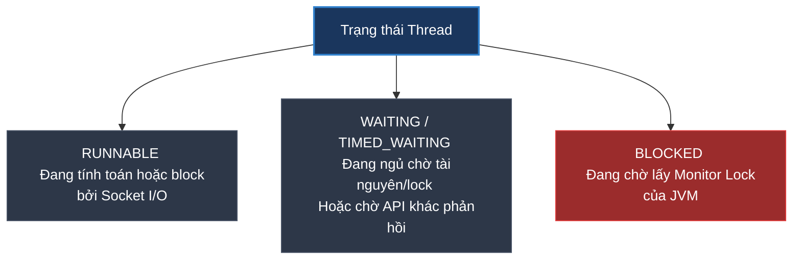

# Làm sao debug Thread Pool Exhaustion trên Production?

## ⚡ Tóm tắt ngắn (30s)
* **Thread Pool Exhaustion (Cạn kiệt luồng)** xảy ra khi tất cả các luồng xử lý (Active Threads) trong Thread Pool (ví dụ: Tomcat Web Server Threads, Spring `@Async` Executor) đều đang bận rộn và hàng đợi (Task Queue) đã bị lấp đầy hoàn toàn.
* **Triệu chứng**: 
  1. API bị treo đơ vĩnh viễn, người dùng gặp lỗi **`504 Gateway Timeout`** hoặc **`503 Service Unavailable`**.
  2. Log xuất hiện ngoại lệ: **`java.util.concurrent.RejectedExecutionException`** hoặc cảnh báo từ Tomcat: **`Executor [http-nio-8080] was rejected...`**.
  3. CPU của máy chủ có thể cực thấp (do các thread đang bị block chờ I/O) hoặc cực cao (do có luồng bị vòng lặp vô hạn).
* **Quy trình xử lý thực chiến**:
  1. **Trích xuất tức thời**: Chạy lệnh `jstack` hoặc `jcmd` để xuất **Thread Dump** ngay khi hệ thống đang bị đơ cứng.
  2. **Phân tích (Analysis)**: Sử dụng công cụ online **FastThread.io** hoặc **TDA** để mở file Thread Dump.
  3. Lọc tìm các luồng có trạng thái **`BLOCKED`** hoặc **`TIMED_WAITING`** để chỉ ra chính xác dòng code nghiệp vụ nào đang bắt các luồng phải xếp hàng chờ đợi vô hạn.

---

## 🔍 Chi tiết bản chất thực chiến

### 1. Phân biệt các trạng thái luồng cốt lõi trong Thread Dump



* **`RUNNABLE`**: Luồng đang thực thi mã máy. 
  * *Lưu ý nguy hiểm*: Trong Java, khi luồng đang chờ dữ liệu gửi về từ ổ cứng hoặc từ mạng (Socket Read I/O), hệ điều hành coi là block I/O nhưng JVM vẫn đánh dấu trạng thái luồng là `RUNNABLE`.
* **`WAITING` / `TIMED_WAITING`**: Luồng đang chờ đợi một sự kiện từ luồng khác (ví dụ gọi `Object.wait()`, `Thread.sleep()`, hoặc đang xếp hàng chờ lấy Connection từ Database Connection Pool).
* **`BLOCKED`**: Luồng đang chờ để đi vào một khối code được đồng bộ hóa (`synchronized` block) do một luồng khác đang chiếm giữ khoá (Lock).

---

## 💻 Code thực chiến: Nguyên nhân cạn kiệt luồng và cách khắc phục

### ❌ BAD (Gọi API bên thứ ba không cấu hình Timeout)
Nếu API của bên thứ ba bị treo đơ không phản hồi, và ta gọi nó bằng RestTemplate mặc định (không cấu hình timeout), luồng gọi đó sẽ bị treo đợi vô hạn (`WAITING`). Hàng trăm request tiếp theo ập vào sẽ chiếm dụng sạch các luồng còn lại của Tomcat, gây cạn kiệt luồng toàn hệ thống.

```java
@Service
public class BadPaymentService {
    
    // ❌ BAD: RestTemplate mặc định không có timeout (Timeout = vô hạn)
    private final RestTemplate restTemplate = new RestTemplate();

    public PaymentResponse pay(PaymentRequest req) {
        // Nếu API bank-api.com bị treo, thread này sẽ bị treo cứng ở đây vĩnh viễn!
        String url = "https://bank-api.com/charge";
        return restTemplate.postForObject(url, req, PaymentResponse.class);
    }
}
```

---

### ✅ GOOD (Thiết lập Timeout chặt chẽ & Cấu hình ThreadPoolExecutor an toàn)

#### 1. Luôn cấu hình Timeout rõ ràng cho mọi Client kết nối ra ngoài:
```java
@Configuration
public class RestClientConfig {

    @Bean
    public RestTemplate restTemplate(RestTemplateBuilder builder) {
        return builder
                .setConnectTimeout(Duration.ofSeconds(3)) // ✅ GOOD: Hủy kết nối nếu quá 3 giây không connect được
                .setReadTimeout(Duration.ofSeconds(5))    // ✅ GOOD: Hủy kết nối nếu quá 5 giây không có dữ liệu trả về
                .build();
    }
}
```

#### 2. Cấu hình giới hạn Thread Pool an toàn cho các tác vụ nền:
Tránh dùng `Executors.newCachedThreadPool()` vì nó tạo luồng vô hạn làm sập RAM. Luôn dùng `ThreadPoolExecutor` có cấu hình hàng đợi giới hạn (**Bounded Queue**):

```java
@Configuration
@EnableAsync
public class AsyncConfig {

    @Bean(name = "backgroundTaskExecutor")
    public Executor taskExecutor() {
        ThreadPoolTaskExecutor executor = new ThreadPoolTaskExecutor();
        executor.setCorePoolSize(10);     // Số luồng tối thiểu duy trì
        executor.setMaxPoolSize(50);      // Số luồng tối đa cho phép
        executor.setQueueCapacity(500);   // Hàng đợi có giới hạn
        executor.setThreadNamePrefix("bg-task-");
        
        // ✅ Xử lý khi quá tải Thread & Queue đã đầy: Ném lỗi RejectedExecutionException ngay lập tức
        // để hệ thống kích hoạt Rate Limit / Fallback, tránh làm treo ứng dụng
        executor.setRejectedExecutionHandler(new ThreadPoolExecutor.AbortPolicy());
        
        executor.initialize();
        return executor;
    }
}
```

---

## 📊 Quy trình debug Thread Pool Exhaustion trên Production

### Bước 1: Trích xuất Thread Dump tức thời
Ngay khi hệ thống có dấu hiệu đơ cứng hoặc ngập tràn lỗi timeout, truy cập vào Kubernetes Pod và chạy lệnh:
```bash
# jps để tìm Process ID (PID)
jps

# Xuất dữ liệu Thread Dump ra file text
jcmd <PID> Thread.print > /tmp/thread_dump.txt
```

### Bước 2: Phân tích file Thread Dump
Mở file `thread_dump.txt`, bạn sẽ thấy các block thông tin luồng dạng:
```text
"http-nio-8080-exec-15" #42 daemon prio=5 os_prio=0 cpu=12.45ms elapsed=420s tid=0x00007fba98001000 nid=0x21a4 waiting on condition  [0x00007fba50d12000]
   java.lang.Thread.State: TIMED_WAITING (parking)
        at sun.misc.Unsafe.park(Native Method)
        ...
        at com.zaxxer.hikari.pool.HikariPool.getConnection(HikariPool.java:169) <-- 🛑 THỦ PHẠM: Thread đang bị treo chờ lấy kết nối DB từ Hikari Connection Pool!
```

* **Nếu thấy hàng trăm luồng đều ở trạng thái `TIMED_WAITING` tại `HikariPool.getConnection`**: Database đang quá tải hoặc connection pool bị rò rỉ (không close connection đúng cách).
* **Nếu thấy hàng trăm luồng ở trạng thái `RUNNABLE` tại `socketRead0`**: Ứng dụng đang gọi API bên ngoài nhưng bị treo mạng mà không có Timeout.

---

## ⚠️ Common Gotchas & Questions follow-up

### 1. "Sự khác biệt giữa Tomcat Thread Pool và Spring `@Async` Thread Pool?"
* **Tomcat Thread Pool**:
  * **Nhiệm vụ**: Chuyên xử lý các request HTTP đồng thời từ client gửi tới. Mặc định Tomcat cấu hình tối đa **200 threads**.
  * **Nguy hiểm**: Nếu cạn kiệt pool này, server lập tức từ chối nhận request mới (người dùng bị lỗi connection refused hoặc timeout trắng trang).
* **Spring `@Async` Thread Pool**:
  * **Nhiệm vụ**: Chuyên chạy các tác vụ nền bất đồng bộ (ví dụ gửi mail, xuất file).
  * **Nguy hiểm**: Nếu không cấu hình giới hạn (mặc định Spring dùng `SimpleAsyncTaskExecutor` - tự động tạo luồng mới cho mỗi task), nó sẽ sinh ra hàng ngàn luồng đồng thời gây sập RAM hệ thống (**OutOfMemoryError: unable to create new native thread**).

### 2. "Làm sao để monitor sớm hiện tượng cạn kiệt luồng trước khi nó xảy ra?"
* Luôn theo dõi các metric sau trên Grafana Dashboard:
  * `tomcat_threads_active_threads`: Số luồng Tomcat đang bận rộn xử lý.
  * `tomcat_threads_config_max_threads`: Số luồng tối đa của Tomcat (thường là 200).
* **Thiết lập Alert**: Cảnh báo kích hoạt nếu `active_threads / max_threads > 80%` liên tục trong 3 phút. Điều này giúp dev có thời gian vào can thiệp trước khi pool bị cạn kiệt hoàn toàn và sập dịch vụ.
