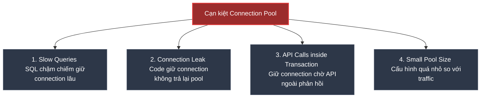

# Làm sao xử lý Database Connection Pool Exhausted trên Production?

## ⚡ Tóm tắt ngắn (30s)
* **Database Connection Pool Exhausted (Cạn kiệt kết nối DB)** xảy ra khi toàn bộ số lượng kết nối vật lý mở sẵn trong pool (ví dụ: HikariCP) đều đang bị chiếm dụng bởi các luồng xử lý khác, khiến các yêu cầu (requests) mới phải xếp hàng chờ đợi cho đến khi quá thời gian chờ và sập API.
* **Triệu chứng**: 
  1. API bị đơ, treo phản hồi đột ngột.
  2. Log tràn ngập ngoại lệ nghiêm trọng: **`SQLTransientConnectionException: Connection is not available, request timed out after 30000ms.`**
* **Quy trình xử lý khẩn cấp (Hot-fix)**:
  1. Tăng tạm thời kích thước pool tối đa (`maximum-pool-size`) qua cấu hình config.
  2. Truy cập Database, kiểm tra và **Kill ngay các câu lệnh SQL bị treo** hoặc đang gây khoá bảng (**DB Locks**).
  3. Khởi động lại (Restart) các Pod ứng dụng để giải phóng toàn bộ kết nối rò rỉ.
* **Biện pháp lâu dài**: Tối ưu hóa truy vấn (Indexing), tách biệt Network Calls (gọi API ngoài) ra khỏi Transaction (`@Transactional`), và cấu hình cơ chế tự động phát hiện rò rỉ kết nối (`leak-detection-threshold`).

---

## 🔍 Chi tiết bản chất thực chiến

### 1. Phân tích nguyên nhân cốt lõi gây cạn kiệt kết nối



* **Slow Queries (Truy vấn chậm)**: Một câu query bình thường chạy mất 5ms. Khi database bị phình to hoặc thiếu Index, câu query đó mất tới 5000ms (5 giây). Một kết nối bị giữ chân lâu gấp 1000 lần sẽ làm connection pool cạn kiệt chỉ trong vài giây.
* **API Calls inside Transaction (Lỗi thiết kế cực kỳ nguy hiểm)**: 
  * Khi bạn viết `@Transactional` bọc ngoài một phương thức chứa cả logic gọi sang dịch vụ bên thứ ba (như cổng thanh toán).
  * Luồng ứng dụng sẽ lấy 1 connection từ pool ngay khi bắt đầu vào phương thức. Connection này bị giữ chặt để duy trì transaction trong suốt thời gian hệ thống đợi cổng thanh toán phản hồi (mất vài giây). Điều này bóp nghẹt connection pool cực nhanh!

---

## 💻 Code thực chiến: Lỗi thiết kế giữ Connection và cách khắc phục

### ❌ BAD (Gọi API ngoài bên trong Transaction `@Transactional`)
```java
@Service
public class BadOrderService {

    private final OrderRepository orderRepository;
    private final PaymentClient paymentClient;

    @Transactional // ❌ BAD: Mở transaction và chiếm giữ DB Connection trong suốt thời gian gọi API ngoài
    public void processOrder(OrderRequest req) {
        Order order = orderRepository.save(new Order(req)); // Lấy DB Connection từ giây thứ 1

        // ❌ Gọi API ngân hàng qua mạng mất 5 giây. 
        // DB Connection bị giữ vô ích trong 5 giây này chỉ để chờ đợi!
        PaymentResponse res = paymentClient.callThirdPartyPayment(req.getAmount()); 

        if (res.isSuccess()) {
            order.setStatus(OrderStatus.PAID);
            orderRepository.save(order);
        }
    }
}
```

---

### ✅ GOOD (Tách biệt logic DB và Network Calls)
```java
@Service
public class GoodOrderService {

    private final OrderRepository orderRepository;
    private final PaymentClient paymentClient;
    private final OrderDbOperations orderDbOperations; // Helper class chứa các transactional methods nhỏ

    public void processOrder(OrderRequest req) {
        // ✅ 1. Lưu thông tin order thô vào DB (mở và đóng transaction cực nhanh trong ~10ms)
        Order order = orderDbOperations.saveInitialOrder(req); 

        // ✅ 2. Gọi API ngoài (Không chiếm giữ bất kỳ DB Connection nào)
        PaymentResponse res = paymentClient.callThirdPartyPayment(req.getAmount()); 

        // ✅ 3. Cập nhật trạng thái vào DB (mở và đóng transaction cực nhanh trong ~10ms)
        if (res.isSuccess()) {
            orderDbOperations.updateOrderStatus(order.getId(), OrderStatus.PAID);
        }
    }
}

@Component
class OrderDbOperations {
    private final OrderRepository orderRepository;

    public OrderDbOperations(OrderRepository orderRepository) {
        this.orderRepository = orderRepository;
    }

    @Transactional // ✅ Chỉ mở transaction trong phạm vi cực nhỏ xử lý DB thực sự
    public Order saveInitialOrder(OrderRequest req) {
        return orderRepository.save(new Order(req));
    }

    @Transactional // ✅ Chỉ mở transaction trong phạm vi cực nhỏ xử lý DB thực sự
    public void updateOrderStatus(Long orderId, OrderStatus status) {
        orderRepository.updateStatus(orderId, status);
    }
}
```

---

## 📊 Các thông số cấu hình HikariCP quan trọng cần Tuning

Khi cấu hình Spring Boot (`application.yml`), ta cần tối ưu các thông số sau của HikariCP:

| Tham số cấu hình | Ý nghĩa & Khuyên dùng |
| :--- | :--- |
| **`maximum-pool-size`** | Số lượng kết nối tối đa được mở tới DB. Mặc định là **10**. Tùy chỉnh dựa trên số core DB (thường để từ 20 - 50 là vừa phải). Đặt quá lớn sẽ làm sập RAM DB Server. |
| **`connection-timeout`**| Thời gian tối đa luồng ứng dụng xếp hàng chờ lấy connection từ pool. Mặc định là **30000ms** (30s). **Thực chiến**: Nên giảm xuống **3000ms - 5000ms** (3-5s). Thà trả lỗi nhanh (Fail-fast) còn hơn để luồng người dùng bị treo đơ xếp hàng làm sập cả Tomcat server. |
| **`idle-timeout`** | Thời gian tối đa một connection nhàn rỗi được phép tồn tại trong pool trước khi bị đóng giải phóng bộ nhớ. Khuyên dùng: **600000ms** (10 phút). |
| **`leak-detection-threshold`**| **Cực kỳ quan trọng**: Thời gian tối đa một luồng được phép giữ connection. Mặc định là 0 (Tắt). Khuyên dùng: **2000ms - 5000ms** (2-5s). Nếu bất kỳ thread nào giữ connection quá thời gian này, HikariCP sẽ lập tức in ra log kèm stack trace chỉ rõ dòng code nào đang bị rò rỉ kết nối! |

---

## ⚠️ Common Gotchas & Questions follow-up

### 1. "Open Session in View (OSIV) là gì? Tại sao nó gây cạn kiệt Connection Pool âm thầm?"
* **Cơ chế OSIV trong Spring Boot**: Mặc định Spring Boot bật cấu hình `spring.jpa.open-in-view=true`.
* **Tác hại**: 
  * OSIV giữ kết nối Database mở xuyên suốt từ lúc Request đi vào Controller cho đến khi render xong dữ liệu HTML/JSON trả về cho khách hàng (nhằm mục đích cho phép Lazy Loading dữ liệu ở tầng View).
  * Nếu tầng Controller hoặc View của bạn thực hiện các tác vụ chậm (ví dụ: chuyển đổi dữ liệu nặng, gọi API bên ngoài), kết nối DB vẫn bị chiếm dụng vô ích.
* **Giải pháp thực chiến**: Luôn luôn tắt cấu hình này trong file `application.yml` bằng câu lệnh:
  ```yaml
  spring:
    jpa:
      open-in-view: false # ✅ Tắt OSIV để giải phóng kết nối DB ngay khi rời khỏi tầng Service
  ```
  *(Lưu ý: Sau khi tắt, ta phải nạp sẵn các entity lazy bằng cú pháp `JOIN FETCH` hoặc DTO Projection để tránh lỗi `LazyInitializationException`)*.

### 2. "Công thức tính toán Kích thước Connection Pool tối ưu là gì?"
* **Sai lầm**: Nghĩ rằng tăng `maximum-pool-size` lên càng lớn (ví dụ 500) càng tốt. 
* **Thực tế**: Một CPU core của Database chỉ có thể xử lý được một câu truy vấn tại một thời điểm. Nếu bạn mở 500 kết nối vật lý gọi vào một Database Server chỉ có 8 Core CPU, hệ điều hành của DB Server sẽ phải liên tục chuyển ngữ cảnh giữa các luồng (context switching), làm tốc độ xử lý tổng thể chậm đi kinh khủng và làm tràn CPU DB.
* **Công thức kinh điển của PostgreSQL**:
  ```text
  Pool Size = ((Số core CPU của DB Server) * 2) + Số lượng ổ đĩa cứng (Spindle count)
  ```
  *Ví dụ*: DB Server có 8 core CPU, dùng ổ SSD. Kích thước pool tối ưu của 1 instance ứng dụng nên rơi vào khoảng `(8 * 2) + 1 = 17` kết nối.
