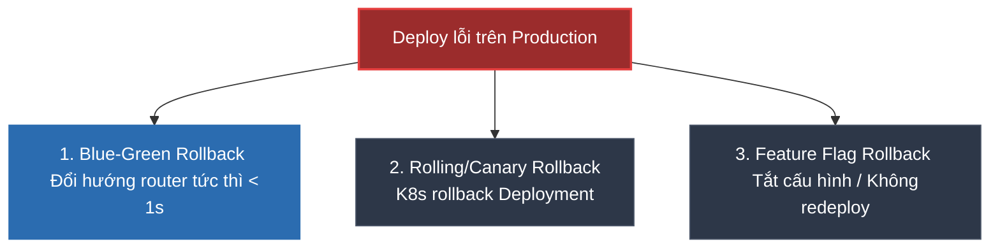

# Chiến lược Rollback an toàn khi Deploy lỗi trên Production

## ⚡ Tóm tắt ngắn (30s)
* **Rollback (Quay lui phiên bản)** là quy trình khôi phục hệ thống trở lại trạng thái hoạt động ổn định trước đó (phiên bản cũ N-1) khi phiên bản mới (N) vừa phát hiện có lỗi nghiêm trọng trên Production.
* **Nguyên tắc vàng**: Hệ thống phải luôn được thiết kế để **tương thích ngược (Backward Compatibility)** cả về Code lẫn cấu trúc Database (Database Schema) để có thể rollback bất kỳ lúc nào mà không gây sập hệ thống hay mất dữ liệu.
* **3 Chiến lược Rollback cốt lõi trong thực tế**:
  1. **Blue-Green Rollback**: Đổi hướng Router (Load Balancer) tức thì quay về cụm server cũ đang chạy song song. Tốc độ rollback nhanh nhất (< 1s), an toàn nhất.
  2. **Canary / Rolling Update Rollback**: Sử dụng Kubernetes để hủy bỏ đợt update và phục hồi lại trạng thái replica set cũ.
  3. **Feature Flag Rollback**: Tắt tính năng lỗi ngay lập tức trên dashboard cấu hình (ví dụ: LaunchDarkly, Unleash) mà không cần redeploy code hay restart server.

---

## 🔍 Chi tiết bản chất thực chiến



### 1. Phân tích chi tiết các chiến lược Rollback

#### A. Blue-Green Deployment Rollback
* **Cách hoạt động**: Ta có 2 cụm môi trường giống hệt nhau. Phiên bản cũ đang chạy ở cụm Blue. Phiên bản mới được deploy lên cụm Green. Router hướng 100% traffic sang cụm Green. Khi Green xảy ra lỗi, Router lập tức bẻ lái dòng traffic quay trở lại cụm Blue (vốn vẫn đang sống và chạy bình thường).
* **Đánh giá**: Cực kỳ nhanh và an toàn, nhưng tốn gấp đôi chi phí hạ tầng vì phải duy trì 2 cụm server chạy song song trong lúc deploy.

#### B. Kubernetes Rolling Update Rollback
* **Cách hoạt động**: Kubernetes cập nhật pod dần dần từng cái một. Khi phát hiện pod mới khởi động bị lỗi crash hoặc trả về lỗi qua readiness probe, Kubernetes dừng quá trình deploy lại và cho phép ta chạy lệnh phục hồi trạng thái Deployment trước đó.

#### C. Feature Flags Rollback (Đỉnh cao của CD)
* **Cách hoạt động**: Toàn bộ các code mới deploy đều được bọc trong các câu lệnh `if (featureFlags.isEnabled("new-feature"))`.
* **Đánh giá**: Khi tính năng mới gặp bug, Ops chỉ cần click "Turn Off" trên dashboard quản trị cấu hình. Luồng xử lý lập tức rẽ sang nhánh code cũ an toàn mà không cần chạm vào CI/CD pipeline hay restart container.

### 2. Thách thức lớn nhất: Database Migration Rollback
* **Vấn đề**: Code thì dễ rollback, nhưng Database thì không. Nếu bản deploy mới đã chạy câu lệnh `ALTER TABLE` đổi tên cột, việc rollback code cũ (vốn chỉ hiểu tên cột cũ) sẽ làm sập hệ thống ngay tức thì.
* **Giải pháp: Quy trình "Expand and Contract" (Mở rộng và Thu hẹp)**:
  * **Tuyệt đối không đổi tên cột trực tiếp**. Khi cần đổi tên cột `phone` thành `mobile_phone`, ta làm qua 4 bước ở các bản release độc lập:
    1. **Expand**: Thêm cột mới `mobile_phone` (cột `phone` cũ vẫn giữ nguyên).
    2. **Transition**: Code phiên bản mới sẽ ghi song song dữ liệu vào cả 2 cột. Viết script chạy ngầm copy data cũ sang cột mới.
    3. **Contract code**: Deploy code bản mới chỉ đọc ghi ở cột `mobile_phone`.
    4. **Contract DB**: Chạy lệnh xóa cột `phone` cũ ở đợt deploy sau cùng khi hệ thống đã ổn định hoàn toàn.
  * Việc này đảm bảo tại bất kỳ bước nào, nếu xảy ra lỗi, ta đều có thể rollback code về bản cũ mà DB vẫn tương thích hoàn hảo.

---

## 💻 Kịch bản thực chiến: Lệnh Rollback trong Kubernetes & Code Feature Flag

### 1. Câu lệnh Rollback khẩn cấp trong Kubernetes
Khi Rolling Update gặp lỗi, chạy lệnh sau để khôi phục nhanh về bản ổn định gần nhất:
```bash
# Xem lịch sử các lần deploy (revisions)
kubectl rollout history deployment/order-service

# Rollback khẩn cấp về bản ổn định liền trước (Revision N-1)
kubectl rollout undo deployment/order-service

# Hoặc rollback về một version cụ thể trong quá khứ
kubectl rollout undo deployment/order-service --to-revision=3
```

### 2. Code cấu hình Feature Flag động trong Spring Boot (Không cần restart)
Sử dụng Spring Cloud Config hoặc Unleash để thay đổi cấu hình logic runtime:

```java
import org.springframework.beans.factory.annotation.Value;
import org.springframework.cloud.context.config.annotation.RefreshScope;
import org.springframework.stereotype.Service;

@Service
@RefreshScope // ✅ Cực kỳ quan trọng: Cho phép Spring tự động nạp lại giá trị cấu hình mới mà không cần restart!
public class PromotionService {

    // Feature Flag lấy từ Config Server từ xa (mặc định là false)
    @Value("${features.new-discount-algorithm:false}")
    private boolean useNewAlgorithm;

    public double calculateDiscount(Order order) {
        if (useNewAlgorithm) {
            // ❌ Nhánh tính năng mới vừa deploy có khả năng bị lỗi tiềm ẩn
            try {
                return applyComplexNewDiscount(order);
            } catch (Exception e) {
                // Fallback an toàn phòng vệ nếu code mới bị crash
                return applyLegacyDiscount(order);
            }
        } else {
            // ✅ Nhánh cũ chạy ổn định suốt 2 năm qua
            return applyLegacyDiscount(order);
        }
    }

    private double applyLegacyDiscount(Order order) { return order.getAmount() * 0.9; }
    private double applyComplexNewDiscount(Order order) { return order.getAmount() * 0.85; }
}
```
* Khi tính năng mới gặp bug trên Production, ta chỉ cần vào Config Server đổi `features.new-discount-algorithm=false` và kích hoạt `/actuator/refresh`. Logic lập tức quay về luồng cũ an toàn trong 1 giây!

---

## 📊 Bảng so sánh 3 chiến lược Rollback

| Tiêu chí | Blue-Green Rollback | Canary / Rolling Rollback | Feature Flag Rollback |
| :--- | :--- | :--- | :--- |
| **Thời gian thực hiện** | **Tức thời** (< 1 giây) | Trung bình (1 - 5 phút) | **Tức thời** (< 1 giây) |
| **Ảnh hưởng người dùng** | Gần như 0% | Một lượng nhỏ bị ảnh hưởng | Gần như 0% |
| **Độ phức tạp hạ tầng** | Rất cao (yêu cầu 2 cụm 1-1) | Trung bình (K8s tự xử lý) | Thấp (chỉ cần config server) |
| **Mức độ an toàn** | Rất cao | Cao (chỉ ảnh hưởng ít pod) | Tuyệt đối an toàn |

---

## ⚠️ Common Gotchas & Questions follow-up

### 1. "Rollback vs Roll-Forward: Khi nào nên chọn cách nào?"
* **Rollback (Quay lui)**: Trả hệ thống về phiên bản cũ N-1.
  * **Khi nào dùng**: Khi phát hiện lỗi nghiêm trọng ảnh hưởng luồng core (ví dụ không thể thanh toán), lỗi hệ thống diện rộng, và ta chưa biết nguyên nhân lỗi là gì hoặc việc fix lỗi mất nhiều thời gian (> 30 phút). Mục tiêu hàng đầu là đưa hệ thống ổn định trở lại nhanh nhất có thể.
* **Roll-Forward (Tiến lên)**: Giữ nguyên bản lỗi N, nhanh chóng code bản vá nóng (Hot-fix) và deploy đè lên thành bản N+1.
  * **Khi nào dùng**: Khi lỗi ở mức độ nhẹ, không ảnh hưởng cốt lõi (ví dụ sai lệch text hiển thị, lỗi CSS), và việc sửa lỗi cực kỳ đơn giản, chỉ mất 5 phút để code và deploy.
  * **Chú ý**: Roll-Forward mang tính rủi ro cao vì việc vội vã viết code hot-fix dễ gây ra lỗi dây chuyền mới.

### 2. "Làm thế nào để cải thiện chỉ số MTTR (Mean Time To Recover)?"
* MTTR là thời gian trung bình để khôi phục hệ thống từ lúc phát sinh sự cố cho đến khi hệ thống ổn định trở lại.
* **Cách tối ưu**:
  * Tự động hóa hoàn toàn quy trình rollback bằng các kịch bản CI/CD một nút nhấn (One-click Rollback).
  * Viết sẵn các câu lệnh CLI rollback Kubernetes ra tài liệu khẩn cấp để On-call copy-paste chạy ngay mà không cần suy nghĩ.
  * Triển khai Feature Flags cho toàn bộ các thay đổi lớn để có thể bẻ luồng logic tức thời.
