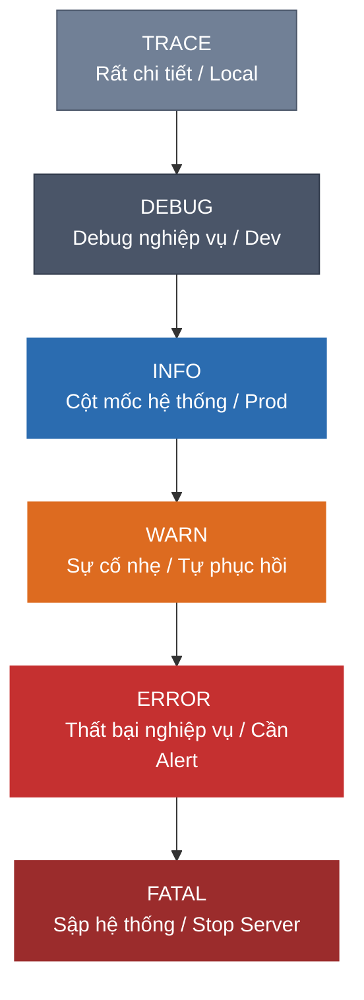

# Log Levels: Khi nào nên sử dụng TRACE, DEBUG, INFO, WARN, ERROR, và FATAL?

## ⚡ Tóm tắt ngắn (30s)
* Phân chia **Log Level (Mức độ ghi nhật ký)** giúp kiểm soát lượng log xuất ra (Log Volume), đảm bảo thông tin quan trọng không bị loãng và tối ưu hóa tài nguyên hệ thống.
* **TRACE / DEBUG**: Chỉ dùng cho lập trình viên tìm lỗi chi tiết ở môi trường Local/Development. Ghi log cực nhiều, **bắt buộc tắt ở Production**.
* **INFO**: Ghi lại các sự kiện cột mốc thành công của hệ thống (System Milestones). Bật mặc định ở Production.
* **WARN**: Các bất thường xảy ra nhưng hệ thống **vẫn xử lý được** và tự phục hồi (ví dụ: retry thành công, query chậm). Cần theo dõi nhưng không cần ứng cứu khẩn cấp.
* **ERROR**: Một nghiệp vụ cụ thể bị **thất bại hoàn toàn** (ví dụ: NullPointerException, DB Timeout, API bên thứ ba chết). Cần kích hoạt Cảnh báo (Alert) ứng cứu ngay.
* **FATAL**: Sự cố thảm họa cấp độ hệ thống khiến ứng dụng **ngưng hoạt động hoàn toàn** (ví dụ: Out of Memory, mất kết nối DB vĩnh viễn lúc boot).

---

## 🔍 Chi tiết bản chất thực chiến



### 1. Chi tiết định nghĩa và ngữ cảnh sử dụng thực tế

#### A. TRACE (Mức chi tiết nhất)
* **Ngữ cảnh**: Ghi lại chi tiết từng bước chạy nhỏ nhất của code, giá trị của các biến trong vòng lặp, các gói tin SQL thô.
* **Ví dụ**: `TRACE [http-8080-1] - UserSessionMap: Current session map size is 12051`

#### B. DEBUG (Mức tìm lỗi)
* **Ngữ cảnh**: Dành cho Dev điều tra lỗi nghiệp vụ. Mô tả chi tiết luồng xử lý: dữ liệu đầu vào là gì, kết quả trung gian ra sao.
* **Ví dụ**: `DEBUG [order-service] - Fetching product list for categoryId: 10, total products returned: 5`

#### C. INFO (Mức thông tin vận hành)
* **Ngữ cảnh**: Ghi lại các bước chuyển trạng thái quan trọng giúp quản trị viên hiểu được ứng dụng đang chạy ổn định. **Nguyên tắc**: Log INFO phải ngắn gọn, tần suất xuất hiện vừa phải.
* **Ví dụ**: `INFO  [main] - Application started successfully on port 8080`

#### D. WARN (Mức cảnh báo sớm)
* **Ngữ cảnh**: Có vấn đề không ổn xảy ra, nhưng hệ thống vẫn tự sửa đổi hoặc bỏ qua được mà không ảnh hưởng tới kết quả của người dùng.
* **Ví dụ**: `WARN  [client-3] - Third-party Payment API timeout on try 1, retrying...` (Retry lần 2 thành công nên user không bị lỗi).

#### E. ERROR (Mức lỗi nghiệp vụ)
* **Ngữ cảnh**: Lỗi xảy ra làm gián đoạn hoặc thất bại hoàn toàn hành động của người dùng. Cần phải đính kèm đầy đủ **Stack Trace** để điều tra nguyên nhân.
* **Ví dụ**: `ERROR [order-service] - NullPointerException while calculating discount for order ORD-123. Stack trace: ...`

#### F. FATAL (Mức thảm họa)
* **Ngữ cảnh**: Lỗi nghiêm trọng đến mức ứng dụng không thể tự khôi phục và phải dừng hoạt động ngay lập tức.
* **Ví dụ**: `FATAL [main] - java.lang.OutOfMemoryError: Java heap space. Terminating application.`

---

## 💻 Code thực chiến: Sử dụng Log Level chuẩn xác trong Spring Boot

### ❌ BAD (Sử dụng sai Log Level bừa bãi)
```java
@Service
public class BadUserService {
    private static final Logger log = LoggerFactory.getLogger(BadUserService.class);

    public User registerUser(UserDto dto) {
        // ❌ BAD: Dùng INFO để ghi thông tin quá chi tiết nhạy cảm (gây ô nhiễm log và lộ data)
        log.info("Registering user with email: {} and raw password: {}", dto.getEmail(), dto.getPassword());

        try {
            User user = saveToDb(dto);
            // ❌ BAD: Dùng ERROR cho trường hợp nghiệp vụ thông thường (Validate thất bại)
            if (user == null) {
                log.error("Validation failed: Email already exists!"); // Nên dùng WARN hoặc DEBUG
                throw new DuplicateEmailException("Email exists");
            }
            return user;
        } catch (Exception e) {
            // ❌ BAD: Log ERROR nhưng không in stack trace, không biết lỗi ở dòng nào
            log.error("Failed to save user: " + e.getMessage()); 
            throw e;
        }
    }
}
```

---

### ✅ GOOD (Viết log chuyên nghiệp, đúng ngữ cảnh và tối ưu hiệu năng)
```java
@Service
public class GoodUserService {
    private static final Logger log = LoggerFactory.getLogger(GoodUserService.class);

    public User registerUser(UserDto dto) {
        // ✅ Dùng DEBUG cho thông tin chi tiết phục vụ dev.
        // Sử dụng {} placeholder thay vì cộng chuỗi String để tránh cấp phát bộ nhớ vô ích nếu tắt log DEBUG.
        log.debug("Initiating registration for user email: {}", dto.getEmail());

        if (isEmailExist(dto.getEmail())) {
            // ✅ Dùng WARN cho lỗi logic nghiệp vụ do phía client hoặc thông thường
            log.warn("Registration rejected: Email already registered: {}", dto.getEmail());
            throw new DuplicateEmailException("Email exists");
        }

        try {
            User savedUser = dbRepository.save(new User(dto));
            
            // ✅ Dùng INFO cho cột mốc thành công quan trọng của hệ thống
            log.info("User registered successfully. UserId: {}", savedUser.getId());
            return savedUser;
        } catch (DataAccessException e) {
            // ✅ Dùng ERROR cho lỗi hạ tầng/hệ thống nghiêm trọng, bắt buộc đính kèm Exception thực tế (stack trace) ở tham số cuối cùng
            log.error("Database connection failure while registering user with email: {}", dto.getEmail(), e);
            throw new SystemException("Internal server error", e);
        }
    }
}
```

---

## 📊 So sánh các Log Level và môi trường khuyên dùng

| Log Level | Bật ở Dev | Bật ở Prod | Tần suất xuất hiện | Cần Alert ngay? | Hành động tiếp theo |
| :--- | :--- | :--- | :--- | :--- | :--- |
| **TRACE** | ✅ Có | ❌ Không | Cực kỳ nhiều | ❌ Không | Chỉ dùng khi dev debug cục bộ |
| **DEBUG** | ✅ Có | ❌ Không | Nhiều | ❌ Không | Tra cứu luồng xử lý chi tiết |
| **INFO** | ✅ Có | ✅ Có | Vừa phải | ❌ Không | Kiểm tra trạng thái hệ thống |
| **WARN** | ✅ Có | ✅ Có | Ít | ❌ Không | Rà soát log định kỳ hàng ngày |
| **ERROR** | ✅ Có | ✅ Có | Rất ít | ✅ **Có** | Gửi Alert tới Telegram/Slack cho On-call Dev |
| **FATAL** | ✅ Có | ✅ Có | Cực hiếm | ✅ **Khẩn cấp** | Khởi động lại service, cứu hộ hệ thống |

---

## ⚠️ Common Gotchas & Questions follow-up

### 1. "Log Level Pollution (Ô nhiễm log) là gì? Tác hại thế nào?"
* **Hiện tượng**:
  * Ghi quá nhiều log `INFO` chứa thông tin vụn vặt (như *"Bắt đầu chạy hàm X"*, *"Kết thúc hàm Y"*).
  * Ghi tràn lan log `ERROR` cho các lỗi bình thường (ví dụ: user nhập sai mật khẩu, validate form thất bại).
* **Tác hại**:
  * Khiến các log cảnh báo thực sự quan trọng bị chìm nghỉm giữa hàng triệu dòng log rác.
  * Gây tốn hàng chục Terabyte đĩa cứng và làm tăng chi phí lưu trữ trên Cloud.
  * Làm loãng hệ thống Alerting, khiến đội ngũ On-call bị chai lỳ cảm xúc với cảnh báo (Alert Fatigue).

### 2. "Làm sao thay đổi Log Level trên Production mà không cần restart server?"
* **Vấn đề**: Production đang bật log `INFO` để tiết kiệm tài nguyên. Đột nhiên hệ thống gặp một case lỗi ẩn kỳ lạ, ta cần xem log `DEBUG` để điều tra nhưng không muốn restart server (vì restart sẽ làm mất ngữ cảnh lỗi hoặc gián đoạn dịch vụ).
* **Giải pháp: Dynamic Log Level Tuning**:
  * **Sử dụng Spring Boot Actuator**:
    * Gửi request POST lên `/actuator/loggers/com.example.service` kèm payload:
      ```json
      {
        "configuredLevel": "DEBUG"
      }
      ```
    * Log level của package tương ứng sẽ đổi sang `DEBUG` ngay lập tức. Sau khi debug xong, ta có thể POST trả lại mức `INFO`.
  * **Sử dụng các APM Tool** (như Datadog, Dynatrace) có tích hợp sẵn tính năng cấu hình log level động từ giao diện quản trị.
