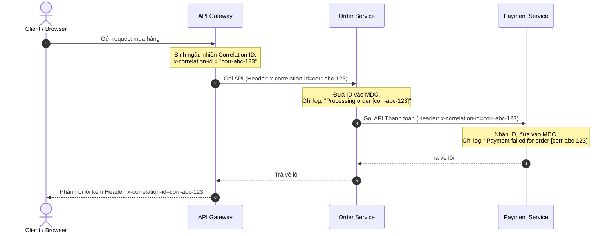

# Correlation ID dùng để làm gì? Cách thiết kế trong Microservices

## ⚡ Tóm tắt ngắn (30s)
* **Correlation ID (hoặc Request ID)** là một chuỗi định danh duy nhất (thường là UUID) được gán cho mỗi yêu cầu (request) ngay khi nó đi vào hệ thống (thường ở API Gateway).
* **Mục tiêu**: Liên kết (correlate) toàn bộ dữ liệu nhật ký (log) phân tán thuộc về cùng một yêu cầu duy nhất của người dùng trên tất cả các dịch vụ (microservices) khác nhau.
* **Cách thức**: Correlation ID được đính kèm vào **HTTP Headers** khi gọi API qua lại, nhúng vào **Message Headers** khi giao tiếp qua Broker (Kafka, RabbitMQ), và tự động đưa vào **Log MDC (Mapped Diagnostic Context)** của từng service để hiển thị trên file log.
* Giúp On-call Engineer debug sự cố chỉ trong 5 phút bằng cách tìm kiếm theo Correlation ID để xem toàn bộ hành trình đi và lỗi của request đó.

---

## 🔍 Chi tiết bản chất thực chiến

### 1. Vấn đề khi không có Correlation ID
Hãy tưởng tượng hệ thống microservices của bạn nhận được 10.000 requests mỗi giây. Khi một khách hàng báo lỗi giao dịch thanh toán thất bại:
* Log của `order-service`, `payment-service`, và `inventory-service` nằm phân tán ở các máy chủ khác nhau.
* Bạn không thể biết dòng log lỗi ở `payment-service` là do request cụ thể nào từ `order-service` gửi sang, vì hàng ngàn dòng log trôi qua cùng một lúc.
* Tìm kiếm theo `user_id` cũng rất khó nếu user đó thực hiện nhiều thao tác cùng lúc.

### 2. Giải pháp: Hành trình truyền tải Correlation ID



* Khi lỗi xảy ra, Client hoặc API Gateway sẽ trả về cho người dùng mã lỗi kèm theo Correlation ID.
* Người dùng gửi mã này cho đội CSKH -> Lập trình viên chỉ cần gõ cụm từ khóa `corr-abc-123` trên Elasticsearch/Kibana sẽ lập tức thấy toàn bộ hành trình đi qua 3 service trên và biết chính xác nguyên nhân lỗi ở Payment Service.

---

## 💻 Code thực chiến: Tự implement Correlation ID trong Spring Boot

Để thiết lập hệ thống Correlation ID tự động mà không làm bẩn code nghiệp vụ, ta cần 3 thành phần:
1. **Filter/Interceptor**: Nhận ID từ Gateway gửi sang (hoặc tự sinh nếu chưa có), đưa vào MDC.
2. **RestTemplate Customizer**: Tự động đính kèm ID vào Header khi gọi service downstream.
3. **MDC Clean**: Xóa ID khỏi thread sau khi request kết thúc.

### 1. Tạo Filter để chặn request đầu vào và nạp vào MDC
```java
import jakarta.servlet.*;
import jakarta.servlet.http.HttpServletRequest;
import jakarta.servlet.http.HttpServletResponse;
import org.slf4j.MDC;
import org.springframework.stereotype.Component;
import java.io.IOException;
import java.util.UUID;

@Component
public class CorrelationIdFilter implements Filter {

    private static final String CORRELATION_ID_HEADER = "X-Correlation-Id";
    private static final String MDC_KEY = "correlationId";

    @Override
    public void doFilter(ServletRequest request, ServletResponse response, FilterChain chain)
            throws IOException, ServletException {
        
        HttpServletRequest httpRequest = (HttpServletRequest) request;
        HttpServletResponse httpResponse = (HttpServletResponse) response;

        // 1. Lấy ID từ Header do Gateway hoặc Client gửi sang
        String correlationId = httpRequest.getHeader(CORRELATION_ID_HEADER);
        
        // 2. Nếu chưa có (ví dụ gọi trực tiếp không qua Gateway), tự sinh mới UUID
        if (correlationId == null || correlationId.isEmpty()) {
            correlationId = UUID.randomUUID().toString();
        }

        // 3. Đưa vào MDC của SLF4J để nhúng tự động vào mọi dòng log của luồng này
        MDC.put(MDC_KEY, correlationId);

        // 4. Trả ngược lại Header về Client để tiện đối chiếu khi báo lỗi
        httpResponse.setHeader(CORRELATION_ID_HEADER, correlationId);

        try {
            chain.doFilter(request, response);
        } finally {
            // ⚠️ Cực kỳ quan trọng: Phải clear MDC khi luồng kết thúc để tránh rò rỉ bộ nhớ trong Thread Pool!
            MDC.remove(MDC_KEY);
        }
    }
}
```

### 2. Tự động truyền Correlation ID sang Microservice tiếp theo (RestTemplate Interceptor)
```java
import org.slf4j.MDC;
import org.springframework.http.HttpRequest;
import org.springframework.http.client.*;
import java.io.IOException;

public class RestTemplateCorrelationInterceptor implements ClientHttpRequestInterceptor {

    private static final String CORRELATION_ID_HEADER = "X-Correlation-Id";
    private static final String MDC_KEY = "correlationId";

    @Override
    public ClientHttpResponse intercept(HttpRequest request, byte[] body, ClientHttpRequestExecution execution)
            throws IOException {
        
        // Lấy Correlation ID hiện tại của thread này ra khỏi MDC
        String correlationId = MDC.get(MDC_KEY);
        
        // Đính kèm ID vào Header của request chuẩn bị gọi đi downstream
        if (correlationId != null) {
            request.getHeaders().add(CORRELATION_ID_HEADER, correlationId);
        }
        
        return execution.execute(request, body);
    }
}

// Khi cấu hình RestTemplate Bean:
// restTemplate.setInterceptors(Collections.singletonList(new RestTemplateCorrelationInterceptor()));
```

### 3. Cấu hình định dạng Logback để in Correlation ID tự động
Trong file `logback.xml` hoặc `application.properties`, ta cấu hình in trường `%X{correlationId}`:
```properties
logging.pattern.level=%5p [correlationId\=%X{correlationId}]
# Output log sẽ tự động có dạng:
# INFO [correlationId=corr-abc-123] com.example.OrderService - Order processed!
```

---

## 📊 So sánh trước và sau khi có Correlation ID

| Tiêu chí | Khi chưa có Correlation ID | Khi đã cấu hình Correlation ID |
| :--- | :--- | :--- |
| **Thời gian tìm lỗi microservices** | Cực kỳ lâu (mất vài tiếng đến cả ngày) | Cực nhanh (chỉ mất 2 - 5 phút) |
| **Phương pháp tìm log** | Grep mò mẫm theo thời gian và User ID | Tìm kiếm chính xác 1 từ khóa Correlation ID duy nhất |
| **Sự liên kết thông tin** | Manh mún, không biết request nào gọi DB nào | Mạch lạc từ API Gateway -> Service A -> Service B -> DB |
| **Hỗ trợ CSKH (Customer Support)** | CSKH chỉ biết hệ thống lỗi, dev mò mẫm | Hệ thống trả mã Correlation ID trên UI, user copy gửi CSKH |

---

## ⚠️ Common Gotchas & Questions follow-up

### 1. "Sử dụng bất đồng bộ (Async / `@Async` / Thread Pool) làm mất Correlation ID, sửa thế nào?"
* **Vấn đề**: MDC sử dụng **`ThreadLocal`** để lưu giữ Correlation ID. Khi bạn gọi một phương thức bất đồng bộ sử dụng `@Async` hoặc tự submit một task vào `ExecutorService`, JVM sẽ tạo hoặc lấy một Thread mới từ Thread Pool. Thread mới này hoàn toàn không có dữ liệu MDC từ Thread cũ sang. Log của Thread con sẽ bị mất Correlation ID.
* **Giải pháp: Dùng TaskDecorator trong Spring**:
  * Định nghĩa một `TaskDecorator` để sao chép dữ liệu MDC từ Thread cha sang Thread con trước khi Thread con chạy:
  ```java
  public class MdcTaskDecorator implements TaskDecorator {
      @Override
      public Runnable decorate(Runnable runnable) {
          // Lấy MDC context của Thread cha hiện tại
          Map<String, String> contextMap = MDC.getCopyOfContextMap();
          return () -> {
              try {
                  // Thiết lập MDC context này cho Thread con mới nhận nhiệm vụ
                  if (contextMap != null) {
                      MDC.setContextMap(contextMap);
                  }
                  runnable.run();
              } finally {
                  MDC.clear();
              }
          };
      }
  }
  
  // Khi cấu hình ThreadPoolTaskExecutor Bean:
  // executor.setTaskDecorator(new MdcTaskDecorator());
  ```

### 2. "Tại sao nên dùng Spring Cloud Sleuth / Micrometer Tracing thay vì tự viết?"
* **Spring Cloud Sleuth** (Spring Boot 2.x) hoặc **Micrometer Tracing** (Spring Boot 3.x) là các thư viện chuẩn công nghiệp.
* Chúng tự động sinh và xử lý không chỉ **Correlation ID (Trace ID)** mà còn cả **Span ID** (định danh chi tiết bước xử lý cụ thể).
* Tự động tích hợp hoàn hảo với WebFlux (Reactive programming), Kafka, RabbitMQ, Feign Client, RestTemplate mà dev không cần viết bất kỳ dòng mã Interceptor thủ công nào.
* Kết nối trực tiếp và xuất dữ liệu sang các công cụ phân tán nổi tiếng như **Zipkin**, **Jaeger**, **OpenTelemetry**.
