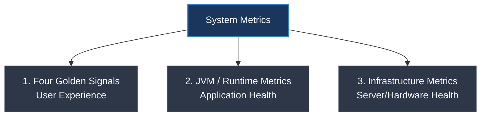

# Các Metrics quan trọng nhất để giám sát sức khỏe Backend Service

## ⚡ Tóm tắt ngắn (30s)
* Để giám sát sức khỏe của một Backend Service, chúng ta cần theo dõi 3 nhóm chỉ số (Metrics) cốt lõi:
  1. **The Four Golden Signals (4 Tín hiệu vàng)**: Đo lường trực tiếp trải nghiệm người dùng, gồm **Latency** (Độ trễ), **Traffic** (Lưu lượng/RPS), **Errors** (Tỉ lệ lỗi), và **Saturation** (Mức độ bão hòa tài nguyên).
  2. **JVM / Runtime Metrics (Dành riêng cho Java)**: Gồm bộ nhớ **Heap Memory**, thời gian dừng **Garbage Collection (GC pauses)**, trạng thái **Thread Pool** và **Database Connection Pool** (HikariCP).
  3. **Infrastructure Metrics (Hạ tầng)**: Gồm mức sử dụng **CPU**, **Memory**, **Disk I/O**, và **Network** của máy chủ vật lý hoặc container (Pod).
* Các metrics này được thu thập tự động qua Spring Boot Actuator + Micrometer và đẩy lên Prometheus/Grafana để vẽ Dashboard và cấu hình Cảnh báo (Alert).

---

## 🔍 Chi tiết bản chất thực chiến



### 1. The Four Golden Signals (Bốn tín hiệu vàng - Theo Google SRE)

* **Latency (Độ trễ)**: Thời gian để xử lý một yêu cầu. 
  * *Lưu ý*: **Không bao giờ dùng thời gian trung bình (Average)**. Bắt buộc phải dùng phân vị **Percentiles (p95, p99)**. p99 = 200ms có nghĩa là 99% số request phản hồi dưới 200ms, và chỉ có 1% request bị phản hồi chậm hơn 200ms.
* **Traffic (Lưu lượng)**: Đo lường mức độ cầu của hệ thống (ví dụ: số lượng HTTP Requests mỗi giây - RPS, số lượng giao dịch đồng thời).
* **Errors (Tỉ lệ lỗi)**: Tỉ lệ các yêu cầu bị thất bại (ví dụ: tỉ lệ HTTP status 5xx, lỗi timeout).
* **Saturation (Mức độ bão hòa)**: Đo lường mức độ "đầy" của tài nguyên hệ thống (ví dụ: hàng đợi Thread Pool đã đầy bao nhiêu %, bộ nhớ RAM còn trống bao nhiêu %).

### 2. JVM & Application Runtime Metrics (Thực chiến Java)

* **Garbage Collection (GC) Metrics**: 
  * Theo dõi tần suất và đặc biệt là **GC Pause Time (Thời gian dừng GC)**. Nếu xảy ra hiện tượng "Stop-the-world" quá lâu (> 1 giây), ứng dụng sẽ bị treo hoàn toàn, dẫn đến sập kết nối và Gateway báo lỗi 504 Gateway Timeout.
* **Database Connection Pool (HikariCP)**:
  * Theo dõi số lượng kết nối đang bận (`hikaricp_connections_active`) và số lượng request đang phải xếp hàng đợi lấy kết nối (`hikaricp_connections_pending`). Nếu `pending` tăng cao, có nghĩa là database đang bị nghẽn hoặc connection pool quá nhỏ.
* **Thread Pool Executor**:
  * Theo dõi số lượng active threads và queue size của Spring `@Async` hoặc Tomcat thread pool. Queue size tăng cao nghĩa là server đang quá tải, phản hồi sẽ bị chậm.

---

## 💻 Code thực chiến: Cấu hình và tạo Custom Metrics trong Spring Boot

Spring Boot Actuator và Micrometer tự động xuất ra hầu hết các metrics quan trọng trên. Tuy nhiên, trong thực tế ta thường cần tạo thêm các **Custom Business Metrics** (ví dụ: đếm số đơn hàng thanh toán thành công, trị giá đơn hàng).

### 1. Thêm Actuator & Prometheus Dependency (Maven)
```xml
<dependency>
    <groupId>org.springframework.boot</groupId>
    <artifactId>spring-boot-starter-actuator</artifactId>
</dependency>
<dependency>
    <groupId>io.micrometer</groupId>
    <artifactId>micrometer-registry-prometheus</artifactId>
</dependency>
```

### 2. Viết Code định nghĩa Custom Counter (Đếm sự kiện) và Gauge (Đo giá trị tức thời)
```java
import io.micrometer.core.instrument.Counter;
import io.micrometer.core.instrument.MeterRegistry;
import org.springframework.stereotype.Service;

@Service
public class OrderService {

    private final OrderRepository orderRepository;
    private final Counter orderSuccessCounter; // ✅ Dùng Counter để đếm số lượng tăng dần

    // Inject MeterRegistry của Micrometer để đăng ký Metric
    public OrderService(OrderRepository orderRepository, MeterRegistry meterRegistry) {
        this.orderRepository = orderRepository;
        
        // Đăng ký Custom Counter với Prometheus
        this.orderSuccessCounter = Counter.builder("order_checkout_success_total")
                .description("Total number of successfully placed orders")
                .tag("env", "production")
                .tag("payment_type", "credit_card")
                .register(meterRegistry);

        // Đăng ký Custom Gauge để theo dõi số lượng đơn hàng đang xử lý trong Queue hiện tại
        meterRegistry.gauge("order_processing_queue_size", this, 
                OrderService::getPendingOrdersCount);
    }

    public Order checkout(OrderRequest request) {
        Order order = orderRepository.save(new Order(request));
        
        // ✅ Tăng giá trị counter lên 1 mỗi khi checkout thành công
        orderSuccessCounter.increment(); 
        
        return order;
    }

    private double getPendingOrdersCount() {
        // Trả về số lượng đơn hàng có status là PENDING trong Database tại thời điểm hiện tại
        return orderRepository.countByStatus(OrderStatus.PENDING);
    }
}
```

---

## 📊 Bảng tổng hợp Metrics quan trọng và Ngưỡng Cảnh báo (Alerting Thresholds)

| Loại Metric | Tên Metric chuẩn (Prometheus) | Ý nghĩa thực tế | Ngưỡng Cảnh báo an toàn (Alert) |
| :--- | :--- | :--- | :--- |
| **Errors** | `http_server_requests_seconds_count` | Tỉ lệ lỗi 5xx trên tổng số request | `Rate(5xx) / Total Rate > 1%` |
| **Latency** | `http_server_requests_seconds{quantile="0.99"}`| Phân vị p99 của độ trễ API | `p99 > 1500ms` trong 5 phút |
| **CPU** | `system_cpu_usage` | Mức sử dụng CPU của Container/Pod | `CPU > 80%` liên tục trong 10 phút |
| **RAM** | `jvm_memory_used_bytes` | Tỉ lệ sử dụng bộ nhớ Heap JVM | `Heap Used > 85%` sau khi GC chạy |
| **GC** | `jvm_gc_pause_seconds_max` | Thời gian dừng GC lớn nhất | `GC Pause > 1s` |
| **DB Pool** | `hikaricp_connections_pending` | Số lượng request chờ lấy connection | `Pending Connections > 5` |

---

## ⚠️ Common Gotchas & Questions follow-up

### 1. "Tại sao Average Latency (Độ trễ trung bình) lại là một chỉ số lừa dối?"
* **Vấn đề**: Trung bình cộng sẽ che giấu đi các giá trị cực trị (Outliers).
* **Ví dụ**: Hệ thống nhận 100 requests. 
  * 99 requests phản hồi cực nhanh trong **10ms**.
  * 1 request bị treo phản hồi trong **10.000ms** (10 giây).
  * Độ trễ trung bình = `(99 * 10 + 10000) / 100 = 109.9ms`.
* **Hậu quả**: Con số `109.9ms` trông có vẻ rất đẹp và an toàn. Tuy nhiên thực tế đã có 1% khách hàng phải chờ đợi tới 10 giây và trải nghiệm cực kỳ tệ.
* **Giải pháp**: Luôn cấu hình Grafana xem các chỉ số **Percentiles (p95, p99)**. Nó phản ánh chính xác độ trễ lớn nhất mà nhóm người dùng không may mắn gặp phải.

### 2. "Sự khác biệt giữa Counter và Gauge trong Micrometer/Prometheus?"
* **Counter (Bộ đếm)**:
  * **Đặc điểm**: Là giá trị chỉ có **tăng dần** (hoặc reset về 0 khi restart ứng dụng).
  * **Sử dụng cho**: Số lượng request đã nhận, số lượng lỗi đã xảy ra, số tiền giao dịch đã thanh toán.
  * **Cách query**: Thường dùng hàm `rate()` trong Prometheus để tính toán tốc độ tăng trưởng trên một đơn vị thời gian (ví dụ: số request lỗi phát sinh mỗi giây).
* **Gauge (Thước đo)**:
  * **Đặc điểm**: Là giá trị **tăng giảm thất thường**, đại diện cho trạng thái tức thời tại thời điểm lấy mẫu (snapshot value).
  * **Sử dụng cho**: CPU%, dung lượng RAM đang dùng, số lượng connection đang mở, số lượng item trong hàng đợi.
  * **Cách query**: Xem trực tiếp giá trị hiện tại mà không cần dùng hàm tính tốc độ.
