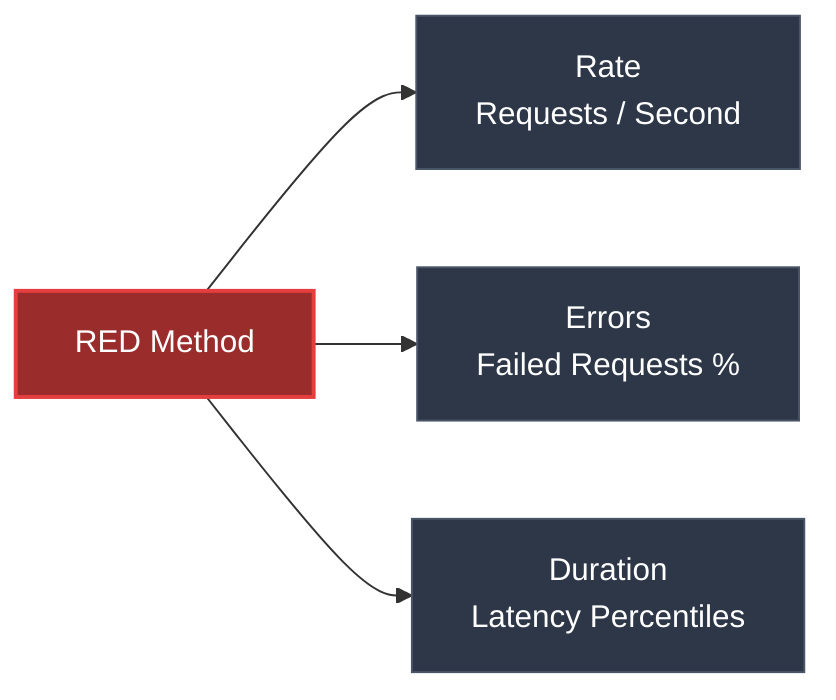

# RED Method là gì? Cách ứng dụng thiết kế Monitor Dashboard

## ⚡ Tóm tắt ngắn (30s)
* **RED Method** là một bộ khung (monitoring framework) được phát triển bởi Tom Wilkie (cựu Kỹ sư SRE của Google, Kỹ sư trưởng tại Grafana), chuyên dùng để giám sát các **dịch vụ hướng yêu cầu (Request-scoped services)** như REST APIs, gRPC Services, Microservices.
* RED là viết tắt của 3 chỉ số cốt lõi:
  1. **R - Rate (Lưu lượng)**: Số lượng request mà dịch vụ đang xử lý trên một đơn vị thời gian (ví dụ: Requests per Second - RPS).
  2. **E - Errors (Lỗi)**: Số lượng request bị thất bại (thường đo bằng số lượng lỗi hoặc tỉ lệ % lỗi).
  3. **D - Duration (Thời gian xử lý)**: Thời gian cần thiết để hoàn thành các request (độ trễ / Latency, bắt buộc đo bằng phân vị p90, p95, p99).
* Phương pháp này giúp chuẩn hóa giao diện giám sát (Dashboard Grafana). Mọi microservice trong hệ thống đều sử dụng chung một kiểu dashboard RED, giúp đội vận hành dễ dàng ứng cứu sự cố mà không cần hiểu sâu logic code bên trong.

---

## 🔍 Chi tiết bản chất thực chiến



### 1. Phân tích chi tiết ba chữ cái trong RED

#### A. Rate (Lưu lượng)
* **Ý nghĩa**: Đo lường mức tải (load) đang đổ vào hệ thống.
* **Mục đích**: Phát hiện các đợt tăng tải đột biến (Spike) hoặc sụt giảm traffic bất thường (ví dụ: sập kết nối từ phía Client hoặc sập DNS khiến không có request nào tới được).

#### B. Errors (Lỗi)
* **Ý nghĩa**: Đo lường chất lượng dịch vụ. Lỗi được định nghĩa dựa trên góc nhìn người dùng (ví dụ: lỗi HTTP status 5xx, gRPC error codes).
* **Mục đích**: Phát hiện ngay khi có lỗi code (bug), lỗi database, hoặc lỗi các dịch vụ bên thứ ba liên kết chết đột ngột.

#### C. Duration (Thời gian xử lý)
* **Ý nghĩa**: Đo lường hiệu năng xử lý. Cần quan sát sự phân bổ thời gian phản hồi (Distribution) thay vì con số trung bình.
* **Mục đích**: Phát hiện khi hệ thống bị nghẽn (bottleneck) làm chậm trải nghiệm của người dùng, ngay cả khi API chưa hề trả về lỗi 500 (chạy đúng nhưng quá chậm).

---

## 💻 Kịch bản thực chiến: Viết câu lệnh Prometheus PromQL vẽ Dashboard Grafana

Giả sử ta sử dụng **Prometheus** làm hệ thống giám sát và thu thập dữ liệu từ Spring Boot Actuator. Dưới đây là các câu truy vấn **PromQL thực tế** để vẽ 3 biểu đồ chính trên Grafana theo chuẩn RED Method.

### 1. Rate (Requests per Second - RPS)
Tính toán tốc độ request trung bình tăng lên trong mỗi giây, đo lường trong khoảng thời gian cửa sổ 5 phút gần nhất:
```promql
# Trả về tổng số request/giây của ứng dụng "order-service"
sum(rate(http_server_requests_seconds_count{application="order-service"}[5m]))
```

### 2. Errors (Tỉ lệ lỗi % - Error Rate)
Tính toán tỉ lệ phần trăm các request bị lỗi hệ thống (HTTP status 5xx) trên tổng số request:
```promql
# Trả về phần trăm lỗi hệ thống
(
  sum(rate(http_server_requests_seconds_count{application="order-service", status=~"5.."}[5m]))
  /
  sum(rate(http_server_requests_seconds_count{application="order-service"}[5m]))
) * 100
```

### 3. Duration (Thời gian phản hồi phân vị p99)
Tính toán thời gian xử lý lớn nhất của 99% người dùng (99th percentile Latency). Sử dụng histogram bucket của Prometheus:
```promql
# Trả về độ trễ p99 (đơn vị: giây)
histogram_quantile(0.99, sum(rate(http_server_requests_seconds_bucket{application="order-service"}[5m])) by (le))
```

---

## 📊 So sánh RED Method vs USE Method

Trong thế giới SRE/Monitoring, **RED Method** và **USE Method** là hai phương pháp bổ trợ hoàn hảo cho nhau:

| Tiêu chí | RED Method (Tom Wilkie) | USE Method (Brendan Gregg) |
| :--- | :--- | :--- |
| **Đối tượng áp dụng** | **Dịch vụ / Phần mềm** (REST API, gRPC, Microservice) | **Hạ tầng / Phần cứng** (CPU, RAM, Disk, Network) |
| **Các chỉ số cốt lõi**| **R**ate, **E**rrors, **D**uration | **U**tilization, **S**aturation, **E**rrors |
| **Tầm quan trọng** | Tập trung vào **Trải nghiệm người dùng** (User-centric) | Tập trung vào **Sức khỏe thiết bị** (System-centric) |
| **Ví dụ chỉ số** | API p99 Latency, HTTP Error %, RPS | CPU % usage, Disk Queue size, RAM saturation |

---

## ⚠️ Common Gotchas & Questions follow-up

### 1. "Tôi có thể dùng RED Method cho Batch Jobs hay Queue Message Consumers không?"
* **Trả lời**: **Không phù hợp**. RED Method được thiết kế đặc thù cho kiến trúc kiểu **Request-Response** (gọi API và nhận phản hồi ngay lập tức).
* **Với Batch Jobs / Queue Consumers** (như RabbitMQ listener, Kafka consumer):
  * **Rate**: Không đo bằng request/giây mà đo bằng **Message Processing Rate** (số message xử lý xong mỗi phút) hoặc **Batch Size**.
  * **Errors**: Số lượng message bị ném vào Dead Letter Queue (DLQ) hoặc số lượng crash.
  * **Duration**: Khái niệm này không phản ánh đúng, thay vào đó ta phải đo **Queue Lag** (số lượng message đang bị ứ đọng chưa kịp consume). Queue lag là chỉ số sinh tử của hệ thống bất đồng bộ.

### 2. "Tại sao RED Method lại là tiêu chuẩn vàng để thiết kế Dashboard cho Microservices lớn?"
* **Tính đồng nhất (Consistency)**: Khi hệ thống phình to lên tới hàng trăm microservices viết bằng các ngôn ngữ khác nhau (Java, Go, Node.js), nếu mỗi team tự chế một kiểu dashboard Grafana riêng, khi có sự cố liên dịch vụ xảy ra, đội On-call/SRE sẽ bị rối và không thể đọc hiểu được dashboard của nhau.
* **Tối ưu hóa phản ứng sự cố**: Khi áp dụng RED Method, mọi service đều có chung 1 template dashboard với 3 biểu đồ chính (Rate, Errors, Duration). Khi có alert, bất kỳ kỹ sư trực chiến nào cũng có thể mở dashboard của service bị lỗi lên và đọc hiểu ngay lập tức tình trạng hiệu năng trong 10 giây đầu tiên, rút ngắn thời gian khắc phục sự cố (MTTR - Mean Time to Resolution).
