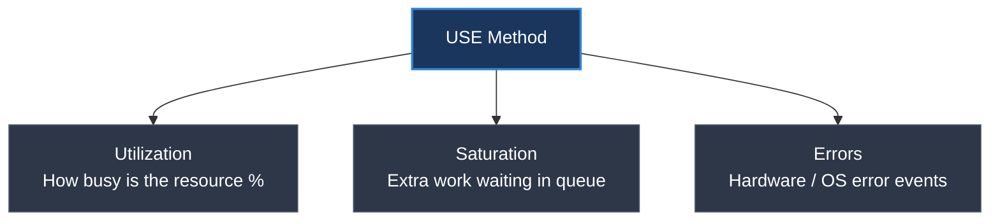

# USE Method là gì? Cách ứng dụng giám sát hạ tầng phần cứng

## ⚡ Tóm tắt ngắn (30s)
* **USE Method** là một bộ khung giám sát hiệu năng được phát triển bởi **Brendan Gregg** (Chuyên gia tối ưu hiệu năng hệ thống lừng danh tại Netflix), chuyên dùng để chẩn đoán sức khỏe của **tài nguyên phần cứng và hạ tầng vật lý** (CPU, RAM, Disk, Network, Virtual machines).
* USE là viết tắt của 3 chỉ số cốt lõi đối với mọi tài nguyên phần cứng:
  1. **U - Utilization (Mức sử dụng %)**: Tỉ lệ phần trăm thời gian tài nguyên bận rộn xử lý công việc (ví dụ: RAM đã dùng 80%, CPU sử dụng 70%).
  2. **S - Saturation (Mức bão hòa / Đợi chờ)**: Lượng công việc phụ trội không được xử lý ngay mà phải **xếp hàng chờ đợi (Queue length / Delay)** do tài nguyên đã hết công suất. Đây là chỉ số quan trọng nhất để phát hiện nghẽn cổ chai (Bottleneck).
  3. **E - Errors (Lỗi phần cứng)**: Số lượng sự kiện lỗi xảy ra ở mức phần cứng hoặc hệ điều hành (ví dụ: Network packet drops, Disk I/O errors).

---

## 🔍 Chi tiết bản chất thực chiến



### 1. Phân tích chi tiết ba chữ cái trong USE đối với các tài nguyên cốt lõi

#### A. CPU
* **Utilization**: Phần trăm thời gian CPU không ở trạng thái rảnh rỗi (`Idle`).
* **Saturation**: Độ dài hàng đợi tiến trình chờ CPU thực thi (đo bằng **Load Average** hoặc **Run Queue Length**).
* **Errors**: Lỗi phần cứng CPU hoặc hiện tượng CPU Throttling do quá nhiệt.

#### B. Memory (RAM)
* **Utilization**: Phần trăm bộ nhớ RAM vật lý đã được sử dụng.
* **Saturation**: Mức độ sử dụng bộ nhớ ảo Swap (Swapping) hoặc tốc độ đọc/ghi trang bộ nhớ ra đĩa (Paging). Nếu Saturation cực hạn, Linux Kernel sẽ kích hoạt cơ chế tự sát ứng dụng: **OOM Killer (Out Of Memory Killer)**.
* **Errors**: Lỗi kiểm tra tính chẵn lẻ của thanh RAM (ECC memory errors).

#### C. Disk (Ổ cứng)
* **Utilization**: Phần trăm thời gian ổ đĩa bận rộn thực hiện I/O read/write.
* **Saturation**: Độ dài hàng đợi I/O chờ đọc ghi trên ổ đĩa (Disk Queue Length).
* **Errors**: Lỗi đọc ghi đĩa vật lý (I/O Errors, Bad sectors).

---

## 💻 Câu lệnh Linux thực chiến & Prometheus PromQL ứng dụng USE Method

### 1. Các câu lệnh Linux để kiểm tra U-S-E tức thời tại máy chủ

#### Xem CPU Saturation & Memory/I/O Saturation bằng lệnh `vmstat`:
```bash
vmstat 1
# Cột 'r' (runnable processes): Chỉ số CPU Saturation. Nếu con số này lớn hơn số core CPU, hệ thống đang bị nghẽn CPU!
# Cột 'si' (swap-in), 'so' (swap-out): Chỉ số Memory Saturation. Nếu khác 0, máy chủ đang bị thiếu RAM và phải swap ra đĩa làm chậm hệ thống.
```

#### Xem Disk Saturation & Utilization bằng lệnh `iostat`:
```bash
iostat -xz 1
# Cột '%util': Đo lường Disk Utilization (tỉ lệ thời gian đĩa bận rộn).
# Cột 'aqu-sz' (average queue size): Đo lường Disk Saturation. Queue size lớn hơn 2-3 chỉ ra ổ đĩa đang bị quá tải I/O.
```

---

### 2. Các câu truy vấn Prometheus PromQL để cấu hình Alert hệ thống theo USE

#### A. Node CPU Utilization (%)
Tính toán mức sử dụng CPU thực tế của máy chủ (loại trừ thời gian CPU Idle):
```promql
100 - (avg by (instance) (irate(node_cpu_seconds_total{mode="idle"}[5m])) * 100)
# Alert kích hoạt nếu CPU Utilization > 85% liên tục trong 10 phút.
```

#### B. Node Memory Saturation (Swap Activity)
Theo dõi tốc độ đọc ghi dữ liệu từ RAM vật lý ra bộ nhớ Swap trên ổ đĩa cứng:
```promql
rate(node_vmstat_pgpgin[5m]) + rate(node_vmstat_pgpgout[5m])
# Tốc độ paging cao chứng tỏ bộ nhớ RAM thật đã hết công suất và đang phải mượn đĩa cứng làm RAM phụ.
```

#### C. Node Disk Saturation (I/O Wait time)
Đo lường thời gian tích lũy mà các I/O request phải chờ đợi trong hàng đợi của ổ cứng:
```promql
rate(node_disk_io_time_weighted_seconds_total[5m])
# Chỉ số weighted time tăng cao cho thấy đĩa cứng I/O đang cực kỳ chậm (thường xảy ra với ổ HDD hoặc SSD hết IOPS).
```

---

## 📊 So sánh RED Method vs USE Method

| Tiêu chí | RED Method | USE Method |
| :--- | :--- | :--- |
| **Phát minh bởi** | Tom Wilkie | Brendan Gregg |
| **Focus vào** | Trải nghiệm người dùng (Workload) | Linh kiện phần cứng (Resource) |
| **Tầng kiến trúc** | Application / Software layer | Infrastructure / OS layer |
| **Chỉ số tương ứng** | Rate = RPS <br> Errors = HTTP 500 <br> Duration = API latency p99 | Utilization = CPU 90% <br> Saturation = Swap active <br> Errors = Packet drops |
| **Use-case tốt nhất** | Giám sát REST API, Microservices | Giám sát Server Linux, Database Engine, VM |

---

## ⚠️ Common Gotchas & Questions follow-up

### 1. "Load Average trong Linux (ví dụ: Load Average: 4.50, 2.10, 1.05) đại diện cho điều gì?"
* **Định nghĩa**: Load Average là thước đo trung bình số lượng tiến trình đang ở trạng thái **chạy được (Running / Run queue)** hoặc đang bị **chặn không ngắt được (Uninterruptible Sleep / Blocked)** trong vòng 1, 5, và 15 phút gần nhất.
* **Bản chất thực chiến**:
  * Nó đại diện cho cả **CPU Saturation** (tiến trình chờ CPU) và **Disk I/O Saturation** (tiến trình bị treo chờ đọc ghi đĩa cứng).
  * **Cách đọc số core**: Nếu máy chủ có 4 Core CPU, mà Load Average 1 phút là `8.0` -> Có nghĩa là trung bình hệ thống đang quá tải gấp đôi công suất (4 tiến trình đang chạy trên 4 Core, và 4 tiến trình khác phải xếp hàng chờ đợi). Đây là chỉ số Saturation hoàn hảo.

### 2. "Tại sao RAM Utilization 99% trên máy chủ Linux chưa chắc đã là lỗi cần Alert?"
* **Cơ chế tối ưu của Linux**: Hệ điều hành Linux được thiết kế để sử dụng tối đa dung lượng bộ nhớ RAM nhàn rỗi (Free RAM) để làm bộ đệm **Disk Cache / Buffer**. Việc này giúp tốc độ đọc ghi đĩa cứng nhanh gấp hàng ngàn lần.
* **Hiểu lầm**: Nhìn thấy RAM free chỉ còn 1% dẫn đến việc hốt hoảng báo động sập server.
* **Chỉ số đúng**: 
  * Cần xem RAM thực tế khả dụng cho ứng dụng (`MemAvailable` hoặc `free -m` ở cột `available`).
  * Quan sát chỉ số **Memory Saturation (Swap activity và Paging rate)**. Nếu RAM dùng 99% mà Swap hoạt động bằng 0 và không có paging, hệ thống vẫn đang chạy cực kỳ tối ưu và an toàn. Chỉ Alert khi Swap tăng cao kèm theo hiện tượng RAM cạn kiệt.
