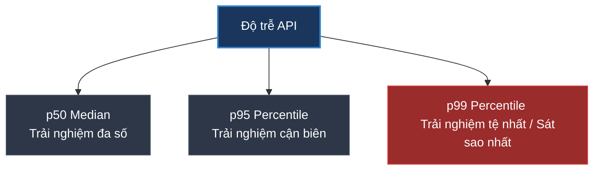

# Độ trễ Percentile p50, p95, p99 có ý nghĩa gì? Cách đo lường chính xác

## ⚡ Tóm tắt ngắn (30s)
* **Percentile (Phân vị)** là chỉ số thống kê dùng để phân nhóm thời gian phản hồi (Latency) của người dùng, cho biết có bao nhiêu phần trăm số request hoàn thành nhanh hơn hoặc bằng một mốc thời gian cụ thể.
* **p50 (Median - Trung vị)**: 50% số request có độ trễ nhỏ hơn hoặc bằng mốc này. Đây là trải nghiệm của đa số người dùng bình thường.
* **p95**: 95% số request có độ trễ nhỏ hơn hoặc bằng mốc này. Chỉ có 5% người dùng bị chậm hơn.
* **p99**: 99% số request có độ trễ nhỏ hơn hoặc bằng mốc này. Chỉ có **1% người dùng chịu trải nghiệm tệ nhất (chậm nhất)**.
* **Tại sao không dùng Average (Trung bình cộng)?** Trung bình cộng bị bóp méo rất mạnh bởi các giá trị cực trị (Outliers), che giấu hoàn toàn trải nghiệm cực tệ của nhóm 1%-5% khách hàng không may mắn, khiến đội vận hành phán đoán sai lệch.

---

## 🔍 Chi tiết bản chất thực chiến



### 1. Tại sao 1% người dùng chậm (p99) lại cực kỳ quan trọng?

* **Thiệt hại doanh thu trực tiếp**: Đối với các hệ thống lớn (như Amazon, Shopee), 1% của hàng triệu người dùng tương đương với hàng chục ngàn khách hàng tiềm năng. Nếu họ gặp độ trễ lớn (> 3 giây), họ sẽ bỏ giỏ hàng và rời đi ngay lập tức.
* **Hiệu ứng lan truyền trong Microservices (Amplification)**:
  * Khi người dùng gọi một API ở API Gateway, service này phải gọi tiếp đồng thời 10 service downstream phía sau để tổng hợp dữ liệu.
  * Nếu mỗi service downstream có độ trễ p99 = 1 giây. Xác suất để request của người dùng bị dính ít nhất một cuộc gọi chậm 1 giây từ 10 service đó tăng lên đến **10%**!
  * Do đó, độ trễ p99 của các dịch vụ bên trong sẽ tích lũy và kéo tụt độ trễ trung bình của dịch vụ bên ngoài API Gateway.

### 2. Biểu đồ phân bổ độ trễ (Distribution Curve)

```text
Số lượng Request 
  ^
  |          * (p50 - Median - Hầu hết request nằm ở đây: 20ms)
  |         * *
  |        *   *
  |       *     *
  |      *       *
  |     *         *
  |    *           *       * (p95 - Bắt đầu chậm dần: 250ms)
  |  *               *   *   *
  |*                   *       *   * (p99 - 1% chậm nhất: 1800ms do GC Pause/Network)
  +-------------------------------------------------------------> Độ trễ (ms)
```

---

## 💻 Code thực chiến: Cấu hình và đo lường Percentiles trong Spring Boot

Để Spring Boot Actuator xuất ra các dữ liệu percentile cho Prometheus vẽ biểu đồ, ta cần cấu hình qua `application.yml` hoặc viết Class Customizer.

### 1. Cấu hình xuất Percentiles tự động qua `application.yml`
```yaml
management:
  metrics:
    distribution:
      percentiles-simple:
        http.server.requests: true # ✅ Bật đo lường percentiles cho mọi HTTP Requests
      percentiles:
        http.server.requests: 0.50, 0.95, 0.99 # ✅ Định nghĩa các phân vị cần Prometheus theo dõi
      sla:
        http.server.requests: 500ms, 1000ms # ✅ Xuất metrics dạng histogram phân bổ theo SLA
```

### 2. Viết câu truy vấn Prometheus PromQL để hiển thị biểu đồ Latency trên Grafana

Sử dụng hàm `histogram_quantile` để tính toán chính xác giá trị phân vị từ dữ liệu histogram (các bucket) do Spring Boot xuất ra:

```promql
# Vẽ biểu đồ độ trễ p95 của dịch vụ "order-service" (kết quả trả về đơn vị: giây)
histogram_quantile(0.95, sum(rate(http_server_requests_seconds_bucket{application="order-service"}[5m])) by (le))

# Vẽ biểu đồ độ trễ p99
histogram_quantile(0.99, sum(rate(http_server_requests_seconds_bucket{application="order-service"}[5m])) by (le))
```

---

## 📊 Bảng so sánh ý nghĩa chỉ số độ trễ

| Chỉ số | Ý nghĩa kỹ thuật | Góc nhìn trải nghiệm người dùng | Hành động của Dev/SRE |
| :--- | :--- | :--- | :--- |
| **Average (Trung bình)** | Tổng độ trễ / Tổng số request | **Sai lệch hoàn toàn**, không đại diện cho ai cả | Chỉ nên dùng để tính toán băng thông tổng quát |
| **p50 (Trung vị)** | 50% user nhanh hơn mốc này | Trải nghiệm của **người dùng bình thường** | Theo dõi xem code chạy có đạt tốc độ cơ bản không |
| **p95** | 95% user nhanh hơn mốc này | Trải nghiệm của **người dùng cận biên** | Điểm bắt đầu để tối ưu hóa code và database query |
| **p99** | 99% user nhanh hơn mốc này | Trải nghiệm **tệ nhất của khách hàng** | Dùng để phát hiện GC pause, DB lock, Network delay |

---

## ⚠️ Common Gotchas & Questions follow-up

### 1. "Percentile Aggregation Trap (Bẫy gộp phân vị) là gì? Tại sao không được lấy trung bình của p99?"
* **Sai lầm chết người**: Bạn có 3 Server chạy cùng 1 service:
  * Server A báo độ trễ p99 = 100ms.
  * Server B báo độ trễ p99 = 120ms.
  * Server C báo độ trễ p99 = 400ms (đang bị nghẽn).
  * Bạn lấy trung bình cộng: `(100 + 120 + 400) / 3 = 206.6ms` và kết luận p99 hệ thống là 206ms. **Đây là lỗi toán học nghiêm trọng!**
* **Tại sao sai?** p99 là chỉ số phi tuyến tính. Bạn không thể lấy trung bình của các phân vị khi số lượng request trên mỗi server khác nhau (ví dụ Server C chỉ nhận 10 requests trong khi Server A nhận 10.000 requests).
* **Giải pháp đúng**: Bắt buộc phải đẩy dữ liệu dạng **Histogram Buckets** về Prometheus. Prometheus sẽ gộp các bucket đó lại theo tổng lượng request bằng hàm `sum()`, sau đó mới chạy hàm `histogram_quantile` để tính ra p99 tổng hợp chuẩn xác.

### 2. "Tại sao hiện tượng JVM Garbage Collection (GC) lại là thủ phạm chính gây ra các đỉnh nhọn p99?"
* **Cơ chế Stop-the-world**: Khi JVM thực hiện gom rác ở thế hệ già (Major GC / Full GC), nó sẽ phải tạm dừng toàn bộ các luồng ứng dụng để dọn dẹp bộ nhớ một cách an toàn.
* **Hậu quả**: Tại đúng thời điểm GC chạy (ví dụ mất 500ms), bất kỳ request nào của người dùng gửi tới trong 500ms đó đều bị treo xếp hàng đợi.
* **Biểu hiện**: Trên dashboard, bạn sẽ thấy p50 cực kỳ mượt mà ở mức 10ms, nhưng biểu đồ p99 sẽ liên tục xuất hiện các **cột gai nhọn vọt lên 500ms - 1000ms** theo chu kỳ.
* **Khắc phục**: Tuning JVM GC (ví dụ chuyển sang dùng G1GC hoặc ZGC có thời gian dừng cực thấp < 10ms), tối ưu hóa code để giảm thiểu việc cấp phát vùng nhớ rác liên tục.
