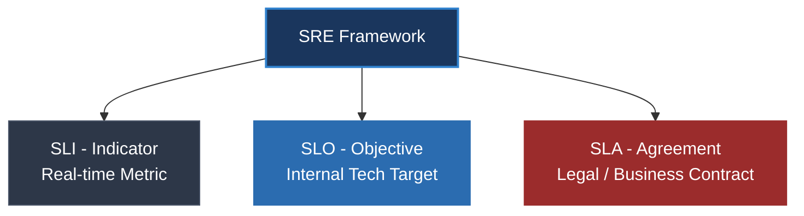

# SLA, SLO, và SLI khác nhau thế nào? Cách thiết kế Error Budget

## ⚡ Tóm tắt ngắn (30s)
* Đây là bộ ba khái niệm cốt lõi trong **SRE (Site Reliability Engineering)** dùng để định lượng, đo lường và cam kết độ tin cậy của hệ thống:
  1. **SLI (Service Level Indicator - Chỉ số)**: Là số liệu thực tế đo được tại thời điểm hiện tại. Trả lời câu hỏi: **"Hệ thống đang chạy tốt thế nào?"** (Ví dụ: Uptime hôm nay đo được là **99.96%**).
  2. **SLO (Service Level Objective - Mục tiêu)**: Là mục tiêu độ tin cậy mà đội ngũ kỹ thuật tự đặt ra làm kim chỉ nam. Trả lời câu hỏi: **"Chúng ta muốn hệ thống chạy tốt thế nào?"** (Ví dụ: Mục tiêu Uptime tháng là **>= 99.9%**).
  3. **SLA (Service Level Agreement - Cam kết)**: Hợp đồng pháp lý ký kết giữa Doanh nghiệp và Khách hàng. Trả lời câu hỏi: **"Điều gì xảy ra nếu chúng ta phá vỡ cam kết?"** (Ví dụ: Nếu Uptime dưới **99.0%**, chúng tôi sẽ hoàn trả **20%** phí dịch vụ tháng đó).
* **Error Budget (Ngân sách lỗi)**: Bằng `100% - SLO` (Ví dụ SLO 99.9% -> Error budget là 0.1%). Đây là "hạn mức lỗi" cho phép đội Dev được phép làm sập hệ thống trong phạm vi an toàn để thử nghiệm và deploy tính năng mới nhanh hơn.

---

## 🔍 Chi tiết bản chất thực chiến



### 1. Phân tích chi tiết ba khái niệm

#### A. SLI — Thước đo thực tế
* **Định nghĩa**: Là một phép đo định lượng cụ thể về hiệu năng của dịch vụ.
* **Công thức chuẩn**: `SLI = (Số lượng sự kiện tốt / Tổng số lượng sự kiện) * 100%`
* **Ví dụ**: Số lượng HTTP requests phản hồi thành công (HTTP status không phải 5xx) có độ trễ dưới 200ms trên tổng số request.

#### B. SLO — Mục tiêu kỹ thuật
* **Định nghĩa**: Mục tiêu mà đội Dev và Ops thống nhất đạt được để đảm bảo khách hàng hài lòng mà không gây tốn kém chi phí vô ích. SLO luôn nghiêm ngặt hơn SLA để tạo ra khoảng đệm an toàn.
* **Ví dụ**: SLO hàng tháng của dịch vụ thanh toán là `Uptime >= 99.9%` và `99% request có Latency < 500ms`.

#### C. SLA — Ràng buộc pháp lý
* **Định nghĩa**: Cam kết thương mại đi kèm chế tài tài chính. Nếu vi phạm, doanh nghiệp phải đền bù tiền mặt, voucher hoặc chịu phạt pháp lý.
* **Lưu ý**: Đội kỹ thuật/SRE chỉ chịu trách nhiệm thiết kế SLO và đo lường SLI, còn SLA do phòng kinh doanh và pháp chế soạn thảo.
* **Ví dụ**: SLA cam kết độ sẵn sàng dịch vụ `Uptime >= 99.0%` hàng quý.

---

## 💻 Kịch bản thực chiến: Tính toán SLI và SLO bằng Prometheus PromQL

Sử dụng Prometheus để đo lường trực tiếp SLI của API và giám sát xem ứng dụng có đạt mục tiêu SLO đề ra hay không.

### 1. Tính toán SLI hiện tại (Độ sẵn sàng API thành công trong 5 phút gần nhất)
```promql
# Tính tỉ lệ % các request phản hồi thành công (không bị lỗi 5xx)
(
  sum(rate(http_server_requests_seconds_count{application="order-service", status!~"5.."}[5m]))
  # Xác định rõ 4xx/timeout có được tính là failure theo SLI của sản phẩm hay không.
  /
  sum(rate(http_server_requests_seconds_count{application="order-service"}[5m]))
) * 100
```

### 2. Tính toán Error Budget tiêu thụ (Ngân sách lỗi còn lại)
Giả sử SLO thiết lập là **99.9% Uptime** trong vòng 30 ngày (cho phép tỉ lệ lỗi tối đa **0.1%**). 
Ta viết câu lệnh PromQL để kiểm tra tỉ lệ lỗi thực tế trong 30 ngày qua xem có vượt quá hạn mức 0.1% hay không:

```promql
# Trả về tỉ lệ lỗi thực tế trong 30 ngày qua (so sánh với ngưỡng 0.001 - tức là 0.1%)
sum(increase(http_server_requests_seconds_count{application="order-service", status=~"5.."}[30d]))
/ 
sum(increase(http_server_requests_seconds_count{application="order-service"}[30d]))
```
* Nếu kết quả trả về `< 0.001` (0.1%): **Error Budget vẫn còn**. Đội Dev được phép tự do deploy tính năng mới nhanh chóng.
* Nếu kết quả trả về `>= 0.001`: **Error Budget đã cạn kiệt (Burned out)**. Đội Dev phải dừng ngay việc ra mắt tính năng mới, tập trung 100% nguồn lực để refactor code, sửa bug và tối ưu hệ thống nhằm nâng cao Uptime.

---

## 📊 Bảng so sánh SLA vs SLO vs SLI

| Tiêu chí | SLI (Indicator) | SLO (Objective) | SLA (Agreement) |
| :--- | :--- | :--- | :--- |
| **Bản chất** | Chỉ số đo lường định lượng | Mục tiêu kỹ thuật nội bộ | Cam kết hợp đồng thương mại |
| **Đối tượng hướng tới** | Kỹ sư vận hành (Ops/SRE) | Đội phát triển (Dev & Ops) | Khách hàng & Phòng Pháp chế |
| **Khoảng đệm an toàn**| Trực tiếp phản ánh hệ thống | Khắt khe (Ví dụ: 99.9%) | Lỏng lẻo hơn (Ví dụ: 99.0%) |
| **Chế tài vi phạm** | Không (chỉ ghi nhận thông tin) | Phạt dừng deploy tính năng mới | Đền bù tài chính, giảm giá |
| **Hỏi nhanh** | Hệ thống chạy thế nào? | Chúng ta kỳ vọng gì? | Đền bù bao nhiêu nếu sập? |

---

## ⚠️ Common Gotchas & Questions follow-up

### 1. "Tại sao không bao giờ nên đặt mục tiêu SLO Uptime là 100%?"
* **Bất khả thi về mặt kỹ thuật**: Không có hệ thống nào trên thế giới đạt độ tin cậy tuyệt đối 100%. Luôn có những sự cố bất khả kháng như thiên tai làm sập trung tâm dữ liệu, cáp quang biển bị đứt, lỗi nhà cung cấp Cloud (AWS/Azure sập diện rộng).
* **Chi phí tăng theo cấp số nhân**: Để nâng Uptime từ 99.9% (cho phép sập 43 phút/tháng) lên 99.99% (chỉ cho phép sập 4.3 phút/tháng), doanh nghiệp phải bỏ ra chi phí gấp 5-10 lần (thiết kế Multi-Region Active-Active, dự phòng nóng thiết bị).
* **Vô ích đối với trải nghiệm người dùng**: Bản thân đường truyền Internet của người dùng (Wifi, 4G) chỉ có độ sẵn sàng khoảng 99% đến 99.5%. Nếu hệ thống của bạn đạt 100% Uptime, người dùng cũng không thể nhận ra sự khác biệt do mạng của họ tự chập chờn trước đó.
* **Bóp nghẹt tốc độ phát triển**: Đặt SLO 100% đồng nghĩa với Error Budget = 0%. Bạn sẽ không bao giờ dám deploy tính năng mới vì sợ rủi ro làm sập dù chỉ 1 giây.

### 2. "Làm thế nào để xác định một SLO tốt và thực tế?"
* **Đừng quá tham lam**: Không lấy số liệu trong mơ. Hãy đo lường SLI thực tế của hệ thống trong 3 tháng gần nhất làm mốc cơ sở (Baseline). Nếu Uptime thực tế đang là 99.5%, hãy đặt SLO quý tiếp theo là 99.7% để cải tiến dần dần.
* **Lắng nghe khách hàng**: SLO tốt là SLO phản ánh đúng sự hài lòng của người dùng. Nếu SLO báo 99.9% (hệ thống xanh rì) nhưng người dùng vẫn liên tục chửi bới hệ thống chậm trên mạng xã hội -> Chứng tỏ ta đang chọn sai SLI (ví dụ: đo lường Uptime nhưng quên đo Latency).
