# Thiết kế hệ thống URL Shortener (Rút gọn liên kết)

## ⚡ Tóm tắt ngắn (30s)
* **Mục tiêu**: Rút gọn một URL dài (e.g., `https://example.com/very/long/path?param=value`) thành một mã ngắn (e.g., `https://short.url/abc123X`). Khi người dùng truy cập URL ngắn, hệ thống sẽ redirect (302/301) về URL gốc.
* **Core Logic**:
  * Chuyển đổi ID số tự tăng (Auto-increment ID hoặc Snowflake ID) sang chuỗi ký tự bằng thuật toán **Base62 encoding** (gồm `a-z`, `A-Z`, `0-9`).
  * Sử dụng **Redis Cache** (LRU) phía trước database để giảm latency cho luồng đọc (Redirect), vốn chiếm 90-99% traffic.
  * Sử dụng **Unique Constraint** hoặc **Distributed Lock** để tránh ghi đè dữ liệu khi chạy ở scale lớn.

---

## 🔍 Phân tích yêu cầu (Requirements)

### 1. Functional Requirements (Yêu cầu chức năng)
* **Tạo URL ngắn**: Nhập URL gốc $\r\rightarrow$ Trả về URL ngắn có độ dài cố định (thường là 7-8 ký tự).
* **Chuyển hướng (Redirecting)**: Truy cập URL ngắn $\r\rightarrow$ Chuyển hướng nhanh nhất có thể về URL gốc.
* **Tùy biến URL (Custom alias)**: Cho phép người dùng tự chọn chuỗi rút gọn nếu chưa bị trùng (e.g., `short.url/promo2026`).
* **Hết hạn (Expiration)**: Hỗ trợ thời gian sống (TTL) cho link rút gọn, tự động xóa khi hết hạn.
* **Thống kê (Analytics)**: Theo dõi số click, địa điểm, thiết bị truy cập (luồng async).

### 2. Non-Functional Requirements (Yêu cầu phi chức năng)
* **High Availability**: Hệ thống phải hoạt động 24/7, tỷ lệ lỗi cực thấp vì nếu URL shortener sập, toàn bộ link đã chia sẻ của khách hàng sẽ bị hỏng.
* **Low Latency**: Luồng đọc (redirect) phải cực kỳ nhanh ($< 20\text{ms}$).
* **Scalability**: Khả năng scale chịu tải hàng triệu request/ngày, hỗ trợ ghi lượng lớn URL mới.
* **Security**: Không cho phép đoán trước (predictable) các URL ngắn tiếp theo để tránh bị quét sạch dữ liệu (cần giải pháp tránh đoán ID).

---

## 🎨 Sơ đồ kiến trúc (Architecture Diagram)

Hệ thống được thiết kế theo mô hình Microservices, phân tách luồng Ghi (Write) và luồng Đọc (Read) để tối ưu hóa hiệu năng độc lập (CQRS-like pattern).

```mermaid
flowchart TD
    User([Người dùng]) <--> Cloudflare[Cloudflare CDN / DDoS Protection]
    Cloudflare <--> APIGateway[API Gateway / Rate Limiter]

    subgraph "Luồng Ghi (Write Path)"
        APIGateway --> WriteService[Write URL Service]
        WriteService --> IDGen[Snowflake ID Generator]
        WriteService --> DB_Primary[(Database PostgreSQL - Master)]
    end

    subgraph "Luồng Đọc (Read Path)"
        APIGateway --> ReadService[Read / Redirect Service]
        ReadService --> Redis[(Redis Cache - LRU)]
        ReadService --> DB_Replica[(PostgreSQL - Read Replica)]
    end

    DB_Primary -->|Replication| DB_Replica
    WriteService -.->|Invalidate / Warm up| Redis

    subgraph "Luồng Async Analytics"
        ReadService --> Kafka{Kafka Topic: click-events}
        Kafka --> AnalyticsWorker[Analytics Service]
        AnalyticsWorker --> ClickHouse[(ClickHouse OLAP)]
    end

    style Redis fill:#1a365d,stroke:#3182ce,stroke-width:2px
    style DB_Primary fill:#1a365d,stroke:#3182ce,stroke-width:2px
    style ClickHouse fill:#1a365d,stroke:#3182ce,stroke-width:2px
    style Kafka fill:#2c1a3f,stroke:#7b2cbf,stroke-width:2px
```



---

## 💾 Thiết kế Database & Thuật toán

### 1. Thuật toán mã hóa: Base62 vs Hashing

| Phương pháp | Cách hoạt động | Ưu điểm | Nhược điểm |
| :--- | :--- | :--- | :--- |
| **MD5 / SHA-256 Hashing** | Băm URL gốc lấy 7 ký tự đầu. | Đơn giản, không cần ID Generator. | Dễ trùng lặp (Hash collision), phải xử lý trùng lặp rất tốn kém (truy vấn DB liên tục để kiểm tra). |
| **Base62 Encoding** | Chuyển đổi một số nguyên (ID) sang cơ số 62 (`[a-zA-Z0-9]`). | Đảm bảo tính duy nhất 100%, không bị trùng lặp, tốc độ siêu nhanh. | Cần một cơ chế sinh ID duy nhất và không trùng lặp (Distributed ID Generator). |

* **Công thức Base62**: Với độ dài 7 ký tự, ta có $62^7 \approx 3.5\text{ trillion}$ (3.5 nghìn tỷ) URL duy nhất, hoàn toàn đủ cho nhu cầu vận hành hàng chục năm.
* **Cách tránh đoán trước ID**: Nếu dùng Auto-increment ID truyền thống (`1, 2, 3...`), kẻ tấn công có thể đoán được URL ngắn tiếp theo. Giải pháp là kết hợp thuật toán **Feistel Cipher** hoặc **ID Shuffling** để biến đổi ID tuần tự thành một số ngẫu nhiên giả (pseudo-random) trước khi mã hóa Base62.

### 2. Thiết kế Schema (PostgreSQL)

```sql
CREATE TABLE urls (
    id BIGINT PRIMARY KEY,              -- ID gốc (e.g. 192837465) sinh từ Snowflake
    short_key VARCHAR(10) UNIQUE NOT NULL, -- Chuỗi sau mã hóa Base62 (e.g. "aB3x9K")
    original_url TEXT NOT NULL,         -- URL gốc
    created_at TIMESTAMP WITH TIME ZONE DEFAULT CURRENT_TIMESTAMP,
    expires_at TIMESTAMP WITH TIME ZONE, -- Hỗ trợ TTL
    user_id BIGINT                      -- Liên kết người dùng nếu có
);

CREATE INDEX idx_urls_short_key ON urls(short_key);
```

---

## 💻 Code Example: Base62 Encoder in Java

Dưới đây là implementation chuẩn của thuật toán Base62 dùng để chuyển đổi ID sang Short Key.

```java
import java.util.Objects;

public class Base62 {
    private static final String BASE62_CHARACTERS = "abcdefghijklmnopqrstuvwxyzABCDEFGHIJKLMNOPQRSTUVWXYZ0123456789";
    private static final int BASE = BASE62_CHARACTERS.length();

    /**
     * Mã hóa số nguyên BIGINT sang chuỗi Base62.
     */
    public static String encode(long number) {
        if (number < 0) {
            throw new IllegalArgumentException("Number must be non-negative");
        }
        
        StringBuilder sb = new StringBuilder();
        long temp = number;
        
        do {
            int remainder = (int) (temp % BASE);
            sb.append(BASE62_CHARACTERS.charAt(remainder));
            temp /= BASE;
        } while (temp > 0);
        
        return sb.reverse().toString(); // Đảo ngược để có kết quả chính xác
    }

    /**
     * Giải mã chuỗi Base62 về lại số nguyên ban đầu.
     */
    public static long decode(String base62Str) {
        Objects.requireNonNull(base62Str, "Input string cannot be null");
        long number = 0;
        
        for (int i = 0; i < base62Str.length(); i++) {
            char c = base62Str.charAt(i);
            int charIndex = BASE62_CHARACTERS.indexOf(c);
            if (charIndex == -1) {
                throw new IllegalArgumentException("Invalid character in Base62 string: " + c);
            }
            number = number * BASE + charIndex;
        }
        
        return number;
    }

    public static void main(String[] args) {
        long id = 56809547L;
        String shortKey = encode(id);
        System.out.println("Encoded ID " + id + " -> " + shortKey); // e.g. eQkP
        System.out.println("Decoded back -> " + decode(shortKey));
    }
}
```

---

## 📊 Trade-off Analysis & Scaling

### 1. HTTP Redirect 301 vs 302

Khi redirect người dùng về URL gốc, chúng ta có hai lựa chọn mã trạng thái HTTP chính:

| HTTP Status | Ý nghĩa | Ưu điểm | Nhược điểm | Use Case |
| :--- | :--- | :--- | :--- | :--- |
| **`301 Moved Permanently`** | Trình duyệt sẽ cache vĩnh viễn kết quả redirect này. | Tiết kiệm traffic cho server, giảm latency tối đa vì trình duyệt không cần hỏi lại server ở các lần sau. | Rất khó để thay đổi đích đến nếu URL gốc bị cập nhật. Không đo lường được analytics chính xác (vì trình duyệt bypass server). | Các link rút gọn cố định, không cần thống kê click chi tiết hoặc đổi hướng động. |
| **`302 Found (Temporary)`** | Trình duyệt không cache, mỗi lần click đều gửi request lên server. | Dễ dàng cập nhật URL gốc động. Thu thập analytics chuẩn xác 100% trên mỗi lượt click. | Server phải xử lý 100% traffic click, đòi hỏi hệ thống chịu tải cao và cache Redis cực tốt. | **(Khuyên dùng)** Cho các hệ thống Marketing, Tracking, cần đo lường chiến dịch và hỗ trợ đổi URL gốc. |

### 2. Chiến lược Cache & Scaling
* **Cache Eviction Policy (LRU - Least Recently Used)**: Lưu các link hot, truy cập nhiều vào Redis. Vì 80% lượng click thường đổ dồn vào 20% số link thịnh hành (Nguyên lý Pareto).
* **Database Sharding**: Khi dữ liệu vượt quá giới hạn của 1 node PostgreSQL (ví dụ $> 500$ triệu bản ghi), ta thực hiện sharding dựa trên `short_key` hoặc `id` để chia tải ghi.
* **Distributed ID Generator**: Tránh dùng database auto-increment vì nó là bottleneck ghi đơn điểm. Thay vào đó, dùng **Twitter Snowflake** hoặc giải pháp **UUIDv7** để đảm bảo phân tán, độc lập và có tính tuần tự tương đối giúp optimize index DB.

---

## ⚠️ Common Gotchas (Câu hỏi đào sâu từ interviewer)

1. **Làm thế nào để tránh tình trạng trùng lặp Custom Alias?**
   * *Trả lời*: Thiết lập trường `short_key` là `UNIQUE` trong DB. Khi người dùng yêu cầu custom alias, thực hiện kiểm tra nhanh trên Redis. Nếu không có trong cache, lưu thẳng vào DB bằng cú pháp `INSERT ... ON CONFLICT DO NOTHING`. Nếu DB báo lỗi trùng lặp, thông báo cho người dùng chọn chuỗi khác.
2. **Nếu kẻ xấu dùng tool spam tạo hàng loạt URL ngắn thì sao?**
   * *Trả lời*: Áp dụng **Rate Limiting** chặt chẽ (sử dụng Token Bucket hoặc Leaky Bucket algorithm thông qua Kong API Gateway / Redis) dựa trên IP và User ID. Thiết lập giới hạn tối đa, ví dụ: tối đa 10 URL ngắn được tạo mỗi phút cho mỗi IP miễn phí.
3. **Làm sao xử lý các URL ngắn đã hết hạn (Expired URLs)?**
   * *Trả lời*: Không nên dùng trigger DB để xóa vì rất nặng. Sử dụng một **Background Worker** chạy định kỳ ban đêm (Off-peak hours) quét các dòng có `expires_at < NOW()` theo từng batch nhỏ (ví dụ 1000 dòng/lần) để xóa dần, tránh gây lock table.
