# Thiết kế hệ thống Tìm kiếm tự động hoàn thành (Search Autocomplete System)

## ⚡ Tóm tắt ngắn (30s)
* **Mục tiêu**: Thiết kế hệ thống gợi ý từ khóa tìm kiếm khi người dùng đang nhập ký tự (e.g., gợi ý 5 từ khóa phổ biến nhất bắt đầu bằng prefix người dùng gõ) với độ trễ cực thấp (dưới 10ms) và chịu tải hàng chục nghìn request mỗi giây (QPS).
* **Core Logic**:
  * **Cấu trúc dữ liệu Trie**: Sử dụng Trie (Cây tiền tố) để lưu trữ từ khóa và tần suất tìm kiếm. Mỗi node chứa ký tự và danh sách 5 từ khóa hot nhất đi kèm để tìm kiếm đạt độ phức tạp $O(1)$ thay vì phải duyệt toàn bộ cây $O(L + K \log K)$.
  * **Xử lý bất đồng bộ (Offline Aggregation)**: Tần suất tìm kiếm thay đổi liên tục nhưng cấu trúc Trie và danh sách gợi ý chỉ cần cập nhật định kỳ (e.g., mỗi 1 giờ hoặc hàng ngày) thông qua luồng gom log (Kafka $\rightarrow$ Spark/MapReduce) để tránh làm nghẽn luồng đọc trực tiếp.
  * **Redis & CDN Edge Caching**: Cache kết quả gợi ý cho các prefix phổ biến nhất tại Redis và phân phối đến các Edge Server (CDN) gần người dùng nhất để đạt độ trễ tiệm cận 0ms.

---

## 🔍 Phân tích yêu cầu (Requirements)

### 1. Functional Requirements (Yêu cầu chức năng)
* **Gợi ý từ khóa**: Khi người dùng nhập một chuỗi ký tự (prefix), trả về danh sách 5 từ khóa tìm kiếm phổ biến nhất bắt đầu bằng chuỗi đó.
* **Cập nhật dữ liệu**: Hệ thống phải thu thập các truy vấn thực tế của người dùng để cập nhật độ phổ biến (tần suất) của các từ khóa.
* **Hỗ trợ đa ngôn ngữ và sửa lỗi chính tả**: Có khả năng xử lý Unicode và bỏ qua lỗi gõ phím nhỏ (nâng cao).

### 2. Non-Functional Requirements (Yêu cầu phi chức năng)
* **Độ trễ cực thấp (Ultra-low Latency)**: Thời gian phản hồi phải $< 10\text{ms}$ trên mỗi ký tự người dùng gõ để đảm bảo trải nghiệm gõ mượt mà (real-time feel).
* **Tính sẵn sàng cao (High Availability)**: Hệ thống gợi ý bị sập không được phép làm sập tính năng tìm kiếm chính.
* **Khả năng mở rộng lớn (Scalability)**: Chịu tải hàng chục triệu người dùng hoạt động hàng ngày (e.g., 10,000+ QPS luồng gợi ý).
* **Độ chính xác tương đối (Eventual Consistency)**: Kết quả gợi ý không cần cập nhật tức thời theo từng giây, có thể trễ vài chục phút đến vài giờ.

---

## 🎨 Sơ đồ kiến trúc (Autocomplete Architecture)

Hệ thống tách biệt hoàn toàn luồng Đọc trực tiếp (Real-time Query Path) và luồng Ghi gom dữ liệu (Data Collection & Offline Processing Path) để bảo vệ hiệu năng hệ thống.

```mermaid
flowchart TD
    User([Người dùng gõ phím]) -->|1. HTTP GET /suggest?q=ap| EdgeCDN[CDN Edge Cache]
    EdgeCDN -->|2. Cache Miss| APIGateway[API Gateway / Rate Limiter]
    APIGateway -->|3. Query suggest| QueryService[Autocomplete Query Service]
    QueryService -->|4. Get top 5 suggestions| RedisCache[(Redis Cluster)]
    QueryService -->|5. Local Trie Lookup if Cache Miss| TrieService[Trie In-Memory Service]

    subgraph "Luồng Đọc Trực Tiếp (Real-time Query Path)"
        QueryService
        RedisCache
        TrieService
    end

    subgraph "Luồng Thu Thập Dữ Liệu (Data Collection Path)"
        UserSearch([Người dùng nhấn Enter Search]) -->|6. Log query| APIGateway
        APIGateway -->|7. Send event| Kafka{Kafka Broker: search-logs}
        Kafka -->|8. Consume logs| LogConsumer[Log Consumer Service]
        LogConsumer -->|9. Raw append| ClickHouse[(ClickHouse Log DB)]
    end

    subgraph "Luồng Xử Lý Bất Đồng Bộ (Offline Aggregation Path)"
        ClickHouse -->|10. Batch processing| Spark[Spark / MapReduce Aggregator]
        Spark -->|11. Calc frequency & Build Trie| TrieBuilder[Trie Builder Worker]
        TrieBuilder -->|12. Push fresh Trie data| DistStorage[(Object Storage - S3)]
        DistStorage -->|13. Reload Trie snapshot| TrieService
        TrieBuilder -->|14. Pre-warm hot prefixes| RedisCache
    end

    style RedisCache fill:#1a365d,stroke:#3182ce,stroke-width:2px
    style ClickHouse fill:#1a365d,stroke:#3182ce,stroke-width:2px
    style DistStorage fill:#1a365d,stroke:#3182ce,stroke-width:2px
    style Kafka fill:#2c1a3f,stroke:#7b2cbf,stroke-width:2px
```



---

## 💾 Cấu trúc dữ liệu & Thiết kế Trie tối ưu

### 1. Thuật toán lưu trữ: Trie Cải tiến (Optimized Trie)
Một cây Trie truyền thông yêu cầu tìm kiếm bằng cách duyệt xuống node tương ứng với prefix, sau đó duyệt tiếp qua toàn bộ các node con phía dưới để tìm các node có tần suất cao nhất. Thao tác này cực kỳ tốn CPU và có độ phức tạp là $O(L + C)$ (với $L$ là độ dài prefix, $C$ là số lượng node con).

**Giải pháp tối ưu**: Tại mỗi node của Trie, ta lưu sẵn danh sách **Top 5 từ khóa phổ biến nhất** đi qua node đó.
* **Ưu điểm**: Khi người dùng gõ xong prefix, ta đi thẳng đến node đó và lấy ngay danh sách gợi ý trong thời gian $O(L)$, hoàn toàn độc lập với kích thước cây và số lượng từ con.
* **Đánh đổi**: Tốn dung lượng bộ nhớ RAM lớn hơn để lưu danh sách gợi ý tại mỗi node. Tuy nhiên, RAM hiện nay rất rẻ và ta có thể giới hạn tối đa chiều sâu của cây (e.g., chỉ build Trie đến độ sâu tối đa 10-15 ký tự).

### 2. Định dạng lưu trữ Redis Cache
Để giảm tải cho dịch vụ Trie In-memory, kết quả gợi ý được cache lại trong Redis dưới dạng Key-Value đơn giản:
* **Key**: `autocomplete:prefix:<chuỗi_gõ>`
* **Value**: Dưới dạng JSON Array lưu thông tin gợi ý.
* **Ví dụ**:
  * Key: `autocomplete:prefix:ap`
  * Value: `["apple", "amazon prime", "api gateway", "apartments for rent", "apple watch"]`

---

## 💻 Code Example: Triển khai Cấu trúc Trie Tối ưu bằng Java

Dưới đây là ví dụ hoàn chỉnh về cách triển khai cấu trúc dữ liệu Trie tối ưu hóa lưu sẵn Top gợi ý tại mỗi node, đảm bảo thread-safe để phục vụ truy vấn đồng thời.

```java
import java.util.*;
import java.util.concurrent.ConcurrentHashMap;

public class AutocompleteTrie {

    // Lớp đại diện cho một Node trong cây Trie
    private static class TrieNode {
        // Sử dụng ConcurrentHashMap để hỗ trợ truy cập đa luồng an toàn
        Map<Character, TrieNode> children = new ConcurrentHashMap<>();
        // Lưu sẵn danh sách gợi ý tốt nhất tại node này
        List<Suggestion> topSuggestions = new ArrayList<>();
    }

    // Lớp đại diện cho một từ gợi ý đi kèm với tần suất tìm kiếm
    public static class Suggestion implements Comparable<Suggestion> {
        String query;
        long frequency;

        public Suggestion(String query, long frequency) {
            this.query = query;
            this.frequency = frequency;
        }

        @Override
        public int compareTo(Suggestion other) {
            // Sắp xếp giảm dần theo tần suất, nếu bằng nhau thì xếp theo bảng chữ cái
            if (this.frequency != other.frequency) {
                return Long.compare(other.frequency, this.frequency);
            }
            return this.query.compareTo(other.query);
        }
    }

    private final TrieNode root;
    private static final int MAX_SUGGESTIONS = 5;

    public AutocompleteTrie() {
        this.root = new TrieNode();
    }

    /**
     * Thêm hoặc cập nhật một từ khóa vào Trie (Thường chạy trong luồng Offline/Background)
     */
    public void insert(String query, long frequency) {
        if (query == null || query.trim().isEmpty()) return;
        
        String cleanQuery = query.toLowerCase().trim();
        TrieNode current = root;
        
        // Cập nhật danh sách gợi ý ngay tại root node
        updateSuggestions(root.topSuggestions, cleanQuery, frequency);

        for (int i = 0; i < cleanQuery.length(); i++) {
            char c = cleanQuery.charAt(i);
            current = current.children.computeIfAbsent(c, k -> new TrieNode());
            // Cập nhật danh sách gợi ý tại các node con tương ứng
            updateSuggestions(current.topSuggestions, cleanQuery, frequency);
        }
    }

    /**
     * Lấy danh sách Top gợi ý cho một tiền tố (Thời gian truy vấn O(L))
     */
    public List<String> getSuggestions(String prefix) {
        if (prefix == null || prefix.trim().isEmpty()) {
            return Collections.emptyList();
        }

        String cleanPrefix = prefix.toLowerCase().trim();
        TrieNode current = root;

        for (int i = 0; i < cleanPrefix.length(); i++) {
            char c = cleanPrefix.charAt(i);
            current = current.children.get(c);
            if (current == null) {
                return Collections.emptyList(); // Không tìm thấy tiền tố tương ứng
            }
        }

        // Lấy ngay danh sách lưu sẵn tại Node đích
        List<String> results = new ArrayList<>();
        for (Suggestion sug : current.topSuggestions) {
            results.add(sug.query);
        }
        return results;
    }

    /**
     * Thuật toán cập nhật danh sách gợi ý cục bộ, duy trì kích thước tối đa là K (5)
     */
    private synchronized void updateSuggestions(List<Suggestion> suggestions, String query, long frequency) {
        // Xóa gợi ý cũ của từ khóa này nếu tồn tại
        suggestions.removeIf(s -> s.query.equals(query));
        
        // Thêm gợi ý mới
        suggestions.add(new Suggestion(query, frequency));
        
        // Sắp xếp lại
        Collections.sort(suggestions);
        
        // Cắt bớt phần dư thừa chỉ giữ lại Top K
        if (suggestions.size() > MAX_SUGGESTIONS) {
            suggestions.subList(MAX_SUGGESTIONS, suggestions.size()).clear();
        }
    }

    public static void main(String[] args) {
        AutocompleteTrie trie = new AutocompleteTrie();
        trie.insert("amazon", 1000);
        trie.insert("amazon prime", 5000);
        trie.insert("apple", 2000);
        trie.insert("apple watch", 1500);
        trie.insert("api gateway", 800);

        System.out.println("Gợi ý cho 'ap': " + trie.getSuggestions("ap"));
        // Kì vọng trả về: [apple, apple watch, api gateway] do amazon không bắt đầu bằng "ap"
        
        System.out.println("Gợi ý cho 'ama': " + trie.getSuggestions("ama"));
        // Kì vọng trả về: [amazon prime, amazon]
    }
}
```

---

## 📊 Trade-off Analysis: So sánh các chiến lược triển khai

| Tiêu chí | Sử dụng Relational DB (SQL `LIKE 'prefix%'`) | Trie In-Memory (Bộ nhớ RAM dịch vụ) | Triển khai trên Elasticsearch (Completion Suggester) |
| :--- | :--- | :--- | :--- |
| **Độ trễ (Latency)** | **Tệ nhất**. Việc quét chuỗi index (`LIKE`) trong DB SQL có traffic thực tế rất chậm ($>50\text{ms}$), gây nghẽn đĩa. | **Tốt nhất**. Dữ liệu nằm hoàn toàn trên RAM dưới dạng con trỏ liên kết, thời gian truy cập $<2\text{ms}$. | Rất tốt. Tốc độ ổn định ($5-15\text{ms}$), tối ưu nhờ cấu trúc FST (Finite State Transducer) trên bộ nhớ. |
| **Độ phức tạp vận hành** | Đơn giản nhất. Không cần hạ tầng bổ sung. | Trung bình. Phải quản lý việc reload snapshot, đồng bộ dữ liệu giữa các node API Server. | Phức tạp cao. Đòi hỏi quản trị cụm Elasticsearch Cluster riêng biệt, chi phí phần cứng lớn. |
| **Xử lý lỗi chính tả (Fuzzy)** | Rất khó khăn và kém hiệu quả. | Cần cài thêm thuật toán phức tạp như Levenshtein Distance trên cấu trúc cây. | **Tốt nhất (Mạnh mẽ)**. Hỗ trợ sẵn khả năng tìm kiếm gần đúng, sửa lỗi chính tả cực kỳ trực quan thông qua config API. |
| **Chi phí phần cứng** | Thấp. | Trung bình (Tốn RAM để lưu trữ cây). | Cao (Elasticsearch ngốn rất nhiều RAM và CPU). |

---

## ⚠️ Common Gotchas (Câu hỏi đào sâu từ interviewer)

1. **Làm thế nào để xử lý các từ khóa tìm kiếm tăng vọt đột biến (Trending Queries / Breaking News)? Hệ thống Offline Aggregation trễ 1 ngày sẽ bỏ lỡ các tin tức này.**
   * *Trả lời*: Với các từ khóa hot đột biến trong thời gian ngắn (ví dụ: thiên tai, scandal nổi tiếng), luồng xử lý offline hàng ngày sẽ không cập nhật kịp thời. Ta thiết kế thêm một **Luồng xử lý thời gian thực (Real-time Stream Pipeline)** song song:
     * Dùng Spark Streaming / Flink tiêu thụ log trực tiếp từ Kafka.
     * Sử dụng thuật toán đếm tần suất cửa sổ trượt (Sliding Window, ví dụ: 5 phút gần nhất) để phát hiện các truy vấn có tỷ lệ tăng trưởng đột biến (Z-score anomaly detection).
     * Đẩy thẳng các từ khóa "Trending" này vào một danh sách đặc biệt trong Redis (`trending:now`).
     * Khi Query Service lấy gợi ý, nó sẽ merge (gộp) kết quả từ Trie gốc và danh sách Trending trong Redis, ưu tiên đưa từ khóa Trending lên đầu nếu tiền tố khớp.

2. **Cây Trie quá lớn không thể chứa hết trên bộ nhớ RAM của một server đơn lẻ thì phải giải quyết thế nào?**
   * *Trả lời*: Ta áp dụng kỹ thuật **Trie Sharding (Phân mảnh dữ liệu cây)**:
     * Phân mảnh dựa trên ký tự đầu tiên của từ khóa (Character-based Sharding). Ví dụ: Server 1 chứa các từ bắt đầu bằng `a-m`, Server 2 chứa `n-z`.
     * Hoặc sử dụng thuật toán băm (Consistent Hashing) trên chuỗi tiền tố để phân bổ đều cho các node. API Gateway sẽ có nhiệm vụ điều phối request của prefix tương ứng đến đúng server đang quản lý phân đoạn Trie đó.

3. **Làm sao để lọc bỏ các từ khóa độc hại, tục tĩu hoặc nhạy cảm khỏi danh sách gợi ý gợi nhớ cho người dùng?**
   * *Trả lời*: 
     * Thiết lập một **Blacklist** (Danh sách đen) chứa các từ khóa cấm, các regex tục tĩu. 
     * Blacklist này được nạp vào bộ lọc **Bloom Filter** đặt ngay tại API Gateway hoặc Query Service để kiểm tra nhanh với thời gian $O(1)$ và bộ nhớ cực kỳ nhỏ gọn. Nếu một từ gợi ý nằm trong Bloom Filter, ta lập tức bỏ qua không trả về cho client.
     * Ở luồng offline Aggregation, chạy thêm các bộ lọc phân tích ngôn ngữ tự nhiên (NLP Toxicity Classifier) để tự động gắn cờ lọc các từ khóa xấu trước khi build Trie.
