# Thiết kế hệ thống ghi nhật ký kiểm toán (Audit Log System)

## ⚡ Tóm tắt ngắn (30s)
* **Mục tiêu**: Thiết kế hệ thống ghi nhận mọi hành động thay đổi dữ liệu hoặc cấu hình của người dùng và quản trị viên trong tổ chức (Ai đã làm gì, lúc nào, thay đổi những gì). Đảm bảo tính **bất biến (Immutability)**, chống chỉnh sửa xóa bỏ (Anti-tampering), hiệu năng ghi cao và lưu trữ lâu dài phục vụ tuân thủ pháp lý (SOX, GDPR, ISO 27001).
* **Core Logic**:
  * **Bất biến & Chống giả mạo**: Sử dụng cơ chế mã hóa **Hash Chain** (mỗi bản ghi log chứa mã băm của bản ghi trước đó) hoặc lưu trữ trực tiếp vào các storage hỗ trợ ghi một lần đọc nhiều lần (**WORM - Write Once Read Many**) như AWS S3 Object Lock.
  * **Luồng Ghi Bất Đồng Bộ**: Ghi log thông qua Spring AOP hoặc Interceptor, đẩy sự kiện bất đồng bộ vào **Kafka**, sau đó một Worker Service gom và ghi hàng loạt (batching) vào **Elasticsearch** (phục vụ tìm kiếm nhanh) và **Cold Storage / S3** (phục vụ lưu trữ rẻ hạn dài).
  * **Bảo mật & Masking**: Tự động mã hóa và ẩn đi các dữ liệu nhạy cảm (PII - Personally Identifiable Information) như mật khẩu, thẻ tín dụng trước khi log rời khỏi service để tránh rò rỉ dữ liệu qua file log.

---

## 🔍 Phân tích yêu cầu (Requirements)

### 1. Functional Requirements (Yêu cầu chức năng)
* **Ghi nhận hành động (Audit Capture)**: Ghi lại đầy đủ các thông tin: *Who* (Ai thực hiện), *What* (Hành động gì, giá trị trước và sau khi đổi), *When* (Thời gian chính xác), *Where* (IP, Client, Service), *Status* (Thành công hay thất bại).
* **Truy vấn & Lọc**: Quản trị viên và thanh tra có thể tìm kiếm, lọc log theo user, khoảng thời gian, loại tài nguyên, hoặc nội dung thay đổi.
* **Xuất báo cáo (Exporting)**: Hỗ trợ kết xuất dữ liệu audit ra định dạng CSV/PDF được ký số phục vụ thanh tra thuế hoặc bảo mật.

### 2. Non-Functional Requirements (Yêu cầu phi chức năng)
* **Tính bất biến (Immutability)**: Log ghi ra không thể bị sửa, xóa, ngay cả bởi quản trị viên hệ thống có quyền Root/DBA.
* **Hiệu năng ghi cực cao (High Write Throughput)**: Việc ghi audit log không được phép làm tăng độ trễ (latency) của các nghiệp vụ chính (luồng chính không bị block nếu hệ thống audit log bị chậm).
* **Độ chính xác và Tin cậy (Reliability & Durability)**: Đảm bảo log không bị mất mát khi gặp sự cố phần cứng (At-least-once delivery).
* **Lưu trữ lâu dài (Long-term Retention)**: Hỗ trợ lưu trữ giá rẻ lên đến 3-7 năm theo yêu cầu luật pháp của nhiều quốc gia.

---

## 🎨 Sơ đồ kiến trúc (Audit Log Architecture)

Hệ thống sử dụng kiến trúc Event-driven để giảm thiểu ảnh hưởng tối đa đến luồng nghiệp vụ của Client và phân tách tầng lưu trữ nóng/lạnh.

```mermaid
flowchart TD
    Client([Người dùng / Admin]) -->|1. Request tác động dữ liệu| BusinessService[Business Service API]
    
    subgraph "Tầng Thu Thập Bất Đồng Bộ"
        BusinessService -->|2. Execute action| DB[(Database Nghiệp Vụ)]
        BusinessService -->|3. AOP Intercept & Capture Event| LogProducer[Audit Log Producer]
        LogProducer -->|4. Push Event Async| Kafka{Kafka Topic: audit-events}
    end

    subgraph "Tầng Tiêu Thụ & Xử Lý"
        Kafka -->|5. Consume batch| LogConsumer[Audit Log Consumer Worker]
        LogConsumer -->|6. Check integrity & Chain Hash| HashService[Cryptographic Hashing Service]
    end

    subgraph "Tầng Lưu Trữ (Tiered Storage)"
        LogConsumer -->|7. Write Hot Index| ES[(Elasticsearch Cluster)]
        LogConsumer -->|8. Compress & Write WORM| S3[(Amazon S3 - Object Lock Enabled)]
        S3 -->|9. Lifecycle Transition after 90 days| Glacier[(AWS Glacier Deep Archive)]
    end

    AdminUI([Admin / Auditor Portal]) -->|10. Query search| SearchService[Audit Query Service]
    SearchService -->|11. Fast Search| ES
    SearchService -->|12. Fetch historical archive| S3

    style ES fill:#1a365d,stroke:#3182ce,stroke-width:2px
    style S3 fill:#1a365d,stroke:#3182ce,stroke-width:2px
    style Glacier fill:#1a365d,stroke:#3182ce,stroke-width:2px
    style Kafka fill:#2c1a3f,stroke:#7b2cbf,stroke-width:2px
```



---

## 💾 Thiết kế Database & Cơ chế Chống giả mạo (Anti-Tampering)

### 1. Kỹ thuật Hash Chaining (Chuỗi băm mật mã)
Để phát hiện bất kỳ sự thay đổi hoặc xóa bỏ log nào từ phía database, ta áp dụng kỹ thuật tương tự Blockchain. Mỗi bản ghi log thứ $N$ sẽ chứa mã băm SHA-256 của toàn bộ dữ liệu bản ghi đó cộng với mã băm của bản ghi thứ $N-1$.

$$\text{Hash}_N = \text{SHA-256}(\text{LogData}_N + \text{Hash}_{N-1})$$

Nếu kẻ tấn công hack vào cơ sở dữ liệu và sửa đổi bản ghi thứ $N$, chuỗi băm của bản ghi $N+1$ sẽ lập tức bị sai lệch. Hệ thống tự động chạy cronjob xác minh tính toàn vẹn (Integrity Check) hàng giờ sẽ phát hiện ra điểm đứt gãy ngay lập tức.

### 2. Thiết kế Schema (Cơ sở dữ liệu Quan hệ hoặc NoSQL)

```sql
CREATE TABLE audit_logs (
    id VARCHAR(64) PRIMARY KEY,          -- UUIDv7 hoặc Snowflake ID
    timestamp TIMESTAMP WITH TIME ZONE NOT NULL DEFAULT CURRENT_TIMESTAMP,
    actor_id VARCHAR(64) NOT NULL,       -- ID người thực hiện
    actor_username VARCHAR(100),         -- Tên người dùng tại thời điểm đó
    action VARCHAR(100) NOT NULL,        -- Ví dụ: USER_PASSWORD_CHANGE, ORDER_VOIDED
    entity_name VARCHAR(100) NOT NULL,   -- Bảng/Tài nguyên tác động (e.g. "orders")
    entity_id VARCHAR(64) NOT NULL,      -- ID tài nguyên tác động
    pre_value JSONB,                     -- Trạng thái cũ (trước thay đổi)
    post_value JSONB,                    -- Trạng thái mới (sau thay đổi)
    ip_address VARCHAR(45) NOT NULL,     -- Địa chỉ IP (Hỗ trợ IPv4 & IPv6)
    user_agent TEXT,                     -- Trình duyệt/Thiết bị
    status VARCHAR(20) NOT NULL,         -- SUCCESS, FAILED
    prev_record_hash VARCHAR(64),        -- Hash mã hóa của bản ghi liền trước (N-1)
    current_hash VARCHAR(64) NOT NULL    -- Hash mã hóa của chính bản ghi này (N)
);

-- Index phục vụ kiểm toán nhanh
CREATE INDEX idx_audit_actor ON audit_logs(actor_id, timestamp DESC);
CREATE INDEX idx_audit_entity ON audit_logs(entity_name, entity_id);
```

---

## 💻 Code Example: Spring Boot AOP & Cryptographic Hash Chain

Dưới đây là cách cài đặt hoàn chỉnh một **Annotation `@AuditLog`** tùy biến, sử dụng Spring AOP để tự động bắt các hành động thay đổi dữ liệu của người dùng, thực hiện tính toán Hash Chain bảo mật trước khi lưu trữ.

### 1. Annotation định nghĩa Audit
```java
@Target(ElementType.METHOD)
@Retention(RetentionPolicy.RUNTIME)
public @interface Audit {
    String action();
    String entity();
}
```

### 2. AOP Aspect tự động capture và lưu log
```java
@Aspect
@Component
public class AuditLogAspect {

    @Autowired
    private KafkaTemplate<String, String> kafkaTemplate;

    @Autowired
    private ObjectMapper objectMapper;

    @Around("@annotation(auditAnnotation)")
    public Object logAudit(ProceedingJoinPoint joinPoint, Audit auditAnnotation) throws Throwable {
        String actorId = SecurityContextHolder.getContext().getAuthentication().getName();
        String ipAddress = getClientIpAddress();
        
        // Trạng thái trước khi thực hiện hành động (cần query hoặc lấy tham số đầu vào)
        Object[] args = joinPoint.getArgs();
        
        Object result;
        String status = "SUCCESS";
        
        try {
            result = joinPoint.proceed(); // Thực hiện nghiệp vụ chính
            return result;
        } catch (Throwable throwable) {
            status = "FAILED";
            throw throwable;
        } finally {
            // Đóng gói Audit Event bất đồng bộ
            AuditEvent event = new AuditEvent();
            event.setActorId(actorId);
            event.setAction(auditAnnotation.action());
            event.setEntityName(auditAnnotation.entity());
            event.setTimestamp(Instant.now());
            event.setIpAddress(ipAddress);
            event.setStatus(status);
            // Payload chi tiết trước/sau thay đổi
            event.setPostValue(objectMapper.valueToTree(args)); 

            // Gửi bất đồng bộ lên Kafka tránh block luồng chính
            String jsonPayload = objectMapper.writeValueAsString(event);
            kafkaTemplate.send("audit-events", event.getActorId(), jsonPayload);
        }
    }

    private String getClientIpAddress() {
        // Trích xuất IP từ HttpServletRequest
        return "192.168.1.100"; // Mock
    }
}
```

### 3. Service tính toán Hash Chaining chống giả mạo ở Consumer
```java
@Service
public class AuditLogConsumer {

    private String lastKnownHash = "0000000000000000000000000000000000000000000000000000000000000000";

    @Autowired
    private AuditLogRepository repository;

    @KafkaListener(topics = "audit-events", groupId = "audit-group")
    @Transactional
    public synchronized void consume(String message) throws Exception {
        AuditEvent event = new ObjectMapper().readValue(message, AuditEvent.class);
        
        // 1. Lấy mã Hash của bản ghi cuối cùng lưu trong DB làm prev_hash
        AuditLogEntity lastLog = repository.findTopByOrderByTimestampDesc();
        String prevHash = (lastLog != null) ? lastLog.getCurrentHash() : lastKnownHash;

        // 2. Định dạng dữ liệu thô để băm (Duy trì thứ tự thống nhất)
        String rawDataToHash = event.getActorId() + "|" 
                + event.getAction() + "|" 
                + event.getTimestamp().toEpochMilli() + "|" 
                + prevHash;

        // 3. Tính toán SHA-256 mã hóa
        MessageDigest digest = MessageDigest.getInstance("SHA-256");
        byte[] encodedHash = digest.digest(rawDataToHash.getBytes(StandardCharsets.UTF_8));
        String currentHash = bytesToHex(encodedHash);

        // 4. Lưu bản ghi chính thức vào DB
        AuditLogEntity entity = new AuditLogEntity();
        entity.setActorId(event.getActorId());
        entity.setAction(event.getAction());
        entity.setPrevRecordHash(prevHash);
        entity.setCurrentHash(currentHash);
        entity.setTimestamp(event.getTimestamp());
        entity.setStatus(event.getStatus());
        
        repository.save(entity);
    }

    private String bytesToHex(byte[] hash) {
        StringBuilder hexString = new StringBuilder(2 * hash.length);
        for (byte b : hash) {
            String hex = Integer.toHexString(0xff & b);
            if (hex.length() == 1) hexString.append('0');
            hexString.append(hex);
        }
        return hexString.toString();
    }
}
```

---

## 📊 Trade-off Analysis & Lưu trữ Phân tầng (Tiering)

Lưu trữ Audit log tăng dần cực kỳ nhanh theo thời gian. Ta cần phân cấp để tối ưu hóa chi phí phần cứng.

| Tầng lưu trữ | Nơi lưu trữ | Mục đích | Thời gian lưu | Chi phí |
| :--- | :--- | :--- | :--- | :--- |
| **Hot Storage (Nóng)** | **Elasticsearch / OpenSearch** | Truy vấn nhanh, vẽ dashboard phân tích thời gian thực, điều tra khẩn cấp sự cố bảo mật vừa xảy ra. | $1 - 90$ ngày | **Cao**. Đòi hỏi đĩa cứng SSD NVMe tốc độ cao và nhiều RAM. |
| **Warm Storage (Ấm)** | **Amazon S3 Standard** | Lưu trữ log nén dưới dạng tệp tin Parquet/ORC lớn. Thỉnh thoảng chạy truy vấn Ad-hoc thông qua AWS Athena. | $91 - 365$ ngày | **Trung bình**. Rất rẻ so với chạy cụm Elasticsearch. |
| **Cold Storage (Lạnh)** | **AWS Glacier Deep Archive** | Lưu trữ lưu trữ dài hạn phục vụ thanh tra thuế hoặc tuân thủ pháp lý. Gần như không bao giờ đọc đến trừ khi có yêu cầu đặc biệt. | $1 - 7$ năm | **Cực kỳ thấp**. Chỉ khoảng $0.00099$ USD/GB/tháng. Tuy nhiên thời gian khôi phục dữ liệu khi cần đọc mất khoảng 3-12 giờ. |

---

## ⚠️ Common Gotchas (Câu hỏi đào sâu từ interviewer)

1. **Làm thế nào để hệ thống tuân thủ yêu cầu xóa dữ liệu của GDPR (Right to be Forgotten) trong khi Audit Log bắt buộc phải giữ lại toàn bộ lịch sử không đổi?**
   * *Trả lời*: Đây là mâu thuẫn lớn trong hệ thống hiện đại: GDPR yêu cầu được xóa thông tin cá nhân, còn Audit Log yêu cầu không được thay đổi dữ liệu log.
   * **Giải pháp: Mã hóa phá hủy khóa (Crypto-shredding)**:
     * Tuyệt đối không lưu trực tiếp thông tin cá nhân dạng rõ (e.g. tên thật, email, số điện thoại) trong payload JSON của Audit Log. Thay vào đó, ta sử dụng mã định danh giả lập (e.g. `user_id = 918237`).
     * Toàn bộ dữ liệu PII được liên kết qua một bảng trung gian mã hóa thông tin. Mỗi người dùng được cấp một cặp khóa mã hóa duy nhất. Dữ liệu nhạy cảm trong log sẽ được lưu ở dạng đã mã hóa bằng khóa này.
     * Khi người dùng yêu cầu xóa tài khoản theo chuẩn GDPR, ta chỉ cần xóa khóa mật mã tương ứng của người dùng đó (Crypto-shredding). Bản ghi Audit Log vẫn giữ nguyên vẹn cấu trúc băm Hash Chain bảo mật nhưng phần thông tin nhạy cảm của người đó đã vĩnh viễn trở thành chuỗi rác không thể giải mã, vừa đảm bảo tính toàn vẹn hệ thống vừa tuân thủ pháp lý 100%.

2. **Nếu quản trị viên hệ thống có quyền truy cập Root vào AWS hoặc Database thực hiện sửa trực tiếp database và chạy lại mã băm thì sao?**
   * *Trả lời*: 
     * Ta lưu trữ bản sao khóa SHA-256 gốc hàng ngày (hoặc mã băm của bản ghi cuối cùng của ngày hôm đó) lên một hệ thống bất biến độc lập hoàn toàn khác, ví dụ: đẩy sang một tài khoản AWS chuyên biệt của đội bảo mật thứ ba (Security Account), cấu hình chính sách **S3 Object Lock** ở chế độ **Compliance Mode** (không một ai, kể cả tài khoản root, có quyền xóa hay chỉnh sửa tệp tin cho đến khi hết hạn thời gian khóa).
     * Áp dụng chữ ký số sử dụng khóa bảo mật lưu trong Hardware Security Module (HSM) để ký nhận cho mỗi bản ghi log. Quản trị viên cơ sở dữ liệu không nắm giữ khóa HSM bí mật này nên không thể ký giả mạo log.

3. **Làm sao ngăn chặn rò rỉ dữ liệu nhạy cảm của người dùng (e.g. Mật khẩu, Token, Số thẻ tín dụng) lọt vào nội dung chi tiết của Audit Log?**
   * *Trả lời*: Ta xây dựng một **Data Masking Engine** chạy tại log producer trước khi gửi lên Kafka:
     * Dùng Annotation hoặc cấu hình danh sách trường nhạy cảm cần ẩn (e.g. `password`, `cvv`, `cardNumber`, `secret`).
     * Sử dụng thư viện lọc để tự động phát hiện mẫu định dạng (Regex) nhạy cảm như Email, thẻ VISA/MasterCard và thay thế chúng thành `*****` hoặc chuỗi Hash một chiều (Salted Hash).
