# Thiết kế hệ thống Lập lịch phân tán (Distributed Scheduler)

## ⚡ Tóm tắt ngắn (30s)
* **Mục tiêu**: Thiết kế hệ thống lập lịch và chạy hàng triệu tác vụ (tasks/jobs) phân tán có độ chính xác cao. Hỗ trợ cả tác vụ chạy một lần (One-off) tại thời điểm chỉ định (e.g., gửi email nhắc nhở sau 2 giờ) và tác vụ lặp chu kỳ (Cron-like recurring).
* **Core Logic**:
  * **Lưu trữ & Phân đoạn (Sharding)**: Dữ liệu task được lưu trong database quan hệ hoặc key-value hỗ trợ phân vùng (Sharding). Sử dụng **Redis Sorted Set (ZSET)** như một hàng đợi trễ (Delay Queue), trong đó `score` là mốc thời gian chạy tiếp theo (epoch millisecond).
  * **Cơ chế Điều phối (Coordination)**: Nhiều node Scheduler cùng chạy song song thực hiện kéo (Pull) các task đã đến hạn chạy (`score <= NOW()`). Sử dụng **Distributed Lock (Redisson)** hoặc cơ chế khóa lạc quan (**Optimistic Locking**) trên database để đảm bảo mỗi task chỉ bị gán cho duy nhất một Worker chạy tại một thời điểm.
  * **Cơ chế Fault-Tolerance**: Các Worker liên tục gửi nhịp tim (Heartbeat) về Scheduler. Nếu Worker đang chạy bị sập (Crash), Scheduler sẽ phát hiện và chuyển trạng thái task về `PENDING` để tái phân bổ cho Worker khác chạy lại (At-least-once execution).

---

## 🔍 Phân tích yêu cầu (Requirements)

### 1. Functional Requirements (Yêu cầu chức năng)
* **Đăng ký tác vụ (Register Task)**: Đăng ký tác vụ mới đi kèm thời gian thực thi (hoặc biểu thức Cron `* * * * *`) và thông tin payload để gọi.
* **Hủy tác vụ (Cancel Task)**: Cho phép dừng và xóa tác vụ đã lập lịch trước khi nó được thực thi.
* **Theo dõi trạng thái**: Truy vấn nhật ký lịch sử chạy tác vụ (Thành công, Thất bại, Đang thử lại).

### 2. Non-Functional Requirements (Yêu cầu phi chức năng)
* **Độ chính xác cao (Accuracy & High Precision)**: Nhiệm vụ phải được kích hoạt gần sát với thời gian dự kiến (độ trễ chấp nhận được trong khoảng giây, không cần real-time mili-giây).
* **Khả năng chịu lỗi (Resilience)**: Đảm bảo không mất mát lịch trình khi server Scheduler hoặc Worker bị sập đột ngột.
* **Không trùng lặp kép (Exactly-once or At-least-once)**: Tránh tối đa tình trạng hai node Worker cùng chạy song song một tác vụ tại một thời điểm (đặc biệt nguy hiểm với các tác vụ thanh toán, chuyển tiền).
* **Khả năng scale lớn**: Chịu tải hàng chục triệu tác vụ được đặt lịch cùng lúc.

---

## 🎨 Sơ đồ kiến trúc (Distributed Scheduler Architecture)

Hệ thống phân tách rõ ràng tầng Điều phối (Scheduler Engine) điều khiển thời gian và tầng Thực thi (Worker Node Pool) xử lý công việc nặng nhọc.

```mermaid
flowchart TD
    Client([Các dịch vụ nghiệp vụ]) -->|1. Đặt lịch / Register Task| SchedulerAPI[Scheduler API Gateway]
    SchedulerAPI -->|2. Save metadata| DB[(PostgreSQL Master DB)]
    SchedulerAPI -->|3. Index task execution| RedisZset[(Redis Cluster - Sorted Set)]

    subgraph "Tầng Điều phối (Scheduler Engine Cluster)"
        SchedulerNode1[Scheduler Coordinator Node 1]
        SchedulerNode2[Scheduler Coordinator Node 2]
    end

    RedisZset <-->|4. Poll due tasks & Lock| SchedulerNode1
    RedisZset <-->|4. Poll due tasks & Lock| SchedulerNode2
    
    subgraph "Hàng đợi Phân phối (Message Queue)"
        Kafka{Kafka / RabbitMQ Broker}
    end

    SchedulerNode1 -->|5. Dispatch payload| Kafka
    SchedulerNode2 -->|5. Dispatch payload| Kafka

    subgraph "Tầng Thực Thi (Worker Pool)"
        Worker1([Worker Node 1])
        Worker2([Worker Node 2])
    end

    Kafka -->|6. Consume job| Worker1
    Kafka -->|6. Consume job| Worker2

    Worker1 -.->|7. Update Heartbeat & Status| RedisZset
    Worker1 -->|8. Save execution log| DB

    style RedisZset fill:#1a365d,stroke:#3182ce,stroke-width:2px
    style DB fill:#1a365d,stroke:#3182ce,stroke-width:2px
    style Kafka fill:#2c1a3f,stroke:#7b2cbf,stroke-width:2px
```



---

## 💾 Thiết kế Database & Cơ chế Trượt Hàng đợi (Sliding Window Polling)

### 1. Redis Sorted Set (ZSET) làm Delay Queue
Đối với hàng chục triệu tác vụ, truy vấn database SQL liên tục bằng lệnh `SELECT ... WHERE trigger_time <= NOW()` sẽ gây quá tải ổ đĩa.
Thay vào đó, ta sử dụng cấu trúc **Sorted Set của Redis**:
* **Key**: `scheduler:jobs`
* **Member**: `job_id` (ví dụ: `"job_91823"`)
* **Score**: Mốc thời gian chạy dự kiến dạng Epoch Millisecond (ví dụ: `1779954000000` tương ứng 10:00:00 ngày mai).

**Cách hoạt động**:
* Schedulers chạy một luồng định kỳ (e.g. mỗi 500ms) quét Redis bằng lệnh:
  `ZRANGEBYSCORE scheduler:jobs -inf <current_time_milliseconds> LIMIT 0 100`
* Lệnh này sẽ trả về ngay lập tức danh sách tối đa 100 job đã đến hoặc quá hạn thực thi mà không gây chậm hệ thống.

### 2. Thiết kế Schema lưu trữ Metadata (PostgreSQL)

```sql
CREATE TABLE scheduled_jobs (
    id VARCHAR(64) PRIMARY KEY,
    name VARCHAR(255) NOT NULL,
    cron_expression VARCHAR(50),         -- Null nếu là One-off task
    trigger_time TIMESTAMP WITH TIME ZONE NOT NULL, -- Thời điểm chạy tiếp theo
    payload TEXT NOT NULL,               -- Tham số gửi cho worker dưới dạng JSON
    status VARCHAR(30) NOT NULL,         -- PENDING, RUNNING, COMPLETED, FAILED
    retry_count INT DEFAULT 0,
    max_retries INT DEFAULT 3,
    last_run_time TIMESTAMP WITH TIME ZONE,
    created_at TIMESTAMP WITH TIME ZONE DEFAULT CURRENT_TIMESTAMP,
    updated_at TIMESTAMP WITH TIME ZONE DEFAULT CURRENT_TIMESTAMP
);

CREATE INDEX idx_jobs_trigger_status ON scheduled_jobs(trigger_time, status) 
WHERE status = 'PENDING';
```

---

## 💻 Code Example: Lấy và Lock Task bằng Redis & Spring Boot

Để tránh tình trạng hai node Scheduler cùng lấy một danh sách job quá hạn từ Redis ZSET và đẩy trùng lặp lên Kafka, ta cần sử dụng **LUA Script** của Redis để đảm bảo tính **nguyên tử (Atomicity)** của thao tác "Đọc và Xóa" (Pop) task.

```java
@Component
public class DistributedScheduler {

    @Autowired
    private StringRedisTemplate redisTemplate;

    @Autowired
    private KafkaTemplate<String, String> kafkaTemplate;

    private static final String ZSET_KEY = "scheduler:jobs";

    // LUA Script nguyên tử: Đọc các phần tử quá hạn, nếu có thì xóa khỏi ZSET để xác nhận độc quyền
    private static final String POP_LUA_SCRIPT = 
            "local jobs = redis.call('zrangebyscore', KEYS[1], 0, ARGV[1], 'LIMIT', 0, ARGV[2]) " +
            "if #jobs > 0 then " +
            "   redis.call('zrem', KEYS[1], unpack(jobs)) " +
            "end " +
            "return jobs";

    @Scheduled(fixedDelay = 500) // Chạy quét mỗi 500ms
    public void pollAndDispatch() {
        long now = System.currentTimeMillis();
        int batchSize = 50;

        // Gọi LUA script nguyên tử đảm bảo không bị trùng lặp giữa các node Scheduler
        RedisScript<List> script = new DefaultRedisScript<>(POP_LUA_SCRIPT, List.class);
        List<String> dueJobs = redisTemplate.execute(
                script, 
                Collections.singletonList(ZSET_KEY), 
                String.valueOf(now), 
                String.valueOf(batchSize)
        );

        if (dueJobs != null && !dueJobs.isEmpty()) {
            for (String jobId : dueJobs) {
                dispatchToKafka(jobId);
            }
        }
    }

    private void dispatchToKafka(String jobId) {
        // Gửi payload đến hàng đợi để Worker tiêu thụ bất đồng bộ
        String kafkaPayload = String.format("{\"jobId\":\"%s\",\"dispatchedAt\":%d}", jobId, System.currentTimeMillis());
        kafkaTemplate.send("job-execution-topic", jobId, kafkaPayload);
        System.out.println("🚀 Đã điều phối Job " + jobId + " lên hàng đợi xử lý.");
    }
}
```

---

## 📊 Trade-off Analysis: Push vs Pull Architecture

| Đặc điểm | Push-based Model (Scheduler chủ động gọi API Worker) | Pull-based Model (Worker chủ động pull từ Queue - Khuyên dùng) |
| :--- | :--- | :--- |
| **Kiểm soát lưu lượng (Backpressure)** | **Tệ**. Nếu Scheduler push quá nhanh mà Worker đang quá tải, Worker có thể bị sập do cạn kiệt tài nguyên (OOM). | **Tốt nhất**. Worker rảnh rỗi đến đâu thì tự động pull lượng công việc tương đương đến đó, đảm bảo độ ổn định của hệ thống. |
| **Quản lý tường lửa & Kết nối** | Khó khăn. Scheduler phải biết chính xác địa chỉ IP/Domain của từng Worker để gọi trực tiếp (dễ lỗi khi Worker scale động). | Đơn giản. Worker chỉ cần kết nối đến Broker trung tâm (Kafka/RabbitMQ), không cần phơi bày cổng API. |
| **Độ trễ kích hoạt** | Cực kỳ thấp ($<100\text{ms}$). | Phụ thuộc vào tần suất polling của Worker và độ trễ của Message Broker ($50-500\text{ms}$). |
| **Khả năng chịu lỗi (Resilience)** | Trung bình. Phải tự implement cơ chế retry phức tạp trên Scheduler nếu Worker gọi lỗi. | **Cao**. Tận dụng cơ chế ACK/NACK của Message Broker để tự động queue lại task nếu Worker gặp sự cố. |

---

## ⚠️ Common Gotchas (Câu hỏi đào sâu từ interviewer)

1. **Làm thế nào để hệ thống mở rộng chịu tải được khi số lượng task tăng lên hàng trăm triệu (Scale out database nút cổ chai)?**
   * *Trả lời*: Khi một cụm Redis Sorted Set hoặc database PostgreSQL duy nhất không còn chứa đủ dữ liệu hoặc bị nghẽn IO ghi, ta áp dụng kỹ thuật **Database Sharding theo Time Window**:
     * Chia dữ liệu làm việc thành các phân đoạn theo giờ (e.g. `jobs_2026_05_23_10h`, `jobs_2026_05_23_11h`).
     * Toàn bộ tác vụ đăng ký trong tương lai xa sẽ được lưu trữ ở Cold Database. Trước thời điểm bắt đầu 1 tiếng, hệ thống chạy background worker di chuyển các task thuộc khung giờ tiếp theo vào Hot Redis Cluster phân mảnh (Sharding dựa trên `job_id % Node_Count`).
     * Cơ chế này giúp thu nhỏ đáng kể kích thước tập làm việc nóng (Working set), giúp duy trì hiệu năng bộ nhớ đệm cực kỳ ổn định.

2. **Nếu Worker nhận Task, đang chạy dở giữa chừng (ví dụ: đang gửi báo cáo tài chính) thì bị cúp điện/sập nguồn vật lý. Làm sao phát hiện để chạy lại?**
   * *Trả lời*: Ta sử dụng mô hình **Active Heartbeat & Lock Lease**:
     * Khi Worker nhận job, trạng thái trong DB/Redis được chuyển sang `RUNNING` kèm theo một mã **Lease ID** (Thời hạn thuê, ví dụ: hiệu lực trong 5 phút).
     * Trong suốt quá trình thực thi, Worker phải duy trì một luồng background gửi tín hiệu sống (Heartbeat) để gia hạn (renew lease) liên tục cho job.
     * Nếu Worker bị sập đột ngột, Heartbeat sẽ tắt. Hết hạn 5 phút Lease, một Scheduler Coordinator sẽ quét các job có trạng thái `RUNNING` nhưng đã quá hạn gia hạn lease, tự động reset trạng thái job về `PENDING`, tăng biến đếm `retry_count` và đưa trở lại hàng đợi để giao cho node Worker khác chạy lại.

3. **Làm thế nào để giải quyết bài toán "Thundering Herd" (Hàng ngàn tác vụ cùng được lập lịch chạy vào đúng mốc thời gian chẵn, ví dụ đúng 00:00:00 ngày đầu tháng)?**
   * *Trả lời*: 
     * **Jitter (Độ lệch ngẫu nhiên)**: Đối với các tác vụ không đòi hỏi thời gian tuyệt đối chính xác (như quét dọn ổ đĩa, tối ưu database), ta tự động cộng/trừ một khoảng thời gian ngẫu nhiên nhỏ (ví dụ từ 1 đến 30 giây) vào thời gian chạy (`trigger_time = target_time + jitter`). Điều này giúp rải đều tải cho hệ thống.
     * **Rate Limiting tại Queue**: Thiết lập giới hạn tối đa số lượng task có thể được gửi đi trên mỗi giây để bảo vệ các worker ở hạ tầng phía sau tránh bị sập do lượng request dồn dập đột biến.
