# Thiết kế hệ thống Quản lý Feature Flag (Hệ thống Bật/Tắt Tính năng Động)

## ⚡ Tóm tắt ngắn (30s)
* **Mục tiêu**: Thiết kế hệ thống cho phép bật/tắt hoặc thay đổi các tính năng của ứng dụng (Web, Mobile, Backend) ngay lập tức trên môi trường Production mà không cần biên dịch lại (recompile) hay triển khai lại mã nguồn (redeploy). Hỗ trợ phân nhóm đối tượng (Targeting) và chạy thử nghiệm tăng dần (Percentage Rollout / Canary Release).
* **Core Logic**:
  * **Đánh giá Cục bộ (Local Evaluation)**: Để tránh độ trễ mạng và nghẽn API, SDK tích hợp ở các Service Backend và Client sẽ tự động đánh giá các quy tắc (Rules) ngay trong bộ nhớ RAM cục bộ thay vì gọi API lên Feature Flag Server ở mỗi request.
  * **Đồng bộ Đẩy Động (SSE / WebSockets)**: Khi quản trị viên thay đổi trạng thái Flag trên Trang quản lý, Feature Flag Server sẽ đẩy cấu hình mới tức thời xuống tất cả các SDK đang chạy thông qua kết nối giữ dài **Server-Sent Events (SSE)** hoặc WebSockets trong vòng dưới 1 giây.
  * **Tính toán Tỷ lệ Nhất quán (Consistent Percentage Rollout)**: Sử dụng hàm băm mã hóa để phân chia tỷ lệ người dùng nhất quán. Công thức: $\text{Hash}(\text{User\_ID} + \text{Flag\_Key}) \pmod{100}$. Nếu giá trị này bé hơn tỷ lệ cấu hình (e.g., $10\%$), tính năng mới sẽ được bật. Điều này đảm bảo cùng một User luôn nhận được trải nghiệm đồng nhất trên mọi thiết bị mà không cần lưu trữ trạng thái phân nhóm trong database.

---

## 🔍 Phân tích yêu cầu (Requirements)

### 1. Functional Requirements (Yêu cầu chức năng)
* **Bật/Tắt Đơn Giản (Boolean Flags)**: Bật hoặc tắt tính năng hoàn toàn cho toàn bộ hệ thống.
* **Phân Nhóm Đối Tượng (User Targeting)**: Bật tính năng cho một nhóm người dùng cụ thể dựa trên thuộc tính (e.g., chỉ bật cho người dùng ở Việt Nam, hoặc nhóm tài khoản VIP).
* **Phát Hành Theo Tỷ Lệ (Percentage Rollout)**: Bật tính năng cho một phần trăm người dùng ngẫu nhiên (e.g., $5\% \rightarrow 20\% \rightarrow 100\%$) để kiểm thử độ ổn định (Canary Release).
* **Cấu Hình Đa Giá Trị (Multivariate Flags)**: Trả về các giá trị dạng Chuỗi, Số hoặc JSON thay vì chỉ Boolean (tiện lợi cho thử nghiệm A/B Testing).

### 2. Non-Functional Requirements (Yêu cầu phi chức năng)
* **Độ trễ bằng 0 (Zero Network Latency for Evaluation)**: Việc đánh giá điều kiện Flag phải diễn ra trong bộ nhớ cục bộ ở mức micro-giây, tuyệt đối không được gọi API từ xa trong luồng xử lý chính.
* **Đồng bộ thời gian thực (Real-time Sync)**: Thay đổi cấu hình Flag phải có hiệu lực toàn cầu trong vòng dưới $1$ giây.
* **Khả năng chịu lỗi tối đa (High Resilience & Fault Tolerance)**: Nếu Feature Flag Server bị sập hoàn toàn, các ứng dụng Client/Backend vẫn phải hoạt động bình thường bằng cách sử dụng các giá trị mặc định được cấu hình sẵn trong code (Fallback) hoặc cache cũ.
* **Hỗ trợ tải siêu lớn**: Phục vụ hàng triệu kết nối SDK kết nối đồng thời từ thiết bị di động của người dùng cuối.

---

## 🎨 Sơ đồ kiến trúc (Feature Flag Architecture)

Hệ thống được thiết kế theo mô hình "Phân phối Cấu hình" (Configuration Delivery System) tách biệt hoàn toàn Control Plane (Quản lý) và Data Plane (Đánh giá cục bộ tại SDK).

```mermaid
flowchart TD
    Admin([Quản trị viên / Dev]) -->|1. Thay đổi cấu hình Flag| AdminPortal[Admin Management Portal]
    AdminPortal -->|2. Lưu cấu hình| ConfigDB[(PostgreSQL - Metadata DB)]
    AdminPortal -->|3. Publish updates| SyncService[Flag Sync Engine]
    
    SyncService -->|4. Push to memory cache| RedisCache[(Redis Cluster)]
    SyncService -->|5. Broadcase update event| PubSub{Redis Pub/Sub or Kafka}

    PubSub -->|6. Consume event| StreamServerPool[SSE Stream Gateway Pool]
    
    subgraph "Tầng Truyền Tải Thời Gian Thực (Streaming Plane)"
        StreamServerPool
    end

    subgraph "Ứng Dụng Khách & SDK (Data Plane)"
        ClientApp([Ứng dụng Mobile / Web]) -->|7. Establish persistent connection| StreamServerPool
        ClientApp -->|8. Local memory evaluation| SDK[Feature Flag Client SDK]
        
        BackendService[Backend Service API] -->|7. Establish persistent connection| StreamServerPool
        BackendService -->|8. Local memory evaluation| SDK
    end

    style RedisCache fill:#1a365d,stroke:#3182ce,stroke-width:2px
    style ConfigDB fill:#1a365d,stroke:#3182ce,stroke-width:2px
    style PubSub fill:#2c1a3f,stroke:#7b2cbf,stroke-width:2px
```



---

## 💾 Thiết kế Quy tắc Đánh giá (Evaluation Rule Engine) & Nhất quán Tỷ lệ

### 1. Cơ chế tính toán Tỷ lệ Nhất quán (Consistent Hash Rollout)
Khi thiết lập mở tính năng cho $10\%$ người dùng, nếu sử dụng hàm ngẫu nhiên `Math.random()`, người dùng sẽ gặp tình trạng giật cục: bấm nút A hiện tính năng mới, tải lại trang lại biến mất do rơi vào $90\%$ còn lại.
Để giải quyết điều này, ta dùng **Consistent Hashing**:

```java
public boolean isFeatureEnabledForUser(String userId, String flagKey, int rolloutPercentage) {
    // 1. Tạo chuỗi kết hợp độc nhất
    String combinedKey = userId + ":" + flagKey;
    // 2. Tính mã băm SHA-256 hoặc Murmur3
    int hashValue = Math.abs(Murmur3.hashString(combinedKey));
    // 3. Lấy số dư chia cho 100
    int bucket = hashValue % 100;
    // 4. So sánh với phần trăm cấu hình
    return bucket < rolloutPercentage;
}
```
* **Kết quả**: Với cùng một `userId` và `flagKey`, kết quả trả về luôn nhất quán 100% qua mọi lần gọi mà không cần tốn 1 byte dung lượng lưu trữ phân nhóm trong DB.

### 2. Thiết kế Schema lưu trữ Quy tắc Flag (Format JSON)
Quy tắc targeting phức tạp được lưu trữ dưới dạng tài liệu JSON phân cấp để SDK dễ dàng tải về và tự parse đánh giá cục bộ.

```json
{
  "flagKey": "new-payment-checkout",
  "isEnabled": true,
  "rules": [
    {
      "description": "Bật 100% cho đội kiểm thử nội bộ",
      "conditions": [
        { "attribute": "email", "operator": "ENDS_WITH", "values": ["@company.com"] }
      ],
      "rolloutPercentage": 100
    },
    {
      "description": "Bật 50% cho nhóm khách VIP tại Việt Nam",
      "conditions": [
        { "attribute": "country", "operator": "EQUALS", "values": ["VN"] },
        { "attribute": "membership", "operator": "EQUALS", "values": ["VIP"] }
      ],
      "rolloutPercentage": 50
    }
  ],
  "defaultValue": false
}
```

---

## 💻 Code Example: Thiết kế Rule Evaluator bằng Java (Trái tim của SDK)

Dưới đây là mã nguồn Java mô tả cách SDK thực hiện phân tích cấu hình JSON quy tắc và tự đánh giá trạng thái Feature Flag cục bộ ngay trên bộ nhớ RAM của Service.

```java
import java.nio.charset.StandardCharsets;
import java.security.MessageDigest;
import java.security.NoSuchAlgorithmException;
import java.util.*;

public class FeatureFlagEvaluator {

    // Thuộc tính người dùng đầu vào phục vụ đánh giá quy tắc
    public static class UserContext {
        private final String userId;
        private final Map<String, String> attributes = new HashMap<>();

        public UserContext(String userId) {
            this.userId = userId;
        }

        public void setAttribute(String key, String value) {
            attributes.put(key, value);
        }

        public String getAttribute(String key) {
            if ("userId".equals(key)) return userId;
            return attributes.get(key);
        }
    }

    // Lớp định nghĩa một điều kiện logic trong quy tắc targeting
    public static class Condition {
        String attribute;
        String operator; // EQUALS, ENDS_WITH
        List<String> values;

        public boolean evaluate(UserContext user) {
            String userVal = user.getAttribute(attribute);
            if (userVal == null) return false;

            if ("EQUALS".equalsIgnoreCase(operator)) {
                return values.contains(userVal);
            } else if ("ENDS_WITH".equalsIgnoreCase(operator)) {
                return values.stream().anyMatch(userVal::endsWith);
            }
            return false;
        }
    }

    // Lớp định nghĩa một Rule gom nhóm nhiều điều kiện
    public static class FlagRule {
        List<Condition> conditions;
        int rolloutPercentage;

        public boolean matches(UserContext user) {
            // Mọi điều kiện đều phải thỏa mãn (AND)
            return conditions.stream().allMatch(c -> c.evaluate(user));
        }
    }

    // Lớp định nghĩa cấu trúc của một Feature Flag hoàn chỉnh
    public static class FeatureFlag {
        String key;
        boolean isEnabled;
        List<FlagRule> rules;
        boolean defaultValue;

        public boolean evaluate(UserContext user) {
            if (!isEnabled) return defaultValue;

            // Kiểm tra từng quy tắc theo thứ tự ưu tiên từ trên xuống
            for (FlagRule rule : rules) {
                if (rule.matches(user)) {
                    return evaluatePercentage(user.userId, key, rule.rolloutPercentage);
                }
            }
            return defaultValue;
        }

        // Tính toán tỷ lệ nhất quán dựa trên mã băm SHA-256
        private boolean evaluatePercentage(String userId, String flagKey, int percentage) {
            try {
                String input = userId + ":" + flagKey;
                MessageDigest digest = MessageDigest.getInstance("SHA-256");
                byte[] hash = digest.digest(input.getBytes(StandardCharsets.UTF_8));
                
                // Chuyển 4 byte đầu thành số nguyên dương
                int value = ((hash[0] & 0xFF) << 24) |
                            ((hash[1] & 0xFF) << 16) |
                            ((hash[2] & 0xFF) << 8)  |
                            (hash[3] & 0xFF);
                
                int bucket = Math.abs(value) % 100;
                return bucket < percentage;
            } catch (NoSuchAlgorithmException e) {
                return false;
            }
        }
    }

    public static void main(String[] args) {
        // Khởi tạo Flag thử nghiệm thanh toán mới
        FeatureFlag paymentFlag = new FeatureFlag();
        paymentFlag.key = "new-payment-checkout";
        paymentFlag.isEnabled = true;
        paymentFlag.defaultValue = false;

        // Chỉ áp dụng cho người dùng VIP tại VN
        Condition countryCond = new Condition();
        countryCond.attribute = "country";
        countryCond.operator = "EQUALS";
        countryCond.values = Collections.singletonList("VN");

        Condition memberCond = new Condition();
        memberCond.attribute = "membership";
        memberCond.operator = "EQUALS";
        memberCond.values = Collections.singletonList("VIP");

        FlagRule vipVnRule = new FlagRule();
        vipVnRule.conditions = Arrays.asList(countryCond, memberCond);
        vipVnRule.rolloutPercentage = 50; // Bật thử nghiệm cho 50% số khách thỏa điều kiện

        paymentFlag.rules = Collections.singletonList(vipVnRule);

        // Tạo Test Users
        UserContext userA = new UserContext("user_101");
        userA.setAttribute("country", "VN");
        userA.setAttribute("membership", "VIP");

        UserContext userB = new UserContext("user_102");
        userB.setAttribute("country", "US"); // Không thỏa điều kiện country
        userB.setAttribute("membership", "VIP");

        System.out.println("User A (VN + VIP) enabled: " + paymentFlag.evaluate(userA));
        System.out.println("User B (US + VIP) enabled: " + paymentFlag.evaluate(userB));
    }
}
```

---

## 📊 Trade-off Analysis: Push vs Pull Sync

| Tiêu chí | Cơ chế Pull (Polling định kỳ) | Cơ chế Push (SSE / WebSockets) - Khuyên dùng |
| :--- | :--- | :--- |
| **Độ trễ cập nhật trạng thái** | Cao. SDK phải đợi đến chu kỳ poll tiếp theo (e.g. mỗi 30s hoặc 1 phút) mới nhận được cập nhật Flag mới. | **Tức thời ($< 1$ giây)**. Tín hiệu update được phát đi toàn cầu ngay khi Admin nhấn Lưu. |
| **Tải hệ thống phía Server** | **Dễ quá tải**. Hàng triệu thiết bị di động liên tục gửi HTTP GET poll cấu hình mỗi 30s sẽ tạo ra lượng traffic khổng lồ tàn phá server. | Tối ưu. Mặc dù duy trì kết nối dài (HTTP Keep-Alive) tốn tài nguyên cổng, nhưng Server hoàn toàn im lặng, chỉ truyền dữ liệu khi thực sự có thay đổi cấu hình. |
| **Độ phức tạp hạ tầng** | Rất đơn giản. Chỉ là một Endpoint REST API tiêu chuẩn và CDN cache ở phía trước. | Phức tạp cao. Đòi hỏi chạy một cụm cổng kết nối Stream Gateway duy nhất xử lý hàng triệu kết nối đồng thời và cơ chế phân phối Pub/Sub ở tầng dưới. |
| **Độ phức tạp Client SDK** | Thấp. | Trung bình. SDK phải xử lý việc tự động kết nối lại (Auto-reconnect) khi mạng chập chờn hoặc rớt kết nối. |

---

## ⚠️ Common Gotchas (Câu hỏi đào sâu từ interviewer)

1. **Điều gì xảy ra khi hệ thống phân phối Stream (SSE) bị quá tải và đứt kết nối diện rộng? Làm sao để tránh sập toàn bộ ứng dụng Client?**
   * *Trả lời*: Ta xây dựng cơ chế **Phòng vệ ba lớp (Tiered Fallback Mechanism)** tại SDK:
     * **Lớp 1 (Local Cache - In-Memory)**: SDK duy trì cấu hình hoạt động mới nhất trong RAM.
     * **Lớp 2 (Local Storage / Disk)**: SDK tự động lưu một bản backup cấu hình Flag hoàn chỉnh vào bộ nhớ trong của thiết bị (e.g. IndexedDB trên trình duyệt, SharedPreferences trên Android, SQLite/LocalFile trên Backend). Khi khởi động lại hoặc khi mất mạng, SDK nạp ngay tệp backup này lên để chạy.
     * **Lớp 3 (Hardcoded Fallback)**: Khi gọi hàm kiểm tra Flag trong code, dev bắt buộc phải truyền giá trị default: `sdk.eval("new-feature", user, false)`. Nếu cả hai lớp trên thất bại, SDK dùng ngay giá trị mặc định cứng này, đảm bảo ứng dụng không bao giờ bị ném exception gây crash.

2. **Hệ thống Feature Flag chạy lâu ngày sẽ dẫn đến tình trạng "Rác cấu hình" (Technical Debt) nghiêm trọng trong code. Làm thế nào để dọn dẹp?**
   * *Trả lời*:
     * Gắn nhãn vòng đời cho Flag (Flag Lifecycle): Phân loại Flag thành **Tạm thời** (phục vụ Release/A/B Test - dọn dẹp sau 2-4 tuần) và **Vĩnh viễn** (phục vụ cấu hình phân quyền, Kill-switch hệ thống).
     * Tích hợp công cụ giám sát: Feature Flag Server theo dõi tần suất gọi của từng Flag. Nếu một Flag đã được bật 100% cho mọi người dùng liên tục trong 30 ngày, hệ thống sẽ gửi cảnh báo Slack/Jira nhắc nhở đội phát triển tạo ticket dọn dẹp, xóa bỏ các dòng code `if-else` thừa trong code gốc.
     * Tích hợp CI/CD linting tự động quét để phát hiện các feature flag quá hạn.

3. **Làm sao để đảm bảo an toàn bảo mật, tránh người dùng cuối "hack" bằng cách giải nén bundle javascript để xem các quy tắc điều kiện nhạy cảm của Feature Flag?**
   * *Trả lời*: Với các Client SDK (Web/Mobile), **không bao giờ được gửi toàn bộ quy tắc đánh giá targeting nhạy cảm của hệ thống xuống Client**.
     * Thay vì gửi cấu hình quy tắc (e.g. "Nếu email kết thúc bằng @company.com thì bật tính năng"), ở luồng khởi động (Bootstrap), Client SDK sẽ gửi User Context lên Edge Server (Cloudflare Worker / CDN) hoặc API Gateway.
     * Edge Server sẽ thực hiện đánh giá quy tắc (Server-side evaluation) và chỉ trả về danh sách kết quả cuối cùng dạng đơn giản dạng: `{"new-ui": true, "promo-code": false}`.
     * Điều này bảo mật tuyệt đối logic kinh doanh của doanh nghiệp và giảm dung lượng gói dữ liệu truyền tải.
