# Thiết kế hệ thống API Gateway (Cổng kết nối API trung tâm)

## ⚡ Tóm tắt ngắn (30s)
* **Mục tiêu**: Thiết kế cổng giao tiếp duy nhất đóng vai trò là điểm đầu vào (Entry Point) của mọi Client đi vào hệ thống Microservices phía sau. Đảm nhiệm các tính năng chung: định tuyến yêu cầu (Request Routing), xác thực bảo mật (AuthN/AuthZ), giới hạn tần suất (Rate Limiting), chấm dứt kết nối mã hóa (SSL Termination), và chuyển đổi giao thức (Protocol Translation) với độ trễ cộng thêm cực kỳ nhỏ ($< 2\text{ms}$).
* **Core Logic**:
  * **Kiến trúc Bất đồng bộ (Non-blocking I/O)**: Sử dụng các công nghệ reactive không chặn luồng như **Netty** (Spring Cloud Gateway) hoặc **Nginx/Lua** (Kong) để xử lý hàng trăm ngàn kết nối đồng thời với số lượng Thread cực nhỏ, bảo vệ hệ thống khỏi nghẽn luồng.
  * **Bộ lọc Phân lớp (Filter Chain Pipeline)**: Request đi qua chuỗi bộ lọc phân cấp tuần tự gồm Pre-filters (Xác thực IP, Auth, Rate limit) $\r\rightarrow$ Routing Filter (Gửi request đến service thích hợp) $\r\rightarrow$ Post-filters (Ghi log, thêm header bảo mật, tính toán thời gian phản hồi).
  * **Distributed Rate Limiting**: Sử dụng thuật toán **Token Bucket** hoặc **Leaky Bucket** phối hợp cùng **Redis Cluster** để lưu trữ và kiểm soát hạn mức request của từng Client trên toàn bộ cụm Gateway.

---

## 🔍 Phân tích yêu cầu (Requirements)

### 1. Functional Requirements (Yêu cầu chức năng)
* **Định tuyến động (Dynamic Routing)**: Ánh xạ đường dẫn HTTP từ Client đến đúng Service nội bộ dựa trên Path, Method, Host hoặc Headers.
* **Xác thực và Phân quyền (Auth)**: Tích hợp với dịch vụ Identity Provider để kiểm tra tính hợp lệ của JWT Token hoặc API Key trước khi chuyển tiếp yêu cầu đi sâu vào hệ thống.
* **Giới hạn tần suất (Rate Limiting)**: Bảo vệ hệ thống khỏi các cuộc tấn công từ chối dịch vụ (DDoS) và spam bằng cách giới hạn số lượng request tối đa trên mỗi IP hoặc User ID.
* **Chuyển đổi giao thức**: Chuyển đổi giao thức truyền tải bên ngoài (e.g., HTTP REST) thành giao thức nội bộ tốc độ cao (e.g., gRPC, Apache Avro).

### 2. Non-Functional Requirements (Yêu cầu phi chức năng)
* **Hiệu năng siêu cao & Độ trễ cực thấp (Ultra-low Latency)**: API Gateway là cổ chai của mọi request, do đó thời gian xử lý nội bộ của Gateway bắt buộc phải $< 2-5\text{ms}$.
* **Khả năng co giãn cao (Scalability)**: Gateway phải là cấu phần không lưu trạng thái (Stateless), cho phép dễ dàng scale out (thêm bớt node) tự động phía sau Bộ cân bằng tải (Load Balancer).
* **Tính sẵn sàng cao (High Availability)**: Không được phép để API Gateway trở thành điểm lỗi đơn nhất (**SPOF - Single Point of Failure**) làm sập toàn bộ hệ thống.
* **Khả năng cập nhật nóng (Zero-downtime Route Reloading)**: Cho phép thêm mới, sửa đổi cấu hình định tuyến (routes) tức thì mà không cần khởi động lại dịch vụ Gateway.

---

## 🎨 Sơ đồ kiến trúc (API Gateway Integration)

Hệ thống đặt API Gateway phía sau tầng bảo mật biên (Edge Security) và tích hợp chặt chẽ với hệ thống Phát hiện Dịch vụ (Service Discovery) để phân phối tải động.

```mermaid
flowchart TD
    User([Người dùng / Mobile App]) -->|1. HTTPS Request| Cloudflare[Cloudflare CDN / DDoS Shield]
    Cloudflare -->|2. L4 Load Balancer| ExternalLB[External Load Balancer - F5/ALB]
    
    subgraph "Tầng Cổng API Gateway (Stateless Cluster)"
        ExternalLB --> GatewayNode1[API Gateway Node 1]
        ExternalLB --> GatewayNode2[API Gateway Node 2]
    end

    subgraph "Tầng Kiểm soát & Cache (Support Tier)"
        GatewayNode1 <-->|3. Fast Auth check| RedisSession[(Redis Session Cache)]
        GatewayNode1 <-->|4. Rate Limit check| RedisRateLimit[(Redis Rate Limiter ZSET)]
        GatewayNode1 <-->|5. Dynamic Routing config| Consul[Consul / Eureka Service Discovery]
    end

    subgraph "Hạ tầng Microservices phía sau (Internal Network)"
        GatewayNode1 -->|6. Reverse Proxy HTTP/gRPC| OrderService[Order Microservice]
        GatewayNode1 -->|6. Reverse Proxy HTTP/gRPC| PaymentService[Payment Microservice]
    end

    style RedisSession fill:#1a365d,stroke:#3182ce,stroke-width:2px
    style RedisRateLimit fill:#1a365d,stroke:#3182ce,stroke-width:2px
    style Consul fill:#1a365d,stroke:#3182ce,stroke-width:2px
```



---

## 💾 Thuật toán Giới hạn Tần suất (Rate Limiting) & Lưu trữ Cấu hình

### 1. Phân loại các thuật toán Giới hạn Tần suất

| Thuật toán | Cơ chế | Ưu điểm | Nhược điểm |
| :--- | :--- | :--- | :--- |
| **Fixed Window (Cửa sổ cố định)** | Đếm số request trong mỗi phút chẵn (ví dụ từ 10:00:00 đến 10:01:00). Reset bộ đếm khi sang phút mới. | Cực kỳ đơn giản, tốn ít bộ nhớ. | Gặp hiện tượng **Bursting** (bùng nổ request ở biên của cửa sổ): Client có thể gửi gấp đôi hạn mức ở giây cuối của phút cũ và giây đầu của phút mới. |
| **Sliding Window Log (Lịch sử cửa sổ trượt)** | Lưu mốc thời gian của từng request vào Sorted Set. Xóa các mốc cũ hơn khoảng thời gian quy định và đếm số lượng bản ghi còn lại. | Cực kỳ chính xác. | Ngốn nhiều bộ nhớ vì phải lưu trữ mốc thời gian của từng request của mọi client. |
| **Token Bucket (Thùng chứa thẻ)** | Một thùng chứa tối đa $N$ thẻ. Thẻ được nạp đầy dần theo thời gian với tốc độ $R$ thẻ/giây. Mỗi request lấy đi 1 thẻ. | **Tốt nhất**. Cho phép bùng nổ lưu lượng ở mức hợp lý (khi thùng đầy), mượt mà và tiết kiệm RAM. | Cấu hình hơi phức tạp hơn. |

### 2. Định dạng cấu hình Định tuyến Động (Dynamic Routing Payload)
Cấu hình định tuyến được lưu trữ trong Consul hoặc PostgreSQL và đồng bộ về bộ nhớ cục bộ của Gateway:

```json
{
  "routeId": "order-service-route",
  "pathPattern": "/api/v1/orders/**",
  "targetUri": "lb://order-microservice",
  "filters": [
    { "name": "AuthenticationFilter", "args": { "requiredRole": "USER" } },
    { "name": "RateLimiterFilter", "args": { "replenishRate": 10, "burstCapacity": 20 } },
    { "name": "StripPrefix", "args": { "parts": 2 } }
  ]
}
```

---

## 💻 Code Example: Distributed Rate Limiter bằng Redis & Spring Cloud Gateway

Dưới đây là cách triển khai một Bộ lọc giới hạn tần suất phân tán (Distributed Rate Limiter) sử dụng **Redis LUA Script** để đảm bảo tính nguyên tử, tránh tình trạng race condition khi Gateway scale ra nhiều node.

### 1. Redis LUA Script nguyên tử cho thuật toán Token Bucket
```lua
-- KEYS[1]: Token Bucket Key (e.g. rate_limit:user_101:tokens)
-- KEYS[2]: Timestamp Key (e.g. rate_limit:user_101:timestamp)
-- ARGV[1]: Hạn mức tối đa (Bucket Capacity, e.g. 20)
-- ARGV[2]: Tốc độ nạp (Replenish Rate per second, e.g. 2)
-- ARGV[3]: Thời gian hiện tại dạng Epoch Second
-- ARGV[4]: Số lượng token cần lấy (thường là 1)

local bucket_capacity = tonumber(ARGV[1])
local replenish_rate = tonumber(ARGV[2])
local now = tonumber(ARGV[3])
local requested = tonumber(ARGV[4])

-- 1. Lấy trạng thái hiện tại từ Redis
local last_tokens = tonumber(redis.call('get', KEYS[1]))
local last_refreshed = tonumber(redis.call('get', KEYS[2]))

if last_tokens == nil then
    last_tokens = bucket_capacity
    last_refreshed = now
end

-- 2. Tính số lượng token mới được tạo ra theo thời gian trôi qua
local delta = math.max(0, now - last_refreshed)
local tokens_to_add = delta * replenish_rate
local current_tokens = math.min(bucket_capacity, last_tokens + tokens_to_add)

-- 3. Kiểm tra xem có đủ token để tiêu thụ không
local allowed = false
if current_tokens >= requested then
    current_tokens = current_tokens - requested
    allowed = true
end

-- 4. Lưu lại trạng thái mới vào Redis
redis.call('set', KEYS[1], current_tokens)
redis.call('set', KEYS[2], now)
-- Đặt TTL 1 giờ để tự động dọn dẹp các key rác không còn hoạt động
redis.call('expire', KEYS[1], 3600)
redis.call('expire', KEYS[2], 3600)

return allowed and 1 or 0
```

### 2. Spring Cloud Gateway Custom Rate Limit Filter
```java
@Component
public class DistributedRateLimiterFilter extends AbstractGatewayFilterFactory<DistributedRateLimiterFilter.Config> {

    @Autowired
    private StringRedisTemplate redisTemplate;

    @Autowired
    private RedisScript<Long> rateLimitLuaScript; // Nạp LUA script ở trên

    public DistributedRateLimiterFilter() {
        super(Config.class);
    }

    public static class Config {
        private int capacity = 20;
        private int replenishRate = 2;
        // Getter/Setter
    }

    @Override
    public GatewayFilter apply(Config config) {
        return (exchange, chain) -> {
            String clientId = exchange.getRequest().getRemoteAddress().getAddress().getHostAddress();
            String tokensKey = "rate_limit:" + clientId + ":tokens";
            String timestampKey = "rate_limit:" + clientId + ":timestamp";

            long now = Instant.now().getEpochSecond();

            // Gọi LUA script nguyên tử trên Redis
            List<String> keys = Arrays.asList(tokensKey, timestampKey);
            Long allowed = redisTemplate.execute(
                    rateLimitLuaScript,
                    keys,
                    String.valueOf(config.capacity),
                    String.valueOf(config.replenishRate),
                    String.valueOf(now),
                    "1"
            );

            if (allowed != null && allowed == 1L) {
                return chain.filter(exchange); // Cho phép request đi tiếp
            } else {
                // Trả về lỗi 429 Too Many Requests
                exchange.getResponse().setStatusCode(HttpStatus.TOO_MANY_REQUESTS);
                return exchange.getResponse().setComplete();
            }
        };
    }
}
```

---

## 📊 Trade-off Analysis: Blocking vs Reactive Gateway

| Đặc điểm | blocking Gateway (Zuul 1 / Spring MVC) | Reactive Gateway (Spring Cloud Gateway / Kong) - Khuyên dùng |
| :--- | :--- | :--- |
| **Mô hình luồng (Thread Model)** | **Thread-per-request**: Mỗi kết nối chiếm dụng cứng 1 Thread. Nếu gọi service phía sau chậm, thread sẽ bị block hoàn toàn. | **Event Loop (Non-blocking)**: Sử dụng mô hình Reactor/Selector của Netty. Một vài Thread cốt lõi xử lý luân phiên hàng triệu luồng IO. |
| **Mức tiêu hao tài nguyên** | **Cực cao**. Tốn nhiều RAM và CPU cho việc chuyển ngữ cảnh (Context Switching) khi số lượng Thread lên hàng ngàn. | **Cực thấp**. Tối ưu hóa tối đa RAM và CPU nhờ cơ chế bất đồng bộ, hoạt động nhẹ nhàng ở scale lớn. |
| **Độ trễ (Latency) khi tải thấp** | Rất thấp (Không tốn chi phí điều phối hàng đợi reactive). | Thấp tương đương. |
| **Độ phức tạp code & Debug** | Đơn giản. Dễ viết code, dễ debug bằng Stack Trace truyền thống. | Khó khăn. Khó theo dõi luồng chạy (Async Stack Trace), đòi hỏi tư duy lập trình Reactive phức tạp. |

---

## ⚠️ Common Gotchas (Câu hỏi đào sâu từ interviewer)

1. **Làm thế nào để tránh tình trạng API Gateway trở thành điểm lỗi đơn nhất (SPOF) làm sập toàn bộ kết nối của doanh nghiệp?**
   * *Trả lời*: 
     * Ta đặt một tầng **Bộ cân bằng tải phần cứng độc lập (L4 Load Balancer)** như AWS Network Load Balancer (NLB) hoặc cụm Cloudflare ở phía trước để rải đều traffic đến nhiều node API Gateway.
     * Cấu hình các API Gateway node hoạt động hoàn toàn **Stateless** (Không lưu trạng thái phiên làm việc của người dùng). Các thông tin Session/Token được lưu trữ tập trung ở cụm Redis Cluster hoặc tự đánh giá thông qua JWT chữ ký số.
     * Triển khai đa vùng (Multi-region Active-Active Deployment): Chạy cụm Gateway ở nhiều Data Center/Region khác nhau. Sử dụng DNS Anycast (e.g. Cloudflare) để tự động chuyển hướng người dùng sang Region dự phòng nếu một Region chính bị sập hoàn toàn.

2. **Khi thay đổi cấu hình định tuyến (Route) hoặc cập nhật filter bảo mật, làm thế nào để tải lại (reload) tức thì mà không cần khởi động lại toàn bộ cổng Gateway (Zero Downtime)?**
   * *Trả lời*: 
     * Ta không hardcode cấu hình định tuyến trong tệp cấu hình tĩnh (YAML/Properties).
     * Dùng Spring Cloud Gateway tích hợp với **Consul** hoặc **ZooKeeper**. Cấu hình định tuyến được lưu trữ tập trung.
     * Cổng Gateway sẽ lắng nghe sự kiện thay đổi thông qua cổng **Consul Watch** hoặc cơ chế Webhook. Khi có thay đổi, Gateway nhận Event, tự động nạp cấu hình JSON mới, xây dựng lại đối tượng `RouteLocator` động ngay trong RAM và áp dụng tức thì cho các request tiếp theo mà không làm ngắt quãng bất kỳ kết nối hiện tại nào.

3. **Làm sao xử lý vấn đề "Cascading Failure" (Sập dây chuyền) khi một Service Backend phía sau bị lỗi hoặc phản hồi chậm, làm cạn kiệt tài nguyên của API Gateway?**
   * *Trả lời*: 
     * Áp dụng **Circuit Breaker** (Cầu chì bảo vệ, ví dụ Resilience4j) và cơ chế **Bulkhead (Vách ngăn cách cô lập)** trực tiếp trên từng Route của API Gateway.
     * Nếu dịch vụ `Order Microservice` phản hồi chậm liên tục quá 10 giây hoặc tỷ lệ lỗi $>50\%$, cầu chì trên route tương ứng sẽ tự động ngắt (Open). Mọi request tiếp theo gửi đến đường dẫn `/api/v1/orders/**` sẽ bị Gateway từ chối ngay lập tức và trả về fallback response (e.g., một thông báo lỗi nhẹ nhàng) mà không cần chuyển tiếp request đi tiếp, bảo vệ tài nguyên luồng kết nối cho các dịch vụ khác như `Payment` hay `Inventory`.
