# Thiết kế hệ thống Ví điện tử và Sổ cái tài chính (Wallet & Ledger System)

## ⚡ Tóm tắt ngắn (30s)
* **Mục tiêu**: Thiết kế hệ thống quản lý số dư (ví điện tử) và lưu trữ lịch sử giao dịch tài chính với yêu cầu độ chính xác tuyệt đối (độ tin cậy ngân hàng), không mất mát tiền bạc, chống chi tiêu kép (Double Spending), đảm bảo tính toàn vẹn kiểm toán (Auditability) và chịu tải giao dịch đồng thời cao.
* **Core Logic**:
  * **Nguyên lý Sổ cái Kép (Double-entry Bookkeeping)**: Không bao giờ thay đổi số dư bằng câu lệnh `UPDATE balance = balance + X` đơn thuần. Mọi giao dịch chuyển tiền phải ghi nhận dưới dạng hai hoặc nhiều dòng bút toán (Entries): một tài khoản ghi nợ (Debit - trừ tiền) và một tài khoản ghi có (Credit - cộng tiền). Tổng giá trị Debit và Credit của một giao dịch bắt buộc phải bằng 0.
  * **Khóa Bi quan (Pessimistic Locking)**: Để tránh Race Condition khi người dùng nhấn nút thanh toán liên tục, sử dụng lệnh `SELECT FOR UPDATE` trong Transaction của cơ sở dữ liệu quan hệ (PostgreSQL) để khóa cứng dòng số dư tài khoản theo đúng thứ tự ID tăng dần (tránh Deadlock).
  * **Xử lý Bất động bộ cho Báo cáo (Event Sourcing)**: Tách luồng ghi giao dịch (giao dịch tức thời) ra khỏi luồng thống kê báo cáo tài chính. Luồng ghi lưu thẳng vào Ledger DB, đồng thời bắn Event vào Kafka để các Worker tổng hợp số dư báo cáo bất đồng bộ sang OLAP DB (ClickHouse).

---

## 🔍 Phân tích yêu cầu (Requirements)

### 1. Functional Requirements (Yêu cầu chức năng)
* **Quản lý Tài khoản (Wallets/Accounts)**: Tạo tài khoản ví cho người dùng, hỗ trợ nhiều loại tiền tệ (VND, USD, Token).
* **Nạp / Rút tiền (Deposit / Withdraw)**: Chuyển tiền từ tài khoản ngoài (Ngân hàng, Thẻ) vào ví và ngược lại.
* **Chuyển tiền nội bộ (Transfer)**: Chuyển tiền ngay lập tức giữa hai ví người dùng trong hệ thống.
* **Lịch sử & Sao kê**: Truy xuất đầy đủ lịch sử giao dịch chi tiết, tính toán số dư tại bất kỳ thời điểm nào trong quá khứ phục vụ kiểm toán.

### 2. Non-Functional Requirements (Yêu cầu phi chức năng)
* **Tính toàn vẹn tuyệt đối (Consistency & ACID)**: Tuân thủ nghiêm ngặt tính chất ACID. Số dư hệ thống luôn khớp 100% với tổng số tiền giao dịch đã ghi nhận.
* **Chống chi tiêu kép & Race Condition**: Ngăn chặn tuyệt đối việc một số dư nhỏ bị trừ song song cho hai giao dịch đồng thời vượt quá giới hạn.
* **Tính không thể sửa đổi (Immutability)**: Lịch sử giao dịch sổ cái một khi đã ghi ra thì không thể sửa hay xóa. Muốn sửa sai phải thực hiện bút toán đảo (Reversal Entry).
* **Tính bất trùng lặp (Idempotency)**: Đảm bảo một yêu cầu chuyển tiền từ Client nếu bị gửi lặp lại nhiều lần (do mất mạng, bấm đúp) thì hệ thống cũng chỉ thực hiện trừ tiền duy nhất 1 lần.

---

## 🎨 Sơ đồ kiến trúc (Wallet & Ledger Engine)

Kiến trúc phân tách Core Ledger (Tầng ghi dữ liệu tài chính đồng bộ) và Tầng báo cáo Analytics (Bất đồng bộ).

```mermaid
flowchart TD
    Client([Người dùng / Merchant]) -->|1. POST /transfer idempotency_key| APIGateway[API Gateway]
    APIGateway -->|2. Check Auth & Rate Limit| WalletService[Wallet Core Service]
    
    subgraph "Luồng Xử Lý Giao Dịch Đồng Bộ (Ledger Engine)"
        WalletService -->|3. Check Idempotency| Redis[(Redis Idempotency Store)]
        WalletService -->|4. Start ACID Transaction| LedgerDB[(PostgreSQL Ledger DB)]
        
        subgraph DoubleEntry ["Luồng Khóa & Ghi Sổ Cái Kép (ACID)"]
            LedgerDB -->|5. SELECT FOR UPDATE| Accounts[Lock Account Balances]
            LedgerDB -->|6. Insert entries| LedgerEntries[Write Debit/Credit Entries]
        end
    end

    subgraph "Luồng Báo Cáo & Đối Soát Bất Đồng Bộ"
        WalletService -.->|7. Publish Tx Event| Kafka{Kafka Topic: transaction-events}
        Kafka -->|8. Consume events| AccountingWorker[Accounting Worker]
        AccountingWorker -->|9. Write OLAP Snapshot| ClickHouse[(ClickHouse DB - Analytics)]
    end

    style Redis fill:#1a365d,stroke:#3182ce,stroke-width:2px
    style LedgerDB fill:#1a365d,stroke:#3182ce,stroke-width:2px
    style ClickHouse fill:#1a365d,stroke:#3182ce,stroke-width:2px
    style Kafka fill:#2c1a3f,stroke:#7b2cbf,stroke-width:2px
```



---

## 💾 Thiết kế Database Sổ cái kép (Double-Entry Bookkeeping)

Tuyệt đối không thiết kế bảng ví bằng cách chỉ lưu trường `balance` rồi dùng update đè lên. Khi có tranh chấp, ta sẽ không thể biết số dư thay đổi do đâu.
Thiết kế chuẩn gồm 3 bảng: **Accounts** (Tài khoản), **Transactions** (Phiên giao dịch), và **Ledger Entries** (Dòng bút toán ghi nợ/có).

### 1. Nguyên lý phân bổ Debit và Credit
* **Debit (Ghi nợ - Thường mang giá trị Âm)**: Trừ tiền từ tài khoản nguồn.
* **Credit (Ghi có - Thường mang giá trị Dương)**: Cộng tiền vào tài khoản đích.
* **Quy tắc vàng**: Tổng số tiền của toàn bộ các dòng `Ledger Entries` trong cùng một `Transaction` bắt buộc phải bằng **0**.

### 2. Thiết kế Schema (PostgreSQL)

```sql
-- Bảng số dư tài khoản
CREATE TABLE accounts (
    id VARCHAR(64) PRIMARY KEY,
    owner_id VARCHAR(64) NOT NULL,
    currency VARCHAR(10) NOT NULL,       -- VND, USD, BTC
    balance DECIMAL(18, 4) NOT NULL DEFAULT 0.0000, -- Hỗ trợ số thập phân tránh sai số
    status VARCHAR(20) DEFAULT 'ACTIVE',  -- ACTIVE, LOCKED
    updated_at TIMESTAMP WITH TIME ZONE DEFAULT CURRENT_TIMESTAMP
);

-- Bảng phiên giao dịch tổng
CREATE TABLE transactions (
    id VARCHAR(64) PRIMARY KEY,          -- UUIDv7 hoặc Idempotency Key
    description TEXT,
    created_at TIMESTAMP WITH TIME ZONE DEFAULT CURRENT_TIMESTAMP
);

-- Bảng chi tiết bút toán (Ledger Entries)
CREATE TABLE ledger_entries (
    id BIGSERIAL PRIMARY KEY,
    transaction_id VARCHAR(64) REFERENCES transactions(id) ON DELETE CASCADE,
    account_id VARCHAR(64) REFERENCES accounts(id),
    amount DECIMAL(18, 4) NOT NULL,      -- Giá trị âm (Debit), Giá trị dương (Credit)
    direction VARCHAR(10) NOT NULL,      -- DEBIT, CREDIT
    created_at TIMESTAMP WITH TIME ZONE DEFAULT CURRENT_TIMESTAMP
);

-- Index tối ưu hóa truy vấn sao kê giao dịch của một tài khoản
CREATE INDEX idx_ledger_account_time ON ledger_entries(account_id, created_at DESC);
```

---

## 💻 Code Example: Luồng Chuyển tiền Đồng thời & Tránh Deadlock trong Java

Khi thực hiện giao dịch chuyển tiền giữa hai tài khoản A và B, ta phải thực hiện khóa cả hai tài khoản bằng `SELECT FOR UPDATE`.
* **Rủi ro Deadlock**: Nếu luồng 1 chuyển tiền từ A $\r\rightarrow$ B (khóa A trước, đợi khóa B), đồng thời luồng 2 chuyển tiền từ B $\r\rightarrow$ A (khóa B trước, đợi khóa A). Hai luồng sẽ khóa chéo nhau mãi mãi.
* **Giải pháp**: Luôn thực hiện khóa tài khoản theo thứ tự ID tăng dần (ví dụ: so sánh bảng chữ cái ID, khóa ID nhỏ trước, ID lớn sau) bất kể chiều chuyển tiền là gửi hay nhận.

```java
@Service
public class WalletTransferService {

    @Autowired
    private EntityManager entityManager;

    @Autowired
    private IdempotencyRepository idempotencyRepository;

    @Transactional
    public void transferMoney(String idempotencyKey, String sourceAccountId, String targetAccountId, BigDecimal amount) {
        if (amount.compareTo(BigDecimal.ZERO) <= 0) {
            throw new IllegalArgumentException("Số tiền chuyển phải lớn hơn 0");
        }

        // 1. Kiểm tra và chặn trùng lặp giao dịch (Idempotency)
        if (idempotencyRepository.existsByKey(idempotencyKey)) {
            throw new DuplicateTransactionException("Giao dịch đã được xử lý trước đó.");
        }
        idempotencyRepository.save(new IdempotencyEntity(idempotencyKey));

        // 2. Tránh Deadlock: Sắp xếp ID tài khoản để khóa theo thứ tự nhất quán
        String firstLockId = sourceAccountId.compareTo(targetAccountId) < 0 ? sourceAccountId : targetAccountId;
        String secondLockId = sourceAccountId.compareTo(targetAccountId) < 0 ? targetAccountId : sourceAccountId;

        // 3. Khóa cứng (Pessimistic Lock) tài khoản thứ nhất
        Account firstAccount = entityManager.find(Account.class, firstLockId, LockModeType.PESSIMISTIC_WRITE);
        // Khóa cứng (Pessimistic Lock) tài khoản thứ hai
        Account secondAccount = entityManager.find(Account.class, secondLockId, LockModeType.PESSIMISTIC_WRITE);

        // Ánh xạ lại đối tượng nguồn/đích sau khi đã khóa an toàn
        Account source = sourceAccountId.equals(firstLockId) ? firstAccount : secondAccount;
        Account target = sourceAccountId.equals(firstLockId) ? secondAccount : firstAccount;

        // 4. Kiểm tra số dư khả dụng của tài khoản nguồn
        if (source.getBalance().compareTo(amount) < 0) {
            throw new InsufficientBalanceException("Tài khoản không đủ số dư.");
        }

        // 5. Cập nhật số dư (Chỉ được chạy sau khi đã thực hiện cơ chế Lock an toàn)
        source.setBalance(source.getBalance().subtract(amount));
        target.setBalance(target.getBalance().add(amount));

        // 6. Ghi nhận giao dịch tổng (Transaction)
        Transaction tx = new Transaction();
        tx.setId(idempotencyKey);
        tx.setDescription("Chuyển tiền nội bộ");
        entityManager.persist(tx);

        // 7. Ghi nhận bút toán Nợ (Debit - Tài khoản nguồn)
        LedgerEntry debitEntry = new LedgerEntry();
        debitEntry.setTransaction(tx);
        debitEntry.setAccount(source);
        debitEntry.setAmount(amount.negate()); // Số âm
        debitEntry.setDirection("DEBIT");
        entityManager.persist(debitEntry);

        // 8. Ghi nhận bút toán Có (Credit - Tài khoản đích)
        LedgerEntry creditEntry = new LedgerEntry();
        creditEntry.setTransaction(tx);
        creditEntry.setAccount(target);
        creditEntry.setAmount(amount); // Số dương
        creditEntry.setDirection("CREDIT");
        entityManager.persist(creditEntry);
        
        // Hoàn tất TRANSACTION - Cơ sở dữ liệu tự động giải phóng toàn bộ khóa
    }
}
```

---

## 📊 Trade-off Analysis: Pessimistic Locking vs Event Sourcing Ledger

| Tiêu chí | Pessimistic Locking (RDBMS - PostgreSQL - Khuyên dùng) | Event Sourcing Ledger (LSM-Tree / Kafka + RocksDB) |
| :--- | :--- | :--- |
| **Độ chính xác và nhất quán** | **Cực cao**. Tận dụng cơ chế ACID nguyên bản của RDBMS, rất khó xảy ra lỗi lập trình dẫn đến lệch số dư. | Rất cao. Nhưng đòi hỏi lập trình viên phải tự xử lý sự nhất quán cuối cùng (Eventual Consistency) rất phức tạp. |
| **Tốc độ ghi (Write Performance)** | Trung bình. Do phải khóa cứng dòng (row locking) và chờ đợi ổ đĩa đồng bộ transaction, tải ghi bị giới hạn bởi năng lực I/O của 1 node DB chính. | **Tốt nhất**. Ghi log nối đuôi (Append-only) cực nhanh vào Kafka/EventStore, không khóa dòng dữ liệu, tốc độ ghi lên đến hàng chục nghìn TPS. |
| **Khả năng khôi phục & Kiểm toán** | Tốt. Xem lịch sử qua bảng `ledger_entries`. | **Tuyệt đối**. Toàn bộ số dư được dựng lên bằng cách phát lại toàn bộ sự kiện từ đầu. Có khả năng "Time-travel" (quay ngược thời gian xem số dư cũ) cực kỳ trực quan. |
| **Độ phức tạp code** | Đơn giản, quen thuộc với hầu hết lập trình viên. | Cực kỳ phức tạp. Đòi hỏi cấu trúc vận hành phức tạp, khó debug khi có sai số. |

---

## ⚠️ Common Gotchas (Câu hỏi đào sâu từ interviewer)

1. **Làm thế nào để thiết kế cơ chế Idempotency (Bất trùng lặp) tuyệt đối cho hệ thống ví? Nếu Client gọi gửi tiền, bị mất mạng giữa chừng, không biết thành công hay chưa và gửi lại.**
   * *Trả lời*: Ta sử dụng cơ chế **Idempotency Key (Mã giao dịch duy nhất)**:
     * Client trước khi gửi yêu cầu chuyển tiền bắt buộc phải sinh một chuỗi ngẫu nhiên duy nhất (UUIDv7) đại diện cho giao dịch đó và gửi kèm trong Header (`X-Idempotency-Key`).
     * Ở tầng API Gateway hoặc Wallet Service, ta sử dụng **Redis `SETNX` (Set if Not Exists)** với key là `idempotency:key:<key_client>` có thời hạn TTL (ví dụ 24 giờ).
     * Nếu key chưa tồn tại, ta tiến hành xử lý giao dịch trong DB. Nếu giao dịch thành công, ta lưu kết quả trả về vào Redis và phản hồi cho client.
     * Nếu Client gửi trùng key đó lên, Redis phát hiện key đã tồn tại, ta chặn đứng luồng xử lý DB và trả về ngay lập tức kết quả đã cache trong Redis, đảm bảo DB không bị tác động lần hai.

2. **Làm sao để giải quyết bài toán sai số làm tròn (Rounding Error) khi chuyển đổi ngoại tệ trong ví (ví dụ chia lẻ tiền lẻ dẫn đến hao hụt 1-2 đồng xu hệ thống)?**
   * *Trả lời*: 
     * **Quy tắc 1**: Tuyệt đối không bao giờ sử dụng kiểu số thực float hoặc double để lưu trữ tiền tệ vì sẽ gây sai số dấu phẩy động (`0.1 + 0.2 = 0.30000000004`). Bắt buộc dùng kiểu dữ liệu **`DECIMAL`** (trong Database SQL) hoặc **`BigDecimal`** (trong Java).
     * **Quy tắc 2 (Lưu trữ đơn vị nhỏ nhất)**: Lưu trữ tiền tệ dưới dạng số nguyên của đơn vị nhỏ nhất (e.g. Thay vì lưu `1.00 USD`, ta lưu `100 cents`, hoặc dùng độ chính xác 4 chữ số thập phân (`DECIMAL(18, 4)`).
     * **Quy tắc 3 (Tài khoản chênh lệch)**: Khi thực hiện chia tiền hoặc quy đổi tỷ giá phát sinh số dư lẻ (ví dụ chia 10 USD thành 3 phần bằng nhau: 3.33, 3.33, 3.33 - tổng mới là 9.99 USD, mất 0.01 USD). Ta phải ghi nhận 0.01 USD hao hụt này vào một tài khoản sổ cái đặc biệt gọi là **Tài khoản Chênh lệch Làm tròn (Rounding Discrepancy Account)** của hệ thống để đảm bảo nguyên lý Sổ cái kép: Tổng Debit + Credit luôn bằng 0.

3. **Làm sao để đối soát (Reconciliation) phát hiện sai lệch số dư ví giữa hệ thống nội bộ của ta và đối tác cổng thanh toán (ví dụ Stripe, VNPay)?**
   * *Trả lời*: Ta xây dựng **Hệ thống Đối soát Định kỳ (Reconciliation Pipeline)**:
     * Hằng ngày vào khung giờ thấp điểm (e.g., 02:00 sáng), hệ thống sẽ tải tệp tin sao kê giao dịch từ đối tác (thường là tệp CSV/JSON đẩy lên SFTP).
     * Chạy một MapReduce/Spark Job thực hiện so khớp chéo (Double Match): khớp mã tham chiếu giao dịch (Reference ID) giữa sao kê đối tác và Ledger DB của ta.
     * Nếu phát hiện giao dịch lệch trạng thái (ví dụ đối tác báo thành công nhưng ta chưa ghi nhận, hoặc ngược lại), hệ thống sẽ đẩy giao dịch đó vào hàng đợi **Tranh chấp (Discrepancy Queue)** để đội vận hành xem xét thủ công hoặc chạy kịch bản bồi hoàn tự động, đảm bảo dòng tiền luôn được kiểm soát.
