# Thiết kế Đường ống Xử lý Đơn hàng Hướng Sự kiện (Event-Driven Order Pipeline)

## ⚡ Tóm tắt ngắn (30s)
* **Mục tiêu**: Thiết kế hệ thống xử lý đơn hàng quy mô lớn từ lúc người dùng nhấn nút đặt hàng đến khi hoàn tất thanh toán, trừ kho và vận chuyển. Hệ thống cần đạt hiệu năng ghi cực cao, phản hồi nhanh cho người dùng, và đảm bảo tính **nhất quán cuối cùng (Eventual Consistency)** giữa nhiều microservices độc lập thông qua mô hình hướng sự kiện (Event-Driven).
* **Core Logic**:
  * **Mô hình Saga (Saga Pattern)**: Áp dụng cơ chế **Saga Orchestration** (điều phối tập trung qua một Service điều phối) hoặc **Saga Choreography** (các service tự lắng nghe và phản ứng chéo qua các Event của nhau) để quản lý luồng xử lý đa bước bất đồng bộ. Nếu một bước lỗi (e.g. Thanh toán thất bại), hệ thống tự động kích hoạt các giao dịch bù trừ (**Compensating Transactions**) để hoàn trả lại trạng thái (hoàn kho, hủy mã giảm giá).
  * **Transactional Outbox Pattern**: Để giải quyết vấn đề mất mát sự kiện khi ghi DB thành công nhưng lỗi đẩy mạng sang Kafka, ta ghi thông tin đơn hàng và sự kiện cần phát đi (Outbox Event) vào cùng một Database quan hệ trong **duy nhất 1 Transaction**. Một công cụ quét log chuyên dụng (**Debezium CDC** hoặc outbox worker) sẽ đọc bảng outbox này và đẩy sự kiện lên Kafka, bảo mật độ tin cậy $100\%$ (At-least-once delivery).
  * **Idempotent Consumers**: Mọi service tiêu thụ sự kiện đều phải thiết kế cơ chế kiểm tra trùng lặp dựa trên `event_id` hoặc `order_id` để tránh xử lý trùng khi Kafka gửi lặp tin nhắn.

---

## 🔍 Phân tích yêu cầu (Requirements)

### 1. Functional Requirements (Yêu cầu chức năng)
* **Khởi tạo Đơn hàng (Create Order)**: Tiếp nhận thông tin mua hàng từ người dùng, đưa đơn hàng vào trạng thái chờ xử lý (`PENDING`).
* **Trừ kho (Inventory Reservation)**: Khóa tạm thời số lượng sản phẩm tương ứng trong kho.
* **Thanh toán (Payment Processing)**: Gọi cổng thanh toán trừ tiền khách hàng.
* **Chuẩn bị vận chuyển (Shipping Preparation)**: Đẩy thông tin giao hàng sang đơn vị logistic.
* **Thông báo (Notification)**: Gửi email/SMS cập nhật trạng thái đơn hàng thời gian thực cho khách hàng.

### 2. Non-Functional Requirements (Yêu cầu phi chức năng)
* **Độ chịu tải cao & Ghi nhanh (High Write Throughput)**: Hệ thống phải tiếp nhận hàng vạn đơn hàng đồng thời mà không bị treo, trả về phản hồi "Đang xử lý đơn hàng" cho client trong vòng $< 100\text{ms}$.
* **Khả năng tự phục hồi (Fault-Tolerance)**: Khi một service trung gian (e.g. cổng thanh toán đối tác) bị sập, hệ thống phải tự lưu lại trạng thái chờ để thử lại (retry) hoặc kích hoạt quy trình hủy đơn hàng an toàn.
* **Độ chính xác và giám sát được (Observability)**: Có khả năng theo dõi tiến độ của một đơn hàng bất đồng bộ đang nằm ở bước nào tại bất kỳ thời điểm nào.

---

## 🎨 Sơ đồ kiến trúc (Event-Driven Order Architecture)

Kiến trúc sử dụng mô hình **Saga Orchestrator** để dễ dàng quản lý luồng điều phối trạng thái phức tạp và theo dõi tập trung.

```mermaid
flowchart TD
    User([Người dùng mua hàng]) -->|1. POST /orders| APIGateway[API Gateway]
    APIGateway -->|2. Create Order PENDING| OrderService[Order Service]
    
    subgraph "Tầng Giao Dịch Đáng Tin Cậy (Outbox Pattern)"
        OrderService -->|3. Write Order & Outbox Event| OrderDB[(PostgreSQL DB)]
        Debezium[Debezium CDC / Outbox Poller] <-->|4. Read log binarily| OrderDB
        Debezium -->|5. Publish Event securely| Kafka{Kafka Broker}
    end

    subgraph "Tầng Điều Phối Trạng Thái (Saga Orchestration)"
        Kafka -->|6. Consume OrderCreatedEvent| Orchestrator[Order Saga Orchestrator]
    end

    subgraph "Các Microservices Thực Thi Nghiệp Vụ"
        Orchestrator -->|7. Command: Reserve Stock| InvService[Inventory Service]
        InvService -->|8. Event: Stock Reserved| Kafka
        
        Orchestrator -->|9. Command: Process Payment| PayService[Payment Service]
        PayService -->|10. Event: Payment Completed| Kafka
        
        Orchestrator -->|11. Command: Ship Order| ShipService[Shipping Service]
        ShipService -->|12. Event: Shipping Prepared| Kafka
    end

    Orchestrator -->|13. Final Command: Complete Order| OrderService
    Orchestrator -.->|14. Send email notification| NotifyService[Notification Service]

    style OrderDB fill:#1a365d,stroke:#3182ce,stroke-width:2px
    style Kafka fill:#2c1a3f,stroke:#7b2cbf,stroke-width:2px
```



---

## 💾 Thiết kế Database & Mẫu thiết kế Transactional Outbox Pattern

### 1. Ý tưởng cốt lõi của Transactional Outbox
Khi lập trình viên viết code:
```java
orderRepository.save(order); // Thành công
kafkaTemplate.send("order-created", event); // Gặp lỗi đứt mạng đột ngột hoặc Kafka crash!
```
* **Hậu quả**: Database đã lưu đơn hàng thành công, nhưng sự kiện không bao giờ được bắn sang hệ thống khác. Kho hàng không bị trừ, thanh toán không diễn ra $\r\rightarrow$ Dữ liệu bị lệch lạc vĩnh viễn giữa các service.
* **Giải pháp (Outbox Pattern)**: Ta tạo thêm bảng `outbox_events` trong cùng Database nghiệp vụ. Khi tạo đơn hàng, ta chèn cả dòng thông tin đơn hàng và dòng sự kiện cần bắn vào DB trong **duy nhất một Database Transaction**. Do đảm bảo tính chất ACID, cả hai dòng này chắc chắn sẽ cùng được lưu hoặc cùng bị rollback. Một worker tách biệt sẽ quét bảng này để gửi tin lên Kafka, đảm bảo không bao giờ mất mát sự kiện.

### 2. Thiết kế Schema Database (PostgreSQL)

```sql
-- Bảng quản lý đơn hàng chính
CREATE TABLE orders (
    id VARCHAR(64) PRIMARY KEY,
    user_id VARCHAR(64) NOT NULL,
    total_amount DECIMAL(18, 2) NOT NULL,
    status VARCHAR(30) NOT NULL DEFAULT 'PENDING', -- PENDING, STOCK_RESERVED, PAID, COMPLETED, CANCELLED
    created_at TIMESTAMP WITH TIME ZONE DEFAULT CURRENT_TIMESTAMP,
    updated_at TIMESTAMP WITH TIME ZONE DEFAULT CURRENT_TIMESTAMP
);

-- Bảng Outbox lưu trữ sự kiện cần phát đi
CREATE TABLE outbox_events (
    id VARCHAR(64) PRIMARY KEY,          -- UUIDv7
    aggregate_type VARCHAR(100) NOT NULL, -- Ví dụ: "Order"
    aggregate_id VARCHAR(64) NOT NULL,   -- ID đơn hàng tương ứng
    event_type VARCHAR(100) NOT NULL,    -- Ví dụ: "ORDER_CREATED"
    payload TEXT NOT NULL,               -- Chi tiết nội dung sự kiện dạng JSON
    status VARCHAR(20) DEFAULT 'PENDING',-- PENDING, PROCESSED, FAILED
    created_at TIMESTAMP WITH TIME ZONE DEFAULT CURRENT_TIMESTAMP
);

CREATE INDEX idx_outbox_pending ON outbox_events(status, created_at) 
WHERE status = 'PENDING';
```

---

## 💻 Code Example: Triển khai Transactional Outbox trong Spring Boot

Dưới đây là mã nguồn Java mô tả cách lưu trữ dữ liệu đồng thời vào bảng `orders` và bảng `outbox_events` trong cùng một transaction, đảm bảo tính nguyên tử tuyệt đối của luồng phát sự kiện.

```java
@Service
public class OrderCreationService {

    @Autowired
    private OrderRepository orderRepository;

    @Autowired
    private OutboxRepository outboxRepository;

    @Autowired
    private ObjectMapper objectMapper;

    /**
     * Bước 1: Lưu Đơn hàng và Sự kiện Outbox trong cùng 1 Transaction đồng bộ
     */
    @Transactional
    public Order createOrder(String orderId, String userId, BigDecimal totalAmount) throws Exception {
        // 1. Tạo và lưu đối tượng Order
        Order order = new Order();
        order.setId(orderId);
        order.setUserId(userId);
        order.setTotalAmount(totalAmount);
        order.setStatus("PENDING");
        Order savedOrder = orderRepository.save(order);

        // 2. Định nghĩa Event Payload nhúng thông tin đơn hàng
        OrderCreatedEvent eventPayload = new OrderCreatedEvent(
                savedOrder.getId(), 
                savedOrder.getUserId(), 
                savedOrder.getTotalAmount()
        );

        // 3. Đóng gói vào bảng Outbox
        OutboxEvent outbox = new OutboxEvent();
        outbox.setId(UUID.randomUUID().toString());
        outbox.setAggregateType("Order");
        outbox.setAggregateId(savedOrder.getId());
        outbox.setEventType("ORDER_CREATED");
        outbox.setPayload(objectMapper.writeValueAsString(eventPayload));
        outbox.setStatus("PENDING");
        
        outboxRepository.save(outbox);

        return savedOrder;
        // Hết Transaction - Cả Order và Outbox Event chắc chắn được lưu đồng thời xuống DB
    }
}
```

```java
@Component
public class OutboxScheduler {

    @Autowired
    private OutboxRepository outboxRepository;

    @Autowired
    private KafkaTemplate<String, String> kafkaTemplate;

    /**
     * Bước 2: Quét bảng Outbox và phát đi sự kiện lên Kafka định kỳ (Thích hợp cho tải vừa)
     * Đối với tải cực lớn, nên dùng Debezium CDC trực tiếp đọc File Log của DB (WAL) để có hiệu năng tốt nhất.
     */
    @Scheduled(fixedDelay = 200) // Quét mỗi 200ms
    @Transactional
    public void processOutboxEvents() {
        List<OutboxEvent> pendingEvents = outboxRepository.findTop50ByStatusOrderByCreatedAtAsc("PENDING");

        if (pendingEvents != null && !pendingEvents.isEmpty()) {
            for (OutboxEvent event : pendingEvents) {
                try {
                    // Phát sự kiện lên Kafka
                    kafkaTemplate.send("order-events", event.getAggregateId(), event.getPayload()).get();
                    
                    // Cập nhật trạng thái sự kiện thành PROCESSED
                    event.setStatus("PROCESSED");
                    outboxRepository.save(event);
                } catch (Exception e) {
                    System.err.println("❌ Lỗi phát sự kiện Outbox " + event.getId() + ": " + e.getMessage());
                    event.setStatus("FAILED");
                    outboxRepository.save(event);
                }
            }
        }
    }
}
```

---

## 📊 Trade-off Analysis: Saga Choreography vs Saga Orchestration

| Tiêu chí | Saga Choreography (Tự điều phối bất đồng bộ) | Saga Orchestration (Điều phối tập trung - Khuyên dùng) |
| :--- | :--- | :--- |
| **Cách hoạt động** | Các service tự do lắng nghe sự kiện của nhau và phản ứng độc lập (ví dụ: Payment lắng nghe OrderCreated, Shipping lắng nghe PaymentCompleted). | Một service trung tâm (Saga Orchestrator) trực tiếp gửi lệnh (Commands) điều hành và lắng nghe Event phản hồi từ các service khác để quyết định bước tiếp theo. |
| **Độ phức tạp điều phối** | Rất khó kiểm soát và vẽ luồng sơ đồ xử lý khi số lượng service tăng lên nhiều ($> 5$). Dễ bị tình trạng phụ thuộc vòng tròn (Circular Dependency). | **Rất dễ kiểm soát**. Toàn bộ logic luồng xử lý và xử lý lỗi được tập trung tại một nơi duy nhất. |
| **Độ độc lập của Service (Decoupling)** | Rất cao. Các service không cần biết đến sự tồn tại của Orchestrator. | Thấp hơn chút ít. Các service thành viên phải tuân thủ chuẩn Command/Event do Orchestrator quy định. |
| **Bảo trì & Debug** | Khó khăn. Rất khó truy tìm nguyên nhân đơn hàng bị kẹt khi phải debug luồng sự kiện phân tán qua nhiều log của các service khác nhau. | **Đơn giản**. Trạng thái luồng xử lý của từng đơn hàng được lưu và theo dõi tập trung tại cơ sở dữ liệu của Orchestrator. |

---

## ⚠️ Common Gotchas (Câu hỏi đào sâu từ interviewer)

1. **Làm thế nào để xử lý các giao dịch bù trừ (Compensating Transactions) khi một bước trung gian bị lỗi để đảm bảo không bị thất thoát tiền bạc/hàng hóa?**
   * *Trả lời*: Khi thiết kế hệ thống Event-driven, ta không thể sử dụng lệnh Rollback DB truyền thống vì các bước trước đã được commit vào DB riêng của từng service nghiệp vụ.
   * Giải pháp là **Giao dịch Bù trừ (Compensating Transaction)**:
     * Ví dụ đơn hàng bị sập ở bước Vận chuyển do địa chỉ không tồn tại, trong khi bước Kho và Thanh toán đã thành công.
     * Orchestrator sẽ gửi lệnh ngược lại: Gửi lệnh `RefundPayment` sang Payment Service (để hoàn trả tiền cho khách), gửi lệnh `ReleaseStock` sang Inventory Service (để cộng trả lại hàng vào kho).
     * Mọi lệnh bù trừ này bắt buộc phải được thiết kế dạng **Bất trùng lặp (Idempotent)** và **Tự động thử lại đến khi thành công (Retry-forever)** để đảm bảo tính nhất quán tuyệt đối của hệ thống.

2. **Làm sao để đảm bảo thứ tự xử lý của các sự kiện đơn hàng trong môi trường phân tán (ví dụ: Event `OrderPaid` không được phép xử lý trước Event `OrderCreated`)?**
   * *Trả lời*: 
     * Ta sử dụng cơ chế **Partition Key của Kafka**: Thiết lập trường `order_id` làm khóa phân vùng (Partition Key) khi đẩy sự kiện lên Kafka.
     * Kafka đảm bảo rằng mọi tin nhắn có cùng một Partition Key sẽ luôn được ghi vào **duy nhất một Partition cụ thể** và được consume theo đúng thứ tự thời gian gửi lên (FIFO).
     * Nhờ đó, một node Consumer cụ thể sẽ luôn tiếp nhận và xử lý chuỗi sự kiện của cùng 1 đơn hàng theo đúng trình tự tuần tự mà không sợ bị đảo lộn thứ tự do chạy đa luồng phân tán.

3. **Làm thế nào để theo dõi và đo lường hiệu năng xử lý (Tránh việc đơn hàng bị kẹt vô hạn ở một bước nào đó mà không ai biết)?**
   * *Trả lời*: 
     * Ta áp dụng giải pháp **Distributed Tracing (Theo dõi phân tán)** sử dụng công nghệ **OpenTelemetry (W3C Trace Context)**.
     * Khi đơn hàng được khởi tạo, ta tạo một mã định danh theo vết duy nhất (**Trace ID**) nhúng vào metadata/headers của mọi sự kiện gửi đi qua Kafka.
     * Mọi Service khi tiêu thụ sự kiện sẽ trích xuất Trace ID này và ghi log đi kèm. Công cụ giám sát (e.g. Jaeger, Zipkin) sẽ tự động liên kết các log này để vẽ sơ đồ trực quan luồng xử lý đơn hàng thời gian thực.
     * Thiết lập cảnh báo (Alerting) trên Orchestrator: Nếu một đơn hàng ở trạng thái `PROCESSING_PAYMENT` quá 15 phút mà chưa nhận được sự kiện phản hồi, hệ thống tự động bắn cảnh báo Slack để kỹ thuật viên kiểm tra xử lý khẩn cấp.
