# Thiết kế hệ thống Rate Limiter (Bộ giới hạn tần suất)

## ⚡ Tóm tắt ngắn (30s)
* **Mục tiêu**: Giới hạn số lượng request mà một client (User ID hoặc IP) được phép gửi đến hệ thống trong một khoảng thời gian nhất định (e.g., 100 requests/phút). Nếu vượt quá, trả về mã lỗi **HTTP 429 Too Many Requests**.
* **Core Logic**:
  * Tích hợp ở lớp **API Gateway** để bảo vệ các service phía sau.
  * Sử dụng **Redis** để quản lý counters/buckets tập trung, giúp hỗ trợ môi trường phân tán (Distributed Rate Limiter).
  * Viết **Redis Lua Script** để thực hiện các thao tác đọc-ghi nguyên tử (Atomic Operations), tránh lỗi tranh chấp tài nguyên (Race Condition) mà không cần dùng khóa phân tán (Distributed Lock) gây chậm hệ thống.

---

## 🔍 Phân tích các thuật toán Rate Limiting

Để chọn giải pháp tối ưu cho từng trường hợp, interviewer thường yêu cầu so sánh sâu 4 thuật toán kinh điển sau:

| Thuật toán | Cơ chế hoạt động | Ưu điểm | Nhược điểm | Use Case tốt nhất |
| :--- | :--- | :--- | :--- | :--- |
| **Token Bucket** | Một chiếc xô chứa tối đa $N$ token, tự động nạp $R$ token mỗi giây. Mỗi request tiêu tốn 1 token. Nếu xô trống $\r\rightarrow$ Reject. | Hỗ trợ **Burst Traffic** (cho phép gửi nhanh một lượng request lớn tạm thời nếu xô đang đầy). Cực kỳ tiết kiệm bộ nhớ. | Cần cấu hình và điều chỉnh hai tham số: Tốc độ nạp ($R$) và dung tích xô ($N$). | Bảo vệ API chung cho các hệ thống SaaS, REST API công cộng. |
| **Leaky Bucket** | Request đi vào xô chứa, sau đó "rò rỉ" ra ngoài với tốc độ không đổi (FIFO Queue). Nếu xô đầy $\r\rightarrow$ Reject. | Đảm bảo **luồng traffic đi vào service luôn ổn định** và mượt mà, loại bỏ hoàn toàn hiện tượng spike traffic. | Nếu có burst traffic, các request hợp lệ có thể bị delay lâu trong queue hoặc bị drop nếu queue đầy. | Hệ thống đẩy dữ liệu bên thứ ba, luồng ghi Database / Batch Job. |
| **Fixed Window Counter** | Chia thời gian thành các block cố định (e.g. 1 phút). Mỗi block có một counter riêng. Vượt ngưỡng $\r\rightarrow$ Reject. | Cực kỳ đơn giản để implement, hiệu năng cao nhất, tốn ít tài nguyên nhất. | Bị hiện tượng **Double Traffic** ở ranh giới giữa hai cửa sổ thời gian (e.g., 100 req ở giây 59 và 100 req ở giây 01 của phút kế tiếp). | Rate limiting cơ bản ở tầng IP hạ tầng, tránh DDoS thô sơ. |
| **Sliding Window Counter** | Kết hợp counter của cửa sổ hiện tại và cửa sổ trước đó bằng trọng số thời gian (Weighted average). | Khắc phục hoàn toàn lỗi ranh giới (Double Traffic) của Fixed Window mà không tốn bộ nhớ như Sliding Window Log. | Độ chính xác ở mức xấp xỉ tương đối (tuy nhiên sai số cực nhỏ, chỉ khoảng $< 0.05\%$). | Phù hợp cho hầu hết hệ thống Production cần độ chính xác cao mà bộ nhớ tối ưu. |

---

## 🎨 Sơ đồ kiến trúc (Distributed Rate Limiter)

Kiến trúc phân tán sử dụng **Kong/Spring Cloud Gateway** tích hợp với **Redis Cluster** để quản lý trạng thái rate limit tập trung.

```mermaid
flowchart TD
    Client([Client Requests]) --> Gateway[API Gateway / Filter]
    
    subgraph "Rate Limiting Layer"
        Gateway -->|1. Check Limit Async / Sync| RateLimiter[Rate Limiter Middleware]
        RateLimiter -->|2. Execute Atomic Script| Redis[(Redis Cluster)]
    end

    subgraph "Backend Services"
        Gateway -->|3a. Allowed: Route Request| BusinessService[Business Service]
        Gateway -->|3b. Rejected: HTTP 429| ErrorPage[Return Retry-After Header]
    end

    style Redis fill:#1a365d,stroke:#3182ce,stroke-width:2px
    style RateLimiter fill:#2c1a3f,stroke:#7b2cbf,stroke-width:2px
```



---

## 💻 Code Example: Redis Lua Script cho Token Bucket

Trong môi trường phân tán (nhiều instance của API Gateway chạy song song), nếu dùng code Java để đọc counter từ Redis, tăng lên, rồi ghi lại sẽ bị lỗi **Race Condition** (Lost Update). 

Giải pháp chuẩn công nghiệp là sử dụng **Lua Script** chạy trực tiếp trên Redis Engine để đảm bảo tính **Atomic** (nguyên tử) tuyệt đối mà không làm giảm throughput.

```lua
-- KEYS[1]: Token Bucket Key (e.g., "rate_limit:user123:api1")
-- ARGV[1]: Max Bucket Capacity (Dung tích xô tối đa, ví dụ: 100)
-- ARGV[2]: Refill Rate per second (Tốc độ nạp, ví dụ: 2 token/giây)
-- ARGV[3]: Current Timestamp (Thời gian hiện tại bằng giây)
-- ARGV[4]: Tokens requested (Số lượng token cần tiêu tốn, ví dụ: 1)

local bucket_key = KEYS[1]
local max_capacity = tonumber(ARGV[1])
local refill_rate = tonumber(ARGV[2])
local now = tonumber(ARGV[3])
local requested = tonumber(ARGV[4])

-- Đọc thông tin xô hiện tại từ Redis Hash map
local bucket = redis.call('HMGET', bucket_key, 'tokens', 'last_updated')
local tokens = tonumber(bucket[1])
local last_updated = tonumber(bucket[2])

if tokens == nil then
    -- Nếu xô chưa tồn tại, khởi tạo xô đầy token
    tokens = max_capacity
    last_updated = now
else
    -- Nếu đã tồn tại, tính toán số token được tự động nạp thêm theo thời gian trôi qua
    local elapsed = math.max(0, now - last_updated)
    local generated = elapsed * refill_rate
    tokens = math.min(max_capacity, tokens + generated)
    last_updated = now
end

-- Kiểm tra xem xô còn đủ token cho request hiện tại không
if tokens >= requested then
    tokens = tokens - requested
    -- Cập nhật lại số lượng token và thời điểm cập nhật vào Redis
    redis.call('HMSET', bucket_key, 'tokens', tokens, 'last_updated', last_updated)
    redis.call('EXPIRE', bucket_key, 3600) -- Tự động dọn dẹp key sau 1 tiếng không hoạt động
    return 1 -- Hợp lệ (Allowed)
else
    -- Không đủ token, từ chối request nhưng vẫn cập nhật lượng token được nạp thêm để đồng bộ
    redis.call('HMSET', bucket_key, 'tokens', tokens, 'last_updated', last_updated)
    return 0 -- Bị chặn (Rejected)
end
```

---

## 📊 Thiết kế HTTP Headers chuẩn cho Rate Limiting

Khi một hệ thống áp dụng Rate Limiting, nó phải trả về các HTTP Headers chuẩn để các Client (Frontend, Third-party) biết tình trạng tải của mình và có kế hoạch tự điều tiết.

* **`X-RateLimit-Limit`**: Số lượng request tối đa được phép gửi trong cửa sổ thời gian (e.g., `100`).
* **`X-RateLimit-Remaining`**: Số lượng request còn lại được phép gửi trong cửa sổ hiện tại (e.g., `58`).
* **`X-RateLimit-Reset`**: Thời gian Epoch Unix còn lại tính bằng giây cho đến khi cửa sổ reset (e.g., `1716382900`).
* **`Retry-After`**: (Chỉ trả về khi HTTP Status = 429) Số giây client **bắt buộc phải đợi** trước khi thử lại (e.g., `15` giây).

---

## 🛡️ Chiến lược Scaling & Tối ưu hóa nâng cao

1. **Local Memory Cache kết hợp Redis (Two-tier Rate Limiting)**:
   * *Vấn đề*: Gửi request lên Redis Cluster trên mỗi API call vẫn tốn tài nguyên mạng và tạo tải lớn cho Redis nếu hệ thống chịu hàng triệu RPS (Requests Per Second).
   * *Giải pháp*: Áp dụng **L1 Cache (Local Memory)** ngay trên mỗi API Gateway instance để lọc nhanh các request vượt ngưỡng rõ ràng, sau đó mới đồng bộ và kiểm tra chính xác qua **L2 Cache (Redis Cluster)** cho các request vượt qua vòng gửi xe.
2. **Xử lý Clock Drift (Lệch múi giờ giữa các máy chủ)**:
   * *Vấn đề*: Trong hệ thống phân tán, thời gian hệ thống giữa các Gateway instance có thể bị lệch vài mili giây đến vài giây, làm thuật toán Sliding Window hoặc Token Bucket hoạt động thiếu chính xác.
   * *Giải pháp*: Không lấy thời gian hệ thống của client hay của từng gateway instance (`System.currentTimeMillis()`). Hãy đồng bộ múi giờ qua NTP hoặc lấy thời gian tập trung từ chính Redis Cluster thông qua lệnh `redis.call('TIME')` bên trong Lua Script.
3. **Mô hình Client-Side Resiliency (Phía người gọi API)**:
   * Khi gặp lỗi 429, phía client phải áp dụng thuật toán **Exponential Backoff với Jitter** (thử lại với thời gian chờ tăng dần kết hợp ngẫu nhiên) để tránh tình trạng hàng vạn client cùng đồng loạt gửi lại request tại một thời điểm (gây ra hiện tượng thảm họa tự nhiên - *Thundering Herd Problem*).
