# Thiết kế hệ thống Backend SaaS Đa hộ thuê (Multi-tenant SaaS Backend System)

## ⚡ Tóm tắt ngắn (30s)
* **Mục tiêu**: Thiết kế hệ thống phần mềm dạng dịch vụ (SaaS) phục vụ đồng thời nhiều khách hàng doanh nghiệp khác nhau (Tenants) trên cùng một hạ tầng phần cứng dùng chung. Đảm bảo tính **cô lập dữ liệu (Data Isolation)** tuyệt đối giữa các tenant, ngăn chặn rò rỉ dữ liệu chéo, chống ảnh hưởng hiệu năng từ khách hàng khác (Noisy Neighbor), và dễ dàng mở rộng quy mô kinh doanh.
* **Core Logic**:
  * **Mô hình Cô Lập Cơ Sở Dữ Liệu**: Lựa chọn giữa 3 mô hình chính tùy thuộc vào chi phí và yêu cầu bảo mật: **Database-per-tenant** (Cô lập vật lý tuyệt đối), **Schema-per-tenant** (Cô lập logic qua schema riêng biệt), hoặc **Shared Database, Shared Schema** (Lưu chung bảng, phân biệt qua cột `tenant_id` và lọc tự động bằng Hibernate Filters).
  * **Định Tuyến Động (Dynamic Tenant Routing)**: Sử dụng API Gateway phân tích tên miền yêu cầu (e.g., `client1.saas.com` hoặc custom domain `portal.client.com`), trích xuất mã định danh Tenant ID và nạp động nguồn cấp dữ liệu tương ứng (**AbstractRoutingDataSource** trong Spring Boot) vào ThreadContext để điều phối các câu lệnh SQL đến đúng database vật lý.

---

## 🔍 Phân tích yêu cầu (Requirements)

### 1. Functional Requirements (Yêu cầu chức năng)
* **Khởi tạo Tenant mới (Onboarding)**: Tự động hóa quy trình đăng ký, tạo cấu trúc dữ liệu, phân quyền tài khoản quản trị cho Tenant mới chỉ trong vài phút.
* **Định cấu hình riêng biệt (Customization)**: Cho phép mỗi Tenant tự cấu hình giao diện (Branding), logo, phương thức thanh toán và cài đặt ngôn ngữ riêng.
* **Lưu trữ độc lập**: Đảm bảo Tenant A tuyệt đối không thể đọc hay sửa dữ liệu của Tenant B dưới mọi hình thức nghiệp vụ và kỹ thuật.

### 2. Non-Functional Requirements (Yêu cầu phi chức năng)
* **Giải quyết bài toán Noisy Neighbor (Khách hàng ồn ào)**: Ngăn chặn tình trạng một Tenant chạy báo cáo nặng làm cạn kiệt tài nguyên CPU/RAM hệ thống, gây chậm chạp cho toàn bộ các Tenant khác.
* **Hiệu năng & Khả năng mở rộng**: Hệ thống dễ dàng scale out khi số lượng Tenant tăng lên hàng chục ngàn.
* **Độ phức tạp bảo trì thấp (Low Maintenance Overhead)**: Dễ dàng thực hiện nâng cấp phiên bản ứng dụng và chạy di dịch cơ sở dữ liệu (Database Migrations) đồng bộ cho toàn bộ các Tenant.

---

## 🎨 Sơ đồ kiến trúc (Multi-tenant SaaS Backend Architecture)

Hệ thống đặt API Gateway phía trước để giải mã Domain động, chuyển đổi thành `Tenant Context` đi kèm request gửi vào cụm API phía sau.

```mermaid
flowchart TD
    UserA([Nhân viên Tenant A]) -->|1. GET clientA.saas.com/orders| APIGateway[API Gateway]
    UserB([Nhân viên Tenant B]) -->|1. GET clientB.saas.com/orders| APIGateway
    
    subgraph "Tầng Định Tuyến Gateway (Control Plane)"
        APIGateway -->|2. Resolve Domain to TenantID| TenantResolver[Tenant Resolution Filter]
        TenantResolver -->|3. Inject X-Tenant-ID Header| LoadBalancer[Internal Load Balancer]
    end

    subgraph "Cụm Dịch Vụ API (Data Plane)"
        LoadBalancer --> API_Node1[Backend API Node 1]
        LoadBalancer --> API_Node2[Backend API Node 2]
    end

    subgraph "Đồng Bộ Nguồn Dữ Liệu Động (Dynamic Routing)"
        API_Node1 <-->|4. Resolve Datasource| RoutingDS[Dynamic Routing Datasource]
    end

    subgraph "Tầng Cơ Sở Dữ Liệu Cô Lập (Physical / Logical Isolation)"
        RoutingDS -->|Tenant A Connection| DB_TenantA[(PostgreSQL DB - Tenant A)]
        RoutingDS -->|Tenant B Connection| DB_TenantB[(PostgreSQL DB - Tenant B)]
        RoutingDS -->|Shared Connection| DB_Shared[(PostgreSQL DB - Shared Tenant Pool)]
    end

    style DB_TenantA fill:#1a365d,stroke:#3182ce,stroke-width:2px
    style DB_TenantB fill:#1a365d,stroke:#3182ce,stroke-width:2px
    style DB_Shared fill:#1a365d,stroke:#3182ce,stroke-width:2px
```



---

## 💾 So sánh các Mô hình Cô lập Cơ sở Dữ liệu

Việc lựa chọn mô hình lưu trữ quyết định trực tiếp đến chi phí hạ tầng và mức độ an toàn dữ liệu của toàn bộ hệ thống SaaS.

| Tiêu chí | Mô hình 1: Shared Database, Shared Schema (Lưu chung bảng) | Mô hình 2: Shared Database, Separate Schema (Schema riêng biệt) | Mô hình 3: Separate Database (Mỗi Tenant 1 DB riêng biệt) |
| :--- | :--- | :--- | :--- |
| **Cách hoạt động** | Toàn bộ dữ liệu nằm chung trong các bảng. Phân biệt bằng cột `tenant_id` ở mọi dòng. | Dùng chung 1 DB instance vật lý, nhưng mỗi tenant được cấp 1 phân vùng logic (PostgreSQL Schema) riêng biệt. | Mỗi tenant được cấp phát 1 DB Server/Instance vật lý độc lập hoàn toàn. |
| **Bảo mật & Cô lập** | **Tệ nhất**. Dễ bị rò rỉ dữ liệu nếu lập trình viên quên viết thêm điều kiện `WHERE tenant_id = ?` trong mã nguồn. | Tốt. Quyền truy cập được phân tách bằng phân quyền tài khoản kết nối DB (DB User). | **Tuyệt vời nhất**. Cô lập hoàn hảo về mặt vật lý, không sợ rò rỉ chéo. |
| **Chi phí hạ tầng** | **Rẻ nhất**. Tận dụng tối đa tài nguyên phần cứng, chia sẻ pool kết nối tối ưu. | Trung bình. | **Đắt đỏ nhất**. Mỗi DB cần cấu hình cấu hình phần cứng tối thiểu gây lãng phí lớn nếu tenant không hoạt động. |
| **Bảo trì & Migration** | Đơn giản. Chỉ cần chạy 1 tệp Script SQL nâng cấp duy nhất cho DB dùng chung. | Phức tạp. Phải lập trình vòng lặp duyệt qua hàng ngàn schema để nâng cấp tuần tự. | Cực kỳ phức tạp. Việc nâng cấp hàng ngàn DB độc lập đòi hỏi các công cụ tự động hóa phức tạp. |
| **Sự cố Noisy Neighbor** | Nghiêm trọng. Một tenant spam request có thể khóa bảng hoặc làm nghẽn toàn bộ IO đĩa. | Trung bình. | **Không xảy ra**. Tài nguyên phần cứng được phân định độc lập tuyệt đối. |

---

## 💻 Code Example: Dynamic Database Routing trong Spring Boot & Hibernate

Dưới đây là mã nguồn Java thực thi việc trích xuất **Tenant ID** từ HTTP Request Header, nạp vào Thread-safe Context, và tự động chuyển đổi kết nối sang Database tương ứng thời gian thực thông qua **AbstractRoutingDataSource**.

### 1. Tenant Context Thread-safe
```java
public class TenantContext {
    private static final ThreadLocal<String> currentTenant = new ThreadLocal<>();

    public static void setCurrentTenant(String tenantId) {
        currentTenant.set(tenantId);
    }

    public static String getCurrentTenant() {
        return currentTenant.get();
    }

    public static void clear() {
        currentTenant.remove();
    }
}
```

### 2. Định tuyến Nguồn cấp dữ liệu động (Routing DataSource)
```java
import org.springframework.jdbc.datasource.lookup.AbstractRoutingDataSource;

public class TenantRoutingDataSource extends AbstractRoutingDataSource {

    @Override
    protected Object determineCurrentLookupKey() {
        // Hibernate gọi hàm này để biết cần lấy Connection từ Pool của Tenant nào
        String tenantId = TenantContext.getCurrentTenant();
        return (tenantId != null) ? tenantId : "DEFAULT";
    }
}
```

### 3. Servlet Filter bắt Tenant ID từ Request
```java
@Component
public class TenantInterceptor implements Filter {

    @Override
    public void doFilter(ServletRequest request, ServletResponse response, FilterChain chain)
            throws IOException, ServletException {
        
        HttpServletRequest httpRequest = (HttpServletRequest) request;
        // Trích xuất mã Tenant từ Custom Header do API Gateway đính kèm
        String tenantId = httpRequest.getHeader("X-Tenant-ID");

        if (tenantId != null && !tenantId.trim().isEmpty()) {
            TenantContext.setCurrentTenant(tenantId);
        } else {
            TenantContext.setCurrentTenant("DEFAULT");
        }

        try {
            chain.doFilter(request, response);
        } finally {
            // Giải phóng ThreadLocal tránh rò rỉ bộ nhớ trong Thread Pool
            TenantContext.clear();
        }
    }
}
```

---

## 📊 Trade-off Analysis: Custom Domain Routing vs Subdomain Routing

| Tiêu chí | Subdomain Routing (e.g. `clientA.saas.com`) | Custom Domain Routing (e.g. `portal.clientA.com`) |
| :--- | :--- | :--- |
| **Độ phức tạp hạ tầng** | **Rất thấp**. Chỉ cần cấu hình bản ghi DNS Wildcard `*.saas.com` trỏ về API Gateway duy nhất là xong. | **Phức tạp cao**. Đòi hỏi API Gateway phải tự động quản lý, ánh xạ bản ghi CNAME động và hỗ trợ cấp phát SSL động. |
| **Cấp phát SSL/TLS Certificate** | Đơn giản. Chỉ cần mua một chứng chỉ **Wildcard SSL Certificate** (`*.saas.com`) duy nhất áp dụng cho toàn bộ khách hàng. | Phức tạp cực kỳ. Hệ thống phải tích hợp tự động hóa Let's Encrypt (hoặc AWS ACM) để tự sinh và tự động gia hạn SSL riêng biệt cho từng domain khách hàng. |
| **Trải nghiệm Thương hiệu** | Khá tốt. | **Tuyệt vời nhất**. Khách hàng có cảm giác sở hữu 1 sản phẩm phần mềm độc lập của riêng họ, tăng độ uy tín thương hiệu. |

---

## ⚠️ Common Gotchas (Câu hỏi đào sâu từ interviewer)

1. **Làm thế nào để giải quyết vấn đề "Noisy Neighbor" (Khách hàng ồn ào) làm cạn kiệt tài nguyên của hệ thống dùng chung (Shared Database)?**
   * *Trả lời*: Ta xây dựng cơ chế **Rate Limiting phân cấp và Throttling định hạn**:
     * Áp dụng Rate Limiting chặt chẽ tại API Gateway dựa trên gói cước dịch vụ (Subscription Tier) của từng Tenant. Ví dụ: gói Free tối đa 60 requests/phút, gói Enterprise không giới hạn.
     * Cấu hình **Tenant Isolation Pool** ở tầng Database (nếu dùng chung DB vật lý): Sử dụng tính năng phân chia tài nguyên của database (ví dụ: PostgreSQL Resource Queues / CPU Affinitiy) để giới hạn tỷ lệ phần trăm CPU và IO tối đa mà một database user (đại diện cho một tenant) có thể chiếm dụng.
     * Nếu phát hiện Tenant A liên tục quá tải, kịch bản tự động hóa sẽ kích hoạt quy trình di chuyển dữ liệu (Data Migration) tự động để cô lập chuyển toàn bộ dữ liệu của Tenant A từ Shared Pool sang một Database vật lý riêng biệt (Scale up độc lập).

2. **Làm sao để thực hiện Database Migration (nâng cấp schema bảng) an toàn cho hàng ngàn Tenant đang hoạt động mà không làm treo hệ thống?**
   * *Trả lời*: Ta áp dụng chiến lược **Chạy Migration Phân khúc Bất đồng bộ (Async Chunked Migration)**:
     * Tuyệt đối không chạy lệnh di dịch trực tiếp đồng bộ bằng các công cụ khởi động Spring Boot (như Flyway/Liquibase mặc định khi boot) vì sẽ làm treo server khởi động vô hạn do phải cập nhật hàng ngàn DB/Schema.
     * Ta xây dựng một **Migration Orchestrator**: Khi phát hành phiên bản mới, ta đẩy tác vụ nâng cấp schema vào hàng đợi. Một Worker chuyên dụng sẽ chia nhỏ danh sách Tenant thành từng nhóm (e.g. 50 tenant mỗi lượt), chạy nâng cấp ngoài giờ cao điểm (Off-peak hours) và cập nhật trạng thái thành công.
     * Áp dụng mẫu thiết kế **Expand and Contract (Expand-Modify-Contract Pattern)** trong code để đảm bảo code mới tương thích ngược với cả DB cũ và mới, giúp quá trình nâng cấp diễn ra mượt mà không gây gián đoạn hệ thống.

3. **Làm sao để sao lưu (Backup) và phục hồi (Restore) dữ liệu cho duy nhất một Tenant cụ thể khi họ vô tình xóa nhầm dữ liệu nghiệp vụ trên mô hình Shared Database?**
   * *Trả lời*:
     * Nếu sử dụng **Separate Database/Separate Schema**: Việc phục hồi cực kỳ đơn giản vì ta chỉ cần khôi phục đúng tệp tin sao lưu (SQL Dump) của schema/database tương ứng của Tenant đó mà không ảnh hưởng bất kỳ ai.
     * Nếu sử dụng **Shared Database**: Việc này rất phức tạp. Ta giải quyết bằng cách:
       * Tải bản sao lưu toàn bộ database dùng chung tại thời điểm gần nhất lên một DB Server phụ tạm thời (Restoration DB Server).
       * Chạy một script trích xuất dữ liệu của riêng Tenant đó (`SELECT ... WHERE tenant_id = X`) từ Restoration DB Server, xuất ra tệp tin SQL chèn (`INSERT ... ON CONFLICT DO UPDATE`).
       * Chạy tệp tin SQL chèn này vào Database Production để bồi hoàn dữ liệu bị mất cho khách hàng, vừa an toàn vừa bảo vệ tính toàn vẹn dữ liệu cho các Tenant còn lại.
