# Thiết kế hệ thống Notification System (Gửi thông báo đa kênh)

## ⚡ Tóm tắt ngắn (30s)
* **Mục tiêu**: Thiết kế hệ thống gửi thông báo dung lượng lớn (SMS, Email, Push Notification, In-app notification) cho hàng triệu người dùng, đảm bảo tin cậy, không mất tin, và độ trễ cực thấp đối với các tin khẩn cấp (e.g., OTP).
* **Core Logic**:
  * **Kiến trúc bất đồng bộ (Asynchronous)**: Sử dụng các hàng đợi thông điệp (**Message Queues/Kafka**) để phân tách (decouple) luồng nghiệp vụ kinh doanh và luồng gửi thông báo, tránh làm chậm API chính.
  * **Phân cấp ưu tiên (Prioritization)**: Chia làm các queue riêng biệt: *High Priority* (OTP, Transaction) và *Low Priority* (Marketing, Newsletter) để đảm bảo OTP không bao giờ bị nghẽn sau tin nhắn quảng cáo.
  * **Feedback Loop**: Tích hợp cơ chế Webhook từ các nhà cung cấp bên thứ ba (SendGrid, Twilio, FCM) để cập nhật trạng thái gửi thành công/thất bại theo thời gian thực.

---

## 🔍 Yêu cầu hệ thống (Requirements)

### 1. Functional Requirements
* **Đa kênh (Omni-channel)**: Hỗ trợ gửi tin nhắn qua Email, SMS, Mobile Push (FCM/APNs), và In-app (WebSocket).
* **Quản lý Template**: Hỗ trợ định nghĩa template có chứa placeholder (e.g., `Chào {{name}}, mã OTP của bạn là {{otp}}`).
* **Cấu hình người dùng (User Preferences)**: Cho phép user bật/tắt nhận thông báo cho từng loại kênh (e.g., chỉ nhận Email, tắt SMS).
* **Quản lý thiết bị (Device Registry)**: Lưu trữ các token thiết bị (FCM Token, APNs Token) liên kết với từng User ID.

### 2. Non-Functional Requirements
* **Độ tin cậy cao (No Data Loss)**: Đảm bảo thông báo quan trọng (OTP, thanh toán) không bao giờ bị mất (At-least-once delivery).
* **Độ trễ thấp**: Tin nhắn OTP phải đến tay người dùng trong vòng $< 5$ giây.
* **Tối ưu hóa chi phí (Cost Efficiency)**: Gửi tin qua SMS rất đắt đỏ, hệ thống cần ưu tiên gửi Push Notification hoặc Email trước, nếu thất bại mới fallback sang SMS.
* **Idempotency (Tránh gửi lặp)**: Đảm bảo người dùng không nhận được cùng một thông báo trùng lặp nhiều lần (đặc biệt là tin nhắn trừ tiền).

---

## 🎨 Sơ đồ kiến trúc (Omni-channel Notification System)

```mermaid
flowchart TD
    subgraph "Clients & Gateways"
        Client[Business Services: Order, Auth, Promo] -->|1. Send Request| APIGateway[API Gateway]
    end

    subgraph "Core Notification Service"
        APIGateway --> CoreService[Notification Core Service]
        CoreService --> DB_User[(User Preferences & Templates DB)]
        
        CoreService -->|2. Push to Queues| KafkaCluster{Kafka Message Queues}
    end

    subgraph "Message Queues (Kafka Topics)"
        KafkaCluster -->|High Priority| Topic_OTP[Topic: notify-otp]
        KafkaCluster -->|Medium Priority| Topic_InApp[Topic: notify-inapp]
        KafkaCluster -->|Low Priority| Topic_Marketing[Topic: notify-marketing]
    end

    subgraph "Async Workers & Engines"
        Topic_OTP --> SMSWorker[SMS Worker]
        Topic_OTP --> PushWorker[Push Worker]
        Topic_InApp --> WebSocketWorker[In-App WebSocket Server]
        Topic_Marketing --> EmailWorker[Email Worker]
    end

    subgraph "Third-Party Providers"
        SMSWorker -->|Twilio / Infobip| Twilio[Twilio SMS API]
        PushWorker -->|FCM / APNs| FCM[Firebase Cloud Messaging]
        EmailWorker -->|SendGrid / SES| SendGrid[SendGrid Email API]
    end

    subgraph "Feedback & Analytics"
        Twilio -.->|Delivery Webhooks| WebhookListener[Webhook Listener Service]
        SendGrid -.->|Bounce / Open Webhooks| WebhookListener
        WebhookListener -->|Update Status Async| DB_Logs[(Notification Logs DB)]
    end

    style KafkaCluster fill:#2c1a3f,stroke:#7b2cbf,stroke-width:2px
    style DB_User fill:#1a365d,stroke:#3182ce,stroke-width:2px
    style DB_Logs fill:#1a365d,stroke:#3182ce,stroke-width:2px
```



---

## 💾 Thiết kế Cơ sở dữ liệu (Database Schema)

Để đáp ứng khối lượng ghi nhật ký (logs) khổng lồ mà không ảnh hưởng tới dữ liệu cấu hình, chúng ta chia làm 2 database:
1. **Relational Database (e.g. PostgreSQL)**: Lưu cấu hình, template, và user preferences (lượng ghi ít, cần tính nhất quán ACID cao).
2. **NoSQL / TimescaleDB (e.g. MongoDB hoặc Cassandra)**: Lưu nhật ký gửi thông báo (`notification_logs`) để phục vụ tra cứu lịch sử, lượng dữ liệu sinh ra cực kỳ lớn, cần khả năng partition theo thời gian tốt.

### Bảng cấu hình tùy chọn nhận tin (PostgreSQL)
```sql
CREATE TABLE user_notification_settings (
    user_id BIGINT PRIMARY KEY,
    allow_email BOOLEAN DEFAULT TRUE,
    allow_sms BOOLEAN DEFAULT FALSE, -- Mặc định tắt SMS để tiết kiệm chi phí
    allow_push BOOLEAN DEFAULT TRUE,
    updated_at TIMESTAMP WITH TIME ZONE DEFAULT CURRENT_TIMESTAMP
);
```

### Bảng nhật ký thông báo (MongoDB Document Schema)
```json
{
  "_id": "ObjectId('60c72b2f9b1d8b2bad18239a')",
  "notification_id": "uuid_v4_string",
  "user_id": 987654321,
  "channel": "EMAIL",
  "priority": "HIGH",
  "recipient": "user@example.com",
  "template_id": "welcome_email",
  "status": "DELIVERED", // PENDING, SENT, DELIVERED, FAILED, BOUNCED
  "idempotency_key": "order_12345_payment_success",
  "created_at": "2026-05-23T07:44:00Z",
  "sent_at": "2026-05-23T07:44:01Z",
  "delivered_at": "2026-05-23T07:44:02Z",
  "error_message": null
}
```

---

## 💻 Code Example: Xử lý trùng lặp và Gửi Email bất đồng bộ (Java Spring Boot)

Dưới đây là mã nguồn của một Email Worker xử lý thông báo tiêu thụ từ Kafka. Nó tích hợp cơ chế chống gửi lặp bằng **Idempotency Key** lưu trong Redis.

```java
import org.springframework.beans.factory.annotation.Autowired;
import org.springframework.kafka.annotation.KafkaListener;
import org.springframework.data.redis.core.StringRedisTemplate;
import org.springframework.stereotype.Service;
import java.time.Duration;

@Service
public class EmailNotificationConsumer {

    @Autowired
    private StringRedisTemplate redisTemplate;

    @Autowired
    private EmailSenderService emailSenderService; // Wrapper cho JavaMailSender

    private static final String IDEMPOTENCY_PREFIX = "notify:idempotency:";

    /**
     * Consume tin nhắn từ Kafka Topic và tiến hành xử lý gửi email
     */
    @KafkaListener(topics = "notify-marketing", groupId = "email-worker-group")
    public void consumeEmailRequest(NotificationPayload payload) {
        String idempotencyKey = payload.getIdempotencyKey();
        
        // 1. Kiểm tra Idempotency Key để tránh gửi lặp thông báo
        if (idempotencyKey != null) {
            String redisKey = IDEMPOTENCY_PREFIX + idempotencyKey;
            
            // SetNX (Set if Not Exists) trong Redis với thời gian hết hạn (TTL) là 24 giờ
            Boolean isUnique = redisTemplate.opsForValue().setIfAbsent(redisKey, "PROCESSING", Duration.ofHours(24));
            
            if (Boolean.FALSE.equals(isUnique)) {
                System.out.println("❌ Duplicate notification detected. Skipping key: " + idempotencyKey);
                return; // Bỏ qua request trùng lặp này
            }
        }

        try {
            // 2. Render content từ Template Engine và gửi Email qua Provider (SendGrid/Amazon SES)
            String renderedBody = emailSenderService.renderTemplate(payload.getTemplateId(), payload.getPlaceholders());
            emailSenderService.send(payload.getRecipient(), payload.getSubject(), renderedBody);
            
            // Cập nhật trạng thái thành công trong Redis để đánh dấu hoàn tất
            if (idempotencyKey != null) {
                redisTemplate.opsForValue().set(IDEMPOTENCY_PREFIX + idempotencyKey, "SUCCESS", Duration.ofHours(24));
            }
            System.out.println("✅ Email sent successfully to " + payload.getRecipient());
            
        } catch (Exception e) {
            System.err.println("🔥 Failed to send email: " + e.getMessage());
            
            // Xóa Idempotency Key khỏi Redis nếu lỗi xảy ra, để luồng retry có thể chạy lại
            if (idempotencyKey != null) {
                redisTemplate.delete(IDEMPOTENCY_PREFIX + idempotencyKey);
            }
            
            // Ném exception để đẩy tin nhắn vào Dead Letter Queue (DLQ) của Kafka để xử lý lỗi sau
            throw new RuntimeException("Push to retry queue", e);
        }
    }
}
```

---

## 📊 Trade-off Analysis & Scaling Strategies

### 1. Phân biệt Message Broker: Kafka vs RabbitMQ cho Notification
Trong thiết kế Notification System, việc lựa chọn Message Queue quyết định khả năng mở rộng của hệ thống:

| Đặc tính | RabbitMQ (AMQP) | Apache Kafka (Event Streaming) |
| :--- | :--- | :--- |
| **Hỗ trợ ưu tiên (Prioritization)**| Hỗ trợ sẵn cơ chế **Priority Queues** trên từng queue đơn lẻ. | Không hỗ trợ trực tiếp. Phải tạo nhiều topic khác nhau cho từng mức độ ưu tiên. |
| **Khả năng lưu trữ** | Tin nhắn bị xóa ngay sau khi Consumer xác nhận (Ack). | Tin nhắn được lưu giữ cố định trên đĩa cứng theo thời gian (Retention). |
| **Throughput** | Trung bình ($10\text{k}-50\text{k}$ msg/s). | Cực kỳ lớn ($> 1\text{million}$ msg/s), phân chia partition dễ dàng. |
| **Use Case phù hợp** | Hệ thống nhỏ, trung bình, cần cơ chế định tuyến (routing) tin nhắn linh hoạt, ưu tiên động. | **(Khuyên dùng)** Hệ thống quy mô lớn, cần lưu trữ nhật ký sự kiện, phục vụ phân tích dữ liệu (Analytics) và phát lại thông điệp khi có sự cố. |

### 2. Chiến lược xử lý sự cố & Giảm tải (Rate Limiting & Retries)
* **Rate Limiting phía Downstream (Nhà cung cấp)**: Các bên thứ ba (e.g. Twilio) giới hạn tốc độ nhận tin (ví dụ: SMS Twilio giới hạn 100 SMS/giây cho một đầu số). Workers phải áp dụng thuật toán **Token Bucket** để điều tiết lượng request gửi đi, tránh bị bên thứ ba từ chối dịch vụ (HTTP 429) hoặc tốn chi phí vô ích.
* **Cơ chế Retry với Exponential Backoff & DLQ**: Khi nhà cung cấp dịch vụ sập, tin nhắn sẽ tự động được gửi lại tối đa 3-5 lần với thời gian chờ nhân đôi mỗi lần (ví dụ: 1s, 2s, 4s, 8s...). Nếu vẫn thất bại, tin nhắn được đẩy vào **Dead Letter Queue (DLQ)** để Kỹ sư vận hành kiểm tra thủ công.

---

## ⚠️ Common Gotchas (Câu hỏi đào sâu từ interviewer)

1. **Làm sao gửi Notification dạng In-App thời gian thực khi user đang mở App?**
   * *Trả lời*: Sử dụng cổng kết nối **WebSockets (hoặc Server-Sent Events - SSE)**. Khi một thông báo mới phát sinh, In-App Worker sẽ tìm kiếm xem User ID đó có đang hoạt động trên WebSocket Connection nào không. Nếu có, bắn thẳng dữ liệu qua socket. Nếu không online, thông báo được lưu tạm vào DB và hiển thị dạng "Tin nhắn chưa đọc" khi user login lại.
2. **Nếu Webhook báo Email bị Bounce (Mail không tồn tại/bị chặn) thì hệ thống nên làm gì?**
   * *Trả lời*: Bắt buộc phải đưa email đó vào danh sách đen (**Suppression List / Blacklist**) trong database. Trước khi gửi bất kỳ email nào tiếp theo, hệ thống phải check danh sách này để loại bỏ ngay lập tức. Nếu tiếp tục gửi vào các mail không tồn tại, IP Server của bạn sẽ bị đánh giá điểm tín nhiệm thấp (Sender Score giảm) và bị các nhà mạng lớn như Google, Outlook đưa thẳng vào thư mục Spam.
3. **Làm thế nào để đảm bảo không vi phạm quy định chống Spam quốc tế (e.g. GDPR)?**
   * *Trả lời*: Bắt buộc phải cung cấp nút "Hủy đăng ký nhận tin" (Unsubscribe) trong mọi Email marketing. Hệ thống phải thực hiện kiểm tra trạng thái **User Notification Settings** trước khi gửi. Nếu người dùng tắt quyền nhận, hệ thống phải block ngay lập tức ở tầng Core Service, tuyệt đối không đẩy vào Message Queue.
