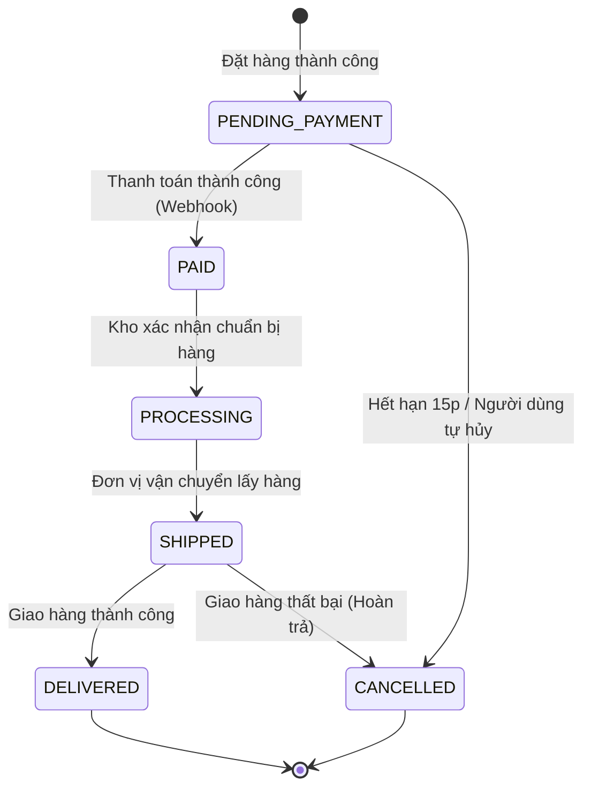

# Thiết kế hệ thống Quản lý đơn hàng (Order Management System - OMS)

## ⚡ Tóm tắt ngắn (30s)
* **Mục tiêu**: Xây dựng hệ thống OMS có khả năng xử lý hàng trăm nghìn đơn hàng mỗi phút (đặc biệt trong các dịp Flash Sale), đảm bảo **tính nhất quán cao** (không bán quá số lượng tồn kho - overselling) và **trạng thái đơn hàng nhất quán** trên môi trường Microservices phân tán.
* **Core Logic**:
  * **Trừ kho trước - Thanh toán sau (Reserve Stock First)**: Trừ tạm thời (reserve) số lượng tồn kho trên Redis ngay khi đặt hàng, giữ trong 10-15 phút. Nếu quá hạn thanh toán $\rightarrow$ Tự động hoàn lại (release) kho.
  * **Saga Pattern (Orchestrator)**: Quản lý giao dịch phân tán giữa 3 service: *Order*, *Inventory*, và *Payment* bằng Saga Orchestrator để đảm bảo roll-back dữ liệu an toàn nếu một bước bị lỗi.
  * **Idempotency Key**: Sử dụng token duy nhất ở phía client để ngăn chặn việc click đúp dẫn đến tạo đơn trùng hoặc thanh toán hai lần.

---

## 🔍 Yêu cầu hệ thống (Requirements)

### 1. Functional Requirements
* **Tạo đơn hàng (Create Order)**: Kiểm tra giỏ hàng, tính giá, giữ kho và lưu trạng thái đơn hàng ban đầu.
* **Theo dõi trạng thái (Order State Machine)**: Quản lý vòng đời chặt chẽ qua các bước: `PENDING_PAYMENT` $\rightarrow$ `PAID` $\rightarrow$ `PROCESSING` $\rightarrow$ `SHIPPED` $\rightarrow$ `DELIVERED` / `CANCELLED`.
* **Hủy đơn & Hoàn kho**: Tự động hủy đơn nếu không thanh toán trong thời gian quy định (e.g. 15 phút) và trả lại kho.

### 2. Non-Functional Requirements
* **Tính nhất quán dữ liệu cực cao (Strict Consistency)**: Tuyệt đối không cho phép bán quá số lượng hàng thực tế có trong kho.
* **Khả năng chịu tải cực lớn (High Concurrency)**: Xử lý mượt mà lượng request khổng lồ đổ dồn vào giỏ hàng trong các sự kiện mở bán lớn.
* **Idempotency**: Chống việc trừ tiền hai lần của khách hàng hoặc tạo nhiều đơn giống nhau cùng lúc.

---

## 🎨 Sơ đồ kiến trúc & Quy trình Saga (Order Creation Process)

Hệ thống sử dụng **Saga Pattern với mô hình Orchestrator** để điều phối giao dịch phân tán giữa các microservices một cách có kiểm soát.

```mermaid
sequenceDiagram
    autonumber
    actor User as Người dùng
    participant GW as API Gateway
    participant Order as Order Service (Orchestrator)
    participant Redis as Redis (Inventory Cache)
    participant Inv as Inventory Service
    participant Pay as Payment Service

    User->>GW: Gửi yêu cầu đặt hàng (có Idempotency Key)
    GW->>Order: Forward yêu cầu tạo đơn
    
    rect rgb(20, 40, 60)
        note right of Order: Bước 1: Trừ kho nhanh trên Redis (Atomic)
        Order->>Redis: DECRBY stock_key_product_A
        Redis-->>Order: Trả về lượng tồn (Nếu < 0 -> Rollback ngay)
    end

    rect rgb(20, 50, 40)
        note right of Order: Bước 2: Tạo đơn trạng thái PENDING_PAYMENT
        Order->>Order: Lưu đơn hàng vào DB PostgreSQL (Trạng thái: PENDING)
    end

    rect rgb(40, 20, 60)
        note right of Order: Bước 3: Đánh dấu giữ kho vật lý (DB)
        Order->>Inv: Gọi API giữ kho (Reserve physical stock)
        Inv-->>Order: Xác nhận giữ kho thành công
    end

    rect rgb(60, 40, 20)
        note right of Order: Bước 4: Xử lý thanh toán
        Order->>Pay: Tạo yêu cầu thanh toán
        Pay-->>Order: Trả về link thanh toán (VNPAY, MoMo, Stripe)
    end

    Order-->>User: Trả về đơn hàng thành công & Link thanh toán
```



### Kịch bản lỗi & Bù đắp giao dịch (Compensating Transactions)
Nếu **Bước 4 (Thanh toán)** bị thất bại hoặc người dùng hủy đơn:
1. **Saga Orchestrator** sẽ kích hoạt hành động bù đắp (Compensating Action).
2. Gọi **Inventory Service** giải phóng lượng kho vật lý đã giữ.
3. Gọi **Redis Cache** cộng lại số lượng hàng đã trừ: `INCRBY stock_key_product_A`.
4. Cập nhật trạng thái đơn hàng thành `CANCELLED` trong DB.

---

## 💾 Thiết kế Database & Quản lý Trạng thái

### 1. Schema Đơn hàng (PostgreSQL - Đảm bảo ACID)
Bảng đơn hàng được thiết kế quan hệ truyền thống và được **Partitioning** theo thời gian (`created_at`) để giữ hiệu năng tối ưu khi số lượng bản ghi lên tới hàng trăm triệu.

```sql
CREATE TABLE orders (
    id VARCHAR(64) PRIMARY KEY,
    user_id BIGINT NOT NULL,
    total_amount DECIMAL(12, 2) NOT NULL,
    status VARCHAR(30) NOT NULL, -- PENDING_PAYMENT, PAID, CANCELLED,...
    idempotency_key VARCHAR(128) UNIQUE NOT NULL, -- Khóa chống trùng lặp
    created_at TIMESTAMP WITH TIME ZONE DEFAULT CURRENT_TIMESTAMP,
    updated_at TIMESTAMP WITH TIME ZONE DEFAULT CURRENT_TIMESTAMP
) PARTITION BY RANGE (created_at);

CREATE TABLE order_items (
    id BIGSERIAL,
    order_id VARCHAR(64) NOT NULL,
    product_id BIGINT NOT NULL,
    quantity INT NOT NULL,
    price DECIMAL(12, 2) NOT NULL,
    PRIMARY KEY (id, order_id)
);
```

### 2. State Machine: Vòng đời trạng thái Đơn hàng
Trạng thái đơn hàng phải được chuyển đổi thông qua các điều kiện chặt chẽ, tránh lỗi cập nhật chéo trạng thái (ví dụ đơn đã hủy `CANCELLED` không được phép chuyển sang đã thanh toán `PAID`).



---

## 💻 Code Example: Trừ kho an toàn bằng Redis Lua Script

Trong các sự kiện Flash Sale, hàng vạn request cùng gọi API để mua một số lượng hàng giới hạn. Sử dụng code Java để check-and-decrement thông thường sẽ gây ra lỗi bán quá hàng (Overselling) do bất đồng bộ.

Dưới đây là **Lua Script** chạy nguyên tử trên Redis giúp trừ kho tuyệt đối an toàn.

```lua
-- KEYS[1]: Redis Key chứa số lượng tồn kho (e.g. "product:stock:999")
-- ARGV[1]: Số lượng sản phẩm khách hàng đặt mua (e.g. 2)

local stock_key = KEYS[1]
local buy_qty = tonumber(ARGV[1])

-- 1. Lấy số lượng tồn kho hiện tại
local current_stock = redis.call('GET', stock_key)

if not current_stock then
    return -1 -- Lỗi: Sản phẩm không tồn tại trong cache tồn kho
end

current_stock = tonumber(current_stock)

-- 2. Kiểm tra tồn kho có đủ không
if current_stock >= buy_qty then
    -- Đủ hàng, tiến hành trừ kho nguyên tử
    local new_stock = redis.call('DECRBY', stock_key, buy_qty)
    return new_stock -- Trả về số lượng còn lại (>= 0) -> Cho phép tạo đơn
else
    return -2 -- Lỗi: Hết hàng / Không đủ tồn kho
end
```

---

## 📊 Trade-off Analysis: Saga Orchestrator vs Saga Choreography

Khi triển khai Saga Pattern cho OMS, có hai hướng tiếp cận chính:

| Tiêu chí | Saga Orchestrator (Điều phối trung tâm) | Saga Choreography (Hướng sự kiện tự do) |
| :--- | :--- | :--- |
| **Cơ chế** | Sử dụng một Service trung tâm (e.g. *Order Service*) điều phối và chỉ dẫn các service khác chạy. | Các service tự lắng nghe event từ các service khác và tự quyết định hành động tiếp theo. |
| **Tính phụ thuộc (Coupling)** | Cực kỳ thấp cho các service con. Nhưng Orchestrator sẽ biết logic của tất cả service con. | Khó theo dõi luồng (decentralized). Các service con phải tự phụ thuộc vào event của nhau. |
| **Dễ debug & giám sát**| **Rất dễ**. Trạng thái giao dịch phân tán được lưu tập trung tại Orchestrator, dễ dàng trace lỗi. | **Rất khó**. Phải sử dụng các công cụ Distributed Tracing (Jaeger/Zipkin) để vẽ lại luồng chạy. |
| **Độ phức tạp code** | Tăng lên ở phía Orchestrator. Thích hợp khi có nhiều bước nghiệp vụ đan xen phức tạp. | Đơn giản khi bắt đầu, nhưng cực kỳ rắc rối khi luồng nghiệp vụ phình to hoặc có sự thay đổi. |
| **Lựa chọn phù hợp** | **(Khuyên dùng cho OMS)** Vì luồng đơn hàng có trạng thái (State) rõ ràng, cần kiểm soát chặt chẽ các compensating actions. | Phù hợp với các hệ thống nhỏ, ít bước giao dịch, luồng nghiệp vụ đơn giản. |

---

## ⚠️ Common Gotchas (Câu hỏi đào sâu từ interviewer)

1. **Làm sao để xử lý tình huống "Trừ kho ảo trên Redis thành công nhưng lưu DB PostgreSQL bị lỗi"?**
   * *Trả lời*: Đây là vấn đề bất đồng bộ giữa Cache và Database. Nếu lưu DB lỗi, ta phải lập tức hoàn trả kho trên Redis bằng cách chạy lệnh `INCRBY` (Compensating action). Đồng thời, trả về lỗi 500 cho client để họ thử lại. Cơ chế này được gọi là "Optimistic locking on Redis with rollback".
2. **Làm sao xử lý tình huống Webhook thanh toán từ MoMo/Stripe gửi về bị chậm hoặc mất?**
   * *Trả lời*: Hệ thống không nên chỉ chờ đợi thụ động vào Webhook. Ta cần thiết kế một **Scheduler (e.g. Spring Batch, Quartz)** chạy định kỳ 5 phút/lần để quét các đơn hàng ở trạng thái `PENDING_PAYMENT` có tuổi thọ quá 10 phút. Service sẽ gọi chủ động sang API của cổng thanh toán để truy vấn trạng thái (Query Transaction API). Nếu đối tác xác nhận đã thanh toán $\rightarrow$ Cập nhật đơn hàng thành `PAID`. Nếu chưa thanh toán $\rightarrow$ Giữ nguyên hoặc hủy đơn nếu quá 15 phút.
3. **Làm thế nào để bảo vệ hệ thống khỏi hiện tượng Thundering Herd khi Flash Sale kết thúc?**
   * *Trả lời*: Khi hàng hết, nút "Mua ngay" trên Frontend phải chuyển sang trạng thái Disable ngay lập tức để chặn request gửi từ trình duyệt. Đồng thời, API Gateway áp dụng bộ lọc rate limit cực hạn và trả về dữ liệu tĩnh cho các request đến muộn, ngăn không cho chúng chạm vào Database.
