# Thiết kế hệ thống Xử lý thanh toán (Payment Processing System)

## ⚡ Tóm tắt ngắn (30s)
* **Mục tiêu**: Xây dựng hệ thống thanh toán an toàn, tin cậy, đạt chuẩn bảo mật tài chính, **tuyệt đối không để xảy ra mất mát tiền bạc** hoặc **thanh toán trùng lặp (Double Charging)**.
* **Core Logic**:
  * **Double-Entry Bookkeeping (Ghi sổ kép)**: Mọi giao dịch tài chính phải được ghi nhận dưới dạng Nợ (Debit) và Có (Credit), tổng tiền của hai vế luôn luôn bằng 0. Không bao giờ dùng thao tác cập nhật số dư đơn giản (`UPDATE balance = balance + X`).
  * **Idempotency an toàn tuyệt đối**: Sử dụng **Idempotency Key** truyền từ client kết hợp cơ chế khóa phân tán (**Distributed Lock/Redis**) để từ chối ngay lập tức mọi yêu cầu thanh toán trùng lặp trong khi một giao dịch đang được xử lý.
  * **Reconciliation (Đối soát)**: Thiết kế luồng đối soát tự động chạy cuối ngày (Nightly Batch Job) để so sánh đối chiếu dữ liệu giao dịch nội bộ và sao kê thực tế từ ngân hàng/đối tác qua file SFTP.

---

## 🔍 Yêu cầu hệ thống (Requirements)

### 1. Functional Requirements
* **Tích hợp đa cổng (Multi-Gateway integration)**: Hỗ trợ kết nối với nhiều cổng thanh toán khác nhau (Stripe, PayPal, MoMo, VNPay) làm phương án fallback khi một cổng bị sập.
* **Xử lý Giao dịch (Charge/Refund)**: Hỗ trợ thanh toán đơn hàng và hoàn tiền (partial hoặc full refund).
* **Double-entry Ledger (Sổ cái ghi sổ kép)**: Ghi lại mọi biến động dòng tiền nội bộ.
* **Đối soát (Reconciliation)**: Phát hiện và cảnh báo các giao dịch sai lệch (mất mát tiền, chênh lệch số dư).

### 2. Non-Functional Requirements
* **PCI-DSS Compliance (Bảo mật tài chính)**: Không lưu trữ trực tiếp thông tin thẻ tín dụng nhạy cảm (PAN, CVV) của khách hàng trên hệ thống của mình. Sử dụng cơ chế **Tokenization** của cổng đối tác.
* **Idempotency (Không thanh toán trùng)**: Dù mạng chập chờn hay user ấn nút liên tục, hệ thống chỉ được gửi yêu cầu thanh toán duy nhất 1 lần lên ngân hàng.
* **Tính nhất quán dữ liệu cao nhất (Strong Consistency)**: Giao dịch tiền bạc bắt buộc phải chạy trong môi trường database ACID nghiêm ngặt.

---

## 🎨 Sơ đồ kiến trúc (Payment Processing Architecture)

```mermaid
flowchart TD
    User([Người dùng]) -->|1. Chọn Thanh Toán| Frontend[Mobile/Web App]
    Frontend -->|2. Send Req + Idempotency Key| APIGateway[API Gateway]
    
    subgraph "Core Payment System"
        APIGateway -->|3. Check Lock| LockMgr[Idempotency & Lock Manager - Redis]
        APIGateway -->|4. Create Transaction| PayService[Payment Service]
        
        PayService -->|5. Write Draft Ledger| LedgerService[Double-Entry Ledger Service]
        LedgerService --> DB_Ledger[(Ledger DB PostgreSQL)]
        
        PayService -->|6. Call Gateway API| PayGateway[Payment Gateway Integrator]
    end

    subgraph "External Gateways"
        PayGateway -->|7. Authorize / Tokenize| Stripe[Stripe / MoMo API]
        Stripe -.->|8. Async Webhook Response| WebhookHandler[Webhook Listener Service]
        WebhookHandler -->|9. Update & Commit Ledger| PayService
    end

    subgraph "Nightly Reconciliation Flow"
        BankSFTP[(Bank SFTP Server)] -->|10. Download Sao Kê| ReconJob[Reconciliation Batch Job]
        DB_Ledger -->|11. Read Tx Logs| ReconJob
        ReconJob -->|12. Generate Report| ReportDB[(Reconciliation DB)]
        ReconJob -->|Alert if mismatch| OpsSlack[Operations Alert - Slack/Email]
    end

    style LockMgr fill:#1a365d,stroke:#3182ce,stroke-width:2px
    style DB_Ledger fill:#1a365d,stroke:#3182ce,stroke-width:2px
    style BankSFTP fill:#2c1a3f,stroke:#7b2cbf,stroke-width:2px
```



---

## 💾 Thiết kế Nguyên lý Kế toán Ghi sổ kép (Double-Entry Bookkeeping)

Trong hệ thống tài chính chuyên nghiệp, ta **không bao giờ** lưu số dư của user dưới dạng một cột `balance` trong bảng `users` rồi chạy lệnh `UPDATE users SET balance = balance + 100`. Cách làm này cực kỳ thiếu an toàn, không có tính audit log và dễ bị race condition.

Thay vào đó, ta sử dụng **Ghi sổ kép**:
* **Tài khoản (Accounts)**: Lưu trữ các ví/tài khoản (e.g. Tài khoản Khách hàng, Tài khoản Ngân quỹ công ty, Tài khoản Cổng Stripe).
* **Nhật ký giao dịch (Transactions)**: Định nghĩa một sự kiện trao đổi tiền tệ.
* **Bút toán (Entries/Legs)**: Mỗi giao dịch gồm ít nhất 2 bút toán. Tổng tiền của các bút toán trong cùng một giao dịch bắt buộc phải bằng 0.

### 📊 Minh họa dòng tiền đặt hàng $100
Khi người dùng A dùng ví MoMo mua hàng của merchant B trị giá $100:
1. Tiền từ ví người dùng A (Asset) chuyển sang MoMo Gateway: Ví A ghi **-$100**, MoMo ghi **+$100**.
2. Tiền từ MoMo chuyển về ví của Merchant B: MoMo ghi **-$100**, Ví Merchant B ghi **+$100**.

### Thiết kế Schema Sổ cái (PostgreSQL - Strict ACID)
```sql
CREATE TABLE accounts (
    id VARCHAR(64) PRIMARY KEY,
    name VARCHAR(100) NOT NULL,
    type VARCHAR(30) NOT NULL, -- ASSET, LIABILITY, EQUITY, REVENUE, EXPENSE
    currency VARCHAR(10) NOT NULL DEFAULT 'VND'
);

CREATE TABLE transactions (
    id VARCHAR(64) PRIMARY KEY,
    description TEXT,
    created_at TIMESTAMP WITH TIME ZONE DEFAULT CURRENT_TIMESTAMP
);

CREATE TABLE entries (
    id BIGSERIAL PRIMARY KEY,
    transaction_id VARCHAR(64) REFERENCES transactions(id),
    account_id VARCHAR(64) REFERENCES accounts(id),
    amount DECIMAL(18, 4) NOT NULL, -- Giá trị âm: CREDIT (Có), Giá trị dương: DEBIT (Nợ)
    created_at TIMESTAMP WITH TIME ZONE DEFAULT CURRENT_TIMESTAMP
);

-- Ràng buộc quan trọng nhất: Đảm bảo tổng Debit và Credit của mỗi Transaction luôn bằng 0
-- Thường được validate thông qua Application Logic ở mức Transaction Serializable 
-- Hoặc viết Database Trigger.
```

---

## 💻 Code Example: Xử lý Idempotency thanh toán an toàn

Dưới đây là đoạn code triển khai cơ chế chống thanh toán trùng lặp bằng cách kết hợp **Redis Distributed Lock (Redisson)** và kiểm tra trạng thái giao dịch trong PostgreSQL.

```java
import org.redisson.api.RLock;
import org.redisson.api.RedissonClient;
import org.springframework.beans.factory.annotation.Autowired;
import org.springframework.stereotype.Service;
import org.springframework.transaction.annotation.Transactional;
import java.util.concurrent.TimeUnit;

@Service
public class PaymentProcessingService {

    @Autowired
    private RedissonClient redissonClient;

    @Autowired
    private TransactionRepository transactionRepository;

    @Autowired
    private ExternalPaymentGatewayClient gatewayClient;

    private static final String LOCK_PREFIX = "payment:lock:";

    @Transactional
    public PaymentResult processPayment(PaymentRequest request) {
        String idempotencyKey = request.getIdempotencyKey();
        String lockKey = LOCK_PREFIX + idempotencyKey;
        RLock lock = redissonClient.getLock(lockKey);

        try {
            // 1. Acquire Lock phân tán với thời gian chờ 10s, tự động giải phóng sau 30s
            boolean acquired = lock.tryLock(10, 30, TimeUnit.SECONDS);
            if (!acquired) {
                throw new PaymentException("🚨 Request is already being processed. Please wait.");
            }

            // 2. Kiểm tra DB xem Idempotency Key này đã từng được xử lý chưa
            TransactionEntity existingTx = transactionRepository.findByIdempotencyKey(idempotencyKey);
            if (existingTx != null) {
                // Nếu giao dịch đã hoàn thành hoặc thất bại vĩnh viễn, trả về kết quả đã lưu trong DB
                return new PaymentResult(existingTx.getStatus(), existingTx.getGatewayTransactionId(), "Duplicate request, returning cached result.");
            }

            // 3. Tạo bản ghi giao dịch nháp (DRAFT / PENDING) vào DB để giữ chỗ
            TransactionEntity tx = new TransactionEntity();
            tx.setIdempotencyKey(idempotencyKey);
            tx.setStatus("PENDING");
            tx.setAmount(request.getAmount());
            transactionRepository.save(tx);

            // 4. Gọi API của Cổng thanh toán bên thứ ba (e.g. Stripe)
            GatewayResponse response = gatewayClient.charge(request.getAmount(), request.getPaymentToken());

            // 5. Cập nhật kết quả thanh toán từ Gateway vào Database
            if (response.isSuccess()) {
                tx.setStatus("SUCCESS");
                tx.setGatewayTransactionId(response.getTransactionId());
            } else {
                tx.setStatus("FAILED");
                tx.setErrorMessage(response.getErrorMessage());
            }
            transactionRepository.save(tx);

            return new PaymentResult(tx.getStatus(), tx.getGatewayTransactionId(), "Processed successfully.");

        } catch (InterruptedException e) {
            Thread.currentThread().interrupt();
            throw new PaymentException("Payment process interrupted", e);
        } finally {
            // Giải phóng khóa phân tán an toàn
            if (lock.isHeldByCurrentThread()) {
                lock.unlock();
            }
        }
    }
}
```

---

## 📊 Trade-off Analysis: Luồng xử lý Đồng bộ vs Bất đồng bộ qua Webhook

Khi làm việc với các cổng thanh toán (3rd party), ta có hai chiến lược xử lý phản hồi:

| Tiêu chí | Luồng Đồng bộ (Synchronous API Call) | Luồng Bất đồng bộ (Async via Webhook) |
| :--- | :--- | :--- |
| **Cơ chế** | Client gửi request $\r\rightarrow$ Service gọi Gateway API $\r\rightarrow$ Đợi phản hồi $\r\rightarrow$ Trả về kết quả trực tiếp cho Client. | Client gửi request $\r\rightarrow$ Redirect sang cổng thanh toán $\r\rightarrow$ Đối tác gọi lại webhook URL của ta để báo kết quả. |
| **Độ trễ (Latency)** | Cao. API Gateway của Stripe/PayPal có thể mất 2-5 giây để phản hồi, giữ connection lâu. | Cực thấp cho luồng API chính của hệ thống. Trải nghiệm người dùng mượt mà hơn. |
| **Độ tin cậy** | Kém. Nếu mạng đứt giữa chừng khi Gateway đang xử lý, hệ thống của ta sẽ bị timeout $\r\rightarrow$ Rơi vào trạng thái không rõ kết quả (lỗi mập mờ). | **Rất cao**. Các cổng thanh toán sẽ retry gọi webhook liên tục (ví dụ Stripe thử lại trong 3 ngày) cho đến khi server của ta phản hồi HTTP 200. |
| **Độ phức tạp code** | Đơn giản. Code chạy tuần tự từ trên xuống dưới. | Phức tạp. Phải xử lý các trường hợp Webhook gửi chậm, gửi trùng, hoặc gửi sai thứ tự sự kiện. |
| **Khuyên dùng** | Chỉ dùng cho các tác vụ nội bộ, ví dụ: Auth/Capture nhanh trong thẻ đã Tokenized trước. | **(Khuyên dùng)** Cho hầu hết luồng thanh toán E-commerce, Ví điện tử, Thẻ tín dụng quốc tế. |

---

## ⚠️ Common Gotchas (Câu hỏi đào sâu từ interviewer)

1. **Làm sao xử lý tình huống "Connection Timeout khi đang gọi API của Stripe"?**
   * *Trả lời*: Đây là lỗi kinh điển trong hệ thống phân tán. Khi bị timeout, ta **tuyệt đối không được phép tự động gọi lại (retry)** hay báo thất bại cho user. Hãy giữ giao dịch ở trạng thái `PENDING`. Ta phải sử dụng **Query API** của Stripe (gọi lên cổng thanh toán truy vấn trạng thái dựa trên Idempotency Key ban đầu) hoặc chờ Webhook gửi về để xác định chính xác Stripe đã trừ tiền của khách hay chưa trước khi cập nhật DB.
2. **Nếu file sao kê (Reconciliation File) từ Ngân hàng báo chênh lệch $1000 so với DB nội bộ thì sao?**
   * *Trả lời*: Đây là tình huống xảy ra thường xuyên ở các ngân hàng lớn. Hệ thống đối soát tự động sẽ đánh dấu giao dịch này là `UNRECONCILED` (Lệch đối soát), ghi nhận vào bảng cảnh báo và gửi tin nhắn khẩn cấp (Slack/Telegram) cho team Vận hành tài chính (Operations Team) để can thiệp thủ công (Manual review), kiểm tra log và làm việc với ngân hàng. Tuyệt đối không để hệ thống tự động sửa đổi hoặc bù trừ dòng tiền tự động mà không có sự kiểm duyệt của con người.
3. **Làm sao để hệ thống đạt chuẩn PCI-DSS mà không tốn chi phí hạ tầng đắt đỏ?**
   * *Trả lời*: Sử dụng giải pháp **Hosted Fields** hoặc **Stripe Elements**. Khi người dùng nhập thông tin thẻ, các thẻ input thực chất là một iframe bảo mật nhúng trực tiếp từ server của Stripe. Trình duyệt của user sẽ gửi thẻ thẳng sang Stripe và trả về cho Backend của ta một chuỗi an toàn là `payment_token`. Backend của ta chỉ lưu chuỗi token này để thanh toán, hoàn toàn không chạm vào thông tin thẻ gốc, từ đó được miễn giảm 95% các thủ tục kiểm định PCI-DSS khắt khe.
