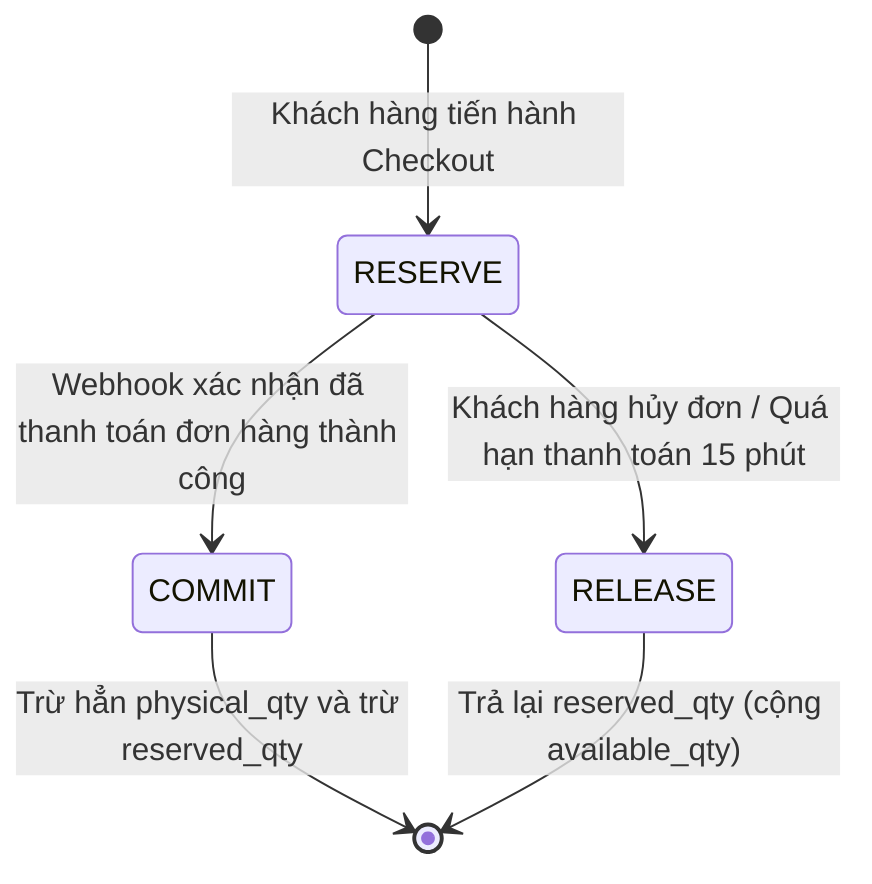

# Thiết kế hệ thống Quản lý Tồn kho (Inventory Management System)

## ⚡ Tóm tắt ngắn (30s)
* **Mục tiêu**: Xây dựng hệ thống quản lý tồn kho thời gian thực, có khả năng xử lý lượng truy cập khổng lồ (Flash Sale) mà **tuyệt đối không bị bán quá (Overselling)**, hỗ trợ nhiều kho bãi (Multi-warehouse) và đồng bộ nhất quán với hệ thống kho vật lý WMS (Warehouse Management System).
* **Core Logic**:
  * **Cơ chế Giữ kho Đa tầng (Multi-tier Reservation)**: Tách biệt rõ ràng giữa ba khái niệm: *Physical Stock* (Tồn kho vật lý), *Reserved Stock* (Tồn kho giữ chỗ tạm thời), và *Available Stock* (Tồn kho sẵn sàng bán = Physical - Reserved).
  * **Atomic Multi-item Reservation (Redis Lua Script)**: Đảm bảo giữ chỗ nguyên tử cho giỏ hàng gồm nhiều sản phẩm khác nhau cùng lúc. Nếu bất kỳ sản phẩm nào không đủ hàng, toàn bộ yêu cầu giữ chỗ bị hủy ngay lập tức (All-or-Nothing).
  * **Event-driven Reconciliation (Đối soát phi tuần tự)**: Đồng bộ không đồng bộ giữa Database online và WMS qua Kafka. Sử dụng cơ chế đối soát liên tục để phát hiện lệch kho vật lý.

---

## 🔍 Yêu cầu hệ thống (Requirements)

### 1. Functional Requirements
* **Kiểm tra tồn kho thời gian thực**: Trả về số lượng sản phẩm sẵn sàng bán cực nhanh để hiển thị trên Product Detail Page.
* **Giữ kho tạm thời (Reserve Stock)**: Giữ kho trong vòng 10-15 phút khi người dùng tiến hành thanh toán đơn hàng.
* **Xác nhận trừ kho thực tế (Commit Stock)**: Chuyển đổi trạng thái từ giữ kho tạm thời sang trừ kho vĩnh viễn khi có xác nhận thanh toán thành công.
* **Giải phóng kho (Release Stock)**: Tự động hoàn lại kho nếu đơn hàng bị hủy hoặc quá thời gian thanh toán.
* **Hỗ trợ Đa kho (Multi-warehouse Routing)**: Định tuyến đơn hàng đến kho gần nhất hoặc kho tối ưu nhất để giao hàng.

### 2. Non-Functional Requirements
* **Tính nhất quán cực cao (Strong Consistency)**: Đối với luồng trừ kho và giữ kho, dữ liệu bắt buộc phải nhất quán tuyệt đối. Không chấp nhận tình trạng Overselling.
* **Độ trễ cực thấp (Low Latency)**: < 50ms cho API kiểm tra tồn kho và < 100ms cho thao tác giữ kho tạm thời dưới tải cao (> 50,000 requests/second).
* **Khả năng chịu lỗi (Resilience)**: Nếu hệ thống WMS bị mất kết nối hoặc quá tải, hệ thống bán hàng online vẫn phải hoạt động bình thường nhờ cơ chế đệm dữ liệu.

---

## 🎨 Sơ đồ kiến trúc (Inventory Management Architecture)

Dưới đây là mô hình kiến trúc phân tầng, kết hợp bộ đệm Redis cho luồng Write-heavy (Giữ kho) và PostgreSQL cho luồng lưu trữ nhất quán (Ledger).

```mermaid
flowchart TD
    User([Người dùng]) -->|1. Đặt hàng / Check kho| APIGW[API Gateway]
    APIGW -->|2. Check/Reserve| InvService[Inventory Service]
    
    subgraph "In-Memory Reservation Layer"
        InvService -->|3. Atomic Lua Execution| RedisCluster[(Redis Cluster - Stock Cache)]
    end
    
    subgraph "Persistent Layer (Transactional DB)"
        InvService -->|4. Async Outbox Event| LocalOutbox[(Outbox Table - Postgres)]
        InvService -->|5. Commit physical stock| DB[(Inventory DB - Postgres)]
    end
    
    subgraph "Message Bus & Async Sync"
        Debezium[CDC / Debezium Connector] -->|6. Tail Binlog| DB
        Debezium -->|7. Publish events| Kafka[Kafka Message Broker]
        Kafka -->|8. Sync Stock Event| WMSService[WMS Sync Worker]
    end

    subgraph "External physical Warehouses"
        WMSService -->|9. Push to WMS API| WMS[Warehouse Management System]
        WMS -.->|10. Daily SFTP Stock Export| ReconJob[Nightly Reconciliation Job]
        ReconJob -->|11. Compare & Adjust| DB
    end

    style RedisCluster fill:#1a365d,stroke:#3182ce,stroke-width:2px
    style DB fill:#1a365d,stroke:#3182ce,stroke-width:2px
    style Kafka fill:#2c1a3f,stroke:#7b2cbf,stroke-width:2px
```



---

## 💾 Thiết kế Database & Cơ chế Giữ kho Đa tầng

Để tránh race condition và đảm bảo tính audit log cao nhất, ta sử dụng thiết kế **Tồn kho phân tầng** và **Bút toán tồn kho (Inventory Ledger)** thay vì cập nhật trực tiếp số lượng tồn kho vật lý.

### 1. Schema Database (PostgreSQL - ACID Compliant)

```sql
-- Bảng định nghĩa danh sách kho bãi vật lý
CREATE TABLE warehouses (
    id VARCHAR(64) PRIMARY KEY,
    name VARCHAR(100) NOT NULL,
    address TEXT NOT NULL,
    status VARCHAR(20) NOT NULL DEFAULT 'ACTIVE', -- ACTIVE, INACTIVE, FULL
    created_at TIMESTAMP WITH TIME ZONE DEFAULT CURRENT_TIMESTAMP
);

-- Bảng lưu trữ tồn kho hiện tại của từng sản phẩm tại từng kho bãi
CREATE TABLE inventory (
    id BIGSERIAL PRIMARY KEY,
    product_id VARCHAR(64) NOT NULL,
    warehouse_id VARCHAR(64) REFERENCES warehouses(id),
    physical_qty INT NOT NULL CHECK (physical_qty >= 0), -- Tồn kho thực tế nằm tại kệ hàng
    reserved_qty INT NOT NULL DEFAULT 0 CHECK (reserved_qty >= 0), -- Số lượng đang được giữ cho các đơn hàng chưa thanh toán
    available_qty INT GENERATED ALWAYS AS (physical_qty - reserved_qty) STORED, -- Số lượng có thể bán trực tuyến
    version INT NOT NULL DEFAULT 0, -- Dùng cho Optimistic Locking
    updated_at TIMESTAMP WITH TIME ZONE DEFAULT CURRENT_TIMESTAMP
);

-- Chỉ mục để truy vấn tồn kho của một sản phẩm cực nhanh
CREATE UNIQUE INDEX idx_inv_product_warehouse ON inventory(product_id, warehouse_id);

-- Bảng ghi chép lịch sử biến động tồn kho (Inventory Ledger) để đối soát
CREATE TABLE inventory_transactions (
    id VARCHAR(64) PRIMARY KEY,
    inventory_id BIGINT REFERENCES inventory(id),
    order_id VARCHAR(64) NOT NULL,
    type VARCHAR(30) NOT NULL, -- RESERVE, COMMIT, RELEASE, ADJUST_IN, ADJUST_OUT
    quantity INT NOT NULL,
    created_at TIMESTAMP WITH TIME ZONE DEFAULT CURRENT_TIMESTAMP
);
```

### 2. State Machine: Quy trình biến động dòng tồn kho



---

## 💻 Code Example: Spring Boot & Redis Lua Script giữ kho đồng thời nâng cao

Khi người dùng mua nhiều sản phẩm trong một đơn hàng (giỏ hàng gồm 3 món sản phẩm khác nhau), ta bắt buộc phải giữ kho cho cả 3 món này một cách **nguyên tử (atomic)** trên Redis để tránh tình trạng: Giữ được món A, món B nhưng đến món C thì hết hàng (gây lỗi trải nghiệm người dùng nghiêm trọng).

### 1. Lua Script giữ kho đồng thời nhiều sản phẩm (multi-item-reserve.lua)
```lua
-- KEYS: Danh sách các key tồn kho trên Redis (e.g., ["stock:p1", "stock:p2"])
-- ARGV: Danh sách số lượng cần giữ tương ứng (e.g., ["2", "1"])
-- Trả về: 1 nếu giữ kho thành công cho TẤT CẢ sản phẩm. -1 nếu có bất kỳ sản phẩm nào không đủ tồn kho.

local keys = KEYS
local qtys = ARGV

-- Bước 1: Kiểm tra tồn kho của tất cả các sản phẩm trước
for i = 1, #keys do
    local current_stock = redis.call('GET', keys[i])
    if not current_stock then
        return -2 -- Lỗi: Key sản phẩm không tồn tại trong cache
    end
    current_stock = tonumber(current_stock)
    local requested_qty = tonumber(qtys[i])
    
    if current_stock < requested_qty then
        return -1 -- Lỗi: Không đủ hàng cho sản phẩm keys[i]
    end
end

-- Bước 2: Chỉ khi TẤT CẢ sản phẩm đủ hàng, mới thực hiện trừ kho nguyên tử
local updated_stocks = {}
for i = 1, #keys do
    local new_stock = redis.call('DECRBY', keys[i], tonumber(qtys[i]))
    table.insert(updated_stocks, new_stock)
end

return 1 -- Giữ kho thành công tuyệt đối cho toàn bộ giỏ hàng
```

### 2. Spring Boot Service điều phối giữ kho
```java
@Service
public class AdvancedInventoryService {

    @Autowired
    private RedisTemplate<String, String> redisTemplate;

    @Autowired
    private DefaultRedisScript<Long> reserveScript; // Load từ file multi-item-reserve.lua

    @Autowired
    private InventoryRepository inventoryRepository;

    @Transactional
    public boolean reserveInventory(String orderId, List<CartItem> items) {
        List<String> keys = items.stream()
                .map(item -> "stock:" + item.getProductId())
                .collect(Collectors.toList());

        List<String> args = items.stream()
                .map(item -> String.valueOf(item.getQuantity()))
                .collect(Collectors.toList());

        // 1. Chạy nguyên tử Lua script trên Redis để trừ kho ảo nhanh
        Long result = redisTemplate.execute(reserveScript, keys, args.toArray());

        if (result == null || result != 1) {
            // Hoặc trả về -1 (không đủ hàng), -2 (lỗi key)
            return false; 
        }

        // 2. Ghi nhận thông tin giữ kho vào database PostgreSQL (Local Outbox)
        // Việc lưu DB này chạy trong transaction ACID để đảm bảo độ tin cậy tuyệt đối
        for (CartItem item : items) {
            inventoryRepository.reserveStockInDB(item.getProductId(), item.getQuantity(), orderId);
        }

        return true;
    }
}
```

---

## 📊 Trade-off Analysis: So sánh các chiến lược quản lý concurrency trong giữ kho

| Chiến lược | Pessimistic Locking (SELECT FOR UPDATE) | Optimistic Locking (Versioning) | Distributed Lock (Redis Redlock) | Atomic Cache Decrement (Lua Script) |
| :--- | :--- | :--- | :--- | :--- |
| **Độ phức tạp code** | Rất thấp. Dễ viết bằng JPA/SQL. | Thấp. Thêm cột `@Version`. | Trung bình. Cần thư viện Redisson. | Cao. Phải quản lý đồng bộ Cache & DB. |
| **Hiệu năng hệ thống (Throughput)**| Kém nhất. Gây nghẽn DB connection pool do giữ transaction lâu. | Khá. Tốt khi lượng tranh chấp thấp. Gặp lỗi `OptimisticLockingFailure` lớn khi Flash Sale. | Tốt. Không làm nghẽn DB. Tránh được phần lớn latency của disk IO. | **Cực tốt (Khuyên dùng)**. Đạt hàng chục nghìn TPS dễ dàng vì tất cả xử lý đồng thời chạy trên RAM của Redis Cluster. |
| **Khả năng an toàn dữ liệu** | Tuyệt đối. Cơ chế khóa vật lý của DB. | Tuyệt đối. Rollback transaction khi phát hiện xung đột version. | Khá tốt. Có khả năng mất khóa nếu Redis Master bị sập trước khi đồng bộ sang Slave. | Cực cao nếu kết hợp ghi nhận vào **Transactional Outbox Table** trong DB bán hàng. |

---

## ⚠️ Common Gotchas (Câu hỏi đào sâu từ interviewer)

1. **Làm sao xử lý lệch tồn kho giữa hệ thống bán hàng online và kho vật lý (WMS)?**
   * *Trả lời*: Đây là thực tế khó tránh khỏi trong ngành thương mại điện tử do hàng hóa có thể bị hư hỏng, thất thoát trong kho vật lý mà hệ thống online không biết. 
   * Giải pháp là thiết kế **Luồng Đối Soát Hằng Ngày (Nightly Reconciliation)**. WMS sẽ kết xuất file báo cáo số dư tồn kho thực tế cuối ngày gửi lên Server SFTP của công ty. Một Batch Job (Spring Batch) sẽ tải file này xuống, so sánh đối chiếu với bảng `inventory` trong database online. 
   * Nếu có sai lệch nhẹ, hệ thống sẽ ghi nhận bút toán `ADJUST` tự động để cân bằng. Nếu lệch lớn (ví dụ chênh lệch trên 5%), hệ thống sẽ đóng băng sản phẩm đó, phát cảnh báo khẩn cấp lên Slack/Teams để thủ kho kiểm đếm thủ công (Manual Stock Take).

2. **Khách hàng ở Hà Nội nhưng sản phẩm họ mua chỉ còn tồn ở kho TP.HCM, làm thế nào để định tuyến (Multi-warehouse Routing)?**
   * *Trả lời*: Đây là bài toán **Định tuyến đơn hàng (Order Routing)**. Hệ thống Inventory Service sẽ kết hợp với **Logistic/Distance Engine** để tính toán.
   * Khi khách hàng đặt mua sản phẩm A:
     1. Hệ thống quét bảng `inventory` lọc ra các kho bãi có `available_qty >= quantity`.
     2. Dùng thuật toán khoảng cách để chọn kho gần với địa chỉ giao hàng của người dùng nhất nhằm tối ưu chi phí và thời gian vận chuyển.
     3. Trong trường hợp giỏ hàng có nhiều sản phẩm nằm ở các kho khác nhau (Split Shipment), hệ thống sẽ tính toán các tùy chọn: Giao thành nhiều kiện từ các kho khác nhau (tăng phí ship của khách) hoặc Gom hàng về một kho trung chuyển trước khi giao (tăng thời gian giao hàng). Các tùy chọn này sẽ hiển thị tường minh ở bước Checkout để khách hàng lựa chọn.

3. **Làm sao giải quyết vấn đề "Phantom inventory" khi Redis bị crash đột ngột làm mất dữ liệu giữ kho tạm thời chưa kịp ghi DB?**
   * *Trả lời*: Để tránh mất dữ liệu giữ kho trên Redis khi crash, ta áp dụng hai cơ chế bảo vệ:
     * Cấu hình **AOF (Append Only File) ở chế độ `everysec`** cho Redis Cluster. Nếu sập, tối đa ta chỉ mất 1 giây dữ liệu giữ kho ảo.
     * **Reconciliation từ DB**: Database PostgreSQL là nguồn chân lý (Source of Truth). Mọi lệnh giữ kho trên Redis đều đi kèm một bản ghi trạng thái `RESERVED` thành công trong DB (qua luồng transactional). Khi Redis hồi phục sau crash, ta sẽ chạy một script hồi sinh cache: Đọc toàn bộ các bản ghi `inventory` có `reserved_qty > 0` trong DB và cập nhật ngược lại số lượng tồn thực tế trên Redis. Điều này đảm bảo Redis luôn đồng bộ với trạng thái thực của Database.
