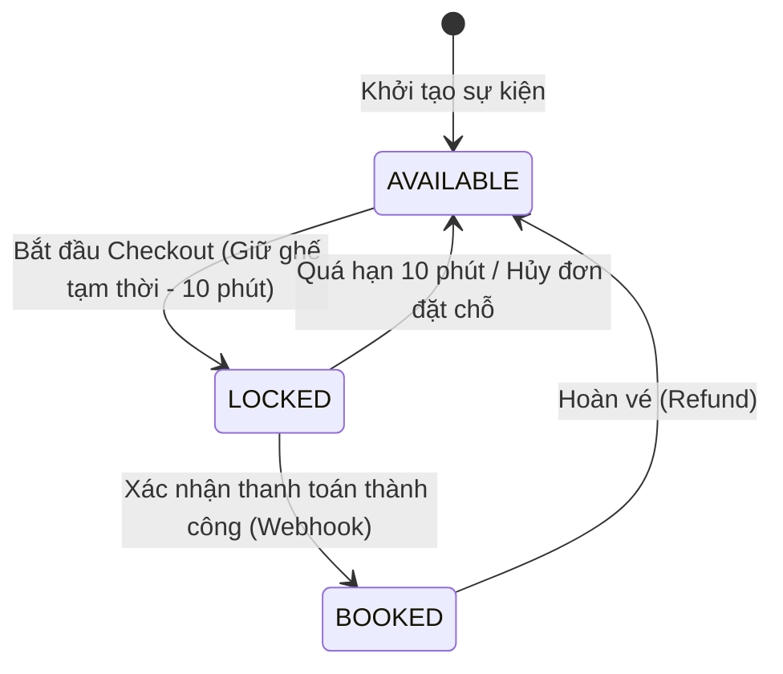

# Thiết kế hệ thống Đặt chỗ/Đặt vé (Booking/Reservation System)

## ⚡ Tóm tắt ngắn (30s)
* **Mục tiêu**: Xây dựng hệ thống đặt chỗ/đặt vé (như vé xem phim, vé máy bay, vé concert) chịu tải cao, **ngăn chặn tuyệt đối tình trạng đặt trùng chỗ (Double Booking)**, và xử lý mượt mà cơ chế giữ chỗ tạm thời (Temporary Seat Hold) trong thời gian chờ người dùng thanh toán.
* **Core Logic**:
  * **Hàng đợi phòng chờ ảo (Virtual Waiting Room)**: Sử dụng các dịch vụ như Cloudflare Waiting Room hoặc hàng đợi Redis để xếp hàng người dùng theo cơ chế FIFO (First-In, First-Out) khi lượng truy cập đột biến (Flash Sale bán vé concert).
  * **Khóa bi quan ở mức Database (Pessimistic Write Lock)**: Khi thực hiện đặt vé, sử dụng cơ chế `SELECT ... FOR UPDATE` trong DB kết hợp transaction cô lập ở mức cao để đảm bảo tại một thời điểm chỉ một luồng có thể thay đổi trạng thái của ghế từ `AVAILABLE` sang `LOCKED`.
  * **Redis TTL Temporary Lock**: Lưu trữ trạng thái giữ chỗ tạm thời trên Redis với thời gian hết hạn (TTL) là 10 phút. Nếu quá 10 phút không có sự kiện thanh toán $\r\rightarrow$ Redis Key hết hạn và kích hoạt Event giải phóng ghế tự động.

---

## 🔍 Yêu cầu hệ thống (Requirements)

### 1. Functional Requirements
* **Tra cứu ghế ngồi thời gian thực (Seat Map)**: Hiển thị sơ đồ các ghế trống, ghế đang bị giữ tạm thời, và ghế đã bán của một sự kiện/chuyến bay.
* **Giữ chỗ tạm thời (Hold Seat)**: Khóa tạm thời một hoặc nhiều ghế trong 5-10 phút khi người dùng chuyển sang màn hình điền thông tin thanh toán.
* **Xác nhận đặt vé (Confirm Booking)**: Đổi trạng thái ghế sang đã bán khi nhận được webhook xác nhận thanh toán thành công.
* **Giải phóng ghế tự động (Release Seat)**: Tự động mở khóa ghế cho người khác chọn nếu người dùng không hoàn thành thanh toán trước khi hết giờ.

### 2. Non-Functional Requirements
* **Ngăn chặn Double Booking tuyệt đối**: Dù hai người dùng cùng bấm chọn một ghế ở cùng một mili giây, hệ thống chỉ cho phép một người thành công.
* **Tính khả dụng cực cao cho luồng Đọc (High Read Availability)**: Sơ đồ ghế ngồi có tần suất đọc rất lớn khi mọi người đang cân nhắc chọn chỗ. Phải đảm bảo cache mượt mà.
* **Tính công bằng (Fairness)**: Thực hiện xử lý đặt vé theo đúng thứ tự ưu tiên thời gian của người dùng đến trước.

---

## 🎨 Sơ đồ kiến trúc (Booking System Architecture)

```mermaid
flowchart TD
    User([Người dùng]) -->|1. Request Booking| GW[API Gateway]
    GW -->|2. Route to Waiting Room| WR[Virtual Waiting Room - Queue]
    WR -->|3. Token approved| BookingService[Booking Service]
    
    subgraph "High Concurrency State Store"
        BookingService -->|4. Check & Write Hold State| Redis[(Redis Cluster - Seat Map & TTL Keys)]
    end
    
    subgraph "ACID Database Layer"
        BookingService -->|5. Pessimistic Write Lock| DB[(PostgreSQL - Booking & Seat DB)]
    end
    
    subgraph "Asynchronous Expiry Engine"
        Redis -->|6. Key Expiration Event| ExpiryListener[Redis Keyspace Notification Listener]
        ExpiryListener -->|7. Unlock Seat DB & Cache| BookingService
    end

    subgraph "External Payments"
        BookingService -->|8. Create Payment Session| PayGateway[Payment Gateway]
        PayGateway -.->|9. Webhook Callback| BookingService
    end

    style Redis fill:#1a365d,stroke:#3182ce,stroke-width:2px
    style DB fill:#1a365d,stroke:#3182ce,stroke-width:2px
    style WR fill:#2c1a3f,stroke:#7b2cbf,stroke-width:2px
```



---

## 💾 Thiết kế Database & Quản lý trạng thái Ghế ngồi

### 1. Schema Database (PostgreSQL)
Mô hình dữ liệu quan hệ được chuẩn hóa để đảm bảo tính toàn vẹn và tối ưu hóa cho các truy vấn SELECT FOR UPDATE.

```sql
-- Bảng lưu trữ thông tin sự kiện/concert/chuyến bay
CREATE TABLE events (
    id VARCHAR(64) PRIMARY KEY,
    title VARCHAR(200) NOT NULL,
    start_time TIMESTAMP WITH TIME ZONE NOT NULL,
    location VARCHAR(200) NOT NULL,
    created_at TIMESTAMP WITH TIME ZONE DEFAULT CURRENT_TIMESTAMP
);

-- Bảng lưu trữ thông tin ghế ngồi vật lý của từng sự kiện
CREATE TABLE seats (
    id BIGSERIAL PRIMARY KEY,
    event_id VARCHAR(64) REFERENCES events(id) ON DELETE CASCADE,
    seat_row VARCHAR(5) NOT NULL,
    seat_number INT NOT NULL,
    price DECIMAL(10, 2) NOT NULL,
    status VARCHAR(30) NOT NULL DEFAULT 'AVAILABLE', -- AVAILABLE, LOCKED, BOOKED
    version INT NOT NULL DEFAULT 0,
    updated_at TIMESTAMP WITH TIME ZONE DEFAULT CURRENT_TIMESTAMP
);

-- Tạo Index để tối ưu tìm kiếm ghế theo event
CREATE INDEX idx_seats_event ON seats(event_id, status);

-- Bảng quản lý đơn đặt vé
CREATE TABLE bookings (
    id VARCHAR(64) PRIMARY KEY,
    user_id BIGINT NOT NULL,
    event_id VARCHAR(64) REFERENCES events(id),
    status VARCHAR(30) NOT NULL, -- PENDING_PAYMENT, CONFIRMED, EXPIRED, CANCELLED
    total_amount DECIMAL(12, 2) NOT NULL,
    expires_at TIMESTAMP WITH TIME ZONE NOT NULL,
    created_at TIMESTAMP WITH TIME ZONE DEFAULT CURRENT_TIMESTAMP
);

-- Bảng trung gian lưu chi tiết danh sách ghế thuộc về đơn đặt vé
CREATE TABLE booking_seats (
    id BIGSERIAL PRIMARY KEY,
    booking_id VARCHAR(64) REFERENCES bookings(id) ON DELETE CASCADE,
    seat_id BIGINT REFERENCES seats(id)
);
```

### 2. Sơ đồ chuyển đổi trạng thái Ghế ngồi (Seat State Machine)
Đảm bảo luồng trạng thái của ghế được kiểm soát chặt chẽ:



---

## 💻 Code Example: Spring Boot & JPA Pessimistic Lock kết hợp Redis TTL

### 1. Spring Data Repository sử dụng Pessimistic Write Lock
Sử dụng khóa bi quan (`LockModeType.PESSIMISTIC_WRITE`) đảm bảo không có giao dịch nào khác có thể đọc hoặc ghi đè lên ghế này khi transaction giữ chỗ đang chạy.

```java
public interface SeatRepository extends JpaRepository<Seat, Long> {

    @Lock(LockModeType.PESSIMISTIC_WRITE)
    @Query("SELECT s FROM Seat s WHERE s.id IN :seatIds AND s.status = 'AVAILABLE'")
    List<Seat> findAvailableSeatsForUpdate(@Param("seatIds") List<Long> seatIds);
}
```

### 2. Service xử lý Giữ ghế tạm thời & Thiết lập khóa Redis TTL
Khi giữ ghế thành công trong DB PostgreSQL, hệ thống ghi đè trạng thái và đồng thời đẩy một key tạm thời lên Redis với TTL 10 phút để tự động hóa việc mở khóa.

```java
@Service
public class BookingService {

    @Autowired
    private SeatRepository seatRepository;

    @Autowired
    private BookingRepository bookingRepository;

    @Autowired
    private RedisTemplate<String, String> redisTemplate;

    private static final String REDIS_SEAT_HOLD_PREFIX = "seat:hold:";

    @Transactional
    public BookingResponse holdSeats(Long userId, String eventId, List<Long> seatIds) {
        // 1. SELECT ... FOR UPDATE khóa các ghế còn trống trong DB
        List<Seat> seatsToHold = seatRepository.findAvailableSeatsForUpdate(seatIds);

        // Nếu số lượng ghế thực tế giữ được ít hơn yêu cầu -> Có ghế đã bị người khác giành trước
        if (seatsToHold.size() != seatIds.size()) {
            throw new BookingException("🚨 Một hoặc nhiều ghế đã được chọn bởi người dùng khác!");
        }

        // 2. Tạo bản ghi đơn hàng đặt chỗ tạm thời (Expires in 10 mins)
        Booking booking = new Booking();
        booking.setId(UUID.randomUUID().toString());
        booking.setUserId(userId);
        booking.setEventId(eventId);
        booking.setStatus("PENDING_PAYMENT");
        booking.setExpiresAt(Instant.now().plusSeconds(600)); // 10 phút
        bookingRepository.save(booking);

        // 3. Cập nhật trạng thái ghế sang LOCKED trong DB
        for (Seat seat : seatsToHold) {
            seat.setStatus("LOCKED");
            seatRepository.save(seat);

            // Đẩy key giữ chỗ lên Redis với TTL = 10 phút (600 giây)
            // Value chứa bookingId để phục vụ việc giải phóng ghế tự động
            String redisKey = REDIS_SEAT_HOLD_PREFIX + seat.getId();
            redisTemplate.opsForValue().set(redisKey, booking.getId(), 600, TimeUnit.SECONDS);
        }

        return new BookingResponse(booking.getId(), "Giữ ghế thành công! Vui lòng thanh toán trong 10 phút.");
    }
}
```

### 3. Redis Keyspace Notification Listener để tự động giải phóng ghế
Khi Redis thông báo Key `seat:hold:<seat_id>` bị hết hạn (expired event), worker sẽ tự động kiểm tra trạng thái đơn hàng. Nếu đơn hàng vẫn ở trạng thái `PENDING_PAYMENT`, nó sẽ kích hoạt hoàn trả trạng thái ghế về `AVAILABLE`.

```java
@Component
public class RedisKeyExpirationListener extends KeyExpirationEventMessageListener {

    @Autowired
    private SeatRepository seatRepository;

    @Autowired
    private BookingRepository bookingRepository;

    public RedisKeyExpirationListener(RedisMessageListenerContainer listenerContainer) {
        super(listenerContainer);
    }

    @Override
    public void onMessage(Message message, byte[] pattern) {
        String expiredKey = message.toString(); // e.g. "seat:hold:1049"
        if (expiredKey.startsWith("seat:hold:")) {
            String seatIdStr = expiredKey.replace("seat:hold:", "");
            Long seatId = Long.parseLong(seatIdStr);

            // Xử lý không đồng bộ giải phóng ghế
            releaseSeatAfterExpiration(seatId);
        }
    }

    @Transactional
    public void releaseSeatAfterExpiration(Long seatId) {
        Optional<Seat> seatOpt = seatRepository.findById(seatId);
        if (seatOpt.isPresent() && "LOCKED".equals(seatOpt.get().getStatus())) {
            Seat seat = seatOpt.get();
            seat.setStatus("AVAILABLE");
            seatRepository.save(seat);
            
            // Log & Update trạng thái Booking tương ứng thành EXPIRED
            System.out.println("⏰ Tự động giải phóng ghế " + seatId + " do hết hạn thanh toán.");
        }
    }
}
```

---

## 📊 Trade-off Analysis: So sánh các chiến lược chống Double Booking

| Tiêu chí | Pessimistic Locking (`SELECT FOR UPDATE`) | Optimistic Locking (`version` check) | Redis-only Distributed Locks | Virtual Waiting Room Queue |
| :--- | :--- | :--- | :--- | :--- |
| **Cách hoạt động** | Khóa trực tiếp dòng dữ liệu trong DB PostgreSQL cho đến khi transaction kết thúc. | Chỉ kiểm tra cột version lúc UPDATE. Nếu trùng version $\r\rightarrow$ Báo lỗi và bắt retry. | Đặt khóa phân tán trên Redis cho từng ID ghế ngồi trước khi chạm vào Database. | Xếp hàng người dùng trên API Gateway, chỉ thả một lượng nhỏ request được vào DB. |
| **Tính Nhất Quán** | **Tuyệt đối**. Đảm bảo chặt chẽ từ tầng vật lý Database. | Tuyệt đối. Không bao giờ ghi đè dữ liệu cũ. | Khá tốt. Nhưng có nguy cơ mất lock nếu Redis bị split-brain hoặc crash. | Tốt. Giảm thiểu tải xung đột trực tiếp trên DB. |
| **Độ trễ & Hiệu năng** | Cao khi có tranh chấp lớn. Thích hợp cho hệ thống đặt vé cỡ vừa (như rạp chiếu phim). | Tốt khi ít tranh chấp. Cực kỳ tệ khi tranh chấp cực cao (mọi người cùng giành 1 ghế). | Rất nhanh. Giải quyết tranh chấp ở tầng RAM siêu tốc. | **Tốt nhất**. Bảo vệ toàn bộ hạ tầng Backend khỏi sập do quá tải (Thundering Herd). |
| **Lựa chọn phù hợp** | Hệ thống đặt vé rạp chiếu phim, đặt bàn nhà hàng. | Hệ thống đặt phòng khách sạn (ít xung đột đồng thời). | Hệ thống bán vé tàu xe quy mô lớn. | **(Khuyên dùng)** Cho vé concert idol nổi tiếng (Flash Sale quy mô khủng). |

---

## ⚠️ Common Gotchas (Câu hỏi đào sâu từ interviewer)

1. **Làm sao xử lý tình huống hàng triệu người cùng giật 10,000 vé của một ca sĩ nổi tiếng (Thundering Herd / Flash Sale)?**
   * *Trả lời*: Với quy mô này, nếu để hàng triệu request chạm trực tiếp vào DB PostgreSQL (dù có dùng Pessimistic Lock hay Optimistic Lock), database chắc chắn sẽ bị sập hoặc nghẽn hàng đợi kết nối (Connection Pool Exhaustion).
   * Giải pháp là áp dụng **Virtual Waiting Room (Phòng chờ ảo)** ở tầng API Gateway (ví dụ Cloudflare Waiting Room hoặc viết module hàng đợi Redis FIFO). Khi sự kiện mở bán bắt đầu, hệ thống sẽ chặn toàn bộ người dùng lại và xếp họ vào hàng đợi. Hệ thống sẽ phát hành một `QueueToken` cho họ. 
   * Backend sẽ kéo từ từ người dùng ra khỏi hàng đợi với tốc độ phù hợp với năng lực xử lý tối đa của Database (ví dụ: 100 giao dịch/giây). Cách tiếp cận này giúp bảo vệ DB luôn chạy ổn định ở hiệu suất cao nhất mà không bị thắt cổ chai.

2. **Nếu Redis Key báo hết hạn (TTL Event) bị trễ hoặc mất (do Redis bị sập đột ngột), làm thế nào đảm bảo không có ghế bị khóa "vĩnh viễn"?**
   * *Trả lời*: Cơ chế Keyspace Notifications của Redis hoạt động theo kiểu *Fire-and-Forget*, tức là Redis không đảm bảo 100% người nghe sẽ nhận được event nếu có trục trặc mạng hoặc listener bị sập đúng lúc.
   * Để giải quyết triệt để, ta thiết kế một **Active Polling Scheduler (e.g. Quartz Job)** chạy định kỳ mỗi 2-5 phút trong hệ thống. Job này quét DB PostgreSQL tìm các đơn hàng ở bảng `bookings` có trạng thái `PENDING_PAYMENT` và thời gian `expires_at < CURRENT_TIMESTAMP`. 
   * Đối với mỗi đơn đặt chỗ quá hạn phát hiện được, Job sẽ tự động chuyển trạng thái đơn hàng thành `EXPIRED` và gọi hàm giải phóng toàn bộ các ghế tương ứng về trạng thái `AVAILABLE`. Đây là cơ chế tự phục hồi (Self-healing/Fallback) bắt buộc phải có để đi kèm với Redis TTL.

3. **Làm sao giải quyết vấn đề "Seat Hoarding" (người dùng cố tình dùng tool giữ hàng trăm ghế đẹp nhưng không thanh toán nhằm đầu cơ vé)?**
   * *Trả lời*: Đây là vấn đề thuộc về chính sách và nghiệp vụ an ninh (Fraud Prevention). Ta xử lý bằng cách:
     * Giới hạn số lượng ghế tối đa được phép giữ trong một đơn hàng (ví dụ: tối đa 4 ghế/tài khoản).
     * Áp dụng xác thực **IP Rate Limiting** và **WAF (Web Application Firewall)** để chặn bot tự động quét và chọn giữ ghế nhanh.
     * Yêu cầu nhập **CAPTCHA** trước khi bấm nút "Giữ ghế" để đảm bảo hành động được thực hiện bởi con người thực.
     * Đánh giá hành vi: Nếu một tài khoản liên tục thực hiện giữ ghế rồi để hết hạn quá 3 lần liên tiếp trong ngày mà không thanh toán, hệ thống sẽ tự động khóa tài khoản đó (Rate block) hoặc xếp họ vào danh sách ưu tiên thấp trong phòng chờ ảo.
