# Thiết kế hệ thống Trò chuyện trực tuyến (Chat/Messaging System)

## ⚡ Tóm tắt ngắn (30s)
* **Mục tiêu**: Xây dựng hệ thống chat thời gian thực (như Messenger, Slack, Telegram) hỗ trợ hàng triệu kết nối đồng thời, đảm bảo độ trễ thấp (< 100ms), thứ tự tin nhắn chính xác, và lưu trữ lịch sử tin nhắn quy mô khổng lồ.
* **Core Logic**:
  * **Scale-out ngang WebSocket với Redis Pub/Sub**: WebSocket là kết nối có trạng thái (stateful). Khi scale-out nhiều instance, ta sử dụng **Redis Pub/Sub** làm Message Bus trung gian để định tuyến tin nhắn giữa các người dùng đang kết nối ở các server khác nhau.
  * **Lưu trữ tin nhắn bằng Apache Cassandra**: Sử dụng cơ chế lưu trữ dạng cột (Column-oriented NoSQL) tối ưu cho việc ghi cực nhanh và đọc tuần tự. Phân vùng (Partition) dữ liệu theo `room_id` và sắp xếp (Clustering) theo `message_id` giảm dần.
  * **Quản lý Presence bằng Redis Bitmap & Heartbeat**: Trạng thái online/offline của người dùng được cập nhật liên tục qua cơ chế Heartbeat (Ping/Pong) và lưu tạm thời trên Redis để tra cứu nhanh.

---

## 🔍 Yêu cầu hệ thống (Requirements)

### 1. Functional Requirements
* **Trò chuyện 1-1 và trò chuyện nhóm (Group Chat)**: Hỗ trợ gửi tin nhắn văn bản, hình ảnh, tệp tin.
* **Trạng thái giao nhận tin nhắn (Message Status)**: Đã gửi (Sent) $\rightarrow$ Đã nhận (Delivered) $\rightarrow$ Đã đọc (Read).
* **Trạng thái hoạt động (Presence)**: Hiển thị trạng thái Online/Offline của người dùng thời gian thực.
* **Lịch sử trò chuyện**: Cho phép người dùng cuộn lên để tải lại các tin nhắn cũ vô hạn.
* **Thông báo đẩy (Push Notification)**: Gửi thông báo đến thiết bị di động khi người dùng đang offline.

### 2. Non-Functional Requirements
* **Độ trễ cực thấp (Low Latency)**: Tin nhắn phải được chuyển đến người nhận trong vòng < 100ms.
* **Đảm bảo thứ tự tin nhắn (Message Ordering)**: Tin nhắn phải hiển thị đúng thứ tự thời gian được gửi, không bị đảo lộn.
* **Độ tin cậy giao nhận (Reliability)**: Đảm bảo giao nhận tin nhắn ít nhất một lần (At-least-once Delivery), không chấp nhận mất mát tin nhắn.
* **Khả năng mở rộng lớn (High Scalability)**: Hỗ trợ tối thiểu 10 triệu người dùng hoạt động hàng ngày (DAU) và 5 triệu kết nối WebSocket đồng thời.

---

## 🎨 Sơ đồ kiến trúc (Chat System Architecture)

```mermaid
flowchart TD
    ClientA([Người dùng A]) -->|1. Connect WebSocket| WSGate1[WS Gateway Server 1]
    ClientB([Người dùng B]) -->|1. Connect WebSocket| WSGate2[WS Gateway Server 2]
    
    subgraph "Stateful Gateway Layer"
        WSGate1
        WSGate2
    end

    subgraph "Routing Message Bus"
        WSGate1 -->|2. Publish Message| RedisPubSub[(Redis Pub/Sub Broker)]
        RedisPubSub -->|3. Route Message| WSGate2
        WSGate2 -->|4. Push Message| ClientB
    end

    subgraph "Stateless Microservices"
        WSGate1 -->|Sync Write| ChatService[Chat Service]
        ChatService -->|Log metadata| DB_Postgres[(Postgres - Metadata & Room DB)]
        ChatService -->|High-throughput write| DB_Cassandra[(Apache Cassandra - Message Store)]
        
        PresenceService[Presence Service] -->|Heartbeat updates| RedisCache[(Redis - Presence & Sessions)]
        WSGate1 -.->|Ping/Pong| PresenceService
    end

    subgraph "Offline Flow"
        ChatService -->|If User Offline| PushService[Push Notification Service]
        PushService -->|Mobile Push| FCM[FCM / APNS Services]
    end

    style RedisPubSub fill:#1a365d,stroke:#3182ce,stroke-width:2px
    style DB_Cassandra fill:#1a365d,stroke:#3182ce,stroke-width:2px
    style RedisCache fill:#1a365d,stroke:#3182ce,stroke-width:2px
```



---

## 💾 Thiết kế Database & Lưu trữ quy mô lớn

Hệ thống trò chuyện tạo ra lượng tin nhắn khổng lồ mỗi ngày. Cách tiếp cận SQL truyền thống sẽ gặp thắt cổ chai về mặt ghi (I/O) và phình to bộ nhớ nhanh chóng. Giải pháp tối ưu là tách biệt cơ sở dữ liệu thành hai phần:

### 1. Database quan hệ (PostgreSQL) - Lưu trữ Metadata ít thay đổi
Dùng để quản lý thông tin tài khoản, danh sách phòng chat, thành viên nhóm.

```sql
CREATE TABLE users (
    id BIGINT PRIMARY KEY,
    username VARCHAR(50) UNIQUE NOT NULL,
    display_name VARCHAR(100),
    avatar_url VARCHAR(255),
    created_at TIMESTAMP WITH TIME ZONE DEFAULT CURRENT_TIMESTAMP
);

CREATE TABLE chat_rooms (
    id VARCHAR(64) PRIMARY KEY,
    name VARCHAR(100),
    type VARCHAR(20) NOT NULL, -- DIRECT, GROUP
    created_at TIMESTAMP WITH TIME ZONE DEFAULT CURRENT_TIMESTAMP
);

CREATE TABLE room_members (
    room_id VARCHAR(64) REFERENCES chat_rooms(id) ON DELETE CASCADE,
    user_id BIGINT REFERENCES users(id) ON DELETE CASCADE,
    joined_at TIMESTAMP WITH TIME ZONE DEFAULT CURRENT_TIMESTAMP,
    PRIMARY KEY (room_id, user_id)
);
```

### 2. NoSQL Column-Family (Apache Cassandra) - Lưu trữ tin nhắn vĩnh viễn
Cassandra được thiết kế tối ưu cho mô hình: ghi tuần tự siêu tốc vào đĩa cứng (SSTables) và đọc theo khoảng phân vùng cực nhanh.
* **Partition Key**: `room_id` (Tất cả tin nhắn trong một phòng chat sẽ được ghi vật lý trên cùng một phân vùng để tối ưu hóa truy vấn cuộn trang history).
* **Clustering Key**: `message_id` (Dùng để sắp xếp tin nhắn tự động theo thứ tự thời gian giảm dần).

```sql
CREATE KEYSPACE chat_keyspace WITH replication = {
    'class': 'SimpleStrategy', 
    'replication_factor': 3
};

CREATE TABLE chat_keyspace.messages (
    room_id text,
    message_id timeuuid, -- Sử dụng TimeUUID (UUID v1) chứa timestamp để tránh trùng lặp và đảm bảo thứ tự
    sender_id bigint,
    content text,
    media_url text,
    created_at timestamp,
    PRIMARY KEY (room_id, message_id)
) WITH CLUSTERING ORDER BY (message_id DESC);
```

---

## 💻 Code Example: Spring Boot WebSocket Handler & Redis Pub/Sub

Khi scale hệ thống lên nhiều node, Người dùng A có kết nối WebSocket nằm ở Server 1, trong khi Người dùng B có kết nối nằm ở Server 2. Khi A gửi tin nhắn cho B, Server 1 sẽ nhận được. Server 1 phải thông báo cho Server 2 biết để gửi xuống cho B. Ta sử dụng Redis Pub/Sub để kết nối các server này lại.

### 1. Triển khai WebSocket Handler trong Spring Boot
```java
@Component
public class ChatWebSocketHandler extends TextWebSocketHandler {

    // Lưu trữ các session WebSocket đang hoạt động cục bộ trên NODE này
    private static final Map<String, WebSocketSession> localSessions = new ConcurrentHashMap<>();

    @Autowired
    private RedisTemplate<String, String> redisTemplate;

    @Autowired
    private ObjectMapper objectMapper;

    @Override
    public void afterConnectionEstablished(WebSocketSession session) {
        String userId = getUserIdFromSession(session);
        localSessions.put(userId, session);
    }

    @Override
    protected void handleTextMessage(WebSocketSession session, TextMessage message) throws Exception {
        String senderId = getUserIdFromSession(session);
        ChatMessage payload = objectMapper.readValue(message.getPayload(), ChatMessage.class);
        payload.setSenderId(senderId);

        // 1. Lưu tin nhắn vào Cassandra & Cập nhật Metadata (được gọi qua ChatService)
        // 2. Publish tin nhắn lên kênh Redis Pub/Sub chung để toàn bộ các server node nhận biết
        redisTemplate.convertAndSend("chat:messages", objectMapper.writeValueAsString(payload));
    }

    @Override
    public void afterConnectionClosed(WebSocketSession session, CloseStatus status) {
        String userId = getUserIdFromSession(session);
        localSessions.remove(userId);
    }

    // Gửi tin nhắn xuống client thực tế nếu họ kết nối trực tiếp vào node này
    public void sendDirectMessage(String recipientId, String messagePayload) throws IOException {
        WebSocketSession session = localSessions.get(recipientId);
        if (session != null && session.isOpen()) {
            session.sendMessage(new TextMessage(messagePayload));
        }
    }

    private String getUserIdFromSession(WebSocketSession session) {
        return Objects.requireNonNull(session.getUri()).getQuery().split("=")[1];
    }
}
```

### 2. Redis Message Listener để lắng nghe và chuyển phát chéo Server
```java
@Component
public class RedisMessageSubscriber implements MessageListener {

    @Autowired
    private ChatWebSocketHandler webSocketHandler;

    @Autowired
    private ObjectMapper objectMapper;

    @Override
    public void onMessage(Message message, byte[] pattern) {
        try {
            String messageBody = new String(message.getBody());
            ChatMessage chatMessage = objectMapper.readValue(messageBody, ChatMessage.class);

            // Bất kể server nào nhận được event này, nó sẽ kiểm tra xem người nhận (recipientId)
            // có đang duy trì kết nối WebSocket cục bộ trên chính nó hay không
            // Nếu có -> Gửi tin nhắn xuống Client ngay lập tức
            webSocketHandler.sendDirectMessage(chatMessage.getRecipientId(), messageBody);

        } catch (IOException e) {
            e.printStackTrace();
        }
    }
}
```

---

## 📊 Trade-off Analysis: So sánh các công nghệ lưu trữ lịch sử Chat

| Tiêu chí | Cơ sở dữ liệu SQL (PostgreSQL/MySQL) | NoSQL Column-Family (Cassandra/HBase) | NoSQL Document (MongoDB) |
| :--- | :--- | :--- | :--- |
| **Tốc độ Ghi (Write Performance)** | Trung bình. Bị thắt cổ chai bởi ổ cứng (B-Tree index write overhead). | **Cực nhanh (Khuyên dùng)**. Ghi tuần tự trực tiếp vào bộ nhớ RAM trước (Memtable) rồi flush xuống đĩa. | Nhanh. Khóa ghi theo document nhưng chậm khi document phình to. |
| **Tốc độ Đọc (Read Performance)** | Rất nhanh khi index tốt, nhưng chậm khi dữ liệu đạt hàng tỷ dòng. | **Rất nhanh** khi đọc tuần tự các tin nhắn thuộc cùng một `room_id`. | Nhanh, nhưng tốn nhiều RAM để cache các index. |
| **Khả năng Mở rộng (Horizontal Scaling)** | Khó. Cần sharding thủ công rất phức tạp. | **Dễ dàng nhất**. Thiết kế Masterless kế thừa giao thức Gossip, scale tuyến tính cực mượt. | Dễ thông qua cơ chế Replica Set và Sharding. |
| **Chi phí hạ tầng** | Trung bình. | Cao. Yêu cầu RAM và ổ SSD tốt để xử lý Compaction dữ liệu. | Trung bình. |

---

## ⚠️ Common Gotchas (Câu hỏi đào sâu từ interviewer)

1. **Làm thế nào để đảm bảo thứ tự tin nhắn (Message Ordering) chính xác khi người dùng dùng nhiều thiết bị hoặc mạng chập chờn?**
   * *Trả lời*: Ta không bao giờ được phép dùng thời gian cục bộ của Client (Client System Time) hay thậm chí là thời gian của Backend Server để làm khóa sắp xếp chính xác thứ tự tin nhắn, vì đồng hồ của các server phân tán luôn bị lệch nhẹ (Clock Drift) và mạng bị trễ không đồng đều.
   * Giải pháp: Sử dụng thuật toán sinh ID duy nhất có thứ tự như **Snowflake ID (Twitter)** kết hợp cơ chế tăng số thứ tự tuần tự trong phòng chat (**Sequence ID per Chat Room**). 
   * Khi Server nhận được tin nhắn trong phòng chat X, nó sẽ lấy số sequence mới nhất của phòng đó bằng Redis atomic `INCR room:seq:X` rồi gán vào tin nhắn. Client khi nhận tin nhắn sẽ sắp xếp hiển thị dựa trên Sequence ID này. Nếu mạng bị gián đoạn dẫn đến tin nhắn đến sai thứ tự, Client vẫn có thể vẽ lại giao diện hoàn hảo.

2. **Cơ chế Presence (Trạng thái Online/Offline) hoạt động ra sao để không gây quá tải cho hệ thống khi người dùng liên tục đổi mạng?**
   * *Trả lời*: Nếu cứ mỗi lần người dùng kết nối hoặc ngắt kết nối WebSocket, ta lại cập nhật DB và phát thông báo (Publish Event) cho toàn bộ bạn bè của họ, hệ thống sẽ bị nghẽn (Broadcast Storm).
   * Giải pháp:
     * **Cơ chế Heartbeat (Ping/Pong)**: Client định kỳ gửi gói tin ping lên WS Gateway mỗi 10-30 giây. WS Gateway cập nhật thời gian hoạt động cuối cùng của user lên Redis dưới dạng một key có TTL = 60 giây (`user:presence:userId`). Nếu quá 60 giây không có heartbeat $\rightarrow$ User được coi là Offline.
     * **Lazy Loading & Pull Model**: Thay vì chủ động thông báo (push) trạng thái online của A cho toàn bộ bạn bè. Ta chỉ làm việc đó khi bạn bè của A mở ứng dụng. Lúc đó, Client sẽ gửi yêu cầu lấy (pull) trạng thái của danh sách bạn bè đang hiển thị trên màn hình hiện tại từ Redis.
     * **Throttling updates**: Nếu trạng thái thay đổi liên tục, áp dụng debounce (chờ 15-30 giây ổn định kết nối trước khi phát đi thông báo đổi trạng thái).

3. **Làm sao đảm bảo tin nhắn không bị mất (At-least-once Delivery) trong môi trường mạng chập chờn?**
   * *Trả lời*: Để đảm bảo tin nhắn chắc chắn đến được người nhận, ta áp dụng cơ chế **Application-Level ACK**:
     1. Khi Người dùng A gửi tin nhắn, Client A lưu trạng thái tin nhắn cục bộ là *Đang gửi (Pending)*.
     2. WebSocket Server nhận tin nhắn, ghi thành công vào Cassandra, gửi phản hồi **ACK (Acknowledgement)** về cho Client A $\rightarrow$ Client A cập nhật trạng thái là *Đã gửi (Sent)*.
     3. Server chuyển phát tin nhắn đến Client B. Client B nhận được tin nhắn thành công, lập tức tự động gửi một gói tin **Delivery ACK** ngược lại Server.
     4. Server nhận được Delivery ACK, cập nhật trạng thái tin nhắn trong DB và phát thông báo về cho Client A $\rightarrow$ Client A cập nhật trạng thái là *Đã nhận (Delivered)*.
     5. Nếu Server gửi đi nhưng không nhận được Delivery ACK từ B sau 10 giây (do mạng B đứt), Server sẽ giữ tin nhắn trong hàng đợi offline và thử gửi lại khi B kết nối lại.
